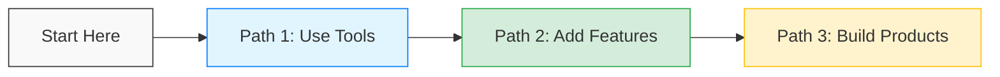

  
Why Frontend First?

  
Most AI tutorials use Python. We use <strong>JavaScript/TypeScript</strong>. We focus on actionable skills: Streaming UI, Browser AI, and Edge Deployment.

## Your Journey

## Recent Additions

- **[MCP Protocol](/integration/protocols/mcp)**: Connect LLMs to your own tools and data.
- **[Browser AI](/tech/frontend/browser-ai)**: Run models in the browser with WebGPU.
- **[Chat UI Recipe](/cookbook/chat-ui)**: A copy-paste streaming chat component.

## Community

- [GitHub Repository](https://github.com/zenheart/learn-ai)
- [Vercel AI SDK Docs](https://sdk.vercel.ai/docs)