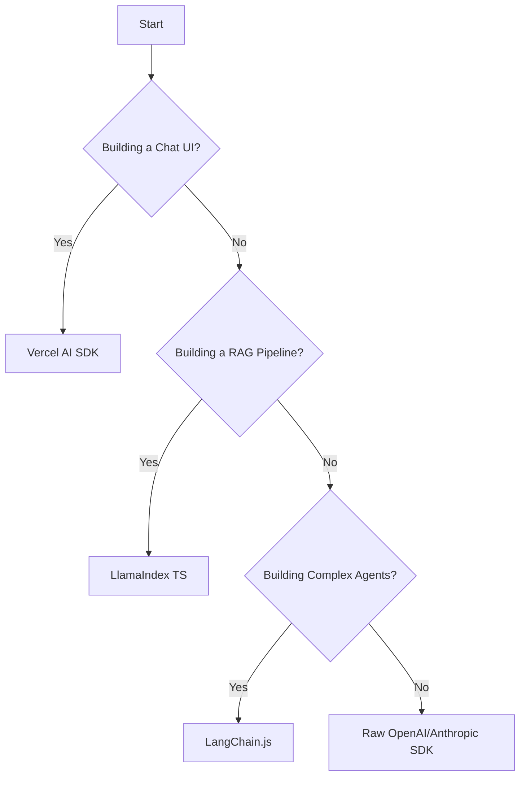

# AI Frameworks Overview

Building AI apps with raw API calls is possible, but frameworks solve common problems like **streaming state management**, **chaining**, and **document retrieval**.

## The Big Three

| Framework | Best For | Philosophy |
| :--- | :--- | :--- |
| **Vercel AI SDK** | **Frontend/Fullstack** | "UI First." Built for React/Next.js/Svelte. Handles streaming hooks and UI updates effortlessly. |
| **LangChain.js** | **Backend Logic/Agents** | "Chains & Agents." Massive ecosystem of integrations. Great for complex workflows independent of UI. |
| **LlamaIndex TS** | **Data/RAG** | "Data First." Specialized in connecting LLMs to your data (PDFs, SQL, Notion) for RAG apps. |

---

## Decision Matrix: What should I use?

## Detailed Guides

### 1. [Vercel AI SDK](./vercel-ai-sdk.md) (Recommended Start)
The default choice for Next.js developers. It unifies the API layer and the UI layer.
- **Key Features**: `useChat`, `useCompletion`, `streamText`.
- **Ecosystem**: Works with OpenAI, Anthropic, Mistral, Google, and more.

### 2. [LangChain.js](./langchain-js.md)
The Swiss Army Knife of AI.
- **Key Features**: Prompt Templates, Output Parsers, Chains, Agents.
- **Use Case**: When you need to switch models easily or build complex multi-step reasoning chains.

### 3. [LlamaIndex.TS](./llamaindex-ts.md)
The Data Framework.
- **Key Features**: Data Loaders (PDF, HTML), Vector Store Indexing, Query Engines.
- **Use Case**: Building a chatbot that "talks to your data" (RAG).

## Can I mix them?
**Yes!** A very common stack is:
- **Vercel AI SDK** for the Frontend UI (streaming hooks).
- **LlamaIndex** or **LangChain** on the Backend to retrieve data and construct the prompt.

## Next Steps
Start with the **[Vercel AI SDK Guide](./vercel-ai-sdk.md)** to build your first streaming UI.
