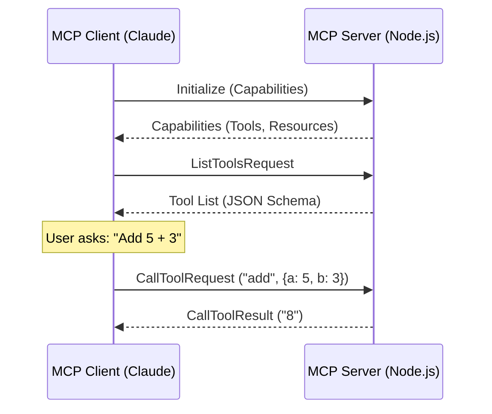

# Model Context Protocol (MCP) Implementation Guide

**Model Context Protocol (MCP)** is the open standard for connecting AI models to external tools and data.

> **Hands-on Example**: We have provided a complete working example in this repository.
>
> 📂 **[View MCP Lab Example](../../../examples/mcp-lab/README.md)**

## Core Implementation Concepts

MCP connects two sides:
1.  **Host (Client)**: The AI application (e.g., Claude Desktop, Cursor, or your custom app).
2.  **Server**: The provider of tools and resources (e.g., your Node.js script).

### The Communication Flow



## Step-by-Step Implementation

Here is how to build a production-ready MCP server using the `@modelcontextprotocol/sdk`.

### 1. Server Setup

```typescript
import { Server } from "@modelcontextprotocol/sdk/server/index.js";
import { StdioServerTransport } from "@modelcontextprotocol/sdk/server/stdio.js";
import {
  CallToolRequestSchema,
  ListToolsRequestSchema,
} from "@modelcontextprotocol/sdk/types.js";
import { z } from "zod";

// Initialize Server with name and version
const server = new Server(
  {
    name: "my-mcp-server",
    version: "1.0.0",
  },
  {
    capabilities: {
      tools: {}, // We are providing tools
    },
  }
);
```

### 2. Defining Tools

You must define the **Schema** (what the AI sees) and the **Handler** (what code runs).

```typescript
// Define what tools are available
server.setRequestHandler(ListToolsRequestSchema, async () => {
  return {
    tools: [
      {
        name: "calculate_sum",
        description: "Add two numbers together",
        inputSchema: {
          type: "object",
          properties: {
            a: { type: "number" },
            b: { type: "number" },
          },
          required: ["a", "b"],
        },
      },
    ],
  };
});
```

### 3. Handling Tool Calls

```typescript
// Execute the logic when AI calls the tool
server.setRequestHandler(CallToolRequestSchema, async (request) => {
  const { name, arguments: args } = request.params;

  if (name === "calculate_sum") {
    // Validate inputs with Zod
    const schema = z.object({ a: z.number(), b: z.number() });
    const { a, b } = schema.parse(args);
    
    return {
      content: [
        {
          type: "text",
          text: `The sum is ${a + b}`,
        },
      ],
    };
  }

  throw new Error(`Unknown tool: ${name}`);
});
```

### 4. Connecting Transport

MCP usually runs over Stdio (Standard Input/Output) for local apps, or SSE (Server-Sent Events) for remote.

```typescript
async function main() {
  const transport = new StdioServerTransport();
  await server.connect(transport);
  console.error("MCP Server running on Stdio");
}

main();
```

## Client Integration Patterns

How do you use this server?

### Option A: Claude Desktop (Easiest)

Add this to your `claude_desktop_config.json`:

```json
{
  "mcpServers": {
    "my-lab-server": {
      "command": "node",
      "args": ["/absolute/path/to/learn-ai/examples/mcp-lab/src/index.js"]
    }
  }
}
```

### Option B: Custom Client (Advanced)

If you are building your own AI app (e.g., with LangChain), you can act as an MCP Client.

```typescript
import { Client } from "@modelcontextprotocol/sdk/client/index.js";
import { StdioClientTransport } from "@modelcontextprotocol/sdk/client/stdio.js";

const transport = new StdioClientTransport({
  command: "node",
  args: ["./my-server.js"],
});

const client = new Client({ name: "my-client", version: "1.0" }, { capabilities: {} });
await client.connect(transport);

// List available tools
const { tools } = await client.listTools();

// Call a tool
const result = await client.callTool({
  name: "calculate_sum",
  arguments: { a: 10, b: 20 },
});
```

## Security Best Practices

1.  **Input Validation**: Always use Zod to validate arguments. AI can hallucinate types.
2.  **Path Traversal**: If creating file system tools, ensure users can't access `../../etc/passwd`.
3.  **Read-Only Defaults**: Start with read-only tools before allowing write/delete operations.

## Next Steps

- **[Tool Calling Guide](./tool-calling.md)**: Deep dive into function calling patterns.
- **[MCP Lab Example](../../../examples/mcp-lab/)**: Run the complete code locally.