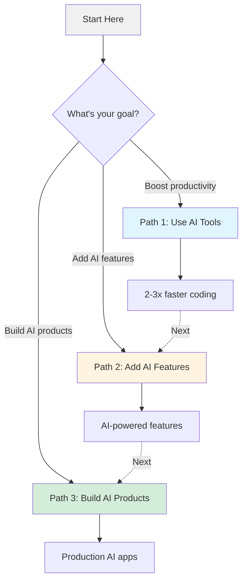

# Learning Paths Overview

Choose your learning path based on your goals and current skill level.

## The Three Paths to AI Mastery

## Path Comparison

| Path | Time | Difficulty | Prerequisites | You'll Build |
|------|------|------------|---------------|--------------|
| **[Path 1: Use AI Tools](./productivity.md)** | 1-2 weeks | Beginner | Basic programming | N/A (productivity tools) |
| **Path 2: Add AI Features** 🚧 | 2-4 weeks | Intermediate | JavaScript, React basics | Chatbots, AI search, smart forms |
| **Path 3: Build AI Products** 🚧 | 4+ weeks | Advanced | Full-stack development | Complete AI SaaS applications |

*🚧 = Coming soon*

---

## Path 1: Use AI Tools

**Status**: ✅ Available

### What You'll Learn
Master AI coding assistants to code 2-3x faster with Cursor, Copilot, Claude CLI, and Gemini CLI.

### Learning Outcomes
- ⚡️ Code 2-3x faster with AI autocomplete
- 🐛 Debug in minutes with AI assistance
- 📚 Learn codebases rapidly
- ✨ Generate boilerplate instantly

### Who Should Take This Path
- Developers new to AI coding tools
- Anyone wanting to boost productivity
- Engineers learning new frameworks/languages
- Teams adopting AI-assisted development

**[Start Path 1 →](./productivity.md)**

---

## Path 2: Add AI Features

**Status**: 🚧 Coming Soon

### What You'll Learn
Integrate AI capabilities into existing applications using JavaScript/TypeScript.

### Learning Outcomes
- 🤖 Build streaming AI chatbots
- 🔍 Implement semantic search with RAG
- 📝 Create AI-powered forms
- 🛠️ Use OpenAI, Anthropic, and HuggingFace APIs

### Who Should Take This Path
- Frontend developers adding AI features
- Full-stack engineers building AI products
- Product managers prototyping AI ideas
- Startups integrating AI into existing apps

**Expected Release**: Q1 2026

---

## Path 3: Build AI Products

**Status**: 🚧 Coming Soon

### What You'll Learn
Design, build, and deploy production-ready AI-powered applications from scratch.

### Learning Outcomes
- 🚀 Deploy AI apps to Edge/Workers
- 📊 Implement monitoring and observability
- 💰 Optimize costs and performance
- 🔒 Handle security and rate limiting
- 🧪 Test and evaluate AI systems

### Who Should Take This Path
- Senior engineers architecting AI systems
- Tech leads planning AI infrastructure
- Founders building AI-first products
- Engineers preparing for AI engineering roles

**Expected Release**: Q2 2026

---

## How to Choose Your Path

### Start with Path 1 if...
- ✅ You're new to AI development
- ✅ You want immediate productivity gains
- ✅ You learn best by using tools hands-on
- ✅ You have limited time (1-2 weeks)

### Skip to Path 2 if...
- ✅ You already use AI coding tools daily
- ✅ You want to add AI features to your app
- ✅ You're comfortable with JavaScript/TypeScript
- ✅ You can dedicate 2-4 weeks

### Jump to Path 3 if...
- ✅ You've built AI features before
- ✅ You're planning a production AI application
- ✅ You understand RAG, embeddings, and agents
- ✅ You need deployment and scaling knowledge

---

## Prerequisites by Path

### Path 1: Use AI Tools
- Basic programming knowledge (any language)
- Code editor (VS Code recommended)
- Willingness to try new workflows

### Path 2: Add AI Features
- JavaScript/TypeScript proficiency
- React or Vue experience
- Basic understanding of APIs
- Node.js environment setup

### Path 3: Build AI Products
- Full-stack development experience
- Understanding of Path 2 concepts
- DevOps basics (deployment, monitoring)
- Database experience

---

## Learning Path Roadmap

### Suggested Progression

**Month 1**: Path 1 - Use AI Tools
- Week 1-2: Master AI coding assistants
- Practice daily with real projects

**Month 2-3**: Path 2 - Add AI Features
- Week 3-4: API integration fundamentals
- Week 5-6: Build chatbot and RAG search
- Week 7-8: Advanced patterns (agents, tools)

**Month 4+**: Path 3 - Build AI Products
- Week 9-10: Production deployment
- Week 11-12: Monitoring and optimization
- Week 13-16: Complete AI SaaS project

**Total Time to Mastery**: 3-4 months (30-60 min/day)

---

## Quick Start Recommendations

### I'm a Frontend Developer
1. Start: **Path 1** (use AI tools to speed up React/Vue work)
2. Next: **Path 2** (add AI chat to your app)
3. Final: **Path 3** (build complete AI product)

### I'm a Backend Developer
1. Start: **Path 1** (use AI for API development)
2. Next: **Path 2** (integrate LLM APIs)
3. Final: **Path 3** (architect AI infrastructure)

### I'm a Product Manager
1. Start: **Path 1** (understand AI capabilities)
2. Next: **Path 2** (prototype AI features)
3. Consider: External development for Path 3

### I'm a Startup Founder
1. Start: **Path 2** (validate AI features quickly)
2. Parallel: **Path 1** (boost team productivity)
3. Next: **Path 3** (scale to production)

---

## Additional Resources

### Before You Start

- [AI Decision Framework](https://github.com/zenheart/learn-ai#5-the-ai-decision-framework-for-frontend-engineers)

### Reference Materials
- [Tech Stack Overview](../tech/index.md)
- [AI Coding Tools](../products/ai-coding/index.md)
- [Prompt Engineering](../tech/prompt/index.md)

### Community
- [GitHub Discussions](https://github.com/zenheart/learn-ai/discussions)
- [Contribution Guide](https://github.com/zenheart/learn-ai/blob/master/CONTRIBUTING.md) 🚧 (Coming Soon)

---

## Frequently Asked Questions

**Q: Can I skip paths?**
A: Yes, but we recommend Path 1 for everyone. Mastering AI coding tools is foundational for all AI development.

**Q: How much time per day do I need?**
A: 30-60 minutes/day is ideal. Consistency matters more than intensity.

**Q: Do I need a paid AI tool subscription?**
A: Path 1 requires a subscription (Cursor $20/mo or Copilot $10/mo). Paths 2-3 use pay-per-use APIs (~$5-20/mo for learning).

**Q: Are there assessments?**
A: Each path has self-assessment milestones. We'll add certification options in the future.

**Q: Can I learn in a team?**
A: Absolutely! We encourage team learning. Pair programming with AI tools is highly effective.

---

**Ready to start?** Choose your path and begin your AI mastery journey!

- ✅ **[Path 1: Use AI Tools](./productivity.md)** - Start here
- 🚧 **Path 2: Add AI Features** - Coming soon
- 🚧 **Path 3: Build AI Products** - Coming soon
