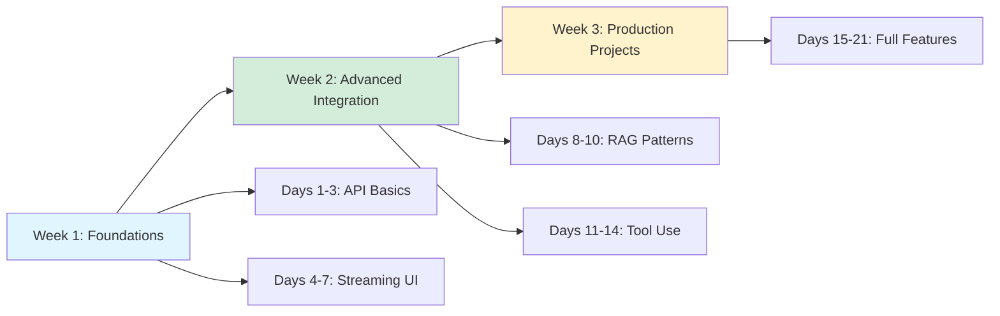

# Path 2: Add AI Features - Integrate AI into Apps

**Time Investment**: 2-4 weeks (30 minutes/day)
**Difficulty**: Intermediate
**Prerequisites**: React/Next.js basics, Node.js knowledge, API Key (OpenAI/Anthropic)

## Overview

This learning path transforms you from a frontend consumer of AI tools into a **builder of AI-powered applications**. You will learn to integrate LLMs directly into your user interfaces, handle streaming responses, manage AI state, and build production-ready features like chatbots and semantic search.

**What You'll Build**:
- 💬 **Streaming Chatbots** that feel like ChatGPT
- 📝 **AI Form Autocomplete** to speed up data entry
- 🔍 **Semantic Search** to find meaning, not just keywords
- 🛠️ **Tool-Using Agents** that can fetch data and perform actions
- 🛡️ **Robust Error Handling** for unreliable AI responses

## Learning Path Overview

## Week 1: Foundations (Days 1-7)

### Days 1-3: API Fundamentals

Understand how to communicate with Large Language Models (LLMs) via API.

#### Core Concepts
1.  **Request/Response Model**: Text-in, text-out.
2.  **Authentication**: API keys and environment variables.
3.  **Models**: Differences between GPT-4o, Claude 3.5 Sonnet, Gemini 1.5.
4.  **Cost**: Tokens, input vs. output pricing.

**Key Resources**:
- [API Comparison](../integration/apis/index.md)
- [OpenAI Integration Guide](../integration/apis/openai.md)
- [Anthropic Integration Guide](../integration/apis/anthropic.md)

**Daily Practice (30 min/day)**:
1.  **Day 1**: Sign up for OpenAI/Anthropic, get API key, make first curl request.
2.  **Day 2**: Create a simple Node.js script to send a prompt and log response.
3.  **Day 3**: Experiment with system prompts vs. user prompts to change behavior.

**Success Milestone**: Successfully receive a structured JSON response from an LLM.

---

### Days 4-7: Streaming User Interfaces

Users expect AI to "type" out answers. Learn to implement streaming.

#### The Streaming Challenge
- **Standard API**: Waits for full generation (slow!).
- **Streaming API**: Sends chunks of text as they are generated (fast TTFT - Time To First Token).
- **Frontend**: Needs to update state incrementally without flickering.

**Tools**:
- **Vercel AI SDK**: The standard for React/Next.js AI apps.
- **Server Sent Events (SSE)**: The protocol behind the scenes.

**Key Resources**:
- [Streaming Fundamentals](../tech/frontend/streaming.md)
- [Vercel AI SDK Guide](../integration/frameworks/vercel-ai-sdk.md)
- [Cookbook: Chat UI](../cookbook/chat-ui.md)

**Daily Practice**:
1.  **Day 4**: Set up a Next.js project with Vercel AI SDK.
2.  **Day 5**: Implement `useChat` hook for a basic chatbot.
3.  **Day 6**: Build a `useCompletion` component for text generation.
4.  **Day 7**: Customize the UI (loading states, error handling).

**Success Milestone**: A functional chat interface that streams responses token-by-token.

---

## Week 2: Advanced Integration (Days 8-14)

### Days 8-10: RAG (Retrieval Augmented Generation)

Teach AI about *your* data.

#### Concept: RAG
1.  **Retrieve**: Find relevant data (docs, database rows) based on user query.
2.  **Augment**: Paste that data into the prompt context.
3.  **Generate**: Ask LLM to answer using only that data.

**Key Resources**:
- [RAG Pattern Explained](../tech/patterns/RAG.md)
- [Embeddings Guide](../tech/fundamentals/embeddings.md)
- [LlamaIndex TS Guide](../integration/frameworks/llamaindex-ts.md)

**Daily Practice**:
1.  **Day 8**: Generate embeddings for a list of text strings.
2.  **Day 9**: Implement a simple cosine similarity search function.
3.  **Day 10**: Build a "Chat with your Text File" feature.

**Success Milestone**: Ask a question about a specific private document and get a correct answer.

---

### Days 11-14: Tool Calling (Agents)

Turn AI from a chatbot into an agent that *does* things.

#### Concept: Function Calling
- Describe functions (tools) to the LLM (e.g., `getWeather(city)`).
- LLM returns a JSON request to call that function.
- You execute the function code and return the result to the LLM.
- LLM generates a natural language response based on the result.

**Key Resources**:
- [Tool Calling Guide](../integration/protocols/tool-calling.md)
- [MCP Protocol](../integration/protocols/mcp.md)
- [Generative UI](../tech/frontend/generative-ui.md)

**Daily Practice**:
1.  **Day 11**: Define a simple tool (e.g., calculator or weather mocker).
2.  **Day 12**: Implement the loop: Prompt -> LLM decides tool -> Execute tool -> LLM explains result.
3.  **Day 13**: Use Vercel AI SDK's `tool` support for easier integration.
4.  **Day 14**: **Advanced**: Render a UI component based on the tool result (Generative UI).

**Success Milestone**: An app where asking "What's the weather?" triggers code execution and shows data.

---

## Week 3: Production Projects (Days 15-21)

Combine everything into polished features.

### Project 1: Smart Form Autocomplete
**Goal**: A form that fills itself based on a short user description.
**Stack**: Next.js, Vercel AI SDK (`useObject`).
**Features**:
- User types "Flight to Paris next Friday"
- Form auto-fills: Destination: Paris, Date: [Next Friday's Date]
- **Key Skill**: Structured Output (JSON mode).

### Project 2: Documentation Q&A Bot
**Goal**: A chatbot widget for a documentation site.
**Stack**: Next.js, OpenAI, Supabase (pgvector) or simple in-memory vector store.
**Features**:
- RAG pipeline for documentation.
- Source citations ("Answer found in section X").
- **Key Skill**: RAG and context management.

### Project 3: AI Dashboard Analyst
**Goal**: An admin panel that answers questions about data.
**Stack**: Next.js, Recharts, Tool Calling.
**Features**:
- "Show me sales for last week" -> Renders a chart.
- "List top users" -> Renders a table.
- **Key Skill**: Generative UI / Dynamic Component Rendering.

---

## API Integration Checklist

Before shipping, ensure you handle these production concerns:

### Security
- [ ] **API Keys**: Never exposed on client-side. Use API routes/proxies.
- [ ] **Rate Limiting**: Prevent one user from draining your credits.
- [ ] **Content Moderation**: Filter inappropriate inputs/outputs.

### User Experience
- [ ] **Optimistic UI**: Show user input immediately.
- [ ] **Loading States**: Skeletons or spinners during "Thinking..." phase.
- [ ] **Stream Handling**: Smooth text rendering (no jitter).
- [ ] **Feedback**: Allow users to rate responses (thumbs up/down).

### Reliability
- [ ] **Fallbacks**: Handle API downtime gracefully.
- [ ] **Retries**: Exponential backoff for failed requests.
- [ ] **Timeouts**: Don't let requests hang forever.

---

## Next Steps

### Path 3: Mastery (4+ weeks)

Move from integration to **building complete AI products and platforms**:

- 🏗️ **Advanced RAG**: Hybrid search, re-ranking, knowledge graphs.
- 🧪 **Evals & Testing**: Systematically improving prompt quality.
- 🚀 **Ops**: Monitoring, finetuning, and cost optimization.
- 🤖 **Multi-Agent Systems**: Complex autonomous workflows.

**Coming Soon**: [Path 3: Mastery](./mastery.md)

---

## Additional Resources

### Documentation
- [Vercel AI SDK Documentation](https://sdk.vercel.ai/docs)
- [OpenAI API Reference](https://platform.openai.com/docs/api-reference)
- [Anthropic API Reference](https://docs.anthropic.com/en/api/getting-started)

### Community Examples
- [Vercel AI Templates](https://vercel.com/templates?search=ai)
- [LangChain.js Examples](https://github.com/langchain-ai/langchainjs)

---

**Ready to start?** Begin by getting your API keys and setting up the basic environment!

**Time to complete**: 2-4 weeks
**Expected Outcome**: 3 Portfolio-ready AI features
**Next learning path**: [Path 3: Mastery](./mastery.md) 🚧
