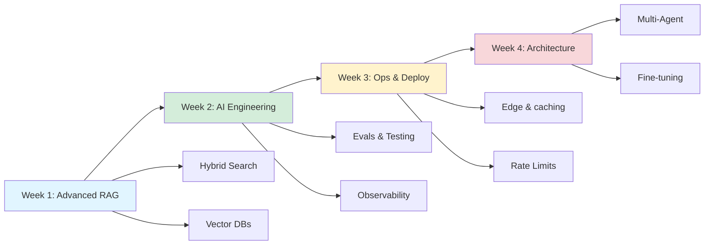

# Path 3: AI Engineer Mastery - Build Production AI Products

**Time Investment**: 4-8 weeks (Advanced)
**Difficulty**: Expert
**Prerequisites**: Path 2 completion, strong full-stack skills (Next.js/Node.js/Database)

## Overview

This is the final stage of your transformation into a **Senior AI Engineer**. You will move beyond simple integrations to building robust, scalable, and cost-effective AI platforms. You will learn to handle "the last mile" of AI development—where 80% of the work lies.

**What You'll Ship**:
- 🏢 **Enterprise Knowledge Base** with hybrid search and citation
- 🤖 **Multi-Agent Systems** that autonomously research and report
- 📊 **AI Analytics Platform** with text-to-SQL capabilities
- 🛡️ **Production Gateways** managing costs, caching, and security

## Learning Path Overview

## Week 1: Advanced RAG Patterns

Basic RAG is easy. Production RAG is hard.

### Concepts
1.  **Hybrid Search**: Combining Keyword (BM25) + Semantic (Vector) search for best accuracy.
2.  **Re-ranking**: Using a specialized model (Cross-Encoder) to re-sort search results.
3.  **Metadata Filtering**: "Search only PDF files created last week".
4.  **Data Ingestion Pipelines**: Parsing PDFs, chunking strategies, and incremental updates.

**Key Resources**:
- [Advanced RAG Patterns](../tech/patterns/RAG.md)
- [Project: RAG Search](../projects/intermediate/rag-search.md)
- [Cookbook: Local Embeddings](../cookbook/local-embedding.md)

**Projects**:
- **Ingestion Engine**: Build a pipeline that watches a folder, OCRs PDFs, chunks them, and updates Pinecone/pgvector.
- **Smart Search**: Implement Hybrid Search using Supabase pgvector + Fuse.js (or similar keyword search).

---

## Week 2: AI Engineering Practices

Treat prompts like code. Test, measure, and optimize.

### Concepts
1.  **Evals (Evaluations)**: Automated unit tests for LLMs. "Does this answer contain the correct pricing info?"
2.  **Prompt Management**: Version controlling prompts separate from code.
3.  **Observability**: Tracing chains, monitoring token usage, and logging interactions.
4.  **Feedback Loops**: Storing user "thumbs up/down" to improve future responses.

**Key Resources**:
- [Testing & Evals](../tech/engineering/testing.md)
- [Observability](../tech/engineering/observability.md)
- [Security Best Practices](../tech/engineering/security.md)

**Projects**:
- **Eval Suite**: Write a script that runs 50 test questions against your RAG bot and scores the answers using an LLM-as-a-judge.
- **Dashboard**: Build a simple admin view showing "Average Tokens per Request", "Error Rate", and "Top User Questions".

---

## Week 3: Production Deployment & Ops

Scalability, Latency, and Cost.

### Concepts
1.  **Edge Computing**: Running AI logic on Cloudflare Workers/Vercel Edge for lowest latency.
2.  **Caching**: Semantic caching (Redis) to serve identical queries instantly and free.
3.  **Rate Limiting**: Tiered access (Free vs. Pro users).
4.  **Cost Optimization**: Router architecture (route simple queries to cheap models, complex ones to GPT-4).

**Key Resources**:
- [Deployment Guide](../deployment/index.md)
- [Cost Optimization](../tech/engineering/cost-optimization.md)
- [Caching Strategies](../deployment/caching.md)

**Projects**:
- **AI Gateway**: Build a proxy server that handles auth, rate limiting, and caching before forwarding to OpenAI.
- **Edge Chat**: Deploy a chat interface completely on the edge (e.g., Cloudflare Workers AI).

---

## Week 4: Advanced Architecture

The cutting edge.

### Concepts
1.  **Multi-Agent Systems**: Orchestrating multiple specialized agents (Researcher, Writer, Reviewer).
2.  **Fine-tuning (SFT)**: When prompt engineering isn't enough (style, specialized format).
3.  **Local LLMs**: Running Llama 3 or Mistral on user devices or private servers.
4.  **Text-to-SQL**: Safely letting users query databases in natural language.

**Key Resources**:
- [Multi-Agent App](../projects/advanced/multi-agent-app.md)
- [Frontend ML (Transformers.js)](../integration/frontend-ml/index.md)
- [Fine-Tuning Guide](../tech/training/SFT.md)

**Projects**:
- **Autonomous Researcher**: An agent that searches the web, reads 5 pages, and writes a summary report.
- **Private Analyst**: A Text-to-SQL bot that answers questions about a sample e-commerce database.

---

## Portfolio Projects to Showcase

To get hired as an AI Engineer, build these:

### 1. The "Enterprise Brain" (RAG)
**Pitch**: "A secure, internal knowledge base that knows everything about the company."
**Tech**: Next.js, LangChain/LlamaIndex, Supabase (pgvector), Clerk (Auth).
**Features**: Upload PDFs/Notion docs, Cite sources, Slack integration.

### 2. The "Autonomous Worker" (Agents)
**Pitch**: "An AI employee that handles customer support tickets."
**Tech**: Python (LangGraph) or TypeScript (LangChain.js), OpenAI Assistants API.
**Features**: Read ticket, search knowledge base, draft reply, tag category, update CRM.

### 3. The "Creative Studio" (Generative UI)
**Pitch**: "Canva but driven by text."
**Tech**: Next.js, Vercel AI SDK, Fal.ai (Image Gen).
**Features**: "Design a poster for a jazz concert" -> Generates layout, text, and images.

---

## Engineering Best Practices Checklist

- [ ] **Prompt Engineering**: Use CoT (Chain of Thought) for complex logic.
- [ ] **Security**: Sanitize inputs to prevent Prompt Injection.
- [ ] **Privacy**: PII redaction before sending data to LLMs.
- [ ] **Fallback**: If GPT-4 fails, fall back to GPT-3.5 or Claude.
- [ ] **Streaming**: Always stream responses > 1 second.
- [ ] **Testing**: CI/CD pipeline includes prompt evals.

---

## Career Advancement Tips

**Roles to Target**:
- AI Engineer
- AI User Interface Engineer
- Forward-Deployed Engineer (FDE)
- Solutions Engineer (AI Focus)

**Interview Prep**:
- Know the "Context Window" limitations.
- Explain "RAG vs. Fine-tuning" (See [Training Guide](../tech/training/index.md)).
- Understand vector math basics (Cosine Similarity).
- Be able to discuss cost vs. latency trade-offs.

---

## Next Steps

**Congratulations!** You have mapped out the entire journey from beginner to expert.

Now, it's time to build. Start by picking one project from **Path 2** or **Path 3** and implementing it fully.

**Go to**: [Projects Section](../projects/index.md) (coming soon)

---

**Ready to start?** Pick a "Week 1" project and begin!

**Time to complete**: 4-8 weeks
**Expected Outcome**: A senior-level AI engineering portfolio
