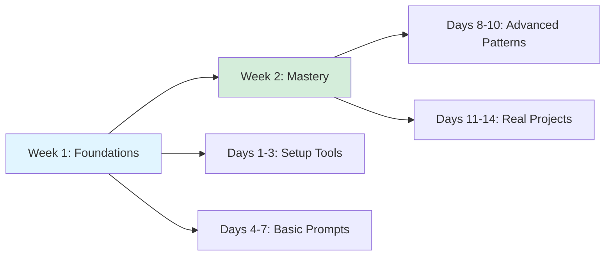

# Path 1: Use AI Tools - Master AI Coding Assistants

**Time Investment**: 1-2 weeks (30 minutes/day)
**Difficulty**: Beginner
**Prerequisites**: Basic programming knowledge, VS Code or similar IDE

## Overview

This learning path transforms you from a traditional developer into an **AI-augmented engineer** who codes 2-3x faster. You'll master the most powerful AI coding assistants and learn to write prompts that generate production-quality code.

**What You'll Achieve**:
- ⚡️ **2-3x faster coding** with AI autocomplete and generation
- 🐛 **Debug in minutes** instead of hours with AI assistance
- 📚 **Learn new codebases** rapidly with AI explanations
- ✨ **Generate boilerplate** instantly (components, tests, configs)
- 🎯 **Focus on architecture** while AI handles implementation details

## Learning Path Overview



## AI Coding Tools Landscape

Before diving in, understand the **5 levels of AI coding assistance**:

| Level | Capability | Example Tools |
|-------|------------|---------------|
| **L1** | Code-level completion | GitHub Copilot, Tabby |
| **L2** | Task-level code generation | Cursor, Claude CLI, Copilot Chat, Continue |
| **L3** | Project-level generation | v0, Sweep, Pythagora |
| **L4** | PRD to production | bolt.new, Lovable, Devin |
| **L5** | AI development team | MetaGPT, AutoDev |

**This path focuses on L1-L2** - the tools you'll use daily as a frontend engineer.

---

## Week 1: Foundations (Days 1-7)

### Days 1-3: Tool Setup & First Prompts

#### Choose Your Primary Tool

Pick **ONE** tool to master first (you can add others later):

**Option 1: Cursor** (Recommended for beginners)
- Best for: Comprehensive AI assistance, chat + autocomplete
- Setup: [Cursor Setup Guide](../products/ai-coding/cursor.md)
- Strength: Multi-file context, excellent UI/UX

**Option 2: GitHub Copilot**
- Best for: VS Code users, fast autocomplete
- Setup: [Copilot Setup Guide](../products/ai-coding/copilot.md)
- Strength: Industry standard, large training dataset

**Option 3: Claude CLI**
- Best for: Terminal lovers, command-line workflows
- Setup: [Claude CLI Setup Guide](../products/ai-coding/claude-cli.md)
- Strength: Best reasoning for complex refactoring

**Option 4: Gemini CLI**
- Best for: Google ecosystem users
- Setup: [Gemini CLI Setup Guide](../products/ai-coding/gemini-cli.md)
- Strength: Large context window, multimodal capabilities

**Daily Practice (30 min/day)**:
1. Install your chosen tool
2. Complete 5 autocomplete tasks (write function signatures, let AI complete)
3. Ask AI to explain 3 unfamiliar code snippets

**Success Milestone**: AI autocompletes 50%+ of your code successfully

---

### Days 4-7: Effective Prompt Engineering

Learn to write prompts that generate **production-quality code**.

#### The CRISP Prompt Framework

Use this structure for every AI coding request:

**C**ontext - What's the situation?
**R**equirements - What do you need?
**I**nput/Output - What data flows through?
**S**tyle - What conventions to follow?
**P**itfalls - What to avoid?

**Example - Bad Prompt**:
```
Create a login form
```

**Example - CRISP Prompt**:
```
Context: I'm building a Next.js 14 app with TypeScript and Tailwind CSS.

Requirements: Create a login form component with email/password fields.

Input/Output:
- Input: User credentials (email, password)
- Output: onSubmit callback with validated credentials

Style:
- Use React Hook Form for validation
- Follow our Tailwind design system (centered card, blue primary colors)
- Export as default function component

Pitfalls:
- Don't use inline styles
- No external libraries except react-hook-form and zod
- Include TypeScript types for all props
```

**Daily Practice**:
1. Rewrite 3 vague prompts using CRISP framework
2. Generate 1 React component with detailed prompt
3. Refactor 1 existing file with AI assistance

**Success Milestone**: 80%+ of AI-generated code requires minimal edits

---

## Week 2: Mastery (Days 8-14)

### Days 8-10: Advanced Patterns

#### Pattern 1: Iterative Refinement

Don't expect perfect code on first try. Use this workflow:

```
1. Generate base implementation (broad prompt)
2. Review output → identify issues
3. Refine with specific corrections
4. Repeat until production-ready
```

**Example Workflow**:
```
You: "Create a useDebounce hook in TypeScript"
AI: [generates basic version]

You: "Add cleanup in useEffect to prevent memory leaks"
AI: [adds cleanup]

You: "Add JSDoc comments and handle edge cases for delay=0"
AI: [final version]
```

#### Pattern 2: Context Loading

Help AI understand your codebase by providing context:

**Techniques**:
- 📁 **Share file structure**: Paste `tree -L 2 src/` output
- 🔍 **Reference existing patterns**: "Follow the style in `src/components/Button.tsx`"
- 📋 **Attach config files**: Share `tsconfig.json`, `package.json` snippets
- 🎨 **Define conventions**: "We use named exports, not default exports"

**Daily Practice**:
1. Generate 1 component that matches existing codebase style
2. Refactor 1 legacy file using "rewrite following our patterns" prompt
3. Create 1 utility function with comprehensive tests

**Success Milestone**: AI generates code that passes linting/testing without modification

---

### Days 11-14: Real-World Projects

Apply AI coding to actual development tasks.

#### Mini-Project Ideas

**Project 1: Form Builder** (2 hours with AI vs 6 hours manual)
- Build a dynamic form component with validation
- Use AI to generate: component structure, Zod schema, error handling
- Your role: Architecture decisions, API integration

**Project 2: API Client** (1 hour with AI vs 4 hours manual)
- Create TypeScript API client with type-safe endpoints
- Use AI to generate: fetch wrappers, error handling, retry logic
- Your role: Design API structure, handle authentication

**Project 3: Testing Suite** (1.5 hours with AI vs 5 hours manual)
- Write comprehensive tests for existing component
- Use AI to generate: test cases, mocks, edge case scenarios
- Your role: Identify critical paths, review coverage

**Daily Practice**:
1. Complete 1 mini-project
2. Track time saved vs manual coding
3. Review AI-generated code quality

**Success Milestone**: Complete 1 project in 1/3 the time with 90%+ code quality

---

## Tool-Specific Guides

### Cursor Power User Tips

**1. Multi-File Context (Cmd/Ctrl + K)**
```
Select multiple files → Ask: "Refactor these to share a common utility"
```

**2. Inline Chat (Cmd/Ctrl + L)**
```
Highlight code → Press Cmd+L → "Optimize this for performance"
```

**3. Composer Mode**
```
For multi-step tasks: "Create component → Add tests → Write Storybook story"
```

**See Full Guide**: [Cursor Documentation](../products/ai-coding/cursor.md)

---

### GitHub Copilot Power User Tips

**1. Comment-Driven Development**
```javascript
// Function to debounce API calls with TypeScript generics
// Should handle cleanup and support custom delay
export function useDebounce... // Let Copilot complete
```

**2. Test Generation**
```javascript
// Write comprehensive tests for the above function including:
// - Basic debounce behavior
// - Cleanup on unmount
// - Edge case: delay = 0
describe('useDebounce', () => {
  // Copilot generates test cases
```

**3. Tab + Arrow Keys Navigation**
- `Tab`: Accept suggestion
- `Alt/Option + ]`: Next suggestion
- `Alt/Option + [`: Previous suggestion

**See Full Guide**: [Copilot Documentation](../products/ai-coding/copilot.md)

---

### Claude CLI Power User Tips

**1. Repository Context**
```bash
# Analyze entire codebase before asking
claude-code --repo . "How should I structure a new feature?"
```

**2. Batch Operations**
```bash
# Refactor multiple files at once
claude-code "Migrate all class components to hooks"
```

**3. Architecture Reviews**
```bash
# Get high-level feedback
claude-code "Review my API design for scalability issues"
```

**See Full Guide**: [Claude CLI Documentation](../products/ai-coding/claude-cli.md)

---

## Daily Practice Schedule

### 30-Minute Daily Routine

**Week 1 Schedule**:
- **Days 1-3** (Setup Phase)
  - 10 min: Tool exploration
  - 15 min: Autocomplete practice
  - 5 min: Review AI suggestions quality

- **Days 4-7** (Prompt Phase)
  - 10 min: Rewrite 3 prompts with CRISP
  - 15 min: Generate 1 component
  - 5 min: Compare AI output vs manual code

**Week 2 Schedule**:
- **Days 8-10** (Patterns Phase)
  - 10 min: Practice iterative refinement
  - 15 min: Context loading exercises
  - 5 min: Document lessons learned

- **Days 11-14** (Projects Phase)
  - 25 min: Work on mini-project
  - 5 min: Track time savings and quality metrics

---

## Success Metrics

Track your progress with these measurable goals:

### Week 1 Milestones
- [ ] Tool installed and configured
- [ ] AI autocompletes 50%+ of code successfully
- [ ] Written 10+ CRISP-format prompts
- [ ] AI-generated code requires <20% edits

### Week 2 Milestones
- [ ] Completed 1+ mini-project
- [ ] Time savings: 2x faster on routine tasks
- [ ] AI code quality: 90%+ production-ready
- [ ] Comfortable with iterative refinement workflow

### Final Assessment
- [ ] Can generate production-quality components in minutes
- [ ] Understand when to use AI vs manual coding
- [ ] Developed personal prompt library
- [ ] Integrated AI tools into daily workflow

---

## Common Pitfalls & Solutions

### Pitfall 1: Accepting AI Code Blindly
**Problem**: AI generates plausible-looking but incorrect code
**Solution**: Always review for logic errors, security issues, performance problems

**Checklist**:
- ✅ Does it handle edge cases?
- ✅ Are there security vulnerabilities (XSS, SQL injection)?
- ✅ Is error handling comprehensive?
- ✅ Does it follow project conventions?

### Pitfall 2: Vague Prompts
**Problem**: "Create a form" → Generic, unusable output
**Solution**: Use CRISP framework (Context, Requirements, Input/Output, Style, Pitfalls)

### Pitfall 3: Over-Reliance on AI
**Problem**: Using AI for trivial tasks, losing fundamental skills
**Solution**: Use AI for boilerplate and exploration, manual coding for core logic

**When to Use AI**:
- ✅ Boilerplate (configs, types, tests)
- ✅ Unfamiliar libraries/patterns
- ✅ Refactoring repetitive code
- ✅ Generating test cases

**When to Code Manually**:
- ❌ Core business logic
- ❌ Security-critical code
- ❌ Performance-sensitive algorithms
- ❌ Learning new concepts

### Pitfall 4: Ignoring Context
**Problem**: AI generates code that doesn't match your stack
**Solution**: Always provide context (framework, language, conventions)

---

## Prompt Library Starter Kit

Save these templates for common tasks:

### Component Generation
```
Context: [Framework + styling approach]
Requirements: Create a [component name] component that [functionality]

Input/Output:
- Props: [list props with types]
- Returns: [what it renders]

Style:
- [Design system/styling preferences]
- [Component pattern (controlled/uncontrolled, etc.)]

Pitfalls:
- [Accessibility requirements]
- [Performance considerations]
```

### Bug Fixing
```
Context: [Describe codebase and bug symptoms]

Problem: [Exact error message or unexpected behavior]

Expected Behavior: [What should happen]

Debugging Done:
- [What you've already tried]

Code:
[Paste relevant code snippet]
```

### Code Review
```
Please review this code for:
1. Logic errors and edge cases
2. Security vulnerabilities
3. Performance issues
4. Best practices for [language/framework]
5. Accessibility concerns

Code:
[Paste code]

Context: [Production use case]
```

### Test Generation
```
Generate comprehensive tests for this [function/component]:

Coverage Requirements:
- Happy path scenarios
- Edge cases: [list specific edge cases]
- Error handling
- [Framework-specific: hooks lifecycle, component interactions, etc.]

Testing Framework: [Jest, Vitest, etc.]
Style: [Testing patterns you follow]

Code:
[Paste implementation]
```

---

## Tools Comparison Matrix

Still deciding which tool to use? Here's a detailed comparison:

| Feature | Cursor | Copilot | Claude CLI | Gemini CLI |
|---------|--------|---------|------------|------------|
| **Autocomplete** | ⭐⭐⭐⭐⭐ | ⭐⭐⭐⭐⭐ | ❌ | ❌ |
| **Chat Interface** | ⭐⭐⭐⭐⭐ | ⭐⭐⭐⭐ | ⭐⭐⭐⭐⭐ | ⭐⭐⭐⭐⭐ |
| **Multi-File Context** | ⭐⭐⭐⭐⭐ | ⭐⭐⭐ | ⭐⭐⭐⭐⭐ | ⭐⭐⭐⭐ |
| **Code Reasoning** | ⭐⭐⭐⭐ | ⭐⭐⭐ | ⭐⭐⭐⭐⭐ | ⭐⭐⭐⭐⭐ |
| **Learning Curve** | Easy | Easy | Medium | Medium |
| **IDE Integration** | Native (VS Code fork) | VS Code, JetBrains | Terminal | Terminal |
| **Cost** | $20/mo | $10/mo (individual) | API usage | API usage |
| **Best For** | Full-stack development | Quick autocomplete | Complex refactoring | Large context tasks |

**Recommendation**:
- **Beginners**: Start with **Cursor** (easiest onboarding)
- **VS Code power users**: Add **Copilot** for autocomplete
- **Terminal workflows**: Use **Claude CLI** for architecture work
- **Budget-conscious**: **Copilot** offers best value

---

## Next Steps

### Path 2: Add AI Features (2-4 weeks)

Now that you're an AI-augmented developer, learn to **integrate AI into your applications**:

- 🤖 Build streaming AI chatbots
- 🔍 Implement semantic search with embeddings
- 📝 Create AI-powered forms and autocomplete
- 🛠️ Use AI APIs (OpenAI, Anthropic, HuggingFace)

**Coming Soon**: [Path 2: Add AI Features](./integration.md)

### Explore Advanced AI Coding Tools

Ready to level up to L3-L5 tools?

- [AI Coding Tool Landscape](../products/ai-coding/index.md) - Full tool comparison
- [Other AI Coding Tools](../products/ai-coding/othertools.md) - Emerging tools

---

## Additional Resources

### Official Documentation
- [Cursor Official Docs](https://cursor.sh/docs)
- [GitHub Copilot Docs](https://docs.github.com/en/copilot)
- [Claude AI](https://claude.ai)
- [Gemini AI](https://ai.google.dev)

### Community & Learning
- [Cursor Community Forum](https://forum.cursor.sh)
- [GitHub Copilot Discord](https://discord.gg/github)
- [AI Coding Levels Framework](https://prompt.16x.engineer/blog/ai-coding-l1-l5)

### Prompt Engineering Resources
- [Prompt Engineering Guide](../tech/prompt/index.md)
- [Case Study: GitHub Copilot Prompts](../tech/prompt/cases/copilot.md)

---

## Feedback & Contribution

Found a better prompt pattern? Discovered a productivity hack?

**Contribute to this guide**:
1. Fork the repository
2. Add your tips to this document
3. Submit a pull request

**Questions or issues?** Open an issue on [GitHub](https://github.com/zenheart/learn-ai/issues)

---

**Ready to start?** Install your first tool and begin the 30-minute daily practice!

**Time to mastery**: 1-2 weeks
**Expected productivity gain**: 2-3x faster coding
**Next learning path**: [Path 2: Add AI Features](./integration.md) 🚧
