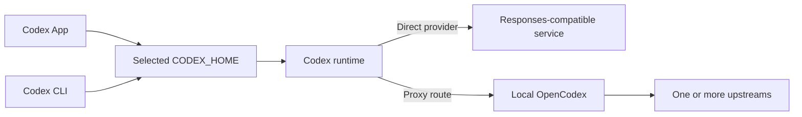

# Third-party models and shared App/CLI configurations

**Keep official sign-in in `~/.codex` and experiment in `~/.codex-api`. Within each mode, point App and CLI at the same home. Switch their launch environment instead of copying `auth.json` between modes.** A working integration needs compatible transport, authentication, catalog metadata, and client versions.[S1][S2][E1]

This tutorial generalizes a native Windows configuration investigation, checked on **2026-09-03** with CLI `0.153.0`, App runtime `0.153.0-alpha.5`, desktop package `26.901.1978.0`, and OpenCodex `2.14.0`. These are observed versions, not minimum supported versions.[E1]

## 1. Overview

### Choose the configuration boundary

| Goal | Approach | Verify |
| --- | --- | --- |
| Share official sign-in | Default `~/.codex`, same credential backend | Actual home, account type, official model list |
| Try a provider in CLI | Named profile or separate API home | Installed profile semantics and Responses compatibility |
| Switch both App and CLI | Launch both against the selected home; set its root provider | GUI home consumption, picker, actual request |
| Show models from several upstreams | Routing proxy such as OpenCodex | Model identifiers, authentication, service lifecycle |
| Return to official defaults | Remove overrides, disable proxy startup, restart clients | Runtime results as well as files |

**Prerequisites:** TOML, process environment variables, basic terminal/PowerShell use, and authorized access to your upstream. **Learning objectives:** understand file ownership, select two reusable configurations, distinguish visibility from availability, and restore official defaults.[S1][S2]

Scope is the local App and CLI. This is not a promise that every “OpenAI-compatible” endpoint works, a cloud Codex setup guide, or a distributable account configuration.

## 2. Usage

### Step 1: Keep a home for each mode

```text
~/.codex/                      Official mode: App + CLI
  config.toml                  User configuration
  auth.json                    Private official login, with file storage
~/.codex-api/                  API mode: App + CLI
  config.toml                  Custom provider
  catalog.json                 Optional, runtime-compatible model metadata
```

`CODEX_HOME` also selects local authentication and state. Two homes therefore have separate histories and caches. Sharing means **one home per mode, consumed by both interfaces**. MCP, plugins, skills, and history are not automatically synchronized across homes; reusable non-sensitive settings need an explicit source and synchronization process.[S1][E1]

Download the [official configuration](/examples/codex-config/official.config.toml), [third-party configuration](/examples/codex-config/third-party.config.toml), [catalog example](/examples/codex-config/catalog.example.json), and [Windows launcher](/examples/codex-config/Start-Codex.ps1). Merge settings into the intended file; do not overwrite unrelated integrations.

Official mode needs no hand-maintained model list, model ID, or base URL. The explicit file-storage template contains only:

```toml
cli_auth_credentials_store = "file"
```

Check your existing backend before changing it: `keyring` and `auto` may store credentials elsewhere. Do not put a third-party key in the official `auth.json`. Login and logout can affect both interfaces when they share the same home and credential backend.[S2]

### Step 2: Configure a Responses-compatible upstream

Put this in the **API home's root `config.toml`**. Replace the fictional model ID and reserved example domain with values from your upstream's documentation:

```toml
model_provider = "example_gateway"
model = "provider-model-id"

[model_providers.example_gateway]
name = "Example Responses gateway"
base_url = "https://gateway.example.com/v1"
env_key = "EXAMPLE_MODEL_API_KEY"
wire_api = "responses"
supports_websockets = false
```

The checked configuration reference accepts only `responses` for `wire_api`. A Chat Completions-only endpoint needs a protocol adapter. Disabling WebSockets does not repair incompatible streaming events, tool calls, or model IDs.[S3]

Supply `EXAMPLE_MODEL_API_KEY` to the launching process from your local credential manager. Do not paste a real value into a template, shell history, or PR. A GUI launched from a desktop icon may not inherit terminal variables. Command-backed `[model_providers.<id>.auth]` can retrieve a token from a credential helper; do not combine it with `env_key`, an inline bearer, or `requires_openai_auth`.[S1][S3]

`requires_openai_auth = true` selects OpenAI authentication and overrides `env_key`. Use it only for a trusted proxy that explicitly requires OpenAI authentication passthrough.[S2]

### Step 3: Select the same mode for both interfaces

On **native Windows**, run one of these alternatives from a PowerShell session with the appropriate credential environment:

```powershell
.\Start-Codex.ps1 -Mode official -Surface cli
.\Start-Codex.ps1 -Mode api -Surface cli
.\Start-Codex.ps1 -Mode official -Surface app
.\Start-Codex.ps1 -Mode api -Surface app
```

The launcher temporarily sets process-level `CODEX_HOME` and restores the caller's value afterward. For App mode it requires the old desktop instance to be closed, discovers the installed MSIX executable, and fails explicitly if the installation layout differs.[E2]

**Verify actual consumption:** open the configuration file from App settings and check its path, then inspect the embedded app-server's `config/read`. A different terminal's environment does not establish which home the GUI loaded. If an installation ignores the launch environment, investigate its configuration entry point before switching. Do not blindly delete directories or introduce junctions. Launcher syntax was tested; GUI switching across every installation method was not.[S4][E2]

For **macOS/Linux CLI**, select the environment per process:

```bash
CODEX_HOME="$HOME/.codex" codex
CODEX_HOME="$HOME/.codex-api" codex
```

A macOS GUI launch also needs the actual executable path, a closed previous instance, and verified environment inheritance. This investigation did not test macOS GUI switching, so it does not supply an unverified universal launch command.[E1]

### Step 4: Add a catalog when the picker needs it

`model` selects a request model; `model_catalog_json` supplies model metadata loaded at startup. The downloadable catalog is a complete **fictional structural fixture**. Replace its context size, reasoning levels, image support, and tool capabilities with your upstream's actual contract.[S3][E2]

Add an absolute path **before the first TOML table header**:

```toml
model_catalog_json = 'C:\Users\Example\.codex-api\catalog.json'
```

Replace `Example` with your own directory. A key after `[model_providers.example_gateway]` belongs to that provider table, not the root.

Validate the catalog against each actual binary:

```powershell
codex debug models --help
codex -c 'model_catalog_json="C:\Users\Example\.codex-api\catalog.json"' debug models
```

Repeat with the App's bundled `codex.exe`, then restart App and inspect its picker. Global CLI and App can package different versions. A catalog copied from upstream `main` is not a cross-version contract; a published reproduction demonstrates this failure.[S5][E2]

### Step 5: Introduce OpenCodex only if you need routing

OpenCodex is a local proxy that routes model identifiers to upstream providers and changes Codex's connection settings and catalog. Its `2.14.0` documentation describes a root `openai_base_url` override on loopback and a named provider on non-loopback binds. Its own `OPENCODEX_HOME` is distinct from `CODEX_HOME`.[S6][E1]



Use an isolated test environment and read the installed help before initialization. `ocx init` modifies the selected Codex configuration:

```powershell
$env:CODEX_HOME = Join-Path $env:USERPROFILE '.codex-api'
$env:OPENCODEX_HOME = Join-Path $env:USERPROFILE '.opencodex-lab'
npm install -g @bitkyc08/opencodex@2.14.0
ocx --help
ocx init
ocx start
```

Close this test terminal afterward so its variables cannot affect your next official launch. Configure authentication through the [OpenCodex provider guide](https://opencodex.me/guides/providers/). Official ChatGPT passthrough, API-key routing, and account pools are separate mechanisms; changing a model name does not convert one into another.[S6][S7]

## 3. Principles

### Keep five independent states separate

| State | Owner | What it does not prove |
| --- | --- | --- |
| Configuration home | Launch process and `CODEX_HOME` | An existing GUI reloaded its configuration |
| Authentication | Provider auth mechanism and credential storage | A stored key is valid or authorized for the model |
| Routing | Provider selection and URLs, or proxy overrides | A GPT-like model label uses an official endpoint |
| Catalog | Static JSON, cache, bundled/remote model data | A visible model can complete a request |
| Task configuration | Thread creation/resumption | A new global default migrated historical threads |

These boundaries follow the configuration interfaces and the observed setup; verify them independently.[S1][S3][S4][E1]

### HOME versus profile

**HOME separates local state; a profile overlays configuration within that home.** From `0.134.0`, CLI `--profile gateway` reads `$CODEX_HOME/gateway.config.toml`. Legacy `[profiles.gateway]` tables and the root `profile = "gateway"` selector no longer apply.[S1]

For a CLI-only experiment, save the third-party template as `gateway.config.toml` and run:

```bash
codex --profile gateway
```

Verify whether your App version exposes an equivalent profile selector. The two-interface workflow here selects the provider in each home's root config and does not assume that a GUI accepts a CLI flag.[E1]

`models_cache.json` is derived state. The investigated machine had both injected catalogs and hundreds of cached entries. Stopping the proxy still required removing overrides and restarting. The official model manager also treats cached refreshes and static catalogs separately.[E1][S8]

## 4. Development

### Case study: return an experimental machine to official defaults

The official home retained ChatGPT credentials but had a proxy-selected model and catalog. The API home used independent API authentication. An old GUI switcher expected junctions that no longer existed, while the API config injected a stale home into child processes. These observations describe one installation, not Codex defaults.[E1]

Use this recovery order after inspecting the actual installation:

1. Keep necessary recovery material on the original device, encrypted or access restricted. Never publish credentials, environment files, logs, account data, or session databases.
2. Exit App and CLI processes that must reload. Preserve the valid official login.
3. Before removing the package, stop OpenCodex and remove its startup service with the installed `ocx service stop` and `ocx service uninstall` commands. `ocx restore` alone does not stop the proxy.[S9]
4. Remove third-party root model/provider/catalog/URL overrides and provider tables. Clean associated profile files, auth helpers, injected artifacts, and stale model caches. Preserve unrelated MCP and project configuration.
5. Check wrappers, user environment, and `shell_environment_policy.set` for old homes, model keys, and routing overrides. Preserve credential sources still used by unrelated applications.
6. Retire the API home while keeping needed history; remove its independent API credential. For a full OpenCodex removal, also remove its runtime state and package.
7. Restart from default entry points and run the acceptance checks. Let the native runtime obtain its official list; do not hard-code an “official” whitelist.

| Gate | Evidence |
| --- | --- |
| Configuration | Same home for App/CLI; no third-party provider, catalog, or URL overrides |
| Authentication | Both runtimes report `chatgpt` through `account/read` and require OpenAI auth; omit personal fields |
| Models | Read every `model/list` page; no third-party entries or proxy prefixes |
| Background state | No service, task, tray, startup entry, or original listener |
| GUI | Restarted new-task picker agrees with the runtime |
| Requests | Make a non-sensitive minimal request before claiming inference works |

The App Server handshake and `config/read`, `account/read`, and `model/list` inspect the native consumer. Filter results locally: full effective configuration can contain sensitive values.[S4]

### Pitfalls and counterevidence

| Symptom | Diagnosis |
| --- | --- |
| CLI lists models but App picker is empty | Version-specific picker regressions exist; inspect bundled runtime, auth filtering, and GUI.[S10] |
| Editing catalog JSON does not update App | Startup-loaded catalogs and app-server caching require a restart and another check.[S3][S11] |
| One binary reports missing JSON fields | Use compatible catalog structure and parse it with both binaries.[S5] |
| Proxy stopped but requests still target localhost | A root URL/profile or old process remains.[E1] |
| A CLI launched by App uses another home | Inspect `shell_environment_policy.set.CODEX_HOME` and wrappers.[E1] |
| An old thread shows the previous model | Check a new task; do not rewrite session databases just to tidy model labels. |
| Healthy proxy cannot answer | Health, model visibility, upstream authorization, streaming, and tool continuation are separate gates. |

**Counterevidence found:** catalog schema mismatch, picker filtering, and startup caching refute the claim that setting `base_url` alone completes third-party support. Keep untested GUI and upstream behavior explicitly unverified.[S5][S10][S11]

**Next steps:** validate model selection, a plain response, a read-only tool call, and continuation after the tool result. Then read [Project integration](./integration) for MCP or return to the [CLI tutorial](./codex-cli).

## 5. Resource Library

### Sources and evidence scope

All sources were retrieved on **2026-09-03**. Where a rolling page has no publication date, use the retrieval date and the explicit tested versions.

| ID | Source / tier | Supports |
| --- | --- | --- |
| S1 | [Advanced Configuration](https://learn.chatgpt.com/docs/config-file/config-advanced), L0 | HOME, profile migration, provider and auth helper configuration |
| S2 | [Authentication](https://learn.chatgpt.com/docs/auth), L0 | Credential stores and provider authentication |
| S3 | [Configuration Reference](https://learn.chatgpt.com/docs/config-file/config-reference), L0 | Responses, catalogs, provider fields |
| S4 | [App Server](https://learn.chatgpt.com/docs/app-server), L0; [App Settings](https://learn.chatgpt.com/docs/reference/settings) | Native config/account/model inspection and settings entry point |
| S5 | [Codex #38934](https://github.com/openai/codex/issues/38934), L2 firsthand reproduction | Reported 2026-08-17: bundled runtime versus current catalog schema; not a support commitment |
| S6 | [OpenCodex Installation](https://opencodex.me/getting-started/installation/), project L0 | State ownership and Codex injection |
| S7 | [OpenCodex Providers](https://opencodex.me/guides/providers/), project L0 | Upstream protocol and authentication boundaries |
| S8 | [Codex 0.153.0 model manager](https://github.com/openai/codex/blob/rust-v0.153.0/codex-rs/models-manager/src/manager.rs), L0 source | Catalog and cache refresh behavior |
| S9 | [OpenCodex CLI Lifecycle](https://opencodex.me/reference/cli/lifecycle/), project L0 | Stop, restore, service removal |
| S10 | [Codex #34487](https://github.com/openai/codex/issues/34487), L2 firsthand report | Catalog loaded but picker empty |
| S11 | [Codex #35129](https://github.com/openai/codex/issues/35129), L2 firsthand report | Static catalog caching in app-server |
| E1 | Sanitized native Windows investigation, empirical | Home/config/auth types, installed proxy lifecycle, native runtime checks; private source files are not published |
| E2 | Downloadable template checks, empirical | Catalog parsing by both binaries, TOML parsing, PowerShell syntax; not real upstream or universal GUI validation |

### Retrieval log

| Channel | Exact query / path | Result / adoption |
| --- | --- | --- |
| Official-domain search | `Codex app custom model providers CODEX_HOME configuration` | Results returned; followed direct configuration pages |
| Official-domain search | `Codex model_catalog_json model providers auth config` | Results returned; adopted S1–S3 page bodies |
| Official GET | `config-advanced`, `config-reference`, `auth`, `app/settings` | Four pages; legacy URLs redirected to `learn.chatgpt.com` |
| Upstream issue search | `site:github.com/openai/codex "model_catalog_json" "app"` | Multiple results; opened/adopted S5, S10, S11 |
| Upstream issue search | `site:github.com/openai/codex "CODEX_HOME" "app" "provider"` | Shared-state leads; not treated as universal behavior |
| OpenCodex GET | `getting-started/installation/`, `guides/providers/`, `reference/configuration/providers/`, `reference/cli/lifecycle/` | Four pages; adopted lifecycle and routing boundaries |
| Native checks | Versions, help, config keys, processes/tasks/listeners, App Server RPC | Retained only structural summaries, booleans, versions, model names |

**Unverified:** real inference/tool execution against the fictional template upstream; GUI home switching across all operating systems and installation methods; compatibility of every third-party model with the current picker. The templates are an inspectable starting point, not substitutes for those checks.
