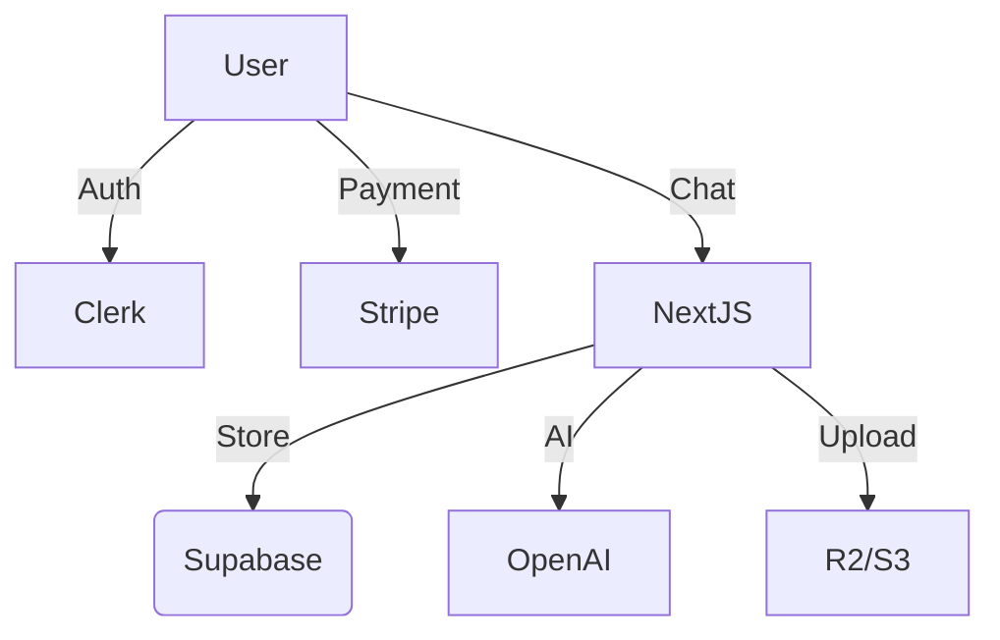

# Project: AI SaaS (Full Stack)

**Level**: Advanced
**Time**: 1-2 Weeks
**Stack**: Next.js, Postgres, Stripe, Clerk, Vercel AI SDK

## Overview

Build a production-ready "Chat with PDF" SaaS platform where users pay a monthly subscription.

## Architecture



## Step 1: Authentication (Clerk)
Protect your routes.
```bash
npm install @clerk/nextjs
```

```tsx
// middleware.ts
import { authMiddleware } from "@clerk/nextjs";
export default authMiddleware({
  publicRoutes: ["/", "/api/webhook/stripe"],
});
```

## Step 2: Database Schema
You need to track:
1.  **Users** (Subscription status)
2.  **Files** (Uploaded PDFs)
3.  **Chats** (History)
4.  **Messages**

```sql
model User {
  id String @id
  stripeCustomerId String?
  isPro Boolean @default(false)
}
```

## Step 3: Payments (Stripe)
Create a Checkout Session.

```typescript
// app/api/stripe/route.ts
const session = await stripe.checkout.sessions.create({
  line_items: [{ price: 'price_123', quantity: 1 }],
  mode: 'subscription',
  success_url: `${origin}/dashboard`,
  metadata: { userId: user.id },
});
```

## Step 4: The RAG Pipeline
When a user uploads a file:
1.  **Index**: Read PDF -> Chunk -> Embed -> Store in Pinecone/Supabase.
2.  **Namespace**: IMPORTANT! Tag vectors with `userId` or `fileId` so users can't search each other's files.

```typescript
// Metadata filter is CRITICAL for security
const results = await vectorStore.similaritySearch(query, 5, {
  userId: currentUser.id, // Only search my files
});
```

## Step 5: Rate Limiting
Prevent abuse.
- Free Users: 5 messages/day.
- Pro Users: 100 messages/day.
Use **Upstash Redis** for this.

## Deployment Checklist
1.  Environment Variables set in Vercel.
2.  Stripe Webhooks configured.
3.  Database migrations applied.
4.  Domain DNS configured.
