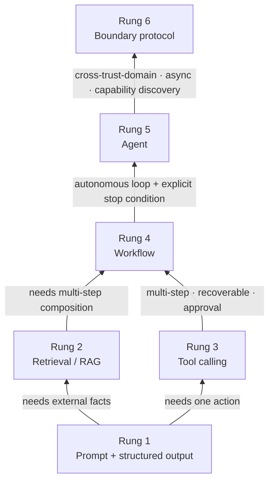

> **Group**: Map · Orientation and Boundaries  |  **Previous group exit**: none  |  **This group exit**: you can pick the lowest-complexity solution for any requirement and state its upgrade trigger
> **Prerequisites**: [Tech Map](../index)  |  **Next**: [Site Boundaries and Knowledge Ownership](site-boundaries.md); to enter the Context group now, start with [Prompt Engineering](../03-context/prompt)

## 1. Overview

**Lead with the answer**: for any AI requirement, find your rung on the ladder below, adopt that rung's **lowest-complexity solution**, and climb only when an explicit upgrade trigger fires. This table precedes any protocol introduction — MCP, A2A, ACP, and AG-UI are candidates for rung 6, not a learning order.

### Mental model: one ladder

The ladder has one rule: **default to the lowest rung and let evidence push you up.** Every climb adds state, boundaries, and failure modes; every descent removes a class of trouble you have not met yet.

### The six-rung decision table

| Rung | Requirement | Lowest-complexity solution | Upgrade trigger | Downgrade counterexample |
| --- | --- | --- | --- | --- |
| 1 | Fixed input → fixed output | Prompt + structured output | External facts or actions needed | If the answer fits in the prompt / context, do not build a retrieval pipeline |
| 2 | Needs external facts | Retrieval / RAG (Retrieval-Augmented Generation) | Many sources; permissions / updates / latency become the problem | With a small, stable knowledge set, inlining into context is cheaper |
| 3 | Needs one controlled action | Function call / tool calling | Multi-step, recoverable, approval-gated → rung 4 | A single-step action needs no agent loop |
| 4 | Needs multi-step decisions | Workflow / same-domain subtasks | Autonomous loop with explicit stop conditions → rung 5 | If steps can be enumerated statically, an autonomous loop only adds risk |
| 5 | Needs an autonomous loop | Agent (runtime + stop condition + permission boundary) | Cross-trust-domain, async tasks, capability discovery, cross-implementation interop | If the task completes inside one process, do not cross boundaries with protocols |
| 6 | Cross-process / org / trust domain | Protocol by connection direction (MCP / A2A / ACP / AG-UI) | — (top of ladder) | In-host tool access: a direct function or plain HTTP suffices |

### Decision comparison (what each rung adds)

| Rung | Direction | Control | Added state | Trust domain | Lowest complexity |
| --- | --- | --- | --- | --- | --- |
| 1 | Read | You write the prompt; changeable per call | none | in-process | prompt + output schema |
| 2 | Read | You control indexing and refresh | index + data freshness | data-source boundary | retrieval |
| 3 | Write (single) | function boundary + parameter validation | call results and side effects | in-process | tool calling |
| 4 | Write (multi) | orchestration; steps enumerable statically | multi-step state and intermediates | in-process | workflow |
| 5 | Read-write loop | stop condition + permission boundary | session / memory / checkpoints | within host | agent runtime |
| 6 | Read-write across boundaries | protocol negotiation + capability discovery | tasks / messages / artifacts | cross-trust-domain | boundary protocol |

"Direction" means read world (retrieval, citations — no side effects by default) versus write world (tools, actions — they change external state). Every write-world rung must explicitly handle permissions, idempotency, cancellation, retry, and rollback.

### When to use / when not to

- Use: before implementation, in design reviews, and whenever judging "should we adopt an agent / a protocol".
- Do not use: for the concrete implementation once the rung is decided — go to the matching layer's five-part chapter.

Historical milestones: this ladder was frozen in 2026-09 with Issue #116, merging the old "training decision tree" and the "workflow vs agent" discussions; earlier origins are unverified and will not be fabricated.

## 2. Usage

This page is a decision tool with no runnable code artifact; "Usage" = decision drills (pen and paper, ≤15 minutes). Acceptance: all four scenarios select the lowest-complexity solution and can say why a higher rung is not justified.

### Drill: four scenarios

For each scenario, pick a rung yourself first, then compare with the expected output.

**Scenario A**: classify support emails into three categories with a confidence score.
- Expected: rung 1. Fixed input → fixed output; prompt + output schema is enough.
- Counterexample check: no external facts (no ticket lookup) and no actions (no status change), so no upgrade trigger fires.

**Scenario B**: answers must be grounded in 8,000 internal wiki pages.
- Expected: rung 2. External facts exceed the context budget; use retrieval / RAG.
- Counterexample check: with only 20 pages updated quarterly, inlining into context (rung 1 + long context) is cheaper.

**Scenario C**: after user confirmation, file the expense report into the approval system.
- Expected: rung 3. One controlled action: tool call + parameter validation + permission boundary.
- Counterexample check: the model is not deciding a "check limit → write → notify" chain; if it must, that is rung 4.

**Scenario D**: a research assistant reads literature, cross-checks, and writes a survey, deciding when to stop on its own.
- Expected: rung 5. An autonomous loop presumes you can write **explicit stop conditions** (page cap, time cap, verification passed) and **permission boundaries** (read-only sandbox).
- Counterexample check: if the steps are really a fixed "retrieve → summarize → aggregate" chain, that is a rung-4 workflow, not autonomy.

### Boundaries of use

- The ladder decides the **system shape**, not model capability: the same model serves every rung.
- Rungs can compose (an agent internally calls RAG), but the externally visible shape takes the highest rung involved, and the risk budget is assessed at that rung.

## 3. Principles

### Why default to the lowest rung

Each upgrade monotonically increases three kinds of cost:

1. **State**: rung 1 is stateless; rung 2 adds an index and freshness; rung 4 adds multi-step intermediates; rung 5 adds sessions, memory, and checkpoints. More state, costlier recovery and debugging.
2. **Boundaries**: from in-process to the data-source boundary, then across trust domains. Every boundary adds a class of authorization, versioning, and protocol-negotiation problems.
3. **Failure modes**: a rung-1 failure is "output violates schema", retryable on the spot; a rung-5 failure may be "three side effects already executed", requiring compensation and rollback.

Low-rung failures are **local and replayable**; high-rung failures are **distributed and side-effecting**. Hence "let evidence push you up": climbing without a fired trigger means pre-paying complexity for problems you do not have.

### Read world / write world as a cross-cutting invariant

Rungs 1–2 mostly read the world: they supply evidence with no side effects by default. From rung 3 the system writes the world: it changes external state, so permissions, idempotency, cancellation, retry, human approval, and rollback must be handled explicitly. These are not rung-specific topics but questions every rung from 3 upward must answer — layers 4 and 5 return to this checklist repeatedly.

### Why protocols sit at the top

Protocols (rung 6) solve communication and capability discovery across trust domains. They add not just technical cost but organizational cost: version negotiation, security boundaries, interoperability commitments. Only when there is an independent trust domain, async tasks, capability discovery, or cross-implementation interop is a protocol the right option. In-host tool access needs only a direct function call or plain HTTP.

### Specification vs local measurement

This page is a decision pattern with no specification to test against. "Spec vs measurement" columns for each rung's solution live in the matching layer chapters: structured output and model API (Inference & Interface), RAG (Grounding), tool execution (Action), protocols (Interoperability).

## 4. Development

This page has no code integration; "Development" = using the ladder as a design and review gate.

### Symptom → Evidence → Action → Done

**Symptom**: the system fails randomly, is hard to debug, and nobody can name the components a single request passed through.
**Evidence**: agent / protocol nodes appear in the architecture diagram while the requirement lands on rungs 1–3; traces show many loop steps unrelated to the task.
**Action**: downgrade to the lowest rung that satisfies acceptance; record the removed capabilities as explicit TODOs pending real triggers.
**Done**: the design doc states the current rung, the checked upgrade triggers, and evidence for any trigger that has fired.

### Symptom → Evidence → Action → Done

**Symptom**: the team argues over "should we go agent" with no resolution.
**Evidence**: neither side can write the autonomous loop's **stop condition** or **permission boundary** — empty fields mean rung 5's admission criteria are unmet.
**Action**: implement as a rung-4 workflow first; collect cases where steps cannot be statically enumerated as upgrade evidence.
**Done**: either the static step list runs (stay at rung 4), or real enumeration-failure cases accumulate before upgrading.

### Symptom → Evidence → Action → Done

**Symptom**: a review demands MCP / A2A "for future integration".
**Evidence**: all collaboration today is inside one host / process; there is no second trust domain, no async task, no capability-discovery need.
**Action**: check each rung-6 upgrade trigger; with none fired, use an in-process solution.
**Done**: the design doc states "if X appears later (cross-trust-domain / async / capability discovery), then introduce protocol Y".

### Anti-pattern list

- **Noun-driven architecture**: pick a trending protocol / framework first, then hunt for a scene that justifies it.
- **Level skipping**: jump to agents while skipping output schemas and failure acceptance (the rung-1 homework) — every upper-layer fault collapses into "the model is bad".
- **Demo as acceptance**: a working demo ≠ existing stop conditions, permission boundaries, and rollback paths. This is the classic "looks successful but under-evidenced" path.

## 5. Resource Library

Four-level reading route:

- **Beginner**: this page + the [Tech Map](../index) decision tree; recite the six rungs and their triggers.
- **Builder**: enter the [Context group](../03-context/) and make rung 1 solid (prompt + schema + failure acceptance).
- **Operator**: enter the [Agent Systems group](../06-agent-systems/agent-runtime.md) and the [Production group](../08-production/) for permissions, idempotency, and rollback at rungs 3–5.
- **Researcher**: read the L1 resources below on the workflow-vs-agent boundary argument.

### Resource table

| Name | Evidence level | Canonical URL | Purpose | Supported claim | Next |
| --- | --- | --- | --- | --- | --- |
| Building Effective Agents (Anthropic) | L1 (maintainer) | https://www.anthropic.com/research/building-effective-agents | The workflow / agent boundary; the case for starting with compositions | The "compose first, escalate later" engineering position (retrievedAt 2026-09-01, HTTP 200) | Compare with rungs 4 / 5 here |
| MCP official site | L0 (official spec) | https://modelcontextprotocol.io/ | One rung-6 candidate: the agent ↔ tools / data boundary | Protocols solve boundary communication (retrievedAt 2026-09-01, HTTP 200) | [MCP chapter](../07-interoperability/mcp) |
| A2A official site | L0 (official spec) | https://a2a-protocol.org/ | One rung-6 candidate: cross-trust-domain agent collaboration | Remote collaboration protocols presume cross-trust-domain needs (retrievedAt 2026-09-01, HTTP 200) | [A2A chapter](../07-interoperability/a2a) |
| Learn LLM chapter 11 (RAG) | sibling | https://llm.zenheart.site/chapters/11-rag | Deep principles behind rung 2 (when retrieval works) | Retrieval internals belong to Learn LLM (retrievedAt 2026-09-01, HTTP 200) | This repo's [Grounding group](../04-grounding/) |

### Active falsification and open questions

- Falsification entry: if you find a scenario where rung N's lowest solution cannot pass acceptance while rung N-1's triggers have not fired, the ladder has a hole — revise the triggers instead of hiding the scenario.
- Open: the rung-6 "choose protocol by connection direction" specifics (which boundary fits MCP / A2A / ACP / AG-UI) land in the layer-4 protocol map; this page keeps only the decision frame.

### Where learn-ai stops / where to continue

- Implementation per rung: this repo's group chapters.
- Deep principles for rungs 2 / 5 (retrieval math, how training shapes behavior): [Learn LLM](https://llm.zenheart.site/chapters/).
- Methods proving each rung is "done": [evals](https://evals.zenheart.site/).
