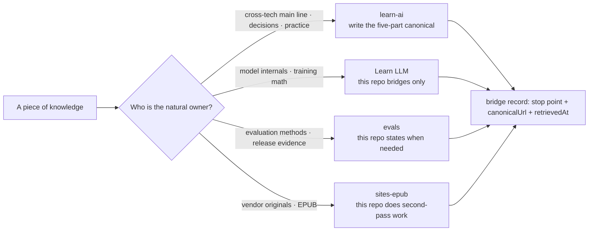

> **Layer**: 0 · Orientation and Boundaries ｜ **Exit of the layer above**: none ｜ **Exit of this layer**: you can decide whether a piece of knowledge belongs here or at a sibling, and write a qualified bridge link
> **Prerequisites**: [Tech Map](../index) ｜ **Next**: [Model Lifecycle (Bridge)](../01-model-lifecycle/index.md) — the first full demonstration of the rules on this page

## 1. Overview

**Lead with the answer**: learn-ai is the single canonical owner of the cross-technology main line, not a second copy of any sibling site. Every piece of knowledge has exactly one body owner; when a sibling already covers a topic completely, this repo writes only "why it affects the current engineering decision + stop point + next hop", never copying the body, full derivations, vendor long-form, or dynamic lists.

### Mental model: one knowledge point, one owner

### Four-site ownership table

| Owner | Owns (canonical) | This repo keeps | Copying forbidden |
| --- | --- | --- | --- |
| **learn-ai** (this repo) | Cross-technology main line, five-part chapters, symptom decision tree, minimal keyless fixtures, debugging / production experience | — | Never a second canonical for any sibling |
| **Learn LLM** | Model internals, training math, low-level RAG / agent principles | Decision impact + stop point + deep link | Full derivations, training experiment details |
| **evals** | Evaluation methods, benchmarks, scorers / judges, release evidence and eval pipelines | When evidence is needed; how release gates plug in | Eval pipeline implementations, benchmark data |
| **sites-epub** | Vendor docs / blog captures, EPUB indexing | Second-pass treatment of stable cross-vendor concepts + reading routes | Vendor long-form, dynamic command / parameter / plan lists |

### Decision table: where a piece of content goes

| Dimension | Write here | Bridge to sibling |
| --- | --- | --- |
| Direction | Main-line knowledge that shapes engineering decisions | Deep principles and methodology |
| Control | This repo's authors can maintain and accept it | Maintained by the sibling's authors and pipeline |
| State | Stable concepts, slow to drift | Dynamic numbers (chapter counts, prices, model lists) |
| Trust domain | This repo's reputation | The sibling's canonical standing |
| Lowest complexity | One bridge table + stop point | — |

Version milestones: the four-site split was frozen in 2026-09 with Issue #116; previously the "Learn LLM chapter links" were scattered across pages, and this page consolidates them into the single ownership rule page.

## 2. Usage

This page is a rules page with no runnable code artifact; "Usage" = bridge-link drills (≤15 minutes, pen and paper). Acceptance: write one qualified bridge for each of three real topics.

### Stop point and next hop per site

**Learn LLM** (https://llm.zenheart.site/)
- Example stop point: stop at "the KV cache sets the order of magnitude of the context budget"; do not derive attention complexity.
- Next-hop format: link the concrete chapter path (e.g. `https://llm.zenheart.site/chapters/09-inference-cache`), not the homepage.

**evals** (https://evals.zenheart.site/)
- Example stop point: stop at "you need replayable evidence before shipping"; do not cover judge construction or benchmark design.
- Next-hop format: a concrete chapter under `https://evals.zenheart.site/book/`.

**sites-epub** (https://epub.zenheart.site/)
- Example stop point: stop at "this concept originates from a vendor document"; do not copy vendor commands and parameters.
- Next-hop format: the site's index page; the site is currently unreachable over HTTPS (see the verification table below) — re-check before citing.

### Drill: write one qualified bridge

Using "the vector geometry of embeddings" as the topic:

1. **Assign the owner**: math and training objectives → Learn LLM.
2. **Find the canonical concrete path**: `https://llm.zenheart.site/chapters/11-rag` (not the homepage).
3. **Record retrievedAt**: 2026-09-01, HTTP 200.
4. **Write the stop point and next hop**: "This repo stops at 'embeddings turn semantics into comparable vectors'; space geometry and training objectives: Learn LLM chapter 11."

**Negative example**: writing only "see Learn LLM" with a homepage link — the reader cannot verify the target chapter exists nor tell when the content expired.

### Site accessibility verification table

| Site | URL | Status | retrievedAt |
| --- | --- | --- | --- |
| Learn LLM | https://llm.zenheart.site/ | HTTP 200, normal | 2026-09-01 |
| Learn LLM chapter index | https://llm.zenheart.site/chapters/ | HTTP 200, 21-chapter map readable | 2026-09-01 |
| evals | https://evals.zenheart.site/ | HTTP 200, normal | 2026-09-01 |
| evals reading entry | https://evals.zenheart.site/book/ | HTTP 200 | 2026-09-01 |
| sites-epub | https://epub.zenheart.site/ | **warning**: TLS certificate mismatch (serves a `*.github.com` certificate); HTTPS currently unreachable | 2026-09-01 |

The sites-epub ownership declaration remains in force (see `_phase0/bridge-register.md`), but any citation must first re-check the site's recovery; this repo writes no content assertions based on an unreachable site.

## 3. Principles

### Why one knowledge point has one owner

The cost of copying a body is not storage but **drift**: after the sibling updates, this repo's copy silently expires; readers see two versions and cannot tell which is trustworthy; audits double. The SSOT (single source of truth) principle replaces copying with **verifiable pointers**: canonicalUrl + retrievedAt + stop point.

### Why dynamic numbers stay out of this repo

Chapter counts, prices, availability, and model lists all change. Copying them statically plants data that expires on a timer. The rule: such facts record only the URL and retrievedAt; the body carries the stable conclusion ("the site's current state prevails").

### Bridge metadata fields

Every cross-site hop records at least:

| Field | Meaning | Example |
| --- | --- | --- |
| canonicalTopicId | The topic ID on this repo's side | `context` |
| owner | The canonical site of the deep content | Learn LLM |
| Stop point | Where this repo's body stops | "The KV cache limits the context budget" |
| canonicalUrl | The target's concrete path (not the homepage) | `https://llm.zenheart.site/chapters/09-inference-cache` |
| sourceCommitOrVersion | The target content's version (when available) | chapter revision; otherwise "not provided" |
| prerequisites / nextQuestion | The reader's question before / after the hop | "Why is there a context budget" / "how to compress context" |
| lastVerified / retrievedAt | Latest verification date | 2026-09-01 |

The full register is maintained in-repo at `_phase0/bridge-register.md` (an engineering artifact, not published with the site); public pages carry only its URLs and stop points.

### Specification vs local measurement

This page has no protocol specification. The "local measurement" is the verification table above; re-verification means issuing one HTTPS request to the target URL and confirming 200 plus a valid certificate.

## 4. Development

This page has no code integration; "Development" = runbooks for ownership conflicts and link rot.

### Symptom → Evidence → Action → Done

**Symptom**: the same topic has two bodies — here versus a sibling (or two pages here).
**Evidence**: a content audit finds duplicated exposition, or the two versions disagree.
**Action**: assign the canonical owner — main-line decisions to this repo, deep principles to the sibling; the loser becomes a bridge (stop point + next hop kept) or a redirect.
**Done**: the topic has exactly one topicId and one body; the bridge register and redirects.json are updated in sync.

### Symptom → Evidence → Action → Done

**Symptom**: a sibling deep link in a resource library 404s or no longer matches.
**Evidence**: retrievedAt older than a quarter; the request returns non-200.
**Action**: re-locate the canonical path on the sibling site, update canonicalUrl and retrievedAt; if no equivalent exists, downgrade to a homepage link labeled "concrete chapter not located".
**Done**: the link returns 200 and the anchored content still supports the original claim.

### Symptom → Evidence → Action → Done

**Symptom**: a sibling site is wholly unreachable (currently the case for sites-epub).
**Evidence**: HTTPS requests fail or the certificate mismatches.
**Action**: mark a warning with retrievedAt on affected pages; keep the ownership record; add no content assertions based on that site.
**Done**: update the status row once the site returns 200; zero new citations in the interim.

### Anti-pattern list

- "See site X" plus a homepage link: an unverifiable, unauditable bridge.
- Translating / summarizing sibling chapters into this repo: creating a second canonical.
- Statically copying dynamic numbers (chapter counts, prices, model lists): planting timed-expiry data.

## 5. Resource Library

Four-level reading route:

- **Beginner**: read the four-site table; decide "where does this content go" correctly.
- **Builder**: write your first qualified bridge (see the Usage drill) and have it reviewed.
- **Operator**: maintain a topic cluster's bridge records; re-verify retrievedAt quarterly.
- **Researcher**: read the sibling sites' structures and understand their knowledge positions.

### Resource table

| Name | Evidence level | Canonical URL | Purpose | Supported claim | Next |
| --- | --- | --- | --- | --- | --- |
| Learn LLM | sibling | https://llm.zenheart.site/ | Canonical for model internals | Deep principles belong there (retrievedAt 2026-09-01, HTTP 200) | [Chapter index](https://llm.zenheart.site/chapters/) |
| evals | sibling | https://evals.zenheart.site/ | Canonical for evaluation methodology | Evaluation belongs there (retrievedAt 2026-09-01, HTTP 200) | [Reading entry](https://evals.zenheart.site/book/) |
| evals source repo | sibling | https://github.com/zenHeart/evals | Content source of the evals site | Repo-to-site correspondence (retrievedAt 2026-09-01, HTTP 200) | — |
| sites-epub | sibling | https://epub.zenheart.site/ | Canonical for vendor originals and EPUB | Ownership in force but site currently unreachable (retrievedAt 2026-09-01, warning) | Re-verify after recovery |

### Active falsification and open questions

- Falsification entry: if a sibling-covered topic carries a long body here (instead of a bridge), this page's rules failed in execution — file a migration instead of adding more.
- Open: the sites-epub HTTPS recovery time is unknown; until then, reading routes depending on it use Learn LLM / evals as substitute entries.
- Open: the `sourceCommitOrVersion` field is unavailable on most sibling pages; record "not provided" uniformly and upgrade once siblings expose stable version identifiers.

### Where learn-ai stops / where to continue

- Next demonstration in this repo: [Model Lifecycle (Bridge)](../01-model-lifecycle/index.md) — a complete bridge page written under this page's rules.
- Deep model principles: [Learn LLM](https://llm.zenheart.site/chapters/).
- Evaluation methodology: [evals](https://evals.zenheart.site/).
