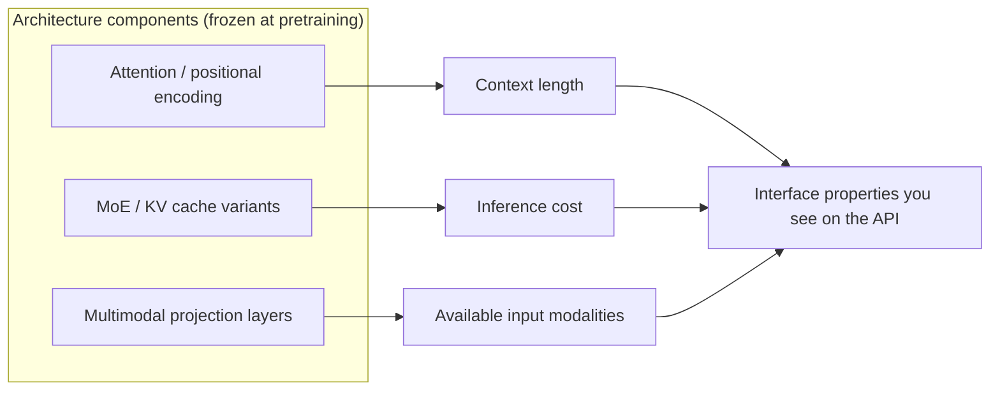

> **Group**: 01 · Model Lifecycle (bridge group)  |  **Exit of the group above**: you can decide knowledge ownership and pick the lowest-complexity option for a need (00-map group)  |  **Exit of this page**: you can translate vendor-launch architecture terms (long context, MoE, cache pricing) into engineering variables of context length, inference cost, and input modality
> **Prerequisites**: [The LLM Mental Model (Bridge)](llm-mental-model.md)  |  **Next**: [Data, Pretraining, and Scaling (Bridge)](data-pretraining-scaling.md)

## 1. Overview

**Lead with the answer**: application engineers do not need to derive Attention, but they do need **position awareness** — architecture is frozen at pretraining and directly determines context length, inference cost, and the multimodal path, all three of which show up on your API bill and in your selection spreadsheet. This page gives each component a one-line "what it is / what decision it touches" position; derivations and from-scratch implementations belong to Learn LLM chapters 7, 9, and 20.

### One-line positioning table

| Component | What it is (one line) | What decision it touches |
| --- | --- | --- |
| Transformer | The self-attention-based sequence backbone; the common foundation of modern LLMs | Switching models = swapping a set of weights with an unchanged interface; far cheaper than switching paradigms |
| Attention | The mechanism where tokens weight each other pairwise; the causal mask enables token-by-token generation | Attention computation grows with sequence length — the reason long context costs more |
| Positional encoding (RoPE) | Rotates position information into queries/keys so the model senses token order | The source of a model's advertised context length; window extension is a recurring release variable |
| MoE (Mixture of Experts) | Activates only a fraction of expert parameters per layer: large total, small per-token activation | Parameter count decouples from per-token cost; an architectural root of vendor pricing differences |
| KV cache and MQA / GQA | Caches attention keys/values at inference, plus variants that shrink that cache | The prefill/decode cost structure and prompt-prefix cache pricing |

### Why position awareness, not derivation ability

Architecture is where the left chain freezes physical constraints into interface properties: after training ends, nobody can change this model's window assumptions or expert routing — you wait for the vendor's next version. Architectural knowledge therefore takes the engineering form of "decoding ability when reading release notes and pricing pages", not write ability. A vendor's "longer context" or "cheaper tier" is almost always an architecture variable — but the landing constraints are whatever the vendor documents say.

## 2. When to Hop

This page has no runnable artifact; route via this table:

| Symptom / question | Where to go | Why |
| --- | --- | --- |
| Want a hand-written Attention, why the causal mask exists | Learn LLM [chapter 7](https://llm.zenheart.site/chapters/07-attention) | The canonical from-scratch Transformer |
| KV cache, quantization, prefill/decode cost models | Learn LLM [chapter 9](https://llm.zenheart.site/chapters/09-inference-cache) | Engineering detail of inference optimization |
| MLA / MoE accounting / modern architecture topics | Learn LLM [chapter 20](https://llm.zenheart.site/chapters/20-deepseek) | DeepSeek-family architecture special topic |
| How API billing and prefix-cache discounts work | This repo's [Model API contract](../02-inference-interface/model-api.md) | Application-side consumption lives here |
| How much context a long session should carry | This repo's [03-context group](../03-context/) | Context trade-offs are this repo's main line |
| Impact of a vendor's new architecture version on production | This repo's [08-production group](../08-production/) | Version-upgrade regression is an operations problem |

## 3. Principles

One-paragraph positioning: Transformer replaced recurrence with self-attention for training parallelism, at the price of attention cost growing with length; RoPE determines how far the model can extrapolate context; MoE decouples "total parameters" from "per-call computation" via sparse activation; KV cache turns decode from recomputation into lookup. Those four sentences are all the architecture an application engineer needs — why scaled dot-product divides by √d, the complex-number form of RoPE, and expert-routing load balancing are derived step by step in Learn LLM chapters 7, 9, and 20 (retrievedAt 2026-09-01); this repo does not copy them.

## 4. Engineering Decision Impact

| Engineering decision | Architectural fact | Engineering action |
| --- | --- | --- |
| Long-session cost estimation | Attention and KV cache volume grow with length | Summarize and prune long history; watch vendor prefix-cache pricing |
| Model family selection | Dense and MoE have different cost structures | Tier by task; compare actual per-task cost, not parameter count |
| Context window upgrade | Window extension often changes behavior | Run regression evaluation before switching |
| Multimodal intake | Images enter token space via projection and are billed per token | Budget in tokens, not pixels or resolution |
| Local / edge deployment | Quantized variants shift the accuracy-cost balance | The math belongs to Learn LLM chapter 9; the selection decision to this repo's 02-inference-interface group |

Maintenance rule (in place of runbooks): when Learn LLM chapters 7/9/20 change structure, re-verify this page's deep links and update `lastVerified`; this page does not maintain a per-vendor adoption matrix of architectures — that drifts with versions; defer to each vendor's model documentation.

## 5. Resource Library

Four-level reading route:

| Level | What to read | Why this order |
| --- | --- | --- |
| Beginner | This page's positioning table + the [group guide](./index) | Build the "component → interface property" map first |
| Builder | This repo's [Model API contract](../02-inference-interface/model-api.md) | Consume these architectural properties at the interface layer |
| Operator | [Cost and performance](../08-production/cost-performance.md) | Bring architecture variables into cost governance |
| Researcher | Learn LLM chapters 7, 9, 20 + the three original papers | Descend to mechanism and derivation |

### Resource table

| Name | Level | Canonical URL | Supported claim | Next |
| --- | --- | --- | --- | --- |
| Learn LLM ch. 7 · Transformer | E | https://llm.zenheart.site/chapters/07-attention | From-scratch Attention / causal mask / multi-head | Hand-write a Transformer block |
| Learn LLM ch. 9 · Inference and quantization | E | https://llm.zenheart.site/chapters/09-inference-cache | Engineering detail of RoPE, KV cache, MQA/GQA, quantization | Understand the inference cost structure |
| Learn LLM ch. 20 · DeepSeek special topic | E | https://llm.zenheart.site/chapters/20-deepseek | MLA / MoE accounting and modern architecture evolution | Optional extension reading |
| Attention Is All You Need (Vaswani et al., 2017) | L4 | https://arxiv.org/abs/1706.03762 | The original Transformer paper | Read the attention section |
| RoFormer (Su et al., 2021) | L4 | https://arxiv.org/abs/2104.09864 | Where RoPE positional encoding was introduced | Read the rotary section |
| Switch Transformers (Fedus et al., 2021) | L4 | https://arxiv.org/abs/2101.03961 | The representative sparse-MoE work | Read the expert-routing section |

(Learn LLM chapters verified via its chapter index; arXiv links are stable abs URLs; retrievedAt 2026-09-01.)

### Active falsification and open questions

- Falsification entry: if a decision truly requires architectural derivation to get right (e.g. implementing an attention kernel yourself), it belongs to Learn LLM or an inference-engine team, not this page — sink the claim instead of expanding here.
- Open: vendor adoption of MQA / GQA / MLA and long-context extrapolation drifts quickly with versions; this page keeps no adoption matrix — defer to each vendor's model card and pricing page.

### Where learn-ai stops / where to continue

- Mechanism and derivation of Attention, RoPE, MoE: Learn LLM chapters 7, 9, 20 — this repo stops here.
- Consume architectural properties at the interface layer: this repo's [02-inference-interface group](../02-inference-interface/).
- Next page in this group: [Data, Pretraining, and Scaling (Bridge)](data-pretraining-scaling.md).
