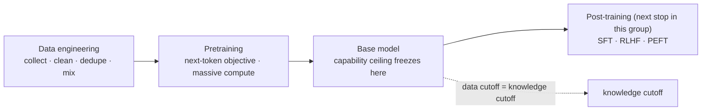

> **Group**: 01 · Model Lifecycle (bridge group) ｜ **Exit of the group above**: you can decide knowledge ownership and pick the lowest-complexity option for a need (00-map group) ｜ **Exit of this page**: you can explain the root of knowledge cutoff, and use "the capability ceiling freezes at pretraining" to discipline model selection, freshness strategy, and version-upgrade regression
> **Prerequisites**: [Model Architecture (Bridge)](architecture.md) ｜ **Next**: [Post-training](post-training/) (in-group subgroup); deep principles at [Learn LLM](https://llm.zenheart.site/chapters/)

## 1. Overview

**Lead with the answer**: a base model's capability ceiling freezes the moment pretraining ends. The trade-offs among data mix, scale, and compute (scaling laws) decide "what this model can and cannot do". This chain explains three application-level facts: the root of knowledge cutoff, the structure of vendor model tiers and pricing, and why a given model is unreliable on your task. This page covers only the engineering meaning of the chain; the from-scratch pretraining pipeline belongs to [Learn LLM chapter 8](https://llm.zenheart.site/chapters/08-tinygpt).

### The chain

### Three engineering consequences

1. **The root of knowledge cutoff is this chain.** The model's factual knowledge comes from the collection cutoff of the pretraining corpus; post-training and product wrapping change behavior, not the world knowledge in the weights. Time-sensitive facts must go through retrieval ([RAG](../04-grounding/rag.md)); the cutoff is an interface property to check, not a defect.
2. **Scaling laws are the structure of vendor tiers.** Kaplan and Chinchilla established that "loss falls predictably with parameters, data, and compute, and there is a compute-optimal balance between parameters and data" (this page does not restate the exponents). Engineering translation: capability tiers are purchasable compute decisions, vendors slice that curve into tiered pricing — your selection is choosing a point on someone else's scaling curve.
3. **Data quality decides task reliability.** How well your domain is represented and cleaned in the pretraining corpus decides out-of-the-box performance; if benchmark data leaks into the corpus (contamination), leaderboard scores inflate. A single leaderboard is not a selection basis — use your own evaluation set ([evals](https://evals.zenheart.site/), [evaluation](../08-production/evaluation.md)).

## 2. When to Hop

This page has no runnable artifact; route via this table:

| Symptom / question | Where to go | Why |
| --- | --- | --- |
| Want pretraining running from scratch (TinyGPT, checkpoints, loss curves) | Learn LLM [chapter 8](https://llm.zenheart.site/chapters/08-tinygpt) | The canonical full pretraining pipeline |
| Why/when training goes unstable | Learn LLM [chapter 6](https://llm.zenheart.site/chapters/06-training-stability) | Training-stability engineering |
| The original scaling-law accounts | The Kaplan / Chinchilla papers (see resource table) | Primary sources; this page keeps only conclusions |
| What to do about time-sensitive knowledge | This repo's [RAG](../04-grounding/rag.md) | Fresh knowledge goes through retrieval, not weights |
| How to select models reliably | This repo's [evaluation](../08-production/evaluation.md) + the evals site | Leaderboards can be contaminated; build your own set |
| Whether to fine-tune new knowledge into weights | In-group [SFT (Bridge)](post-training/sft.md) | The decision gate for touching weights |

## 3. Principles

One-paragraph positioning: pretraining runs the next-token objective over a massive corpus for enough steps; scaling laws are the empirical regularity of that pipeline, not physical law — they guide vendors' training-budget allocation and reach you in the form of model tiers and pricing. Data-engineering detail (dedup, mixing, filtering) and training stability belong to Learn LLM chapters 6 and 8 (retrievedAt 2026-09-01). This repo's stopping point is "the capability ceiling freezes at pretraining": not a value judgment, just the engineering fact that published weights cannot be edited.

## 4. Engineering Decision Impact

| Engineering decision | Judgment derived from this chain | Cost of the wrong expectation |
| --- | --- | --- |
| Model selection | The ceiling froze at pretraining; leaderboard scores may be inflated by contamination | Selecting by leaderboard; task performance disappoints after launch |
| Knowledge freshness strategy | The cutoff is a hard property; it does not vanish because you prompt harder | Expecting a recent model to "surely know" recent events |
| Version upgrades | A new version = new data + new pretraining; every engineering assumption can shift | Switching to latest without regression evaluation |
| Cost structure literacy | Tier pricing is a slice of the scaling curve | Confusing "more expensive" with "better for my task" |
| Domain reliability checks | Corpus representation decides out-of-the-box behavior | Assuming zero-shot reliability in a specialist domain without sample testing |

Maintenance rule (in place of runbooks): when Learn LLM chapters 6/8 change structure, re-verify this page's deep links and update `lastVerified`; specific cutoff dates and corpus composition of mainstream models are vendor disclosures — this page keeps no list; defer to each vendor's model card.

## 5. Resource Library

Four-level reading route:

| Level | What to read | Why this order |
| --- | --- | --- |
| Beginner | This page + the [group guide](./index) | Build the "chain → three consequences" map |
| Builder | [RAG](../04-grounding/rag.md) + [evaluation](../08-production/evaluation.md) | Wire cutoff and reliability into main-line solutions |
| Operator | The version-regression view of [evaluation](../08-production/evaluation.md) | Run regression on every model upgrade |
| Researcher | Learn LLM chapters 6, 8 + the two scaling papers | Descend to the primary accounts of pretraining and scale |

### Resource table

| Name | Level | Canonical URL | Supported claim | Next |
| --- | --- | --- | --- | --- |
| Learn LLM ch. 8 · TinyGPT | E | https://llm.zenheart.site/chapters/08-tinygpt | From-scratch pretraining, overfitting, checkpoint and resume | Run one pretraining end to end |
| Learn LLM ch. 6 · Training stability | E | https://llm.zenheart.site/chapters/06-training-stability | Training stability is an engineering problem | Understand training diagnostics |
| Scaling Laws for Neural Language Models (Kaplan et al., 2020) | L4 | https://arxiv.org/abs/2001.08361 | The systematic quantification of loss vs parameters/data/compute power laws | Read the loss-vs-scale plots |
| Training Compute-Optimal LLMs (Chinchilla, Hoffmann et al., 2022) | L4 | https://arxiv.org/abs/2203.15556 | A compute-optimal balance exists between parameters and data | Compare against Kaplan |
| The evals site | E | https://evals.zenheart.site/ | The canonical sibling for evaluation method and release evidence | Build your own evaluation set |

(Learn LLM chapters verified via its chapter index; arXiv links are stable abs URLs; retrievedAt 2026-09-01.)

### Active falsification and open questions

- Falsification entry: decisions that require concrete training-budget, data-volume, or corpus-mix estimation (e.g. compute planning for training your own model) belong to Learn LLM or an ML team, not this page — sink the claim instead of expanding here.
- Open: public contamination-detection methods and model-card disclosure standards are not unified and not per-model verified here; let your own evaluation set decide selection.

### Where learn-ai stops / where to continue

- Training data engineering and experimental method: Learn LLM chapters 6 and 8 — this repo stops here.
- Supply fresh knowledge to a model: this repo's [04-grounding group](../04-grounding/).
- Next stop in this group: [Post-training](post-training/) (the engineering-decision bridges for SFT / RLHF / PEFT).
