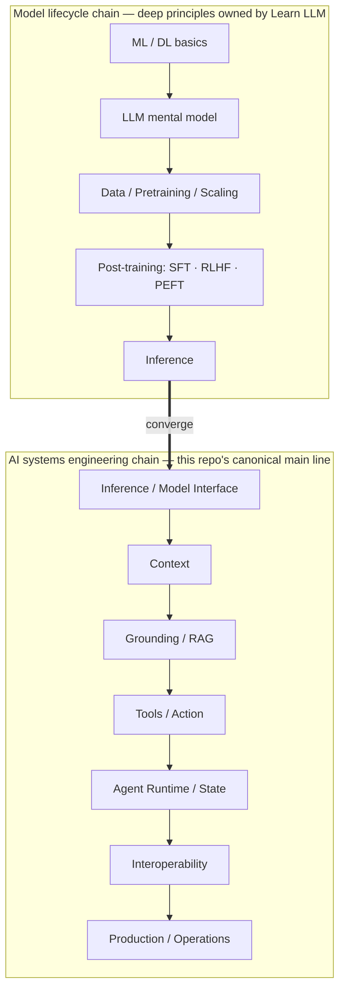

> **Layer**: 0 · Orientation and Boundaries ｜ **Exit of the layer above**: none ｜ **Exit of this layer**: you can state how the model lifecycle affects engineering decisions (when prompt is not enough, how to choose models, how cost works) and know which Learn LLM chapter holds the deep principles
> **Prerequisites**: [Tech Map](../index) · [Site Boundaries and Knowledge Ownership](../00-map/site-boundaries.md) ｜ **Next**: [Complexity Decision Ladder](../00-map/complexity-ladder.md); appendix bridge pages for training topics (SFT / RLHF / PEFT) live under `appendices/model-lifecycle/`

## 1. Overview

**Lead with the answer**: the model lifecycle (data, pretraining, post-training, inference) must have a place on the tech map — otherwise you cannot understand what your system sits on — but this repo covers it only to the depth that **affects engineering decisions**. Training math, experiment details, and full derivations belong to [Learn LLM](https://llm.zenheart.site/chapters/). This page is a bridge (a positioning page), not a tutorial.

### Mental model: two chains converging at Inference

Every line of AI application code you write starts from the end of the left chain (Inference). The left chain decides "what this model is and what it can do"; the right chain decides "what you build with it". The chains converge at Inference / Model Interface — which is why layer 1's first topic is the interaction contract, not model architecture.

### Key terms (full names at first use)

- **SFT** (Supervised Fine-Tuning): continued training on labeled examples that changes model behavior.
- **RLHF** (Reinforcement Learning from Human Feedback): training a reward model from human preference signals, then optimizing the policy against it.
- **PEFT** (Parameter-Efficient Fine-Tuning): training only small attached parameter sets (e.g. LoRA) to cut training cost.
- **Scaling**: the empirical regularity linking model size, data volume, and compute to capability.

### Decision table: changing behavior versus adding knowledge

| Option | Direction | Control | State | Trust domain | Lowest complexity |
| --- | --- | --- | --- | --- | --- |
| Prompt + context | Read, instantly revisable | Adjustable per call | none | in-process | Lowest — start here by default |
| RAG (Retrieval-Augmented Generation) | Read, updates with data | You control indexing and refresh | Retrieval index | data-source boundary | Medium |
| SFT / RLHF / PEFT | Changes the model itself | Training pipeline + weight versioning | model weight versions | model supply chain | Highest — implementation not expanded here |

**Rule of thumb (this repo's position, not a quantified claim)**: exhaust prompt + context first, then RAG; evaluate post-training only when you need to **change the model's behavior** (not to supply facts) and you have large amounts of high-quality labeled data, a training budget, and the matching engineering capability. Missing any one, fall back to RAG. The old training page's specific figures ("10,000+ examples / $10,000+ budget") had no primary source and were deleted; they are not asserted here.

### The three engineering decisions the lifecycle shapes

1. **When prompt is not enough**: missing knowledge → RAG first (this repo's layer 3); off behavior (tone, format, refusal policy) → tune prompt and few-shot examples; only after both are exhausted and the need is stable does post-training enter the conversation.
2. **Model selection**: base / instruct / fine-tuned / quantized variants differ widely in capability, cost, and deployment target; the math of quantization and inference runtimes belongs to Learn LLM, the selection framework to this repo's layer 2.
3. **Cost structure**: training is a one-off large expenditure; inference and retrieval are ongoing variable costs; this repo's layer 5 covers cost governance, and training-cost estimation is out of scope here.

Version milestones: this page was rewritten as a bridge from the old `tech/training/index.md` in 2026-09 under Issue #116; the old page's "golden rule" decision tree keeps its conclusion, and unquantified numbers were dropped for lack of sources.

## 2. Usage

**Not applicable: this page is a bridge positioning page with no runnable artifact.**

Reason: the output here is a judgment plus a hop, not code; attaching a fixture would fake an implementation domain this repo does not own. Substitute action (about 5 minutes):

1. Locate your current concern on the diagram above (e.g. "why won't the model reliably emit JSON" → the junction between Post-training on the left chain and Context on the right).
2. Decide whether it is an engineering or a principles question: unstable output — take the right chain to [Layer 1 · Interaction Contract](../03-context/) first; to understand how post-training shapes instruction following — take the Learn LLM links below.
3. Record your stop point: this repo's body stops at "post-training shapes behavior and instruction following".

## 3. Principles

### Why the left chain must be on the map, yet not expanded here

**It must be on the map**: engineers who do not know that "a model comes from a training pipeline" treat every problem as a prompt problem — unaware that instruct-versus-base behavioral differences come from post-training, that context budgets come from inference-time cache structure, that a model version upgrade can change every engineering assumption. Without the left chain, every "why" on the right chain hangs in the air.

**It is not expanded here**: training math, data engineering, and experimental method form a full discipline that Learn LLM already covers in 21 chapters (retrievedAt 2026-09-01). Any derivation copied here would create a second canonical that drifts over time (rules in [Site Boundaries](../00-map/site-boundaries.md)).

### What the convergence point means for engineering

Inference is the only node the two chains share. It compresses the left chain's entire history (data, scale, post-training) into three engineering-visible interface properties:

- **Behavior**: instruction following, format stability, refusal boundaries — the direct constraint target of layer 1 contracts.
- **Budget**: context length and cache cost — the constraint source for layer 1 context engineering and layer 5 cost.
- **Capability boundary**: what the model can and cannot do — an input assumption for layer 4 tools and agent design.

In engineering you always consume a model through these three properties, not through its training details. That is the basis of the main-line stance "the model is a replaceable external capability".

### Specification vs local measurement

Not applicable: this page has no protocol specification. Site-level "measurement" is the HTTP 200 status of the Learn LLM chapter URLs in the resource table (retrievedAt 2026-09-01).

## 4. Development

**Not applicable: this page is a bridge positioning page with no integration, testing, or rollback semantics.**

Maintenance rule (in place of runbooks): when Learn LLM's chapter structure changes, re-verify every deep link on this page and update `lastVerified`; when a new lifecycle-related engineering decision topic appears in this repo (e.g. model version upgrade strategy), expand it in the matching layer chapter and add only a one-line pointer here.

## 5. Resource Library

Four-level reading route:

- **Beginner**: this page + the [Tech Map](../index); recite the two chains and the convergence point.
- **Builder**: enter [Layer 1 · Interaction Contract](../03-context/) and start hands-on from the engineering side of the convergence.
- **Operator**: watch how model version upgrades affect contracts and cost (layer 5).
- **Researcher**: descend through the Learn LLM chapters below into training and inference principles.

### Resource table (Learn LLM chapters, all HTTP 200, retrievedAt 2026-09-01)

| Chapter | Canonical URL | Maps to this page's link | Supported claim | Next |
| --- | --- | --- | --- | --- |
| Chapter index (full 21-chapter map) | https://llm.zenheart.site/chapters/ | Full expansion of both chains | Deep principles belong to Learn LLM | Pick chapters by link |
| Ch. 8 TinyGPT | https://llm.zenheart.site/chapters/08-tinygpt | Data / Pretraining | Pretraining from scratch, visible end to end | Where base models come from |
| Ch. 6 Training Stability | https://llm.zenheart.site/chapters/06-training-stability | Pretraining engineering | Training stability is an engineering problem | — |
| Ch. 10 Post-training | https://llm.zenheart.site/chapters/10-post-training | SFT / RLHF / PEFT | Post-training shapes behavior and instruction following | This repo's appendix bridge pages (Wave 3) |
| Ch. 9 Inference & Cache | https://llm.zenheart.site/chapters/09-inference-cache | Convergence: Inference | Inference-time caching constrains the context budget | This repo's [Layer 1 Context](../03-context/context-engineering) |

### Active falsification and open questions

- Falsification entry: if you find an engineering decision that **cannot** be made correctly without training details (e.g. VRAM estimation for local fine-tuning), it belongs on an appendix bridge page or Learn LLM — sink the claim to the right owner instead of expanding this page.
- Open: the three appendix bridge pages (`model-lifecycle-sft` / `-rlhf` / `-peft`) land in Wave 3; until then this page is their only entry.
- Open: LoRA / QLoRA selection effects (VRAM, latency, merge strategy) are planned for the PEFT appendix bridge page; concrete thresholds will be verified when that page is written.

### Where learn-ai stops / where to continue

- Training objectives and math (SFT / DPO / LoRA derivations): Learn LLM [chapter 10](https://llm.zenheart.site/chapters/10-post-training) — this repo stops here.
- Start building with models: this repo's [Complexity Decision Ladder](../00-map/complexity-ladder.md) and [Layer 1 · Interaction Contract](../03-context/).
- Proving results are shippable: [evals](https://evals.zenheart.site/).
