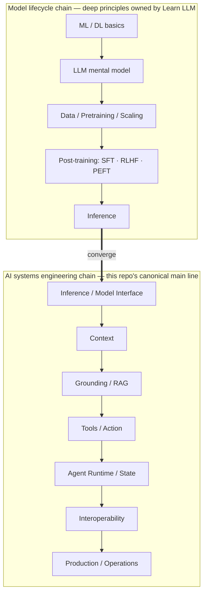

> **Group**: 01 · Model Lifecycle (bridge group)  |  **Exit of the group above**: you can decide knowledge ownership and pick the lowest-complexity option for a need (00-map group)  |  **Exit of this group**: you can state how the model lifecycle affects engineering decisions (when prompt is not enough, how to choose models, how cost works) and know which Learn LLM chapter holds the deep principles
> **Prerequisites**: [Site Boundaries and Knowledge Ownership](../00-map/site-boundaries.md)  |  **Next**: [The LLM Mental Model (Bridge)](llm-mental-model.md); after this group, enter the [02-inference-interface group](../02-inference-interface/)

## 1. Overview

**Lead with the answer**: the model lifecycle (data, pretraining, post-training, inference) must have a place on the tech map — otherwise you cannot understand what your system sits on — but this repo covers it only to the depth that **affects engineering decisions**. Training math, experiment details, and full derivations belong to [Learn LLM](https://llm.zenheart.site/chapters/). This is a bridge group: four pages each bridge one conceptual domain, and their bodies carry only "concept position → why an application engineer needs it → decision impact → link to Learn LLM", never copied derivations.

### Mental model: two chains converging at Inference

Every line of AI application code you write starts from the end of the left chain (Inference). The left chain decides "what this model is and what it can do"; the right chain decides "what you build with it". The chains converge at Inference / Model Interface — which is why the next group (02-inference-interface) opens with the interface contract, not model architecture.

### In-group navigation (4 pages, in order)

| Page | Question it answers | One-line conclusion |
| --- | --- | --- |
| [LLM mental model](llm-mental-model.md) | What the model actually is | A parametrized conditional probability model: prompts invoke capability rather than inject knowledge, context is a hard constraint, temperature is a sampling parameter |
| [Model architecture](architecture.md) | How architecture terms become bills | No derivations needed, but translate Attention / RoPE / MoE / KV cache into context length and inference cost |
| [Data, pretraining, and scaling](data-pretraining-scaling.md) | Where the model's knowledge and ceiling come from | The capability ceiling freezes at pretraining: knowledge cutoff, pricing tiers, and task reliability all trace to this chain |
| [Post-training](post-training/) (three-page subgroup) | When weights are worth touching | The engineering-decision bridges for SFT / RLHF / PEFT; exhaust prompt and RAG first |

### Key terms (full names at first use)

- **SFT** (Supervised Fine-Tuning): continued training on labeled examples that changes model behavior.
- **RLHF** (Reinforcement Learning from Human Feedback): training a reward model from human preference signals, then optimizing the policy against it.
- **PEFT** (Parameter-Efficient Fine-Tuning): training only small attached parameter sets (e.g. LoRA) to cut training cost.
- **Scaling**: the empirical regularity linking model size, data volume, and compute to capability.

## 2. When to Hop

This group has no runnable artifact; substitute action (about 5 minutes): locate your concern on the diagram above (e.g. "why won't the model reliably emit JSON" → the junction between Post-training on the left chain and Context on the right), decide whether it is an engineering or a principles question (engineering questions take the right chain into this repo's groups; principles questions hop to Learn LLM), and record your stop point — this group's body stops at "the lifecycle shapes interface properties". For a single question, enter directly via the table:

| Symptom / question | Where to go |
| --- | --- |
| The model "doesn't know" a fact, or knowledge is stale | [Data, pretraining, and scaling](data-pretraining-scaling.md) → [RAG](../04-grounding/rag.md) |
| Bill / latency mismatched with expectations | [Model architecture](architecture.md) → [Cost and performance](../08-production/cost-performance.md) |
| Unstable output format | [Structured output](../02-inference-interface/structured-output.md) (an interface-contract problem, not comprehension) |
| Want to truly understand training and inference internals | The [Learn LLM chapter index](https://llm.zenheart.site/chapters/) (21 chapters) |

## 3. Principles

### Why the left chain must be on the map, yet not expanded here

**It must be on the map**: engineers who do not know that "a model comes from a training pipeline" treat every problem as a prompt problem — unaware that instruct-versus-base behavioral differences come from post-training, that context budgets come from inference-time cache structure, that a model version upgrade can change every engineering assumption. Without the left chain, every "why" on the right chain hangs in the air.

**It is not expanded here**: training math, data engineering, and experimental method form a full discipline that Learn LLM already covers in 21 chapters (retrievedAt 2026-09-01). Any derivation copied here would create a second canonical that drifts over time (rules in [Site Boundaries](../00-map/site-boundaries.md)).

### What the convergence point means for engineering

Inference is the only node the two chains share. It compresses the left chain's entire history (data, scale, post-training) into three engineering-visible interface properties:

- **Behavior**: instruction following, format stability, refusal boundaries — the direct constraint target of the interface contracts (02-inference-interface group).
- **Budget**: context length and cache cost — the constraint source for context engineering (03-context group) and cost governance (08-production group).
- **Capability boundary**: what the model can and cannot do — an input assumption for tools and agent design (05-action and 06-agent-systems groups).

In engineering you always consume a model through these three properties, not through its training details. That is the basis of the main-line stance "the model is a replaceable external capability".

**Specification vs local measurement**: not applicable — this group has no protocol specification; site-level "measurement" is the HTTP 200 status of the Learn LLM chapter URLs in the resource table (retrievedAt 2026-09-01).

## 4. Engineering Decision Impact

### Decision table: changing behavior versus adding knowledge

| Option | Direction | Control | State | Trust domain | Lowest complexity |
| --- | --- | --- | --- | --- | --- |
| Prompt + context | Read, instantly revisable | Adjustable per call | none | in-process | Lowest — start here by default |
| RAG (Retrieval-Augmented Generation) | Read, updates with data | You control indexing and refresh | Retrieval index | data-source boundary | Medium |
| SFT / RLHF / PEFT | Changes the model itself | Training pipeline + weight versioning | model weight versions | model supply chain | Highest — implementation not expanded here |

**Rule of thumb (this repo's position, not a quantified claim)**: exhaust prompt + context first, then RAG; evaluate post-training only when you need to **change the model's behavior** (not to supply facts) and you have large amounts of high-quality labeled data, a training budget, and the matching engineering capability. Missing any one, fall back to RAG. The old training page's specific figures ("10,000+ examples / $10,000+ budget") had no primary source and were deleted; they are not asserted here.

### The three engineering decisions the lifecycle shapes

1. **When prompt is not enough**: missing knowledge → RAG first (04-grounding group); off behavior (tone, format, refusal policy) → tune prompt and few-shot examples; only after both are exhausted and the need is stable does post-training enter the conversation (in-group [post-training/](post-training/)).
2. **Model selection**: base / instruct / fine-tuned / quantized variants differ widely in capability, cost, and deployment target; the math of quantization and inference runtimes belongs to Learn LLM, the selection framework to the 02-inference-interface group.
3. **Cost structure**: training is a one-off large expenditure; inference and retrieval are ongoing variable costs; cost governance lives in the 08-production group, and training-cost estimation is out of scope here.

Maintenance rule (in place of runbooks): when Learn LLM's chapter structure changes, re-verify every deep link in this group and update each page's `lastVerified`; when a new lifecycle-related engineering decision topic appears in this repo (e.g. model version upgrade strategy), expand it in the matching group's chapter and add only a one-line pointer here.

## 5. Resource Library

Four-level reading route:

- **Beginner**: this guide + the [LLM mental model](llm-mental-model.md) — recite the two chains, the convergence point, and one correct mental model.
- **Builder**: enter the [02-inference-interface group](../02-inference-interface/) and start hands-on from the engineering side of the convergence — this group gives judgments, the interface group gives implementations.
- **Operator**: watch how model version upgrades affect contracts and cost (08-production group) — upgrades can change every assumption in this group.
- **Researcher**: descend through the Learn LLM chapters below into training and inference principles — the single canonical for deep principles.

### Resource table (Learn LLM chapters, verified via its chapter index, retrievedAt 2026-09-01)

| Chapter | Canonical URL | Maps to this group's link | Supported claim | Next |
| --- | --- | --- | --- | --- |
| Chapter index (full 21-chapter map) | https://llm.zenheart.site/chapters/ | Full expansion of both chains | Deep principles belong to Learn LLM | Pick chapters by link |
| Ch. 4 Character language model | https://llm.zenheart.site/chapters/04-probabilistic-lm | LLM mental model | Conditional probability and sampling are the core mechanism | In-group [mental-model page](llm-mental-model.md) |
| Ch. 7 Transformer | https://llm.zenheart.site/chapters/07-attention | Model architecture | From-scratch Attention / causal mask / multi-head | In-group [architecture page](architecture.md) |
| Ch. 8 TinyGPT | https://llm.zenheart.site/chapters/08-tinygpt | Data / Pretraining | Pretraining from scratch, visible end to end | In-group [data-pretraining page](data-pretraining-scaling.md) |
| Ch. 6 Training Stability | https://llm.zenheart.site/chapters/06-training-stability | Pretraining engineering | Training stability is an engineering problem | — |
| Ch. 10 Post-training | https://llm.zenheart.site/chapters/10-post-training | SFT / RLHF / PEFT | Post-training shapes behavior and instruction following | In-group [post-training subgroup](post-training/) |
| Ch. 9 Inference and quantization | https://llm.zenheart.site/chapters/09-inference-cache | Convergence: Inference | Inference-time caching constrains the context budget | [03-context group](../03-context/) |

### Active falsification and open questions

- Falsification entry: if you find an engineering decision that **cannot** be made correctly without training details (e.g. VRAM estimation for local fine-tuning), it belongs to the in-group post-training subgroup or Learn LLM — sink the claim to the right owner instead of expanding this guide.
- Open: the owner of LoRA / QLoRA selection effects is the in-group [PEFT page](post-training/peft.md); Learn LLM deep links use the 2026-09-01 full verification as baseline, re-checked per the maintenance rule when chapter structure changes.

### Where learn-ai stops / where to continue

- Training objectives and math (SFT / DPO / LoRA derivations): Learn LLM [chapter 10](https://llm.zenheart.site/chapters/10-post-training) — this repo stops here.
- Start building with models: this repo's [02-inference-interface group](../02-inference-interface/) and the [Complexity Decision Ladder](../00-map/complexity-ladder.md).
- Proving results are shippable: [evals](https://evals.zenheart.site/).
