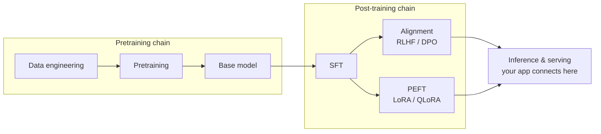

# Model Lifecycle Bridges

**What this is**: navigation and overview for the three training bridge pages (SFT / RLHF / PEFT). This repo keeps **only the engineering-decision view** of training — when moving weights is justified and what it costs. The canonical treatment of training objectives and math lives in [Learn LLM](https://llm.zenheart.site/).

**The two chains converge at inference** (full discussion: [Model lifecycle bridge](../../01-model-lifecycle/)):

Your application work happens at the right edge of this graph: **consuming trained models through APIs**. The internals of both chains belong to Learn LLM; the three bridge pages here only answer "when does an engineer need to cross that line".

## The three bridges

| Bridge | Question it answers | One-line verdict |
| --- | --- | --- |
| [SFT (bridge)](sft.md) | When to teach the model new knowledge/formats with labeled data | Exhaust prompt and RAG first; SFT is an option only with real data and budget |
| [RLHF (bridge)](rlhf.md) | Where model behavior and "personality" come from | App engineers never implement RLHF; understanding it explains refusals, verbosity, style |
| [PEFT (bridge)](peft.md) | How to customize a model at lower cost | LoRA/QLoRA drop the cost by an order of magnitude; the default starting point when weights must move |

## Connection to the mainline

- For external knowledge, the mainline answer is always [RAG](../../04-grounding/rag) first (layer 3).
- For output-format control, the mainline answer is [structured output](../../02-inference-interface/structured-output) (layer 1), not fine-tuning.
- Only when both layers produce evidence of "not enough", take the decision tables here to an ML engineer.
