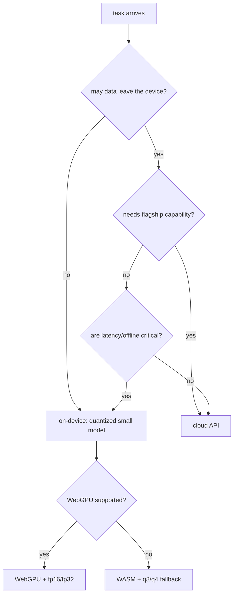

# Browser and Edge Inference

> **Group**: Inference & Interface  |  **Previous group exit**: can write a model-calling loop with error-family classification, retry semantics, and usage observability  |  **This topic exit**: can decide whether to go on-device, pick the right runtime library, and design an access chain with fallback
> **Prerequisites**: [Model API Contract](model-api.md)  |  **Next**: [Embeddings and Retrieval](../04-grounding/embeddings-retrieval), [Cost and Performance](../08-production/cost-performance)

## 1. Overview

Edge inference solves this problem: **some tasks should never send the data out, and some contexts cannot wait for the network**. Running the model in the browser buys privacy (data never leaves the device), offline availability, zero per-token cost, and low latency for small tasks; the price is a **model-quality ceiling** — on-device runs quantized small models, not in the same capability class as cloud flagships.

This page is an **access-location decision** within the Inference & Interface group: the same "capability → product interaction" question, with the execution environment moved from a cloud API to the device itself.



### When to use / when not to

- **Use**: privacy-sensitive inputs that must stay on-device; offline scenarios; marginal-cost control for high-frequency small tasks (classification, extraction, embeddings); latency-sensitive interactions within reach of small models.
- **Do not use**: tasks needing flagship quality (complex reasoning, long-form writing); first-load-bandwidth-sensitive pages with low-frequency tasks (downloading tens of MB for one classification is a mismatch); broad device coverage including pre-WebGPU browsers combined with high latency requirements.

### Decision table: cloud API vs edge vs hybrid

| Approach | Direction | Control | State | Trust domain | Minimum complexity |
| --- | --- | --- | --- | --- | --- |
| Cloud API | outbound request | vendor controls model and capacity | vendor-side session conveniences | data leaves the device | fetch and go |
| On-device inference | in-device execution | fully yours (model delivery/runtime) | device-local | data never leaves | model delivery + runtime integration |
| Hybrid | routed per task | you manage both | both sides | sensitive small tasks on-device, complex ones in cloud | highest: two chains |

**Hybrid is the usual endpoint**: the edge does the front work (classification, redaction, embedding), the cloud does the heavy lifting (generation, reasoning).

### Historical milestones

- Execution environments evolved from WASM (CPU, universal) to WebGPU (GPU, Chromium-family browsers); WebGL is in maintenance mode, with official advice to use WebGPU for new projects (ONNX Runtime Web support matrix, retrievedAt 2026-09-01).
- The transformers.js package name migrated from `@xenova/transformers` (v2) to `@huggingface/transformers` (v3+, the current official-docs naming, retrievedAt 2026-09-01).
- WebGPU remains experimental in some browsers (per the Hugging Face docs' own reminder, retrievedAt 2026-09-01).

## 2. Usage

### Minimal hands-on: environment detection and fallback chain (≤15 minutes; the decision logic runs in Node)

Full edge code needs a browser environment; this fixture first verifies the **decision logic** (detect → choose device/dtype) in Node, with the browser part marked "needs browser-environment verification". Environment: Node ≥ 23.6. Save as `edge-detect.mts`:

```ts
// fixture: the edge-access fallback decision chain (pure logic, verifiable in Node).
interface EdgeConfig { backend: 'webgpu' | 'wasm'; dtype: 'fp16' | 'fp32' | 'q8' | 'q4'; reason: string }

// Simulated browser probe inputs (the real environment collects them from navigator)
function detectEnvironment(hasWebGPU: boolean, isLowPowerDevice: boolean): EdgeConfig {
  if (hasWebGPU && !isLowPowerDevice) {
    return { backend: 'webgpu', dtype: 'fp16', reason: 'GPU available, prefer half precision' };
  }
  if (hasWebGPU && isLowPowerDevice) {
    return { backend: 'webgpu', dtype: 'q4', reason: 'GPU available but memory constrained' };
  }
  return { backend: 'wasm', dtype: 'q8', reason: 'no WebGPU, fall back to CPU with 8-bit quantization' };
}

// Decision-table verification: three typical devices
const show = (name: string, cfg: EdgeConfig) => console.log(`${name}: ${JSON.stringify(cfg)}`);
show('desktop Chrome ', detectEnvironment(true, false));
show('low-end device ', detectEnvironment(true, true));
show('Safari/Firefox ', detectEnvironment(false, false));
```

Run and normal output:

```text
$ node edge-detect.mts
desktop Chrome : {"backend":"webgpu","dtype":"fp16","reason":"GPU available, prefer half precision"}
low-end device : {"backend":"webgpu","dtype":"q4","reason":"GPU available but memory constrained"}
Safari/Firefox : {"backend":"wasm","dtype":"q8","reason":"no WebGPU, fall back to CPU with 8-bit quantization"}
```

The negative case: hard-coding `hasWebGPU` to true in production fails every Safari/Firefox user outright — the consequence of shipping without a fallback chain (the first runbook in Development). Acceptance: the three output lines match the above.

### Full browser-side integration (conceptual, needs browser-environment verification)

```ts
// conceptual: transformers.js pipeline + fallback chain. Verify in a browser environment (including the WebGPU branch).
// npm install @huggingface/transformers
type Sentiment = { label: string; score: number };

async function createSentiment(): Promise<(text: string) => Promise<Sentiment[]>> {
  const { pipeline } = await import('@huggingface/transformers');
  // real probe: const hasWebGPU = typeof navigator !== 'undefined' && 'gpu' in navigator;
  const hasWebGPU = typeof navigator !== 'undefined' && 'gpu' in navigator;
  const classifier = await pipeline('sentiment-analysis',
    'Xenova/distilbert-base-uncased-finetuned-sst-2-english', {
    device: hasWebGPU ? 'webgpu' : 'wasm',   // default is WASM(CPU); GPU must be explicit (official docs)
    dtype: hasWebGPU ? 'fp16' : 'q8',         // dtype options: see the quantization table in Principles
  });
  return (text: string) => classifier(text) as Promise<Sentiment[]>;
}

// Performance discipline: run inference in a Web Worker to avoid freezing the main thread
// worker.js: import { pipeline } from '@huggingface/transformers';
// self.addEventListener('message', async (e) => self.postMessage(await pipe(e.data)));
```

This block follows the official docs' current API (retrievedAt 2026-09-01) but was **not executed in a browser** — verify it on your target browsers before production.

### Scenario matrix

| Scenario | Input | Action | Output | Fits | Does not fit |
| --- | --- | --- | --- | --- | --- |
| Basic: on-device sentiment | user text | pipeline + q8 quantized model | label + score | privacy-sensitive light tasks | flagship-quality needs |
| Common: on-device embeddings | text chunks | embedding pipeline | vectors | local retrieval/semantic caching (→ [Embeddings and Retrieval](../04-grounding/embeddings-retrieval)) | large-scale indexing (insufficient compute) |
| Combined: edge pre-filter + cloud generation | classify locally first | sensitive on-device, complex to cloud | hybrid result | production privacy products | pure display tasks |

## 3. Principles

### Execution environment matrix (ONNX Runtime Web support matrix, retrievedAt 2026-09-01)

| Backend | Hardware | Compatibility | Status |
| --- | --- | --- | --- |
| WebAssembly (WASM) | CPU | all major browsers + Node (single-threaded) | available by default; transformers.js default backend |
| WebGPU | GPU | Chromium family (Chrome/Edge; Windows needs 113+) | experimental; not in Safari/Firefox |
| WebGL | GPU | broad | maintenance mode; use WebGPU for new projects |
| WebNN | NPU | behind a command-line flag | early experimental |

Corollary: **every edge product must ship a WASM fallback path** — WebGPU's coverage makes it an enhancement, never a prerequisite.

### Three-library positioning (per each official doc, retrievedAt 2026-09-01)

| Dimension | transformers.js | ONNX Runtime Web | TensorFlow.js |
| --- | --- | --- | --- |
| Positioning | Hugging Face ecosystem's easy high layer (pipeline API) | the inference engine you drive directly (sessions, tensors) | the only full stack supporting in-browser **training** |
| Underneath | itself built on ONNX Runtime | is the runtime | own backends (ONNX exportable) |
| Model source | ONNX-ized models on HF Hub (Optimum conversion) | any `.onnx` file | own format + converter (tensorflowjs_converter) |
| Typical use | NLP/CV/audio/multimodal inference | production optimization, custom models | transfer learning (e.g., KNN classifier retraining the last layer) |
| Package | `@huggingface/transformers` | `onnxruntime-web` (WebGPU via the `onnxruntime-web/webgpu` subpath import) | `@tensorflow/tfjs` |

Selection rule: **run ready-made models with transformers.js; bring a data-science team's custom `.onnx` to ONNX Runtime Web; train in the browser on user data with TensorFlow.js**.

### Quantization

Quantization compresses weights from 32-bit floats to lower bit widths, directly determining download size and memory footprint. transformers.js's `dtype` options (official docs, retrievedAt 2026-09-01): `fp32` (WebGPU default), `fp16`, `q8` (WASM default), `q4`. q8 is roughly a quarter of fp32's size, q4 smaller still, at the cost of accuracy — **the more complex the task, the lower the quantization tolerance; measure per task**.

Why quantization works, how error accumulates, and the algorithm variants — the mathematics lives in the [Learn LLM quantization chapter](https://llm.zenheart.site/); this repo stops here (bridge, see bridge-register).

### First load and delivery

The real cost of edge is the **first load**: model weights download from a CDN (tens of MB up), parse, and compile. Engineering counters: quantize to shrink; persist in Cache Storage/IndexedDB (no re-download on return visits); isolate in a Web Worker (no UI freeze); lazy-load (fetch the model only when used).

### Spec vs local test

| Claim | Spec/official docs | Local test |
| --- | --- | --- |
| transformers.js defaults to WASM; `device:'webgpu'` enables GPU explicitly | HF official docs (L0) | not tested (needs a browser), see open questions |
| dtype options include fp32/fp16/q8/q4 with those defaults | HF official docs (L0) | not tested (needs a browser) |
| WebGPU is Chromium-family only | ONNX Runtime Web matrix (L0) | not tested (needs a browser matrix) |
| WebGL is in maintenance mode | ONNX Runtime Web matrix (L0) | not tested |
| Fallback decision-chain logic (three device tiers) | this page's design | verified: edge-detect.mts, three output lines |
| Node-side probe logic is unit-testable | — | verified: fixture run on Node 24 |

## 4. Development

### Integration and compatibility

- Get the import path right: ONNX Runtime Web's WebGPU support imports from the `onnxruntime-web/webgpu` subpath (experimental feature, official docs).
- Pin the model id together with dtype: quantization variants are separate artifacts; upgrades must re-measure accuracy.
- Put the target-browser matrix into CI decisions: where the WebGPU branch cannot be verified in a GPU-less environment, the fallback path must have automated coverage.

### Debug runbooks

### Symptom → Evidence → Action → Done when
**Symptom**: a WebGPU-capable machine still runs on CPU; inference is slow.
**Evidence**: runtime logs show the wasm backend; the code never passes `device` explicitly.
**Action**: pass `device:'webgpu'` explicitly; check the import path (ORT's webgpu subpath); probe `navigator.gpu` at runtime.
**Done when**: logs show the WebGPU backend; inference time improves by an order of magnitude over CPU.

### Symptom → Evidence → Action → Done when
**Symptom**: first visit stares at a blank screen while the model downloads; users leave.
**Evidence**: network panel shows model-weight transfer size and duration; no cache hits.
**Action**: quantize to shrink (fp16→q8/q4); store weights in Cache Storage; interaction-first skeleton with lazy model loading.
**Done when**: return visits download nothing; time-to-interactive is decoupled from model readiness.

### Symptom → Evidence → Action → Done when
**Symptom**: the page freezes and animations drop frames during inference.
**Evidence**: the Performance panel shows main-thread long tasks coinciding with inference.
**Action**: move inference to a Web Worker; the main thread only receives results.
**Done when**: the UI stays interactive during inference with no long-task blocking.

### Symptom → Evidence → Action → Done when
**Symptom**: on-device features fail completely for a slice of browsers.
**Evidence**: errors concentrate where WebGPU is unavailable and no fallback branch exists.
**Action**: add the WASM fallback per the fixture's decision chain; probe failures must surface a user-visible degraded notice.
**Done when**: the target-browser matrix is green and the fallback path is visible in logs.

### Anti-pattern list

- Hard-coding `device:'webgpu'` without probing — every Safari/Firefox user fails.
- Preloading a large model for all users for one infrequent small task — a first-load cost mismatch.
- Running inference on the main thread — one UI freeze per inference.
- Picking a quantization level by gut — without measuring accuracy on the target task.
- Treating a small on-device model's output as a flagship-grade conclusion — a quality-ceiling misjudgment.

## 5. Resource Library

### Four-level reading route

- **Beginner** (2): the transformers.js official Quick tour (pipeline API); this page's fixture for the fallback chain.
- **Builder** (2): the ONNX Runtime Web Get started (session/tensor APIs); the transformers.js quantization guide (dtype options).
- **Operator** (2): maintaining the WebGPU browser-compat matrix; monitoring first-load size and cache-hit strategy.
- **Researcher** (2): the [Learn LLM quantization chapter](https://llm.zenheart.site/) (quantization math); the WebGPU spec (w3c.github.io/webgpu/).

### Resource table

| Name | Level | Canonical URL | Use | Supported claim | Next |
| --- | --- | --- | --- | --- | --- |
| transformers.js docs | L0 | https://huggingface.co/docs/transformers.js | the go-to edge library | pipeline API, device/dtype options, ONNX Runtime underneath | run your first pipeline |
| ONNX Runtime Web Get started | L0 | https://onnxruntime.ai/docs/get-started/with-javascript/web.html | engine-level integration | package names/import paths/execution-backend matrix | custom-model integration |
| ONNX Runtime Web compat matrix | L0 | https://onnxruntime.ai/docs/get-started/with-javascript/web.html | browser support surface | WebGPU Chromium-only; WebGL in maintenance | set your browser matrix |
| MDN WebGPU API | L0 | https://developer.mozilla.org/en-US/docs/Web/API/WebGPU_API | environment probing | navigator.gpu detection | probe code |
| Learn LLM quantization chapter | E | https://llm.zenheart.site/ | quantization math | bridge (this repo's stopping point) | deep-read when principles matter |
| This page's fixture | E | edge-detect.mts (inline) | fallback-decision verification | three-tier device decisions | fold into product code |

retrievedAt: all web resources 2026-09-01.

### Active falsification and open questions

- The browser-side code (transformers.js pipeline, WebGPU branch) was **not executed in a browser** — the official API is as of retrievedAt 2026-09-01; verify on real devices before integration.
- "q8 is roughly a quarter of fp32's size" is a bit-width inference (8/32); actual sizes and accuracy losses per model artifact need per-model measurement.
- The size ceiling of models runnable on-device evolves with hardware; this page maintains no specific numbers.

### Where learn-ai stops / where to go next

This page owns the access location and runtime selection. Feeding on-device embeddings into a retrieval chain → [Embeddings and Retrieval](../04-grounding/embeddings-retrieval); edge-vs-cloud cost modeling → [Cost and Performance](../08-production/cost-performance); quantization math and inference-runtime internals → [Learn LLM](https://llm.zenheart.site/); product-level usage of specific libraries (ml5 and friends) → Products.
