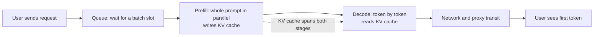

# Inference Fundamentals: Where Latency Comes From

> **Group**: 2 · Inference & Interface ｜ **Previous group exit**: can explain how the model lifecycle shapes engineering decisions (the model is a replaceable capability with three interface properties: behavior, budget, capability boundary) ｜ **This group exit**: can decompose one user-perceived latency into queue / prefill / decode / network, and say who owns each segment and which lever you can pull
> **Prerequisites**: [Model Lifecycle (bridge)](../01-model-lifecycle/) ｜ **Next**: [Efficient Serving](efficient-serving.md), [Model API Contract](model-api.md)

## 1. Overview

This page fills the layer that was missing between "the model" and "the API": **a generative model is not a synchronous function where input goes in and output comes out — it is a two-stage pipeline**. Without understanding that pipeline you cannot explain why the first token is slow while the rest stream out at a steady pace, why the bill scales with output length, or when to leave a hosted API.

Generation has two stages with completely different latency profiles:

- **Prefill**: the entire prompt is processed in one parallel pass, computing the Key/Value tensors attention needs for every prompt token. This stage determines **time to first token** (TTFT).
- **Decode**: tokens are generated one at a time, serially, and each step must "see" every previous token. This stage determines **inter-token latency** (ITL) and total duration.



### Latency decomposition: one user-perceived latency has four segments

| Segment | What happens | Who owns it | Your lever |
| --- | --- | --- | --- |
| Queue | The request waits for a batch or instance slot | The serving platform (vendor or your cluster) | Concurrency shaping, priority tier, load leveling |
| Prefill | The whole prompt is computed in parallel; KV written to cache | The model serving process | Shorten the prompt; raise prefix cache hits (→ [Efficient Serving](efficient-serving.md)) |
| Decode | Token-by-token generation, bound by memory bandwidth | The model serving process | Cap `max_tokens`; speculative decoding (vendor side) |
| Network | TLS, gateways, proxy buffering (a buffered stream degrades into a single full response) | Your infrastructure + the vendor edge | Nearby ingress; make sure proxies do not buffer streams (→ [Streaming](streaming.md)) |

**Key corollary**: TTFT ≈ queue + prefill + network; total duration ≈ TTFT + (output tokens − 1) × per-step decode. **Prompt length mostly hits TTFT; output length mostly hits total duration** — that is the starting point for every latency investigation.

### When to use / when not to

- **Use**: building latency budgets and attributing regressions (TTFT spike — where to look), reading cost structure (why billing is per token with different input/output prices), deciding whether to self-host serving.
- **Do not use**: training and attention math — go to [Learn LLM chapter 9](https://llm.zenheart.site/chapters/09-inference-cache); vendor-specific fields and error codes — go to [Model API Contract](model-api.md); rendering tokens into interfaces — go to [Generative UI](ui.md).

### Decision table: three ways to consume a model

| Mode | Direction | Control | State | Trust domain | Minimum complexity |
| --- | --- | --- | --- | --- | --- |
| Vendor API | Outbound request/response | Vendor owns queueing, batching, caching; you own the call | Stateless (KV cache lives vendor-side) | Data leaves your domain | One fetch away |
| Self-hosted serving (vLLM etc.) | Runs in your cluster | You own everything: batch scheduling, KV memory, quantization | KV cache lives on your GPUs | Data stays in-domain | GPU ops + model supply chain |
| On-device inference | Runs on the user's device | Fully yours, hard-capped by device compute | Device-local | Data never leaves | Model distribution + runtime (→ [Browser and Edge Inference](browser-edge.md)) |

**Start at minimum complexity**: almost every application starts on a vendor API. Evaluate self-hosting only when cost, latency, or data boundaries are blocked by the API; enter on-device only with hard offline/privacy/tail-latency requirements.

### Historical milestones

- FlashAttention paper (arXiv 2205.14135, 2022-05): IO-aware exact attention that reduces HBM reads/writes — the de facto baseline of modern serving kernels. retrievedAt 2026-09-01.
- The vLLM paper was published at SOSP 2023 (listed on the vLLM docs homepage). retrievedAt 2026-09-01.
- Other engine and vendor timelines are **unverified**; we do not fabricate them.

## 2. Usage

### Minimal hands-on: a zero-key two-stage serving simulator (≤ 15 minutes)

No API key, no dependencies, deterministic output. One TypeScript file simulates a "two-stage service": prefill processes the prompt at once, decode emits tokens one by one, and the KV cache is an array of already-computed tokens. Time is measured in abstract **cost units** so every run prints the same numbers.

Environment: Node ≥ 23.6 (runs .mts directly); Node 22.6–23.5 needs `--experimental-strip-types`. Save as `inference-sim.mts`:

```ts
// fixture: zero-key, zero-dependency two-stage inference simulation. Deterministic output.
const FORWARD_PER_TOKEN = 12; // full forward cost for one token (without cache: the whole prefix is re-run every step)
const KV_READ_PER_TOKEN = 1;  // cached decode: reading one K/V entry instead of one forward pass

interface Timing {
  ttftCost: number;      // queue + prefill (here: prefill only, queue = 0)
  decodeCost: number;    // sum of all decode steps
  totalCost: number;
  tokens: number;
  avgPerToken: number;
  stepsGrowth: number[]; // per-step cost at step 1 / mid / last, for the growth table
}

function serve(promptTokens: number, newTokens: number, useCache: boolean): Timing {
  // Stage 1: prefill — the whole prompt is processed once, K/V for every prompt token is cached
  const prefillCost = promptTokens * FORWARD_PER_TOKEN;
  const kvCache: number[] = useCache ? Array.from({ length: promptTokens }, (_, i) => i) : [];

  // Stage 2: decode — one token per step; attention must "see" every previous token
  let decodeCost = 0;
  const stepsGrowth: number[] = [];
  for (let step = 0; step < newTokens; step++) {
    const context = promptTokens + step; // tokens the new token must attend to
    let stepCost: number;
    if (useCache) {
      // 1 forward pass for the new token + 1 cache read per previous token
      stepCost = FORWARD_PER_TOKEN + context * KV_READ_PER_TOKEN;
      kvCache.push(promptTokens + step); // the new token's K/V is appended, never recomputed
    } else {
      // negative case: no cache — the forward pass re-runs over the entire prefix every step
      stepCost = (context + 1) * FORWARD_PER_TOKEN;
    }
    decodeCost += stepCost;
    if (step === 0 || step === Math.floor(newTokens / 2) || step === newTokens - 1) stepsGrowth.push(stepCost);
  }
  const totalCost = prefillCost + decodeCost;
  return {
    ttftCost: prefillCost,
    decodeCost,
    totalCost,
    tokens: newTokens,
    avgPerToken: Math.round((totalCost / newTokens) * 10) / 10,
    stepsGrowth,
  };
}

const PROMPT = 200; // prompt tokens
const OUT = 40;     // tokens to generate

const withCache = serve(PROMPT, OUT, true);
const noCache = serve(PROMPT, OUT, false);

const fmt = (n: number) => n.toLocaleString('en-US');
const report = (label: string, t: Timing) => {
  console.log(`--- ${label} ---`);
  console.log(`TTFT (prefill):        ${fmt(t.ttftCost)} units`);
  console.log(`decode (${t.tokens} tokens): ${fmt(t.decodeCost)} units`);
  console.log(`total:                 ${fmt(t.totalCost)} units; avg/token: ${t.avgPerToken}`);
  console.log(`step cost (first/mid/last): ${t.stepsGrowth.map(fmt).join(' / ')}`);
};
report('with KV cache', withCache);
report('without KV cache (negative case)', noCache);
const saved = ((1 - withCache.totalCost / noCache.totalCost) * 100).toFixed(1);
console.log(`KV cache saved: ${saved}% of total cost`);
console.log(`throughput proxy (tokens per 1k units): cached ${(1000 / (withCache.totalCost / OUT)).toFixed(2)} vs no-cache ${(1000 / (noCache.totalCost / OUT)).toFixed(2)}`);
```

Run and expected output:

```text
$ node inference-sim.mts
--- with KV cache ---
TTFT (prefill):        2,400 units
decode (40 tokens): 9,260 units
total:                 11,660 units; avg/token: 291.5
step cost (first/mid/last): 212 / 232 / 251
--- without KV cache (negative case) ---
TTFT (prefill):        2,400 units
decode (40 tokens): 105,840 units
total:                 108,240 units; avg/token: 2706
step cost (first/mid/last): 2,412 / 2,652 / 2,880
KV cache saved: 89.2% of total cost
throughput proxy (tokens per 1k units): cached 3.43 vs no-cache 0.37
```

Read three things out of the negative case:

1. **TTFT is identical** (2,400): the KV cache does not change prefill — prefill already runs once.
2. **Per-step cost grows in both cases** (212→251 and 2,412→2,880): decode inherently reads the whole context; the cache removes "re-running the forward pass", not "reading the history".
3. **A constant 12× gap** (`FORWARD_PER_TOKEN / KV_READ_PER_TOKEN`): that is why the KV cache exists — reading one cached entry is far cheaper than re-running a layer of the network.

Acceptance: the three sections match the output above; `KV cache saved` prints `89.2%`. Cleanup: delete the file; no network, no ports.

### Scenario matrix

| Scenario | Input | Action | Output | Fits | Does not fit |
| --- | --- | --- | --- | --- | --- |
| Basic: TTFT attribution | Users report "forever until the first token" | Change `PROMPT`, re-run, watch TTFT | TTFT scales linearly with the prompt | Long-prompt cases start at prefill | Slow output phase (change `OUT`, watch total) |
| Common: output length budget | Total duration worsens as answers grow | Change `OUT`, watch the decode share | The decode share grows with output | Basis for a `max_tokens` cap | TTFT problems |
| Combined: long prompt + long output | Knowledge-base context dumped into the prompt | Large `PROMPT` + large `OUT` | Per-step decode cost is pushed from both ends | Why context must be trimmed (→ [Session and State](../03-context/session-memory.md)) | — |

## 3. Principles

### Prefill and decode are two different kinds of computation

**Prefill is a parallel one-shot computation**: all prompt tokens pass through the network simultaneously, the GPU is fed, and cost grows roughly linearly with prompt length. It is the main component of TTFT (plus queue and network).

**Decode is a serial, memory-bound computation**: token N depends on the output of token N−1, so it cannot be parallelized; every step must read the Key/Value of all previous tokens from GPU memory. Modern GPUs have surplus compute while memory bandwidth is the bottleneck — decode speed is decided by "how much memory is read", not "how many FLOPs are computed".

### KV cache: why it exists and what it costs

**Why it exists**: every decode step needs the K/V of all previous tokens for attention. Without caching, generating each token means re-running the forward pass over the prefix (the fixture's negative case). With the cache, history degrades from "recompute the network" to "read a cache entry".

**Memory cost**: each token's KV footprint is roughly

```text
2 (K and V) × layers × KV heads × head dimension × bytes per parameter
```

For a given model this is **a constant × token count**: KV memory grows **linearly with context length**. That is the physical source of "context length is a memory budget" — a vendor's advertised maximum context is ultimately "KV cache + weights + activations fit in memory". Engineering implication: **context is not free**; every extra turn of history makes every later token's memory access more expensive (the 212→251 growth in the fixture is a miniature of this).

### Batching: the throughput/latency trade-off

A single request's decode cannot saturate memory bandwidth, leaving GPU compute idle. Packing many requests' decode steps into one batch reads the weights once, several requests share them, and **throughput rises while per-request latency stays almost unchanged** — until compute saturates. **Continuous batching** (the vLLM docs term) goes further and lets new requests join a batch that is already generating, instead of waiting for the whole batch to finish (vLLM homepage feature list: continuous batching, chunked prefill, prefix caching, retrievedAt 2026-09-01).

What this means for you: **you share the vendor's batches**. Queue delay comes from "waiting for a slot" while prefill/decode per-step latency is comparatively stable; peak-hour TTFT degradation is usually queue growth, not the model getting slower.

### Basic shapes of serving

- **Vendor API**: queueing, batching, KV cache, quantization are all borne by the vendor; you pay per token (billing structure → [Efficient Serving](efficient-serving.md)).
- **Self-hosted serving**: engines like vLLM productize those mechanisms (PagedAttention for block-wise KV, automatic prefix caching, INT8/INT4 quantization, speculative decoding — terminology per its docs homepage, retrievedAt 2026-09-01). You gain control and pay with GPU operations and the model supply chain.
- **On-device**: compute and memory are hard-capped by the device; the model must shrink (quantization, smaller models), see [Browser and Edge Inference](browser-edge.md).

### Spec claims vs local measurement

| Claim | Source | Local fixture measurement (above) |
| --- | --- | --- |
| TTFT is decided by prefill, independent of output length | Corollary of the two-stage structure | Measured: changing `OUT` only moves `decodeCost`; `ttftCost` stays |
| Per-step decode cost grows linearly with context | Attention reads all history every step | Measured: 212 → 232 → 251 (prompt 200 + steps) |
| The KV cache removes prefix recomputation, not history reads | KV cache semantics | Measured: per-step cost grows with and without cache; only the constant differs by 12× |
| Batching raises throughput, not per-request latency | vLLM docs terminology (L1) | Not covered: the fixture is single-request (see open questions) |
| Queueing dominates TTFT at peak | General serving experience | Not covered: the fixture's queue is always 0 (see open questions) |

### Boundary with Learn LLM

Hand-written implementations of prefill/decode, numerical equivalence checks for the KV cache, and the math of quantization (INT8/INT4) all belong to [Learn LLM chapter 9 (Inference & Quantization)](https://llm.zenheart.site/chapters/09-inference-cache). This page keeps only decision-relevant depth: latency attribution, memory budgets, mode selection.

## 4. Development

### Integration checklist for latency budgets

- Instrument TTFT and ITL separately (first streamed chunk time ≠ total duration) — without split metrics, none of the runbooks below have evidence.
- Put a `max_tokens` cap under code review: output length multiplies decode cost directly.
- Put prompt length distribution into monitoring: when TTFT degrades, look there first, then cache hit rates, and only then suspect the vendor.

### Debug runbooks

### Symptom → Evidence → Action → Done when
**Symptom**: users report "forever until the first token", but generation flows fine afterwards.
**Evidence**: split streaming metrics show high TTFT and normal ITL; per-request prompt token counts; the vendor's cache hit fields (e.g. `cached_tokens`).
**Action**: check in order — ① queue (peak-vs-offpeak comparison, concurrency over quota); ② prefill (did the prompt grow: full history resent, template bloat); ③ prefix cache misses (a prompt restructure that moved dynamic content to the front).
**Done when**: TTFT p50/p95 return to baseline; you can point at the data and name the slow segment.

### Symptom → Evidence → Action → Done when
**Symptom**: the bill spikes while traffic is flat.
**Evidence**: reconcile usage: are per-turn input tokens inflating linearly with turns (whole-context recomputation); did the cache hit share drop.
**Action**: add session history trimming with a token budget (→ [Session and State](../03-context/session-memory.md)); reorder the prompt to "stable prefix first, dynamic content last" (→ [Efficient Serving](efficient-serving.md)); audit whether `max_tokens` was raised.
**Done when**: per-turn input tokens stop growing without bound; the per-session cost curve's slope falls back.

### Symptom → Evidence → Action → Done when
**Symptom**: mid-generation stalls, occasional pauses between tokens (ITL jitter).
**Evidence**: per-chunk timestamps for the tail; confirm decode jitter vs network (compare a direct local connection); check whether the output triggers long reasoning stretches.
**Action**: on the network side, confirm proxies do not buffer SSE (→ [Streaming](streaming.md)); on the decode side, cap output length and split long tasks; persistent jitter is vendor capacity — status pages and fallback chains (→ [Browser and Edge Inference](browser-edge.md)).
**Done when**: ITL p95 stabilizes; every stall sample attributes to either network or decode.

### Anti-patterns

- Using total duration as the only latency metric — TTFT and ITL optimize differently; mixing them makes attribution impossible.
- Leaving `max_tokens` unbounded — output length is a multiplier; runaway output amplifies cost and duration.
- Assuming "big context window = stuff anything in" — per-token KV memory and per-step reads all bill for length.
- Swapping models the moment TTFT slows — decompose first; most of the time it is queueing or a longer prompt.
- "Looks successful but the evidence is missing": claiming "the optimization worked" without segmented metrics.

## 5. Resource Library

### Four-level reading route

- **Beginner** (2): run this page's fixture; read the prefill/decode and KV cache sections of [Learn LLM chapter 9](https://llm.zenheart.site/chapters/09-inference-cache).
- **Builder** (2): the [OpenAI prompt caching guide](https://platform.openai.com/docs/guides/prompt-caching) (why a static prefix belongs up front); [Model API Contract](model-api.md) (turn this page's model into calling code).
- **Operator** (2): the vLLM docs homepage (serving terminology overview: continuous batching / chunked prefill / prefix caching); vendor status pages and a latency metrics board.
- **Researcher** (2): the FlashAttention paper (IO-aware attention); the vLLM paper (SOSP 2023, indexed via the vLLM docs homepage).

### Resource table

| Name | Level | canonical URL | Purpose | Supported claim | Next |
| --- | --- | --- | --- | --- | --- |
| Learn LLM ch. 9 · Inference & Quantization | E | https://llm.zenheart.site/chapters/09-inference-cache | Principles and from-scratch implementation | Deep theory of prefill/decode, KV cache, quantization lives in Learn LLM | Hand-write the cache/full equivalence |
| vLLM docs homepage | L1 | https://docs.vllm.ai/en/latest/ | Serving terminology and feature overview | continuous batching, chunked prefill, prefix caching, quantization, speculative decoding as vLLM features | Dig into feature pages |
| OpenAI Prompt Caching guide | L0 | https://platform.openai.com/docs/guides/prompt-caching | Prefix caching engineering | automatic caching ≥1024 tokens; the `cached_tokens` field; KV tensors are produced during prefill | Restructure your prompt |
| Anthropic Prompt Caching docs | L0 | https://docs.anthropic.com/en/docs/build-with-claude/prompt-caching | Explicit cache breakpoints | `cache_control`; 5-minute TTL; minimum cacheable length | Compare the two caching models |
| FlashAttention paper | L4 | https://arxiv.org/abs/2205.14135 | Kernel-level principles | IO-aware attention reduces HBM reads/writes (2022-05) | Read the tiling design |
| This page's fixture | E | inference-sim.mts (inline above) | Zero-key verification | The two-stage cost structure; the benefit and boundary of the KV cache | Re-parameterize for attribution practice |

retrievedAt: all web resources 2026-09-01.

### Active falsification and open questions

- The fixture is single-request: batching and queueing cite vLLM terminology and general experience, not local measurement.
- Cost units are abstract: the 12:1 recompute/read ratio is a **teaching constant**, not a measurement of any real hardware; the real ratio depends on layer count, kernel implementation, and memory bandwidth.
- "TTFT ≈ queue + prefill + network" is a structural decomposition; the real share of each segment must be validated on your own metrics.
- Reasoning-token billing: the OpenAI pricing page states reasoning tokens are not visible via the API but occupy the context window and are billed as output tokens (retrievedAt 2026-09-01) — not expanded here; owned by [Model API Contract](model-api.md).

### Where learn-ai stops / where to go next

This page owns "the structure of latency and cost". How these mechanisms become cheaper fields on the bill → [Efficient Serving](efficient-serving.md); turning the model into calling code → [Model API Contract](model-api.md); math and from-scratch implementation → [Learn LLM chapter 9](https://llm.zenheart.site/chapters/09-inference-cache); cost governance after launch → [Cost and Performance](../08-production/cost-performance).
