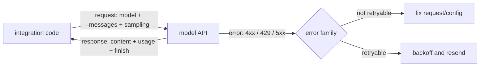

# Model API Contract

> **Group**: Inference & Interface ｜ **Previous group exit**: can write and validate input/output schemas ｜ **This topic exit**: can write a model-calling loop with error-family classification, retry semantics, and usage observability
> **Prerequisites**: [Structured Output](../02-inference-interface/structured-output) ｜ **Next**: [Streaming](streaming.md), [Session and State](../03-context/session-memory.md)

## 1. Overview

The problem the model API contract solves: **vendor interfaces churn, and your integration code should not**. This page abstracts one model call into five stable parts — messages, sampling, usage, errors, and versioning — and gives you a zero-key way to verify each one locally.



### When to use / when not to

- **Use**: the first step of wiring model capability into any product; staying portable across vendors.
- **Do not use**: vendor-specific details (SDK usage, pricing, tiers) — those live on the Products vendor pages; the schema contract for tool calls — see [Tool Calling Contract](../05-action/tool-calling).

### Decision table: how to call

| Approach | Direction | Control | State | Trust domain | Minimum complexity |
| --- | --- | --- | --- | --- | --- |
| Direct fetch | Outbound request/response | All yours (errors, retries, types) | Stateless | Key server-side | Single file, zero deps |
| Official SDK | Outbound request/response | SDK provides types and default retries | Stateless | Key server-side | +1 dependency |
| AI framework | Request + stream + UI | Framework takes over, config for flexibility | Framework session | Key server-side | Full framework contract |

**Start at minimum complexity**: plain fetch until retries and typing become repetitive labor, then an SDK; consider a framework only when streaming, sessions, and UI arrive together.

### Historical milestones

- OpenAI shipped the Responses API and recommends it over Chat Completions for streaming — retrievedAt 2026-09-01, see Resource Library.
- Anthropic's newer model generations (4.6+/5 series) removed several sampling parameters (sending `temperature` returns 400) — retrievedAt 2026-09-01, see the table in Principles.
- Other vendor timelines **unverified**; no dates invented.

## 2. Usage

### Minimal hands-on: zero-key calling loop (≤15 minutes)

No API key, no dependencies, reproducible from a clean checkout. A `node:http` mock server speaks the OpenAI Chat Completions shape; a client demonstrates **normal call, 429 retry, 400 no-retry**.

Environment: Node ≥ 23.6 (add `--experimental-strip-types` on 22.6–23.5). Save as `model-api-mock.mts`:

```ts
// fixture: zero-key, zero-dependency verification of the model API contract. Deterministic output.
import * as http from 'node:http';

interface ChatMessage { role: 'system' | 'user' | 'assistant'; content: string }
interface ChatRequest { model?: string; messages?: ChatMessage[] }
interface ChatCompletion {
  id: string; object: 'chat.completion';
  choices: { message: ChatMessage; finish_reason: 'stop' }[];
  usage: { prompt_tokens: number; completion_tokens: number; total_tokens: number };
}

// ---- mock server: OpenAI Chat Completions-compatible shape ----
let rateLimitHits = 0;
const server = http.createServer((req, res) => {
  let body = '';
  req.on('data', (c) => (body += c));
  req.on('end', () => {
    const payload = JSON.parse(body) as ChatRequest;
    const send = (status: number, json: unknown, headers: Record<string, string> = {}) => {
      res.writeHead(status, { 'Content-Type': 'application/json', ...headers });
      res.end(JSON.stringify(json));
    };
    // Negative 1: missing messages -> 400, client must not retry
    if (!Array.isArray(payload.messages) || payload.messages.length === 0) {
      return send(400, { error: { message: 'messages: field is required', type: 'invalid_request_error', code: 'missing_messages' } });
    }
    // Negative 2: rate-limited model returns 429 (with Retry-After) once, then passes
    if (payload.model === 'mock-rate-limited' && ++rateLimitHits === 1) {
      return send(429, { error: { message: 'Rate limit reached', type: 'rate_limit_error' } }, { 'Retry-After': '1' });
    }
    const last = payload.messages[payload.messages.length - 1].content;
    send(200, {
      id: 'chatcmpl-mock-001', object: 'chat.completion',
      choices: [{ message: { role: 'assistant', content: `echo: ${last}` }, finish_reason: 'stop' }],
      usage: { prompt_tokens: 12, completion_tokens: 8, total_tokens: 20 },
    } satisfies ChatCompletion);
  });
});

// ---- client: error-family classification + Retry-After-honoring retry ----
class ApiError extends Error {
  status: number;
  retryable: boolean;
  retryAfterMs?: number;
  constructor(status: number, retryable: boolean, retryAfterMs?: number) {
    super(`HTTP ${status}: request rejected`);
    this.status = status;
    this.retryable = retryable;
    this.retryAfterMs = retryAfterMs;
  }
}

async function chatOnce(base: string, body: ChatRequest): Promise<ChatCompletion> {
  const res = await fetch(`${base}/v1/chat/completions`, {
    method: 'POST',
    headers: { 'Content-Type': 'application/json', Authorization: 'Bearer mock-key' },
    body: JSON.stringify(body),
  });
  if (!res.ok) {
    // Error families: 429 and 5xx are retryable; other 4xx are not
    const retryable = res.status === 429 || res.status >= 500;
    const retryAfterMs = Number(res.headers.get('retry-after') ?? 0) * 1000;
    throw new ApiError(res.status, retryable, retryAfterMs || undefined);
  }
  return (await res.json()) as ChatCompletion;
}

const sleep = (ms: number) => new Promise((r) => setTimeout(r, ms));

async function chatWithRetry(base: string, body: ChatRequest, maxRetries = 2): Promise<ChatCompletion> {
  for (let attempt = 0; ; attempt++) {
    try {
      return await chatOnce(base, body);
    } catch (e) {
      if (e instanceof ApiError && e.retryable && attempt < maxRetries) {
        const delay = e.retryAfterMs ?? 2 ** attempt * 100;  // prefer the server's Retry-After
        console.log(`  [retry] HTTP ${e.status}, waiting ${delay}ms (attempt ${attempt + 1}/${maxRetries})`);
        await sleep(delay);
        continue;
      }
      throw e;
    }
  }
}

// ---- demo ----
await new Promise<void>((resolve) => server.listen(0, '127.0.0.1', resolve));
const base = `http://127.0.0.1:${(server.address() as { port: number }).port}`;

console.log('--- normal call ---');
const ok = await chatWithRetry(base, { model: 'mock-model', messages: [{ role: 'user', content: 'hello' }] });
console.log('content:', ok.choices[0].message.content);
console.log('usage:', ok.usage);

console.log('--- 429 -> honor Retry-After -> success ---');
const limited = await chatWithRetry(base, { model: 'mock-rate-limited', messages: [{ role: 'user', content: 'again' }] });
console.log('content:', limited.choices[0].message.content);

console.log('--- 400 -> no retry, throw immediately ---');
try {
  await chatWithRetry(base, { model: 'mock-model', messages: [] });
} catch (e) {
  console.log((e as Error).message, '| retryable:', e instanceof ApiError && e.retryable);
}

server.close();
```

Run and normal output:

```text
$ node model-api-mock.mts
--- normal call ---
content: echo: hello
usage: { prompt_tokens: 12, completion_tokens: 8, total_tokens: 20 }
--- 429 -> honor Retry-After -> success ---
  [retry] HTTP 429, waiting 1000ms (attempt 1/2)
content: echo: again
--- 400 -> no retry, throw immediately ---
HTTP 400: request rejected | retryable: false
```

The negative output is the third section: the 400 is **thrown immediately** with no `[retry]` log — error-family classification at work. Acceptance: the three output sections match the above exactly.

Cleanup: delete the file; the mock listens on a random 127.0.0.1 port, released when the process exits.

### Scenario matrix

| Scenario | Input | Action | Output | Fits | Does not fit |
| --- | --- | --- | --- | --- | --- |
| Basic: single-turn Q&A | one user message | POST + parse choices | text + usage | starting point for all products | UI needing progressive text (→ streaming) |
| Common: rate-limit recovery | burst of requests | classify + Retry-After backoff | success after retry | production must-have | exhausted quota (retry is useless; top up first) |
| Combined: multi-vendor adapter | two or more vendors | one internal type + adapter layer | one calling codebase | portability requirements | single vendor with no switching plan |

## 3. Principles

### The five contract parts

**Messages and role semantics**. The request core is the messages array; roles define instruction priority:

| Semantics | Meaning | OpenAI naming | Anthropic naming |
| --- | --- | --- | --- |
| System instruction | app-developer rules, highest priority | `system` (Chat Completions) / `developer` (Responses) | top-level `system` parameter |
| User input | end-user instructions and data | `user` | `user` |
| Model history | prior model outputs | `assistant` | `assistant` |
| Tool results | tool execution returns | `tool` | `tool_result` blocks inside `user` |

Two verified vendor notes (retrievedAt 2026-09-01): OpenAI's priority chain is developer > user (defined in its Model Spec); Anthropic's messages accept only `user`/`assistant` and must alternate — the system prompt is a top-level field, and violating alternation returns 400 (`roles must alternate between "user" and "assistant"`).

**Key corollary: the API is stateless; the messages array is the session state**. Every turn resends all needed history; "multi-turn memory" is constructed by this layer (expanded in [Session and State](../03-context/session-memory.md)).

**Sampling parameters**. They control randomness and output length:

| Parameter | Effect | OpenAI | Anthropic |
| --- | --- | --- | --- |
| Temperature | distribution sharpness | `temperature` | `temperature` |
| Top-p | candidate truncation | `top_p` | `top_p` |
| Top-k | keep top k candidates | none | `top_k` |
| Output cap | max generated tokens | `max_completion_tokens` (Chat Completions) / `max_output_tokens` (Responses) | `max_tokens` (**required**) |
| Stop sequences | halt on match | `stop` | `stop_sequences` |

Note: the sampling surface is shrinking. Anthropic's 4.6+/5-series models removed `temperature`/`top_p`/`top_k` (sending them returns 400, retrievedAt 2026-09-01). **Do not treat sampling parameters as a permanent contract** — check the supported surface when migrating model generations.

**Usage and billing**. Responses carry a usage field family: OpenAI uses `prompt_tokens`/`completion_tokens`/`total_tokens`; Anthropic uses `input_tokens`/`output_tokens` (plus cache-hit fields). Billing = unit price × tokens, so usage is the primary cost-observability signal. **Unit prices and tiers are dynamic numbers — never bake them into architecture docs**; the vendor pricing page of the day wins.

**Error families and retry semantics**. Classify by "can this be retried" rather than by memorized vendor codes:

| Family | Typical codes | Meaning | Handling |
| --- | --- | --- | --- |
| Request error | 400 / 404 / 413 | your request is wrong | fix the request, **no retry** |
| Auth/permission | 401 / 403 | key or permission problem | fix config, **no retry** |
| Rate/quota | 429 | too fast (backoff ok) or quota exhausted (retry useless) | distinguish via `Retry-After` and `error.code` |
| Server-side | 500 / 503 / 529 | vendor-side issue | backoff and retry |

Verified vendor notes (retrievedAt 2026-09-01): OpenAI's billing-class 429s (e.g., `credit_balance_exhausted`) **do not recover on retry** — top up or raise the limit first; when `Retry-After` is present, wait at least that long; otherwise use exponential backoff with jitter. Anthropic's retryable errors are 429 `rate_limit_error`, 500 `api_error`, and 529 `overloaded_error`.

**Idempotency**. Generation requests have no built-in idempotency key, so **retrying after a timeout may bill twice** (the original request may have been processed). Mitigations at this layer: cap retries; make user-visible operations idempotent at the application layer (one intent produces one visible result).

**Version pinning**. Pin production apps to specific model snapshots (the `gpt-5-2025-08-07` naming form — OpenAI officially recommends snapshot pinning for consistent behavior, retrievedAt 2026-09-01). A model swap is a **release event**: run evals, update the snapshot, go through the release process — not a one-line env change.

### Spec vs local test

| Claim | Spec/official docs | Local mock test (fixture above) |
| --- | --- | --- |
| 429 responses may carry `Retry-After` | OpenAI rate limit guide (L0) | implemented and verified: client waits 1000ms |
| 4xx must not be retried | general HTTP semantics | verified: 400 throws immediately, no `[retry]` log |
| 5xx is retryable | OpenAI/Anthropic error guides (L0) | mock does not inject 5xx (see open questions) |
| usage returned with the response | both API references (L0) | verified: every success carries usage |
| Anthropic `max_tokens` is required | Anthropic API reference (L0) | mock implements the OpenAI shape only (see open questions) |

## 4. Development

### Version pinning and migration

- Treat `model` as a dependency: pin snapshots, route changes through code review.
- Migration checklist: message-role mapping, sampling support surface, output field names (`finish_reason` vs `stop_reason`), usage field names, error-code family mapping.
- Lock the five items above with contract tests (run them against the mock and against the real vendor).

### Debug runbooks

### Symptom → Evidence → Action → Done when
**Symptom**: many requests fail at peak, recovering later.
**Evidence**: HTTP status distribution of failures, 429 share; whether `error.code` is billing-class.
**Action**: add `Retry-After` backoff and request throttling for non-billing 429s; stop retrying billing-class 429s and fix the quota.
**Done when**: the retry curve converges; no double charges on the billing panel; failure rate returns to baseline.

### Symptom → Evidence → Action → Done when
**Symptom**: after a model swap every request returns 400.
**Evidence**: the error message points at a specific field (unknown parameter, unsupported `max_tokens`).
**Action**: fix field mapping against the migration checklist; add a contract test.
**Done when**: the same input replays as 200; the contract test is green.

### Symptom → Evidence → Action → Done when
**Symptom**: billed tokens exceed your business logs.
**Evidence**: reconciling vendor usage against local request records reveals double-billing from timeout retries.
**Action**: tighten timeouts and retry caps; on timeout, probe before retrying or fail fast with a user-facing retry entry.
**Done when**: the reconciliation gap is zero (or a constant, explainable difference).

### Symptom → Evidence → Action → Done when
**Symptom**: the client only logs "request failed" with no way to locate the cause.
**Evidence**: a catch block swallowed the status code and error body.
**Action**: throw typed exceptions per error family (like the fixture's `ApiError`); log status, error.code, and request id.
**Done when**: any failure sample maps to exactly one error family from its log line.

### Anti-pattern list

- Registering three vendors before thinking about the feature — run one end-to-end first, then port.
- Copying a price table into an architecture doc as permanent fact.
- One `catch (e)` swallowing every error with no family split — looks successful, evidence-free.
- Retrying 429 without backoff — amplifies the outage.
- Hard-coding sampling parameters as a stable contract across model generations.

## 5. Resource Library

### Four-level reading route

- **Beginner** (2): the OpenAI text generation guide (roles and request basics); the Anthropic Messages API overview.
- **Builder** (2): the OpenAI error codes guide (families and handling code); extend this page's fixture into your project's contract test.
- **Operator** (2): the OpenAI rate limits guide; vendor status pages (status.openai.com / status.anthropic.com).
- **Researcher** (2): the OpenAI Model Spec (the normative source of role priority); both vendors' API changelogs/deprecations.

### Resource table

| Name | Level | Canonical URL | Use | Supported claim | Next |
| --- | --- | --- | --- | --- | --- |
| OpenAI Text generation guide | L0 | https://developers.openai.com/api/docs/guides/text | roles/request basics | developer>user priority; snapshot pinning advice | run your first real request |
| OpenAI Streaming guide | L0 | https://developers.openai.com/api/docs/guides/streaming-responses | streaming overview | Responses semantic events; streamed output is harder to moderate | → [Streaming](streaming.md) |
| OpenAI Error codes guide | L0 | https://developers.openai.com/api/docs/guides/error-codes | error handling | billing 429 not retryable; Retry-After semantics | add error families to your client |
| OpenAI Rate limits guide | L0 | https://developers.openai.com/api/docs/guides/rate-limits | rate-limit operations | limit tiers and backoff advice | design throttling |
| Anthropic API docs | L0 | https://docs.anthropic.com | Messages API reference | required max_tokens; error type table | write the adapter side |
| This page's fixture | E | model-api-mock.mts (inline) | zero-key verification | error-family and Retry-After behavior | extend into a contract test |

retrievedAt: all web resources 2026-09-01.

### Active falsification and open questions

- The fixture does not inject a 5xx path; "5xx is retryable" rests on official docs, not local test.
- The mock implements only the OpenAI shape; the Anthropic shape (top-level system, required max_tokens) is not covered by the fixture.
- "Sampling parameters shrink on reasoning generations" was verified on the Anthropic side only; OpenAI's reasoning-model sampling surface is unverified and not asserted.

### Where learn-ai stops / where to go next

This page owns the calling contract. Output arriving progressively → [Streaming](streaming.md); how history is sent → [Session and State](../03-context/session-memory.md); vendor-specific access (SDK install, pricing, tiers) → the Products vendor pages; observability and cost tracking for the call chain → [Observability](../08-production/observability), [Cost and Performance](../08-production/cost-performance).
