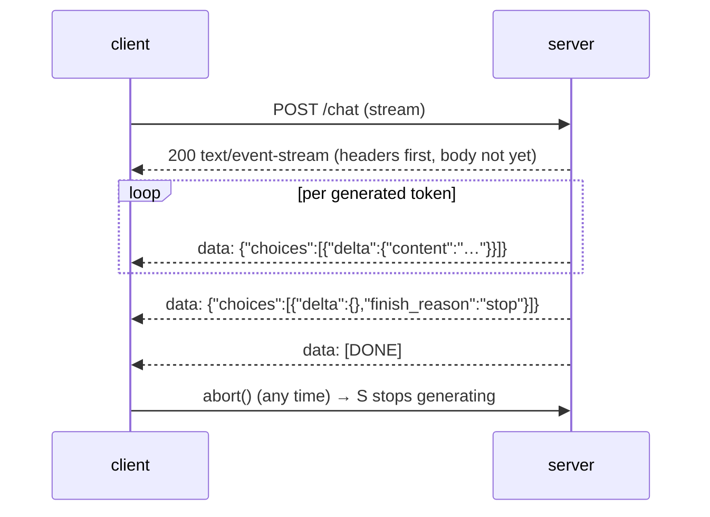

# Streaming

> **Group**: Inference & Interface ｜ **Previous group exit**: can write a model-calling loop with error-family classification, retry semantics, and usage observability ｜ **This topic exit**: can consume one model stream — accumulate chunks, cancel at any time, recognize interruption, and read the finish reason
> **Prerequisites**: [Model API Contract](model-api.md) ｜ **Next**: [Session and State](../03-context/session-memory.md), [Generative UI](ui.md)

## 1. Overview

Streaming solves the problem of **perceived latency**. Generating an answer often takes seconds; waiting for the complete payload shows the user a spinner over blank space. Streaming brings Time To First Token (TTFT) under a second with the rest arriving progressively — the user sees work happening, which changes the waiting experience completely.

One streaming interaction consists of four things: **transport** (SSE, Server-Sent Events), **accumulation** (chunks joined into full content), **cancellation** (AbortController propagating so the server stops generating), and **finish semantics** (finish_reason tells you whether the ending is natural, truncated, or a refusal).



### When to use / when not to

- **Use**: human-facing generation (chat, writing, code); unpredictable generation length with a waiting user.
- **Do not use**: background batch jobs (whole-payload handling is simpler); structured output that must be validated before display (see [Structured Output](../02-inference-interface/structured-output); the two can combine — stream the transport, buffer, then validate); moderation-sensitive production traffic — partial completions are harder to moderate (per OpenAI's official note, retrievedAt 2026-09-01).

### Decision table: SSE vs WebSocket vs polling

| Approach | Direction | Control | State | Trust domain | Minimum complexity |
| --- | --- | --- | --- | --- | --- |
| SSE (HTTP stream) | one-way: server → client | standard HTTP; browser auto-reconnects (EventSource) | connectionless semantics | plain HTTP auth | lowest: response header + data lines |
| WebSocket | bidirectional | you own protocol, heartbeats, reconnect | optionally stateful | upgraded protocol, extra gateway config | medium: worth it only for two-way needs |
| Polling | client pulls | fully manual | server stores results | plain HTTP | low, but poor latency and wasted requests |

**Default to SSE**: model streams are pure one-way pushes over ordinary HTTP infrastructure; move to WebSocket only when you must send input mid-generation (e.g., real-time barge-in). OpenAI Responses now ships an official WebSocket mode for exactly that incremental input (retrievedAt 2026-09-01) — it solves "send input mid-generation", not resuming an interrupted generation (see Principles); SSE remains the default HTTP streaming path.

### Historical milestones

SSE is an old WHATWG HTML-spec technology (predating LLM apps); vendors define their own streaming event vocabularies — OpenAI Chat Completions uses `data:` JSON chunks plus a `[DONE]` sentinel, the Responses API switched to typed semantic events (`response.output_text.delta` and friends), Anthropic uses lifecycle message events (`message_start` → `content_block_delta` → `message_stop`). Event lists are governed by the vendor docs of the day (retrievedAt 2026-09-01).

## 2. Usage

### Minimal hands-on: zero-key stream consumption and cancellation (≤15 minutes)

A local mock serves an OpenAI-style SSE stream; the client demonstrates **full consumption** and **mid-stream cancellation**. Environment: Node ≥ 23.6 (add `--experimental-strip-types` on 22.6–23.5). Save as `streaming-mock.mts`:

```ts
// fixture: zero-key, zero-dependency SSE consumption and cancellation. Deterministic output.
import * as http from 'node:http';

// ---- mock server: OpenAI-style SSE stream, deterministic chunks ----
const TOKENS = ['流式', '传输', '把', '等待', '变成', '逐步', '呈现', '。'];
const encoder = new TextEncoder();
const sleep = (ms: number) => new Promise((r) => setTimeout(r, ms));

const server = http.createServer(async (req, res) => {
  if (req.url !== '/v1/chat/stream') { res.writeHead(404).end(); return; }
  res.writeHead(200, {
    'Content-Type': 'text/event-stream',   // the SSE MIME type
    'Cache-Control': 'no-cache',
  });
  let finished = false;
  req.on('close', () => {
    if (!finished) console.log('[server] client disconnected -> generation stopped');
  });

  for (let i = 0; i < TOKENS.length; i++) {
    if (res.destroyed) return;             // stop generating right after cancellation
    const chunk = { choices: [{ delta: { content: TOKENS[i] }, finish_reason: null }] };
    res.write(encoder.encode(`data: ${JSON.stringify(chunk)}\n\n`));
    await sleep(80);
  }
  finished = true;
  const done = { choices: [{ delta: {}, finish_reason: 'stop' }], usage: { prompt_tokens: 10, completion_tokens: 8, total_tokens: 18 } };
  res.write(encoder.encode(`data: ${JSON.stringify(done)}\n\n`));
  res.write(encoder.encode('data: [DONE]\n\n'));
  res.end();
});

await new Promise<void>((resolve) => server.listen(0, '127.0.0.1', resolve));
const base = `http://127.0.0.1:${(server.address() as { port: number }).port}`;

// ---- client: SSE parsing + chunk accumulation + AbortController cancellation ----
interface StreamResult { text: string; finishReason: string | null; aborted: boolean }

async function consumeStream(url: string, signal?: AbortSignal): Promise<StreamResult> {
  const res = await fetch(url, { signal });
  if (!res.ok || !res.body) throw new Error(`HTTP ${res.status}`);
  const reader = res.body.getReader();
  const decoder = new TextDecoder();
  let buffer = '';
  let text = '';
  let finishReason: string | null = null;

  try {
    while (true) {
      const { value, done } = await reader.read();
      if (done) break;
      buffer += decoder.decode(value, { stream: true });   // a chunk may split a line; buffer first
      let sep: number;
      while ((sep = buffer.indexOf('\n\n')) >= 0) {        // events end with a blank line
        const rawEvent = buffer.slice(0, sep);
        buffer = buffer.slice(sep + 2);
        for (const line of rawEvent.split('\n')) {
          if (!line.startsWith('data:')) continue;          // handle only data: lines
          const data = line.slice(5).trim();
          if (data === '[DONE]') return { text, finishReason, aborted: false };
          const chunk = JSON.parse(data) as {
            choices: { delta: { content?: string }; finish_reason: string | null }[];
          };
          text += chunk.choices[0]?.delta.content ?? '';   // accumulate
          if (chunk.choices[0]?.finish_reason) finishReason = chunk.choices[0].finish_reason;
        }
      }
    }
    return { text, finishReason, aborted: false };
  } catch (e) {
    if (signal?.aborted) return { text, finishReason, aborted: true };  // cancelled: keep partial output
    throw e;
  }
}

console.log('--- full consumption ---');
const full = await consumeStream(`${base}/v1/chat/stream`);
console.log('text:', full.text);
console.log('finish_reason:', full.finishReason);

console.log('--- cancel after 320ms ---');
const controller = new AbortController();
setTimeout(() => controller.abort(), 320);
const partial = await consumeStream(`${base}/v1/chat/stream`, controller.signal);
console.log('text:', partial.text);
console.log('aborted:', partial.aborted, '| finish_reason:', partial.finishReason);

await sleep(50);
server.close();
```

Run and normal output:

```text
$ node streaming-mock.mts
--- full consumption ---
text: 流式传输把等待变成逐步呈现。
finish_reason: stop
--- cancel after 320ms ---
text: 流式传输把等待
aborted: true | finish_reason: null
[server] client disconnected -> generation stopped
```

The negative output is the second section: after cancellation `aborted: true` and `finish_reason` is empty — **partial output has no finish reason, so the UI must mark it "interrupted" rather than treat it as complete**. The server log proves generation actually stopped (that is the evidence of "cancellable"). Acceptance: both paths match the output above.

Cleanup: delete the file; the mock listens on a random 127.0.0.1 port, released on process exit.

### Scenario matrix

| Scenario | Input | Action | Output | Fits | Does not fit |
| --- | --- | --- | --- | --- | --- |
| Basic: progressive display | an SSE stream | accumulate deltas + render | full text | chat interfaces | JSON needing whole-payload validation |
| Common: stop button | user click | AbortController.abort() | partial text + interrupted marker | any generation UI | — |
| Combined: streaming + structure | a stream of component JSON | buffer per line + validate, then render | whitelist components | [Generative UI](ui.md) | strict low-frequency validation (plain non-streaming) |

## 3. Principles

### SSE wire format (WHATWG-spec behavior, retrievedAt 2026-09-01, MDN)

- Response headers: `Content-Type: text/event-stream`, paired with `Cache-Control: no-cache`.
- The body is a UTF-8 text stream; **each event ends with a blank line (`\n\n`)**.
- Each line is `field: value`; four fields are recognized: `data` (payload), `event` (event name), `id` (resume marker), `retry` (reconnect milliseconds).
- Multiple consecutive `data:` lines are joined with newlines; a leading `:` makes a comment line, usable as a keep-alive.
- The `EventSource` API fires `onmessage` for unnamed events and `addEventListener` for `event:`-named ones; it **reconnects automatically** (tunable via `retry`), and `close()` terminates.
- Connection limits: over HTTP/1.x a browser allows **at most 6 concurrent SSE connections per origin** (marked Won't fix in Chrome/Firefox); HTTP/2 negotiates its stream limit (default 100).

Model-API streams almost universally use `data:` lines carrying JSON; vendors differ in the **event vocabulary**:

| Concept | OpenAI Chat Completions | OpenAI Responses | Anthropic Messages |
| --- | --- | --- | --- |
| Text delta | `choices[0].delta.content` | `delta` on `response.output_text.delta` | `text_delta` on `content_block_delta` |
| Finish reason | `finish_reason` on the last chunk | `response.completed` | `stop_reason` carried by `message_delta` |
| End sentinel | `data: [DONE]` | the event type itself | `message_stop` |
| First chunk | delta containing only the role | `response.created` | `message_start` |

### Finish reason semantics

`finish_reason`/`stop_reason` answers "why did this stop", which decides the next action:

- Natural end (`stop` / `end_turn`): content is complete; safe to write into session history.
- Length cap (`length` / `max_tokens`): content truncated; continue or inform the user.
- Stop sequence (`stop_sequence`): hit a stop string you configured.
- Tool call (`tool_calls` / `tool_use`): hand off to tool execution (see [Tool Calling Contract](../05-action/tool-calling)).
- Safety refusal (Anthropic `refusal`): content may be a refusal notice; check before displaying.
- **Cancellation (abort): no finish reason** — it is a client action, not a server semantic; the UI must mark it.

### Backpressure and render throttling

Network arrival speed and rendering speed are decoupled. Calling `setState` per chunk at high stream rates overwhelms the render pipeline. The fix is to separate accumulation from rendering — flush the buffer once per frame (requestAnimationFrame) or at a fixed interval. The Node-side equivalent is the `ReadableStream` reader loop, which naturally consumes chunk by chunk without piling up.

### Interruption and recovery

- **A broken transport is not a generation semantic.** A fetch stream does not auto-reconnect (only EventSource does); keep the partial content received so far and mark it "incomplete".
- **Generation cannot be resumed.** There is no universal "continue from token N" interface; recovery means a new request built around the partial content (or an explicit user retry). EventSource's `Last-Event-ID` reconnection is meaningful only for **replayable event sources**, not one-shot generation.
- **Proxy buffering is the number-one enemy.** Reverse proxies such as Nginx buffer responses by default, collapsing the stream into one block. Servers need `X-Accel-Buffering: no` (or the equivalent) and should flush response headers early.

### Spec vs local test

| Claim | Spec/official docs | Local mock test (fixture above) |
| --- | --- | --- |
| Events end with a blank line; `data:` carries payload | WHATWG/MDN (L0) | verified: parser splits on `\n\n` |
| A chunk may split a line; buffer and join | MDN streaming semantics (L0) | verified: decode with `{ stream: true }` + buffer |
| The server can sense connection close after abort | HTTP connection semantics | verified: `req.on('close')` fires and generation stops |
| A cancelled stream has no finish_reason | vendor streaming docs, inferred | verified: `aborted: true` with null finishReason |
| HTTP/1.x 6-connections-per-origin cap | MDN (L0) | not tested (single-connection scenario), see open questions |

## 4. Development

### Integration and compatibility

- Prefer `fetch` + `AbortController` on the client (POST-friendly); `EventSource` is GET-only, suited to simple read-only streams.
- Flush headers early on the server; when a CDN/gateway sits in the path, verify "chunks arrive progressively", not "one block arrives".
- Memoize historical messages in the render layer and update only the streaming one, avoiding whole-list re-renders.

### Debug runbooks

### Symptom → Evidence → Action → Done when
**Symptom**: the frontend displays everything only after generation completes.
**Evidence**: `curl -N <endpoint>` shows chunked vs one-block arrival; response headers hint at an intermediate buffer.
**Action**: add `X-Accel-Buffering: no` / disable gzip / flush early on the server; confirm the intermediate layers pass streams through.
**Done when**: `curl -N` prints tokens progressively; browser TTFT lands under a second.

### Symptom → Evidence → Action → Done when
**Symptom**: the user clicked stop, but billing shows generation continued.
**Evidence**: server logs show generation-loop output after the abort.
**Action**: listen for `req.on('close')` and forward the cancellation upstream (pass the AbortSignal to the vendor API), stopping on receipt.
**Done when**: server generation logs stop immediately after abort; reconciliation shows no over-billing.

### Symptom → Evidence → Action → Done when
**Symptom**: an interrupted answer is stored as complete, and the model continues from the half sentence next turn.
**Evidence**: assistant messages without a finish_reason exist in session history.
**Action**: check `aborted`/`finishReason` before writing back; mark truncated messages or do not persist them.
**Done when**: every assistant message in history carries an explicit end state.

### Symptom → Evidence → Action → Done when
**Symptom**: opening a few more tabs makes all new connections fail.
**Evidence**: browser console connection errors; HTTP/1.x with 6 open same-origin connections.
**Action**: upgrade to HTTP/2, or multiplex over a single event channel.
**Done when**: multiple tabs stream concurrently.

### Anti-pattern list

- Calling `JSON.parse` on each chunk of incomplete JSON — buffer per event first.
- Aborting only in the frontend UI layer without server propagation — generation and cost continue.
- Silently swallowing a broken stream and rendering it as a normal ending — success-looking but missing the finish reason.
- Calling setState on every network chunk — render jitter at high stream rates.
- Ignoring `finish_reason` and persisting `length`-truncated content as complete.

## 5. Resource Library

### Four-level reading route

- **Beginner** (2): MDN Using server-sent events (wire format and EventSource); run this page's fixture to exercise cancellation.
- **Builder** (2): the OpenAI streaming guide (delta chunk structure); the Anthropic streaming event reference.
- **Operator** (2): proxy/CDN configuration checks for the streaming path (X-Accel-Buffering and friends); add TTFT metrics per [Observability](../08-production/observability).
- **Researcher** (2): the WHATWG HTML spec section on event-stream syntax; HTTP/2 stream multiplexing material.

### Resource table

| Name | Level | Canonical URL | Use | Supported claim | Next |
| --- | --- | --- | --- | --- | --- |
| MDN Using SSE | L0 | https://developer.mozilla.org/en-US/docs/Web/API/Server-sent_events/Using_server-sent_events | wire-format authority | fields/blank-line separation/reconnect/6-connection cap | write a parser |
| OpenAI Streaming guide | L0 | https://developers.openai.com/api/docs/guides/streaming-responses | vendor streaming overview | Responses semantic events, moderation note | connect a real vendor |
| Anthropic Streaming reference | L0 | https://docs.anthropic.com | event lifecycle | message_start/delta/stop event family | connect a real vendor |
| WHATWG HTML spec | L0 | https://html.spec.whatwg.org/multipage/server-sent-events.html | syntax norm | event-stream grammar and parsing rules | consult for exact definitions |
| This page's fixture | E | streaming-mock.mts (inline) | zero-key verification | accumulation/cancellation/finish-reason behavior | swap in a real vendor endpoint |

retrievedAt: all web resources 2026-09-01.

### Active falsification and open questions

- "Sub-second TTFT meaningfully improves the experience" is an engineering consensus; your product's threshold needs its own measurement.
- The 6-connection cap was not reproduced in the fixture (needs a multi-tab browser environment); the claim is from MDN, marked L0.
- Vendor event vocabularies follow their official docs; this page's table lists only verified fields.

### Where learn-ai stops / where to go next

This page owns "progressive arrival". Sending and trimming multi-turn history → [Session and State](../03-context/session-memory.md); rendering components inside the stream → [Generative UI](ui.md); TTFT/throughput measurement → [Cost and Performance](../08-production/cost-performance); framework streaming wrappers → the Products framework pages.
