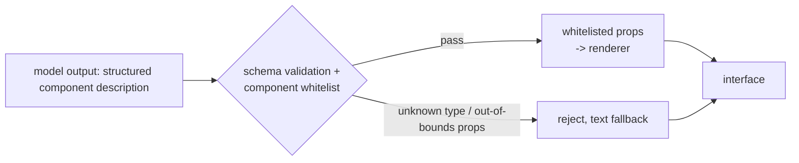

# Generative UI

> **Group**: Inference & Interface  |  **Previous group exit**: can consume one model stream — accumulate chunks, cancel at any time, recognize interruption, and read the finish reason  |  **This topic exit**: can render model output as whitelisted components — streamed, schema-validated, with untrusted content rejected
> **Prerequisites**: [Structured Output](../02-inference-interface/structured-output), [Streaming](streaming.md)  |  **Next**: [AG-UI Protocol](../07-interoperability/ag-ui), [A2UI and MCP Apps](../07-interoperability/a2ui-mcp-apps)

## 1. Overview

Generative UI solves this problem: **plain text is a naturally bad interface for many tasks**. "25 degrees in Beijing today" is a sentence; a temperature card with the next three hours' trend is immediately usable interface. Generative UI has the model emit **structured component descriptions** (schema-shaped data), and the frontend renders them into real components drawn from a whitelist.

The mainstream implementation path today (per the Vercel AI SDK v7 docs, retrievedAt 2026-09-01): **a tool call is the UI description**. You give the model tools (e.g., `displayWeather`), the model decides to call one, the tool executes and returns data, and the frontend binds "this tool's output" to the matching React component. The model never emits HTML — only structured parameters and data.



### When to use / when not to

- **Use**: answers that are fundamentally data displays (weather, quotes, checklists, form drafts); mixing text and rich components inside one chat stream.
- **Do not use**: answers that are fundamentally prose (text is the best form); when the model must operate real systems rather than display — that is a [Tool Execution Engineering](../05-action/tool-execution) concern; when arbitrary third-party hosts must render your agent UI — that is a protocol concern ([AG-UI](../07-interoperability/ag-ui), [A2UI](../07-interoperability/a2ui-mcp-apps); this page provides only the conceptual base).

### Decision table: three shapes of model-driven interface

| Shape | Direction | Control | State | Trust domain | Minimum complexity |
| --- | --- | --- | --- | --- | --- |
| Plain text + frontend parsing | model emits text only | frontend decides all display | none | text is content | lowest |
| Tool call → component (this page) | model picks tool and args | you lock the component set; the model only fills data | component state client-side | output passes schema + whitelist | + tool definitions and bindings |
| UI protocol (AG-UI/A2UI) | standardized event stream | protocol owns event and state semantics | protocol state machine | cross-host trust at protocol level | highest; worth it only cross-end |

**Start with the tool-call shape**: a single product needs no protocol, and a fully controlled component set is also the safest.

### Historical milestones

- Early implementations rendered "model-emitted JSON/JSX" directly (including RSC streamed-component approaches); the mainstream has since converged on "tool calls + component binding" (the Vercel AI SDK v7 shape, retrievedAt 2026-09-01).
- Protocol tracks (AG-UI, A2UI/MCP Apps) emerged after 2025 and belong to the interoperability group ([07](../07-interoperability/ag-ui)); not expanded here.

## 2. Usage

### Minimal hands-on: zero-key component-stream rendering (≤15 minutes)

A mock model streams component descriptions (NDJSON lines); a whitelist renderer consumes them — covering both **normal rendering** and **untrusted-content rejection**. Environment: Node ≥ 23.6 (add `--experimental-strip-types` on 22.6–23.5). Save as `ui-mock.mts`:

```ts
// fixture: zero-dependency verification of the generative-UI core pipeline. Deterministic output.
type UiEvent =
  | { type: 'text'; text: string }
  | { type: 'component'; component: { type: string; props: Record<string, unknown> } };

// Component whitelist: the renderer knows only types registered here
interface ComponentSpec {
  allowedProps: Record<string, 'string' | 'number' | 'string[]'>;
  render: (props: Record<string, unknown>) => string;
}
const registry: Record<string, ComponentSpec> = {
  card: {
    allowedProps: { title: 'string', items: 'string[]' },
    render: (p) => {
      const items = (p.items as string[]) ?? [];
      return [`+-- ${String(p.title)} --+`, ...items.map((it) => `| ${it}`)].join('\n');
    },
  },
  metric: {
    allowedProps: { label: 'string', value: 'string' },
    render: (p) => `[ ${p.label}: ${p.value} ]`,
  },
};

// Validation: type must be whitelisted + no out-of-bounds props; extra/unknown props are rejected (not ignored)
function validate(name: string, props: Record<string, unknown>): { ok: boolean; reason?: string } {
  const spec = registry[name];
  if (!spec) return { ok: false, reason: `unknown component type "${name}"` };
  for (const key of Object.keys(props)) {
    if (!(key in spec.allowedProps)) return { ok: false, reason: `prop "${key}" not allowed on "${name}"` };
  }
  return { ok: true };
}

// ---- mock model: streams NDJSON lines (simulating streamed structured output) ----
const encoder = new TextEncoder();
const sleep = (ms: number) => new Promise((r) => setTimeout(r, ms));
const MODEL_OUTPUT: UiEvent[] = [
  { type: 'text', text: '本周概览：' },
  { type: 'component', component: { type: 'card', props: { title: '发布清单', items: ['流式接入', '会话裁剪'] } } },
  { type: 'component', component: { type: 'metric', props: { label: 'TTFT', value: '480ms' } } },
  // Negatives: model output is untrusted — unknown component, out-of-bounds props (injection attempt)
  { type: 'component', component: { type: 'iframe', props: { src: 'https://evil.example/x' } } },
  { type: 'component', component: { type: 'card', props: { title: 'x', items: [], onClick: 'alert(1)' } } },
];

async function* mockModelStream(): AsyncGenerator<Uint8Array> {
  for (const event of MODEL_OUTPUT) {
    // deliberately split one JSON line into two chunks to verify line-buffered accumulation
    const line = JSON.stringify(event);
    const mid = Math.floor(line.length / 2);
    yield encoder.encode(line.slice(0, mid));
    await sleep(20);
    yield encoder.encode(line.slice(mid) + '\n');
    await sleep(20);
  }
}

// ---- client render pipeline: accumulate per line -> validate -> whitelist render ----
async function renderStream(stream: AsyncGenerator<Uint8Array>): Promise<void> {
  let buffer = '';
  for await (const chunk of stream) {
    buffer += new TextDecoder().decode(chunk, { stream: true });
    let nl: number;
    while ((nl = buffer.indexOf('\n')) >= 0) {
      const line = buffer.slice(0, nl).trim();
      buffer = buffer.slice(nl + 1);
      if (!line) continue;
      const event = JSON.parse(line) as UiEvent;
      if (event.type === 'text') {
        console.log('text:', event.text);
        continue;
      }
      const { type, props } = event.component;
      const check = validate(type, props);
      if (!check.ok) {
        console.log(`rejected: ${check.reason} (fallback to text)`);
        continue;
      }
      // pass only whitelisted props to the renderer
      const safe: Record<string, unknown> = {};
      for (const key of Object.keys(registry[type].allowedProps)) safe[key] = props[key];
      console.log('render:', registry[type].render(safe));
    }
  }
}

await renderStream(mockModelStream());
```

Run and normal output:

```text
$ node ui-mock.mts
text: 本周概览：
render: +-- 发布清单 --+
| 流式接入
| 会话裁剪
render: [ TTFT: 480ms ]
rejected: unknown component type "iframe" (fallback to text)
rejected: prop "onClick" not allowed on "card" (fallback to text)
```

The negative output is the last two lines: the unknown `iframe` component and the out-of-bounds `onClick` prop (an injection attempt) are both rejected and demoted to text — **the renderer's trust in model output is zero**. Acceptance: the five output lines match the above.

Cleanup: delete the file.

### Scenario matrix

| Scenario | Input | Action | Output | Fits | Does not fit |
| --- | --- | --- | --- | --- | --- |
| Basic: data card | structured tool output | whitelist component render | rich card | weather/quotes/checklists | prose answers |
| Common: streaming placeholder | tool call starts | loading state → replaced by complete state | skeleton first, content later | slow tools (seconds) | instantly returning data |
| Combined: form draft | model-generated prefills | form component + user confirmation | editable draft | structured entry | direct persistence (requires human confirmation) |

## 3. Principles

### The four stages of the render pipeline

1. **Description**: the model emits a structured component description (NDJSON events in this page's fixture; the product path is usually tool-call parameters and results, see [Tool Calling Contract](../05-action/tool-calling)).
2. **Validation**: the description must pass both schema (shape) and whitelist (type and prop range) — the [Structured Output](../02-inference-interface/structured-output) exit applied here directly.
3. **Binding**: a legal description maps to a real component; only whitelisted props reach the component.
4. **Fallback**: any illegal description degrades to text display and never breaks the whole stream.

### Combining with streaming

Component events arrive in a partial-JSON state mid-stream (a line cut by the network), and the countermeasure matches [Streaming](streaming.md): **buffer at event boundaries, parse when complete**. In the product path a tool call has three states (matching Vercel AI SDK v7's tool-part states, with part type `tool-${toolName}`, retrievedAt 2026-09-01): `input-available` (args complete, show a skeleton) → `output-available` (data complete, render the component) → `output-error` (show an error state).

### The security boundary (the most important principle on this page)

**Model output is untrusted input**. It can be hijacked by prompt injection (see [Security](../08-production/security)) into emitting escape-attempting descriptions. Therefore:

- **Whitelist enumeration**, not blacklist filtering: the renderer knows only registered component types.
- **Prop narrowing**: only declared props pass, type-checked, into the component.
- **Never**: `dangerouslySetInnerHTML`, `eval`, or treating model-emitted strings as URLs/HTML/code. Text content goes through the framework's default escaping.
- Keep the component library small and dull: cards, metrics, charts, form drafts — no "universal container" components (iframe, script, arbitrary HTML).

### Spec vs local test

| Claim | Spec/official docs | Local mock test (fixture above) |
| --- | --- | --- |
| Tool-call results can bind to component rendering | Vercel AI SDK v7 docs (L0) | the fixture simulates that path with NDJSON events |
| Tools have three states (args/output/error) | same | the fixture covers the success and rejected states |
| Streamed partial JSON needs event-boundary buffering | SSE/NDJSON stream semantics | verified: a line split across two chunks still parses |
| The whitelist rejects unknown components and out-of-bounds props | application-security practice | verified: both injections rejected |
| Rendering model-emitted HTML/JSX directly risks injection | application-security consensus | no real injection attack constructed, see open questions |

## 4. Development

### Integration and versioning

- Bring component schemas under contract testing: adding a component extends the whitelist and the test cases together.
- Version the component descriptions: replaying historical sessions must render old descriptions with the old whitelist (carry a version in the description).
- Integrate with the state layer: persist component events in structured form (replayable) rather than only the rendered text.

### Debug runbooks

### Symptom → Evidence → Action → Done when
**Symptom**: components render malformed UI (empty cards, misaligned layout).
**Evidence**: schema-validation logs; replaying that component description's JSON offline.
**Action**: tighten the schema (required fields, types); validate before rendering; route illegal descriptions to text fallback.
**Done when**: malformed descriptions no longer reach the renderer; all show fallback.

### Symptom → Evidence → Action → Done when
**Symptom**: a security test finds script content smuggled in model output being executed.
**Evidence**: an HTML injection point in the render path (dangerouslySetInnerHTML, unescaped interpolation, arbitrary URLs).
**Action**: remove universal-container components; narrow prop whitelists; route all text through default escaping.
**Done when**: replaying the injection payload yields only "rejected + text fallback".

### Symptom → Evidence → Action → Done when
**Symptom**: streaming render jitters; components flicker and jump.
**Evidence**: every network chunk triggers a reflow; skeleton and complete states thrash.
**Action**: buffer per event and render when complete; update only on state transitions in the three-state model; memoize historical components.
**Done when**: during a long stream the interface changes only at event granularity, with no per-chunk jitter.

### Symptom → Evidence → Action → Done when
**Symptom**: after refresh, components become raw JSON text.
**Evidence**: session history stored only the text projection; the structured description is gone.
**Action**: store the structured description (with version) in history; treat rendering as a replayable projection.
**Done when**: after refresh the components re-render as before.

### Anti-pattern list

- Giving the model a "render arbitrary HTML" component — handing the DOM to untrusted input.
- Silently dropping failed validations — the user never learns content was swallowed; show fallback and log.
- Passing model output straight through to component props (no whitelist) — the injection surface grows with the props.
- Storing only the render result instead of the structured description — history stops being replayable.
- Pulling a cross-host UI protocol into a single product — a complexity mismatch (protocols stay in the interoperability group).

## 5. Resource Library

### Four-level reading route

- **Beginner** (2): run this page's fixture for whitelist rendering; revisit schema discipline in [Structured Output](../02-inference-interface/structured-output).
- **Builder** (2): the Vercel AI SDK Generative User Interfaces guide (the product path of tool → component binding); add three-state rendering to two or three business components.
- **Operator** (2): monitor component render-failure rates and fallback statistics; cover the component path with [Security](../08-production/security) injection test cases.
- **Researcher** (2): compare the protocol tracks of [AG-UI](../07-interoperability/ag-ui) and [A2UI/MCP Apps](../07-interoperability/a2ui-mcp-apps).

### Resource table

| Name | Level | Canonical URL | Use | Supported claim | Next |
| --- | --- | --- | --- | --- | --- |
| Vercel AI SDK: Generative User Interfaces | L0 | https://ai-sdk.dev/docs/ai-sdk-ui/generative-user-interfaces | product-path authority | tool → component binding; tool-part three states | wire real tools per the guide |
| Vercel AI SDK: Chatbot Tool Usage | L0 | https://ai-sdk.dev/docs/ai-sdk-ui/chatbot-tool-usage | tool rendering details | tool-part rendering patterns | extend the component set |
| OWASP Prompt Injection material | L1 | https://owasp.org/www-project-top-ten/ | injection risk background | why model output is untrusted | build injection tests |
| This page's fixture | E | ui-mock.mts (inline) | zero-key verification | whitelist rejection behavior | swap in real tool calls |
| AG-UI (this repo, interoperability group) | E | ../07-interoperability/ag-ui | protocol deep-dive | event/state/interrupt semantics | when going cross-host |

retrievedAt: all web resources 2026-09-01.

### Active falsification and open questions

- The fixture constructs no real browser injection attack (no DOM environment); "escaping + whitelist suffices" rests on static reasoning and OWASP practice — the browser path needs [Security](../08-production/security) test cases.
- "Text is a naturally bad interface for some tasks" is a product-design judgment; counterexamples exist (heavy screen-reader users prefer plain text), so components must provide accessible text equivalents.
- Historical routes such as RSC streamed components are not preserved here in implementation detail (superseded by the mainstream convergence).

### Where learn-ai stops / where to go next

This page owns the in-product component stream. Cross-host UI protocols → [AG-UI](../07-interoperability/ag-ui), [A2UI and MCP Apps](../07-interoperability/a2ui-mcp-apps); execution safety for actions triggered by components → [Tool Execution Engineering](../05-action/tool-execution); accessibility and design systems → product-design material (not expanded in this repo).
