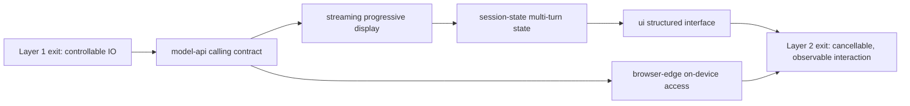

# Layer 2 · Application Integration

> **Layer**: 2 · Application Integration ｜ **Previous layer exit**: can write and validate input/output schemas ｜ **This layer exit**: can run a cancellable, observable end-to-end interaction
> **Prerequisites**: [Structured Output](../01-contracts/structured-output), [Tool Calling Contract](../01-contracts/tool-calling) ｜ **Next**: [Embeddings and Retrieval](../03-grounding/embeddings-retrieval), [Observability](../05-operations/observability)

## 1. Overview

Layer 2 addresses one specific symptom: **the answers are already stable, but they are not in the product yet**. Layer 1 gave you control over model input and output; this layer wires that capability into a real user-facing interface — how to call the API, how output arrives progressively, where multi-turn state lives, and what happens when things fail.

The gap between capability and product consists of four things:

- **API adaptation**: converge vendor-specific interfaces into one stable calling contract (messages, sampling, usage, errors).
- **Streaming**: turn "wait for the whole answer" into "watch it appear", reducing perceived latency from total duration to time-to-first-token.
- **Session**: the model API is stateless; you store, trim, and restore multi-turn history yourself.
- **Error handling**: rate limits, timeouts, and interruptions are routine in production; retry semantics must be defined at this layer.



### When to enter this layer / when not to

- **Enter**: the endpoint works, output is controllable, and you are building a user-facing feature.
- **Do not enter**: answers are still unstable or unparseable — go back to [Layer 1 interaction contracts](../01-contracts/structured-output); answers lack private facts — go to [Layer 3 grounding](../03-grounding/rag); the system must take actions — go to [Layer 4 action](../04-action/tool-execution).

### Symptom → topic navigation

| Symptom | Go to | After reading you can |
| --- | --- | --- |
| First request not sent yet / falls over on 429 | [Model API Contract](model-api) | Write a calling loop with error-family classification and retries |
| Endpoint works, but UI waits for the full answer | [Streaming](streaming) | Consume an SSE stream; cancel and recover from interruption |
| Longer chats cost more / refresh loses history | [Session and State](session-state) | Manage chat history: trimming, persistence, concurrency guards |
| Want components in answers, not just text | [Generative UI](ui) | Render model output through a component whitelist |
| Need lower latency / privacy / offline | [Browser and Edge Inference](browser-edge) | Pick the right on-device runtime and fallback chain |

### Decision table: integration approaches

| Approach | Direction | Control | State | Trust domain | Minimum complexity |
| --- | --- | --- | --- | --- | --- |
| Direct fetch to vendor API | Outbound request/response | All yours | None (rebuild per turn) | Key stays server-side | Single file |
| Official SDK | Outbound request/response | SDK handles retries and types | None | Key stays server-side | +1 dependency |
| Frontend AI framework | Request + stream + UI bundled | Framework takes over | Framework session model | Key stays server-side | Full framework contract |
| On-device inference | In-device execution | Entirely yours | Device-local | Data never leaves device | Model delivery + runtime |

Selection principle: **start at minimum complexity**. Use plain fetch until you need SDK retries and types; adopt a framework only when you need streaming, sessions, and UI at once.

### Historical milestones

Vendor API shapes keep evolving (e.g., OpenAI from Chat Completions to Responses API; Anthropic shrinking sampling parameters across model generations). This layer does not maintain a vendor timeline — field-level truth lives in the vendor docs of the day; assertions recorded here carry a retrievedAt date.

## 2. Usage

The minimal hands-on for this layer is the zero-key fixture in [Model API Contract](model-api): a local mock server plus a client loop with error handling — runnable in a clean environment within 15 minutes.

```bash
# Save the full fixture from the model-api page as model-api-mock.mts, then:
node model-api-mock.mts
```

Acceptance: all three output sections appear — a normal call returning content and usage, a 429 triggering one backoff retry then succeeding, and a 400 failing fast without retry. Once it runs, you have personally implemented one "observable" call (you saw usage) and error-family classification (you saw the retryable flag).

Every topic in this layer follows the same constraints for its Usage section: zero API keys, single self-contained file, deterministic output, and paired normal/negative paths.

## 3. Principles

On the capability transformation chain, this layer upgrades "one controllable transformation" into "one product interaction chain":

```text
user action → request assembly (Layer 1 schema + Layer 2 session state)
           → API call (model-api: error families, retries, usage)
           → streaming display (streaming: SSE, accumulation, cancellation)
           → structured rendering (ui: whitelist components)
           → state write-back (session-state: trimming, persistence, versioning)
```

- **Invariant 1**: the model API is stateless. Every request resends all needed history; "conversation memory" is a construct of this layer.
- **Invariant 2**: model output is untrusted input. It must pass schema and whitelist checks before rendering (the Layer 1 exit applied here directly).
- **Invariant 3**: the interaction must be cancellable and observable. Cancellation relies on AbortController propagating to the server stopping generation; observability relies on usage and traces reaching your cost dashboard.

**Exit criteria**: you can run one cancellable, observable end-to-end interaction — the user sends a request, sees progressive output, can stop mid-flight, ends in a consistent state, and the run can be reconciled afterwards.

Topic-level principles: [model-api](model-api), [streaming](streaming), [session-state](session-state), [ui](ui), [browser-edge](browser-edge).

## 4. Development

Before entering the layer, locate the right page with three diagnostics.

### Symptom → Evidence → Action → Done when
**Symptom**: demo works fine, production fails intermittently.
**Evidence**: HTTP status distribution of failed samples; 429/5xx share.
**Action**: add error-family classification and backoff per [model-api](model-api); for quota errors fix the quota first instead of retrying.
**Done when**: under the same traffic, client logs show retries converging and no unclassified errors.

### Symptom → Evidence → Action → Done when
**Symptom**: users report "a long wait, then everything appears at once".
**Evidence**: the browser network panel shows the response arriving as one block.
**Action**: open the streaming path per [streaming](streaming) (server chunks, no proxy buffering, client renders per event).
**Done when**: `curl -N` shows chunks arriving progressively; TTFT drops under a second.

### Symptom → Evidence → Action → Done when
**Symptom**: latency and cost grow with turn count; refresh loses history.
**Evidence**: request logs show resent messages length growing per turn; the store lives in process memory.
**Action**: add a token-budget trim and persistence per [session-state](session-state).
**Done when**: resent payload is capped; sessions survive a restart.

## 5. Resource Library

### Four-level reading route

- **Beginner**: [Model API Contract](model-api) (get one call working) → [Streaming](streaming) (let the tokens appear).
- **Builder**: [Session and State](session-state) → [Generative UI](ui).
- **Operator**: the runbooks in each topic's Development section → [Observability](../05-operations/observability).
- **Researcher**: [Browser and Edge Inference](browser-edge) → the Layer 3 retrieval chain ([RAG](../03-grounding/rag)).

### Active falsification and open questions

- The claim "perceived latency is dominated by TTFT" reflects general streaming engineering experience; thresholds for your product need their own measurement.
- Vendor field names and error codes change over time; this layer's tables keep only verified versions — the vendor docs of the day win.

### Where learn-ai stops / where to go next

This layer answers "how to connect", not "where answers get their grounding" (→ [Layer 3](../03-grounding/embeddings-retrieval)), "how to execute actions" (→ [Layer 4](../04-action/tool-execution)), or "what proves it is production-ready" (→ [Layer 5](../05-operations/testing)).
