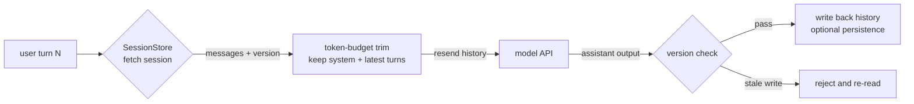

# Session and State

> **Layer**: 2 · Application Integration ｜ **Previous layer exit**: can write and validate input/output schemas ｜ **This layer exit**: can build sessions for multi-turn conversation — budget-trimmed history, persistent recovery, and concurrency guards
> **Prerequisites**: [Streaming](streaming), [Context Engineering](../01-contracts/context) ｜ **Next**: [Generative UI](ui), [Tool Execution Engineering](../04-action/tool-execution)

## 1. Overview

Session and state solves this problem: **the model API has no memory, but the product needs multi-turn conversation**. Every request resends history (the key corollary in [Model API Contract](model-api)), which drops three engineering problems in your lap: where history **lives** (memory/Redis/database), how much you send (**trimming within a token budget**), and how you **recover** after failures (restoration and concurrency guards).



### When to use / when not to

- **Use**: any multi-turn interaction (chat, iterative editing, tool tasks with context).
- **Do not use**: single stateless calls (classification, extraction, one-shot Q&A) — just build the messages array; cross-session long-term memory and knowledge consolidation — that is a retrieval problem, go to [Layer 3](../03-grounding/embeddings-retrieval).

### Decision table: where session state lives

| Option | Direction | Control | State | Trust domain | Minimum complexity |
| --- | --- | --- | --- | --- | --- |
| Process memory (Map) | in-process read/write | fully yours | lost on restart | single-instance boundary | lowest: one Map |
| Redis (TTL) | shared external store | you own schema and expiry | cross-instance, expirable | adds an ops component | +1 infrastructure piece |
| Database (rows) | persistent external store | you own migrations and indexes | permanent, auditable | adds schema governance | +1 schema to govern |

**Start in memory**: run the semantics (trim, version, restore) with a Map in one instance; move to Redis/DB only when you need multiple instances or restart survival — the interface stays, only the store implementation swaps.

### Historical milestones

Vendors have been adding server-side session conveniences (e.g., OpenAI Responses' `previous_response_id` server-side conversation state, retrievedAt 2026-09-01), but **ownership of session state still sits in this layer** — vendor conveniences are not portable; when migrating across vendors you still manage history yourself.

## 2. Usage

### Minimal hands-on: zero-key session store (≤15 minutes)

An in-memory session store + token-budget trim + snapshot restore + optimistic lock, all four verified in one file. Environment: Node ≥ 23.6 (add `--experimental-strip-types` on 22.6–23.5). Save as `session-mock.mts`:

```ts
// fixture: zero-dependency verification of session-state core logic. Deterministic output.
interface ChatMessage { role: 'system' | 'user' | 'assistant'; content: string }
interface Session {
  id: string;
  version: number;          // optimistic lock: +1 per write
  messages: ChatMessage[];
}

const TOKENS_PER_CHAR = 0.25;   // heuristic: ~4 chars ≈ 1 token (English approximation)
const estimateTokens = (text: string): number => Math.ceil(text.length * TOKENS_PER_CHAR);
const estimateHistory = (messages: ChatMessage[]): number =>
  messages.reduce((sum, m) => sum + estimateTokens(m.content), 0);

// Trim within a token budget: always keep system + the latest turns, drop oldest non-system first
function trimToBudget(messages: ChatMessage[], budgetTokens: number): ChatMessage[] {
  const system = messages.filter((m) => m.role === 'system');
  const conversation = messages.filter((m) => m.role !== 'system');
  const kept: ChatMessage[] = [];
  for (let i = conversation.length - 1; i >= 0; i--) {   // collect from newest backwards
    const candidate = [...system, ...kept, conversation[i]];
    if (estimateHistory(candidate) > budgetTokens && kept.length > 0) break;
    kept.unshift(conversation[i]);
  }
  return [...system, ...kept];
}

// ---- in-memory store + serializable snapshot (simulating persistence) ----
class SessionStore {
  private sessions = new Map<string, Session>();
  create(id: string, system: string): Session {
    const s: Session = { id, version: 0, messages: [{ role: 'system', content: system }] };
    this.sessions.set(id, s);
    return s;
  }
  get(id: string): Session | undefined { return this.sessions.get(id); }
  append(id: string, message: ChatMessage, expectedVersion: number): { ok: boolean; version: number } {
    const s = this.sessions.get(id);
    if (!s) return { ok: false, version: -1 };
    if (s.version !== expectedVersion) return { ok: false, version: s.version };  // race: version mismatch
    s.version += 1;
    s.messages.push(message);
    return { ok: true, version: s.version };
  }
  snapshot(id: string): string { return JSON.stringify(this.sessions.get(id)); }
  restore(id: string, snapshot: string): void {
    this.sessions.set(id, JSON.parse(snapshot) as Session);
  }
}

// ---- demo ----
const store = new SessionStore();
store.create('s1', '你是简洁的助手');
store.append('s1', { role: 'user', content: '第一轮：介绍流式传输' }, 0);
store.append('s1', { role: 'assistant', content: '流式传输让输出逐步到达。' }, 1);
store.append('s1', { role: 'user', content: '第二轮：它和 SSE 什么关系？' }, 2);
const history = store.get('s1')!.messages;

console.log('--- trim: the budget decides how much history is resent ---');
console.log('full history tokens:', estimateHistory(history), '| messages:', history.length);
const loose = trimToBudget(history, 40);
const tight = trimToBudget(history, 8);
console.log('budget=40 ->', loose.length, 'msgs |', loose.map((m) => m.role).join(' -> '));
console.log('budget=8 ->', tight.length, 'msgs |', tight.map((m) => m.role).join(' -> '), '| system kept:', tight[0].role === 'system');

console.log('--- snapshot -> restore (simulated process restart) ---');
const snap = store.snapshot('s1');
const store2 = new SessionStore();
store2.restore('s1', snap);
console.log('restored messages:', store2.get('s1')!.messages.length, '| version:', store2.get('s1')!.version);

console.log('--- concurrent writes to one session: optimistic lock rejects the stale write ---');
const v = store2.get('s1')!.version;
const writeA = store2.append('s1', { role: 'user', content: 'A 的输入' }, v);        // arrives first
const writeB = store2.append('s1', { role: 'user', content: 'B 的输入' }, v);        // arrives second, stale version
console.log('writeA:', writeA, '| writeB:', writeB);
console.log('final history:', store2.get('s1')!.messages.map((m) => m.content).join(' | '));
```

Run and normal output:

```text
$ node session-mock.mts
--- trim: the budget decides how much history is resent ---
full history tokens: 12 | messages: 4
budget=40 -> 4 msgs | system -> user -> assistant -> user
budget=8 -> 2 msgs | system -> user | system kept: true
--- snapshot -> restore (simulated process restart) ---
restored messages: 4 | version: 3
--- concurrent writes to one session: optimistic lock rejects the stale write ---
writeA: { ok: true, version: 4 } | writeB: { ok: false, version: 4 }
final history: 你是简洁的助手 | 第一轮：介绍流式传输 | 流式传输让输出逐步到达。 | 第二轮：它和 SSE 什么关系？ | A 的输入
```

The negative output is the third section: `writeB` is rejected by the optimistic lock (`ok: false`), so the stale write never polluted the history — **B's input is absent from the final history**. Acceptance: all three sections match, in particular system surviving at `budget=8`.

Cleanup: delete the file.

### Scenario matrix

| Scenario | Input | Action | Output | Fits | Does not fit |
| --- | --- | --- | --- | --- | --- |
| Basic: multi-turn chat | session id + new input | fetch history → trim → resend → write back | linear history | every chat product | single-turn tasks |
| Common: restart survival | process restart | end-of-turn snapshot → restore | session resumes | any long-conversation product | throwaway sessions |
| Combined: concurrent editing | two writers on one session | optimistic lock rejects stale writes | linearly consistent history | multi-device sync | very low write frequency with no conflicts |

## 3. Principles

### Stateless API vs stateful session

The invariant: **the vendor API sees only this request's messages; "the session" is a projection built by this layer**. Three design constraints follow:

1. **History is cost**. Every resent token bills; more turns cost more — trimming is not an optimization, it is a requirement.
2. **History is context**. The trim strategy directly changes model behavior (a dropped key turn equals amnesia); it is the same problem as [Context Engineering](../01-contracts/context), instantiated in the session dimension.
3. **History is a trust boundary**. Only **completed** content enters history — a truncated streaming message (see finish semantics in [Streaming](streaming)) must not be persisted.

### The trimming strategy space

| Strategy | Approach | Cost | Fits |
| --- | --- | --- | --- |
| Tail window | keep system + last N turns | loses early context | simple chat |
| Token budget | keep system + newest content within budget (this page's fixture) | same, but cost-capped | production default |
| Summary compression | summarize old turns into one system/assistant message | lossy summary + one extra call | long conversations |
| Retrieval-based | move old content to a vector store, retrieve on demand | a full retrieval pipeline | cross-session knowledge (→ [Layer 3](../03-grounding/rag)) |

Token estimation: a character approximation (e.g., ~4 English chars ≈ 1 token) is fit only for budget sizing; **exact counting uses the vendor endpoint** (e.g., Anthropic's count-tokens endpoint, retrievedAt 2026-09-01) or the SDK's counting utility.

### Expiry and recovery

- **TTL**: give sessions an expiry (native in Redis); expiry demotes the session from "resumable" to "start over".
- **Snapshot points**: take one consistent snapshot per completed turn (assistant message persisted); recovery replays to the last complete turn.
- **Drop partial turns**: a crash mid-stream leaves no complete assistant output — discard that turn and roll back to the previous snapshot instead of persisting half a message.

### Concurrency and races

Concurrent requests on one session cause two kinds of pollution: **interleaved history** (outputs from two paths alternating) and **lost updates** (an old write overwriting a new one). The minimum-complexity guard is an optimistic lock (the fixture's version field): writes must carry the version they read; on mismatch, reject, then the client re-reads and retries or merges. Stronger protection is per-session serialization (a queue/lock) for high-contention cases.

### Spec vs local test

| Claim | Spec/official docs | Local mock test (fixture above) |
| --- | --- | --- |
| The API is stateless; history must be resent | both API references (L0) | the fixture's resend path is built that way |
| 4 chars ≈ 1 token is an approximation | tokenizer common knowledge (for sizing) | verified: the estimate is deterministic for budgeting |
| Trims must keep system and the latest turns | context-engineering practice | verified: system -> user at budget=8 |
| An optimistic lock rejects stale writes | general concurrency-control pattern | verified: writeB `ok: false` |
| Exact counting uses the vendor endpoint | Anthropic count tokens (L0) | not tested (zero-key design), see open questions |

## 4. Development

### Integration and migration

- Keep the store interface narrow (get/append/snapshot/restore); memory → Redis → DB swaps only the implementation.
- Reserve `version` and `created_at`/`updated_at` in the persistence schema; migrations will use them.
- Session data contains user input and is personal data: design cleanup (TTL/account deletion) together with [Security](../05-operations/security) compliance.

### Debug runbooks

### Symptom → Evidence → Action → Done when
**Symptom**: the longer the chat, the more "amnesiac" the answers — or the cost curve spikes.
**Evidence**: request logs show resent messages length and usage.prompt_tokens growing per turn.
**Action**: introduce token-budget trimming; confirm the trim keeps system and the latest turns.
**Done when**: the resent payload has a hard cap; prompt_tokens growth plateaus.

### Symptom → Evidence → Action → Done when
**Symptom**: refresh or restart resets the conversation to zero.
**Evidence**: the store is process memory with no recovery path.
**Action**: persist per-turn snapshots (Redis TTL or DB); hydrate on startup.
**Done when**: after a process restart the session resumes from the last complete turn.

### Symptom → Evidence → Action → Done when
**Symptom**: after simultaneous use on two devices the history interleaves or loses messages.
**Evidence**: user/assistant messages out of order; two write requests overlapping in the timeline.
**Action**: add an optimistic lock (the fixture's version) or per-session serialization; the rejected side re-reads and merges.
**Done when**: after concurrent writes the history stays linearly consistent with no lost updates.

### Symptom → Evidence → Action → Done when
**Symptom**: session storage grows without bound.
**Evidence**: store or table size curves; expired sessions never cleaned.
**Action**: TTL + capacity caps + archival policy.
**Done when**: storage scales with active sessions; stale sessions expire automatically.

### Anti-pattern list

- Depending on a vendor's server-side session convenience as a portable capability.
- Writing truncated streaming output straight back into history (the model continues the half sentence next turn).
- Trimming by "N turns" while ignoring tokens — one Chinese turn can equal ten English ones.
- No version guard on concurrent writes — the multi-device case fails deterministically.
- No cleanup policy for history — storage and privacy debt together.

## 5. Resource Library

### Four-level reading route

- **Beginner** (2): run this page's fixture for trimming and restore; read [Context Engineering](../01-contracts/context) to see the window as a resource.
- **Builder** (2): swap the store for a Redis implementation (TTL); wire the vendor token-counting endpoint for exact budgets.
- **Operator** (2): capacity and expiry governance for session storage; usage reconciliation (history length vs billing).
- **Researcher** (2): summary compression vs retrieval-based memory trade-offs (bridging [RAG](../03-grounding/rag)); boundary reading on vendor server-side session layers.

### Resource table

| Name | Level | Canonical URL | Use | Supported claim | Next |
| --- | --- | --- | --- | --- | --- |
| OpenAI Conversation state guide | L0 | https://developers.openai.com/api/docs/guides/conversation-state | server-side session convenience | previous_response_id semantics | decide whether to depend on it |
| Anthropic Count tokens reference | L0 | https://docs.anthropic.com | exact token counting | endpoint existence and usage | replace the heuristic |
| MDN IndexedDB / Web Storage | L0 | https://developer.mozilla.org/en-US/docs/Web/API/IndexedDB_API | browser-side persistence | local storage boundaries | client hydration |
| This page's fixture | E | session-mock.mts (inline) | zero-key verification | trim/restore/optimistic-lock behavior | swap in persistence |
| Context Engineering (this repo) | E | ../01-contracts/context | window management principles | the context view of trimming | bridge to Layer 1 |

retrievedAt: all web resources 2026-09-01.

### Active falsification and open questions

- The 4-chars-≈-1-token estimate approximates English only; Chinese ratios differ — production should use the vendor counting endpoint (the fixture does not cover real counting calls).
- The cost-effectiveness of summary compression is not verified here; measure it per product.
- Vendor server-side session fields and limits change; consult the official docs of the day before depending on them.

### Where learn-ai stops / where to go next

This page owns in-session state. Cross-session knowledge and private facts → [Layer 3 grounding](../03-grounding/embeddings-retrieval); executing actions and tools within a session → [Layer 4 tool execution](../04-action/tool-execution); agent-scale long-term memory and checkpoints → [Agent State and Memory](../04-action/agent-runtime/state-memory).
