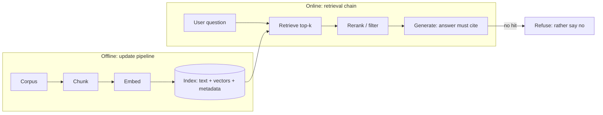

# Layer 3 · Knowledge Grounding

> **Layer**: 3 · Knowledge Grounding | **Previous layer exit**: run a cancellable, observable end-to-end interaction | **This layer exit**: build a traceable retrieval chain and an update pipeline
> **Prerequisites**: [Streaming](../02-integration/streaming) | **Next**: [Embeddings and Retrieval](embeddings-retrieval), [Tool Execution Engineering](../04-action/tool-execution)

## 1. Overview

Layer 3 addresses one specific symptom: **answers lack private or fresh facts**. A model's parametric memory is frozen the moment training ends—it does not know your tickets, your code, or the document you changed last week. This layer ties answers to external evidence: retrieve first, generate second, attach provenance to every answer, and rebuild when the data changes.

The original RAG paper (Lewis et al., NeurIPS 2020) named this structure "parametric memory + non-parametric memory": the parametric memory is a pre-trained generator, the non-parametric memory is an external vector index accessed by a retriever. The paper also states that for pure parametric models, "providing provenance for their decisions" and "updating their world knowledge" remain open problems—exactly the two things this layer delivers (a traceable retrieval chain, a re-runnable update pipeline).

This layer also differs fundamentally from Layer 4: **reading the world vs. writing the world**. Everything here is a read—chunking, indexing, retrieving, citing—with no side effects by default; the failure mode is "wrong answer" or "should have refused but didn't", never destruction. Layer 4 starts writing to the world (executing actions, crossing boundaries). Hence the different acceptance criteria: this layer audits **citation correctness and refusal correctness**; Layer 4 audits **restricted permissions and recoverability**.



### When to enter this layer / when not to

- **Enter**: answers need private corpora (product docs, tickets, code), need citations, or the knowledge updates frequently.
- **Do not enter**: answers are unstable or unparseable—go back to [Layer 1 interaction contracts](../01-contracts/structured-output); not yet wired into a product interaction—start [Layer 2 application integration](../02-integration/model-api); you need the system to take actions—go to [Layer 4 action and collaboration](../04-action/tool-execution).

### Symptom → topic navigation

| Symptom | Go to | After reading you can |
| --- | --- | --- |
| Want search by meaning; keywords miss | [Embeddings and Retrieval](embeddings-retrieval) | Build a vector retrieval entry with metadata filtering and a no-hit path |
| Building "answer from our docs" features | [RAG: Retrieval-Augmented Generation](rag) | Run the full ingest→chunk→embed→retrieve→generate chain with citations and refusals |
| Baseline RAG recall not enough / error codes not found | [Advanced Retrieval](advanced-retrieval) | Raise recall with hybrid search, query rewriting, reranking; pin permissions at the retrieval layer |

### Decision table: knowledge injection options

| Option | Direction | Control | State | Trust domain | Minimum complexity |
| --- | --- | --- | --- | --- | --- |
| Long-context stuffing | Corpus → prompt (bulk move) | Prompt-layer concat, no retrieval control | Full text resent per request | Entire corpus enters model context | Lowest (small single-batch corpus) |
| RAG (this layer) | Query → retrieve → context (selective move) | Index, chunking, filtering all yours | Index is derived, rebuildable | Only hit fragments reach the model | Medium (embedding + index + pipeline) |
| Fine-tuning | Corpus → parameters (rewrite the model) | Training recipe and data mix | Baked into weights; update = retrain | Corpus enters the training pipeline | Highest (see Learn LLM bridge) |

Selection principle: **start at the lowest complexity**. If a batch of corpus fits in the context (Anthropic's reference line is about 200,000 tokens, with prompt caching), stuff it first; move to RAG when the corpus is large, updates often, or citations matter; consider fine-tuning only to change behavior style, not facts.

### Historical milestones

- 2016: HNSW approximate nearest-neighbor index published (Malkov & Yashunin, arXiv:1603.09320); became the mainstream index foundation of vector databases (retrievedAt 2026-09-01).
- 2020: RAG paper published (Lewis et al., NeurIPS 2020, arXiv:2005.11401), establishing the "parametric + non-parametric memory" framing (retrievedAt 2026-09-01).
- Anthropic Contextual Retrieval (contextualized chunks + BM25 + reranking): experiment data in [Advanced Retrieval](advanced-retrieval); blog publish date outside this verification pass—marked unverified.

## 2. Usage

This layer's minimal hands-on is the zero-key example in [Embeddings and Retrieval](embeddings-retrieval): a pure-TypeScript deterministic vector retriever that runs in a clean environment within 15 minutes.

```bash
# Save the full example from the embeddings-retrieval page as embeddings-retrieval.ts, then:
node embeddings-retrieval.ts
```

Acceptance: three output groups present—a lexically overlapping query hits the right document with its source; a paraphrased query (zero lexical overlap) correctly takes the no-hit path; an off-corpus question correctly refuses. Once it runs you have seen this layer's two core behaviors: **a score is not truth** (high similarity only means "similar"), and **no-hit is a path, not an exception**.

Every topic's Usage section follows the same constraints: zero API keys, single self-contained file, deterministic output, positive and negative paths in pairs.

## 3. Principles

On the capability chain, this layer upgrades Layer 2's "one interaction" into "one grounded interaction":

```text
Offline: corpus → chunk → embed → index (text + vectors + metadata + content fingerprint)
Online:  question → retrieve top-k → filter (permissions/tenant) → rerank → generate (with citations)
Update:  document change → fingerprint compare → incrementally rebuild entries → delete stale ones
```

- **Invariant 1: cite, or say there is nothing**. Every answer must trace back to a source document; if retrieval finds nothing, refuse—never let the model fill the gap from parametric memory.
- **Invariant 2: permission filtering happens at retrieval time**. Documents a user cannot see must not be retrievable by them; filtering happens during recall, not by hiding after generation.
- **Invariant 3: the index is a derived artifact**. It is determined by "corpus + chunking strategy + embedding model version"; any change requires a rebuild; the index can always be re-derived from the corpus.

**Exit criteria**: build a traceable retrieval chain and an update pipeline—any answer traces back to its source document and chunk; questions that should be refused are refused; after corpus updates, a re-runnable rebuild pipeline exists.

Per-topic details: [embeddings-retrieval](embeddings-retrieval), [rag](rag), [advanced-retrieval](advanced-retrieval).

## 4. Development

Before entering the layer, use three diagnostics to locate the right page.

### Symptom → Evidence → Action → Done when
**Symptom**: the model fabricates private facts, confidently.
**Evidence**: ask the same question to the bare model and to the retrieval-backed product; check retrieval logs for hits.
**Action**: confirm the question actually goes through the retrieval chain; add no-hit refusal and citation constraints per [rag](rag).
**Done when**: every "should refuse" item in the golden set is refused; every "should hit" answer carries a correct citation.

### Symptom → Evidence → Action → Done when
**Symptom**: the answer cites a passage that does not match what it says.
**Evidence**: replay sampled answers against the text their chunk ids point to; check whether chunk boundaries cut semantics apart.
**Action**: re-chunk per [embeddings-retrieval](embeddings-retrieval) (structure-first boundaries, with overlap); rebuild the index with stable ids.
**Done when**: 20 sampled answers all cite passages that support them.

### Symptom → Evidence → Action → Done when
**Symptom**: the document changed; the answer still gives the old version.
**Evidence**: compare index entry timestamps/content fingerprints against the current document version.
**Action**: fix the indexing pipeline per [rag](rag) (content fingerprint + incremental rebuild + stale-entry deletion).
**Done when**: after the rebuild triggered by the document update, the same question's answer points to the new version.

## 5. Resource Library

### Four-level reading route

- **Beginner**: [Embeddings and Retrieval](embeddings-retrieval) (run one vector search first).
- **Builder**: [RAG: Retrieval-Augmented Generation](rag) (wire retrieval into the generation loop).
- **Operator**: runbooks in each topic's Development section → [Evaluation (bridge)](../05-operations/evaluation) (turn citation correctness into a release gate).
- **Researcher**: [Advanced Retrieval](advanced-retrieval) → Learn LLM's RAG chapters (mechanisms and math, not duplicated here).

### Active falsification and open questions

- "About 200,000 tokens fits by stuffing" comes from the Anthropic Contextual Retrieval post (retrievedAt 2026-09-01); actual windows and cache prices change—recheck the official docs on the day you use them.
- The hybrid-search and reranking gains are Anthropic's experimental results on their corpus and configuration; run your own golden-set comparison before porting the numbers.

### Where learn-ai stops / where to go next

This layer answers "how to ground results". It does not answer "embedding training objectives and vector geometry" (→ [Learn LLM](https://llm.zenheart.site/chapters/11-rag)), "evaluation methodology and benchmarks" (→ [evals](https://evals.zenheart.site/)), or "executing actions and permissions" (→ [Layer 4 action and collaboration](../04-action/tool-execution)).
