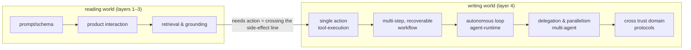

> **Where you are**: Layer 4 · Action and Collaboration ｜ **Exit of the layer above**: you can build a traceable retrieval chain ｜ **Exit of this page**: you can restrict permissions, pause/resume tasks, and pick the minimum-complexity option for any collaboration need
> **Prerequisites**: [RAG: Retrieval-Augmented Generation](../03-grounding/rag) ｜ **Next**: [Tool Execution Engineering](tool-execution) (this layer's entry); leaving the layer for [Observability](../05-operations/observability) and [Security](../05-operations/security)

## 1. Overview

**BLUF**: through layer 3, the worst failure is "a wrong answer" — the system only **reads** the world. From layer 4 the system starts to **write** it: calling tools, executing flows, delegating tasks — and the worst failure becomes "doing a wrong thing": the email is sent, the data deleted, the order shipped. Hence this layer's single governing rule: **writing the world has side effects by default, and permissions, idempotency, cancellation, retry, human approval, and rollback must be handled explicitly**. Layer 3's evidence chains answer "is the result grounded"; this layer's engineering answers "is the action under control".

### Symptom entry

From the decision tree of the [tech map](../index.md), two symptoms land here:

- **The system must call other systems or perform actions** (query an order, write a database, send a notification) → this layer's main body (tools/workflows/agents).
- **Collaboration must cross host / organization / agent boundaries** → this layer's protocol branch (pick by connection direction, see the [Protocol Map](protocols/)).

### Mental model: reading vs writing the world

The side-effect line is this layer's entrance: before crossing it, errors can be fixed by rerunning; after crossing it, **every execution must first answer six questions** — is there permission, is there idempotency, can it be canceled, can it be retried, does a human need to approve, and how is it rolled back when wrong.

### The action decision ladder

Restated from rungs 3–6 of the [complexity ladder](../00-orientation/complexity-ladder); use it inside this layer to pick the minimum complexity:

| Need shape | Where to go | Upgrade trigger |
| --- | --- | --- |
| One action (call and return) | [Tool Execution Engineering](tool-execution) | Multi-step, recoverable, needs approval |
| Multi-step and recoverable (steps statically enumerable) | [Workflow Patterns](workflow) | Steps unpredictable; needs an autonomous loop |
| Autonomous loop (model decides each step) | [Agent Runtime](agent-runtime/) | Cross trust domain, async, capability discovery |
| Cross-trust-domain collaboration | [Protocol Map](protocols/) (MCP/A2A/ACP/AG-UI) | — (top of this layer) |

| Option | Direction | Control | State | Trust domain | Minimum complexity |
| --- | --- | --- | --- | --- | --- |
| Single tool call | Write (once) | Five gates | Single call record | In-process | Single-step action |
| Workflow | Write (multiple) | You orchestrate steps | Multi-step + checkpoints | In-process | Enumerable multi-step |
| Agent loop | Read-write loop | Model + stopping conditions | Session/memory/checkpoints | Within host | Unpredictable steps |
| Multi-agent | Read-write loop × N | Supervisor delegation | Per-agent contexts + synthesis | Within host | Parallel gains > coordination cost |
| Boundary protocol | Read-write across boundaries | Protocol negotiation | Tasks/messages/artifacts | Cross trust domain | A second trust domain appears |

### Layer navigation

| Topic | Question it answers | Exit capability |
| --- | --- | --- |
| [Tool Execution Engineering](tool-execution) | How is one model-initiated action executed under control | An executor that can deny, time out, cancel, and deduplicate |
| [Workflow Patterns](workflow) | How multi-step flows checkpoint and recover | Replay from persisted state after failure; human approval before the irreversible |
| [Agent Runtime](agent-runtime/) (subtree) | How an autonomous loop is built and constrained | The model + context + tools + state + loop + environment runtime; incl. [design patterns](agent-runtime/design-patterns), [state and memory](agent-runtime/state-memory), [recovery and human-in-the-loop](agent-runtime/recovery-hitl), [computer use](agent-runtime/computer-use) |
| [Multi-Agent Systems](multi-agent) | When and how to delegate to several agents | Supervisor delegation contract + routing degradation + failure localization |
| [Agent Skills](skills) | How capabilities are described and delivered as files | Versionable, reusable skill assets |
| [Protocol Map](protocols/) (subtree) | How to collaborate across processes/orgs/trust domains | Pick a protocol by connection direction: MCP / A2A / ACP / AG-UI etc. |

### When to enter / when not to

- Enter: the requirement mentions "perform an action", "multi-step flow", "delegate", or "cross-boundary collaboration" in any combination.
- Do not enter: still solving "answers are unstable" or "ungrounded" — go back to layer 1 (contracts) or layer 3 (grounding); bringing immature problems into the write world only amplifies errors.

History milestones: this layer's structure was frozen with the Issue #116 pyramid restructure in 2026-09; content from the old agent/patterns/skills directories was split and merged into the chapters above. Earlier timelines unverified; not fabricated.

## 2. Usage

This page is a navigation and decision page with no runnable artifact; "usage" = a decision drill (paper works, ≤15 minutes). Acceptance: all four scenarios pick the minimum-complexity destination and can say "why not higher".

### Drill: four scenarios

**Scenario A**: after a button click, write form data into the internal ticketing system.
- Expected: [Tool Execution Engineering](tool-execution). One controlled action: allowlist + argument validation + idempotency key.
- Counter-check: the model need not decide a multi-step chain; if "check quota then write then notify" becomes a fixed chain, upgrade to a workflow.

**Scenario B**: every day, run 300 new articles through "extract → validate → load → summarize".
- Expected: [Workflow Patterns](workflow). Steps are statically enumerable; failures resume from checkpoints instead of rerunning the batch.
- Counter-check: if "validate" must dynamically decide what to query based on content, that one step is an agent node — not the whole chain becoming an agent.

**Scenario C**: let the system investigate a live alert on its own — read logs, form hypotheses, verify, write a report — and judge when to stop.
- Expected: [Agent Runtime](agent-runtime/). Prerequisite: you can write **explicit stopping conditions** (time cap, iteration cap) and **permission boundaries** (read-only sandbox).
- Counter-check: if the investigation is actually a fixed routine, that is a workflow wearing an agent costume.

**Scenario D**: two companies' systems must delegate tasks to each other and deliver results asynchronously.
- Expected: [Protocol Map](protocols/). Cross trust domain + async + capability discovery — three hits for the protocol branch.
- Counter-check: a "multi-agent" setup inside one company's process needs no protocol at all — function calls suffice.

### Usage boundaries

- This layer decides the **collaboration shape**; each shape's implementation lives in its own chapter and is not repeated here.
- The six questions (permissions/idempotency/cancel/retry/approval/rollback) are a cross-cutting checklist: whichever topic a design lands on, a review must answer all six.

## 3. Principles

### The six questions of the write world: this layer's cross-cutting invariants

| Question | One-line test | Primary owning chapter |
| --- | --- | --- |
| Permissions | Who may do this action, and in what scope? Deny by default | [Tool Execution Engineering](tool-execution), [Security](../05-operations/security) |
| Idempotency | Does repeating the same intent produce the side effect only once? | [Tool Execution Engineering](tool-execution) |
| Cancellation | When the caller gives up, does execution stop and clean up? | [Tool Execution Engineering](tool-execution), [AG-UI](protocols/ag-ui) |
| Retry | Which errors are retryable, protected by what key? | [Tool Execution Engineering](tool-execution), [Workflow Patterns](workflow) |
| Human approval | Who signs off before the irreversible? Is the pause point persisted? | [Workflow Patterns](workflow), [Recovery and HITL](agent-runtime/recovery-hitl) |
| Rollback | How is a mistake undone? Is compensation registered? | [Workflow Patterns](workflow) (saga) |

The six are orthogonal: a system can do permissions well but lack rollback, or idempotency well but fail cancellation. Score them one by one in review; the weakest answer sets the risk.

### Why "minimum complexity" matters most in this layer

Read-world complexity is **additive** (each retrieval layer adds latency); write-world complexity is **multiplicative** — each extra level of autonomy adds a way to "keep executing from a wrong state", and each extra collaborator adds an error-propagation path. That is why the [complexity ladder](../00-orientation/complexity-ladder) insists on "evidence pushes you up" above rung 3: climbing without hitting an upgrade trigger prepays **side-effect risk**, not just performance.

### Spec requirements vs local test

This page is a navigation layer with no spec to test locally; the six questions and each topic's spec-vs-test tables live in their chapters. Spec snapshots for the protocol subtree (MCP / A2A / ACP / AG-UI) are registered in the [Protocol Map](protocols/).

## 4. Development

This page has no code integration; "development" = using the six questions and the decision ladder as design-review gates.

### Symptom → Evidence → Fix → Done

**Symptom**: the agent can already call tools, and the team believes "there is nothing to do on the execution side".
**Evidence**: tool functions are wired straight to model output — no allowlist, no idempotency key, timeouts by luck; one retry produces a double write.
**Fix**: upgrade the bare calls to a [controlled executor](tool-execution): fill in the five gates, starting with idempotency and the allowlist (anti double-write, anti hallucinated tools).
**Done**: all four states (normal/timeout/cancel/denied) have test assertions; replaying the same call produces no second side effect.

### Symptom → Evidence → Fix → Done

**Symptom**: the team argues "workflow or agent" with no resolution.
**Evidence**: neither side can draw the full flowchart nor write the agent's stopping conditions — both admission materials are missing.
**Fix**: write the stopping conditions and permission boundaries first; if you can write them, it is an agent; if you can draw the graph, it is a workflow; if neither exists, start as a workflow and collect "enumeration failure" cases.
**Done**: the design document picks one, with the corresponding admission material (full graph or stopping-condition list) attached.

### Symptom → Evidence → Fix → Done

**Symptom**: a review demands A2A/MCP be introduced now "for future multi-company integration".
**Evidence**: all current collaboration is in-process; there is no second trust domain, no async delivery, no capability discovery.
**Fix**: check the protocol branch's three hits (cross trust domain / async / capability discovery) one by one; with none hit, stay on the in-process option.
**Done**: the design document states "when X appears (second trust domain / async tasks / capability discovery), introduce protocol Y".

### Anti-patterns

- **Skipping execution engineering on the way to agents**: leaving the permissions and idempotency homework to "the agent's intelligence" — zero of the six questions answered.
- **Noun-driven architecture**: picking a protocol/framework first and hunting for scenarios (this layer's most common waste).
- **Treating "it runs" as "it's controlled"**: a successful tool call in a demo ≠ existing timeout, cancel, retry, and rollback paths.
- **Protocols inside one domain**: forcing a cross-boundary protocol onto same-process multi-agent buys a stack of version-negotiation problems.

## 5. Resource Library

Four-level reading route:

- **Beginner**: this page + the [complexity ladder](../00-orientation/complexity-ladder); recite the six questions and the action decision ladder.
- **Builder**: into [Tool Execution Engineering](tool-execution) (this layer's foundation); run the controlled-executor fixture.
- **Operator**: recovery semantics in [Workflow Patterns](workflow) + [Recovery and HITL](agent-runtime/recovery-hitl); then layer-5 [Observability](../05-operations/observability) and [Security](../05-operations/security).
- **Researcher**: the connection-direction taxonomy of the [Protocol Map](protocols/) and the specs themselves; Anthropic's multi-agent retrospective.

### Resource table

| Name | Evidence tier | canonical URL | Use | Supported claim | Next |
| --- | --- | --- | --- | --- | --- |
| Building Effective Agents (Anthropic) | L1 (maintainer) | https://www.anthropic.com/engineering/building-effective-agents | Workflow/agent boundary and five patterns | "Workflows orchestrate via predefined code paths; agents direct themselves" (retrievedAt 2026-09-01) | [Workflow Patterns](workflow) |
| How we built our multi-agent research system | L1 (maintainer) | https://www.anthropic.com/engineering/built-multi-agent-research-system | Production fault-tolerance posture for acting systems | "Retry + checkpoints + resume from where the error occurred" (retrievedAt 2026-09-01) | [Multi-Agent Systems](multi-agent) |
| Temporal Workflows (official docs) | L1 (maintainer) | https://docs.temporal.io/workflows | Industry reference for recovery semantics | Event History / replay / determinism constraints (retrievedAt 2026-09-01) | [Workflow Patterns](workflow) |
| MCP specification | L0 (official spec) | https://modelcontextprotocol.io/specification/latest | Protocol-branch candidate | Cross-process tool/context integration (retrievedAt 2026-09-01; snapshot in bridge-register) | [Protocol Map](protocols/) |
| A2A specification | L0 (official spec) | https://a2a-protocol.org/v1.0.0/specification/ | Cross-trust-domain candidate | Agent-to-agent tasks/messages/artifacts (retrievedAt 2026-09-01; snapshot in bridge-register) | [A2A](protocols/a2a) |

### Active falsification and open questions

- Falsification entry: if a class of write-world systems runs safely for years without answering some of the six questions — describe its shape and runtime, and the necessity claim needs narrowing.
- Open: the `agent-runtime`, `skills`, and `protocols` subtrees are owned by the remaining layer-4 chapters (Issue #116 Wave 2 split); this page's navigation table follows the topicIds frozen in slug-map and will be re-checked once the subtrees land.

### Where learn-ai stops / where to go next

- Implementations of each shape: the chapters in this layer (see the navigation table).
- Why models can be steered by tool descriptions: [Learn LLM](https://llm.zenheart.site/).
- Evaluation methods proving action quality and risk: [evals](https://evals.zenheart.site/).
- Leaving the layer: [Layer 5 · Operations](../05-operations/) — proving with replayable evidence that it can go live.
