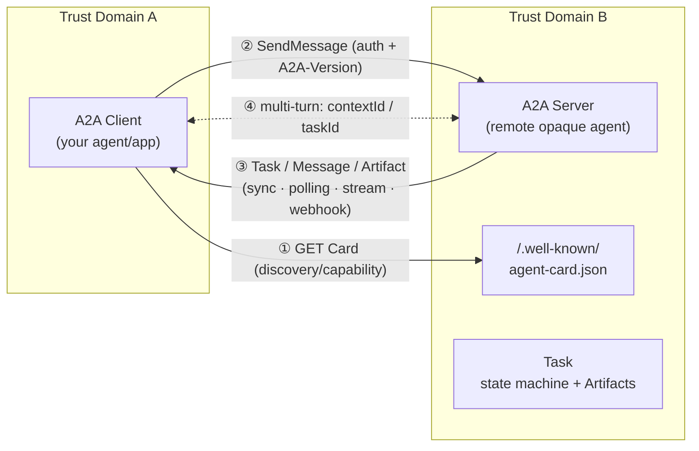

> **Layer**: 4 · Action and Collaboration ｜ **Previous layer exit**: build a traceable retrieval chain with an update path ｜ **This layer exit**: delegate tasks to an opaque agent across trust domains, and recover from dropped streams, missing input, and version mismatches
> **Prerequisites**: [Protocol Map](./index) ｜ [Multi-Agent Systems](../multi-agent) ｜ **Next**: [ACP: Agent Client Protocol](acp-agent-client) ｜ [A2UI and MCP Apps](a2ui-mcp-apps)

## 1. Overview

**BLUF**: The A2A (Agent2Agent Protocol) solves exactly one kind of collaboration — "my agent needs to delegate work to a remote agent whose internals I cannot see." It uses a self-describing manifest (Agent Card) for discovery, a Message to start the conversation, a Task to carry stateful async work, and an Artifact to deliver results. If the collaborator is a function in your own process, a trusted tool source, or a same-domain subagent, do not use A2A — that is function-call, MCP, or workflow territory.

### Mental model: a conversation across a trust boundary



The four core objects:

| Object | Who creates it | Lifecycle | One-liner |
| --- | --- | --- | --- |
| AgentCard / AgentSkill | Server | Changes with `version`; cacheable (ETag) | Describes "who I am, what I can do, how to connect, how to authenticate" — a **description, not an SLA** |
| Message | Sender (`messageId` from creator) | Immediate | Unit of communication: start, clarify, update; **never carries results** |
| Task | Server (`taskId` is server-generated) | State machine, below | A stateful unit of async work |
| Artifact | Server (`artifactId` unique per task) | Attached to Task | The deliverable; results belong here |

The nine normative Task states (wire values are SCREAMING_SNAKE_CASE):

| State | Class | Meaning |
| --- | --- | --- |
| `TASK_STATE_UNSPECIFIED` | indeterminate | Unknown/indeterminate |
| `TASK_STATE_SUBMITTED` | active | Accepted and acknowledged |
| `TASK_STATE_WORKING` | active | Being processed |
| `TASK_STATE_COMPLETED` | terminal | Finished successfully |
| `TASK_STATE_FAILED` | terminal | Finished with error |
| `TASK_STATE_CANCELED` | terminal | Canceled before completion |
| `TASK_STATE_REJECTED` | terminal | Agent declined the task |
| `TASK_STATE_INPUT_REQUIRED` | interrupted | Needs more user input |
| `TASK_STATE_AUTH_REQUIRED` | interrupted | Needs authorization (delegable up the agent chain) |

The spec defines the state set, the terminal set, and constraints such as "streams must close on terminal states"; it does **not** publish a complete transition diagram. Transitions beyond SUBMITTED→WORKING are implementation-defined — never treat any SDK's state machine as *the* normative one.

### When to use / when not to

- Use: cross-framework/cross-vendor interoperability; collaboration with remote, external, internals-hidden agents; long-running async tasks (minutes and beyond); enterprise scenarios needing discovery and multiple bindings (JSON-RPC / gRPC / REST).
- Do not (non-goals): model internals (→ Learn LLM); shared-memory collaboration — A2A explicitly does **not** expose the peer's internal state, memory, or tools; general tool invocation (→ [MCP](./mcp)); user-interface flows (→ [AG-UI](ag-ui)); being an agent framework.

### Decision table: A2A vs neighbors

| Dimension | Function / HTTP call | MCP | Workflow / same-domain subagent | **A2A** |
| --- | --- | --- | --- | --- |
| Direction | request → response | host → tools | orchestrator → subtasks | client agent → remote opaque agent (peers) |
| Control | caller owns everything | host decides tool exposure | orchestrator owns everything | each side owns its own; interact only via protocol |
| State | none / short-lived | server-side session | shared in-process | Task/context **owned by the server**; client holds handles |
| Trust domain | in-process / same service | tool sources the host trusts | same host | **cross-vendor / cross-org / cross trust domain** |
| Minimum complexity | one fetch | tool schema + transport | orchestration DSL | discovery + auth + version negotiation + async task management |

### History milestones

Version sequence published on the spec page: `1.0.0` (latest) ← `0.3.0` ← `0.2.6` ← `0.1.0`; the project was initiated by Google and donated to the Linux Foundation (retrieved 2026-09-01 from the official site and repo llms.txt). Two breaking changes in 1.0 (migration appendix A.2): ① the `kind` discriminator was removed — the JSON member name itself now discriminates Part and stream-event types; ② `extendedAgentCard` moved from the card top level into `capabilities`. Exact release dates per version: unverified.

### DoD self-check for this chapter

- [ ] Run the §2 fixture within 15 minutes (two terminals, zero dependencies)
- [ ] Explain Card → Message → Task → Artifact responsibilities to a colleague
- [ ] Reconcile task state with GetTask after a dropped connection
- [ ] Know what to send when you receive `TASK_STATE_INPUT_REQUIRED`
- [ ] Classify failures into three buckets by error code: auth, version, resource

## 2. Usage

**Minimal hands-on**: two zero-dependency Node scripts act out a complete A2A REST-binding exchange. Requires Node ≥ 18 (built-in `node:http` and global `fetch`), no npm packages, no API keys, localhost only.

**setup**: create an empty directory and save the two files below.

`a2a-server.mjs` (A2A server: serves the Card + three routes + one slow task):

```javascript fixture
// a2a-server.mjs — minimal A2A HTTP+JSON binding server (Node ≥ 18, zero deps)
// Routes: GET /.well-known/agent-card.json
//         POST /message:send        → SendMessage
//         GET  /tasks/:id           → GetTask (polling/reconcile)
import { createServer } from "node:http";
import { randomUUID } from "node:crypto";

const PORT = 3123;
const BASE = `http://127.0.0.1:${PORT}`;
const tasks = new Map(); // taskId -> Task (in-memory, for the demo)

const card = {
  name: "Echo Research Agent",
  description: "Demo opaque agent: echoes research requests and emits a summary artifact.",
  version: "1.2.0",
  supportedInterfaces: [
    { url: `${BASE}/`, protocolBinding: "HTTP+JSON", protocolVersion: "1.0" },
  ],
  capabilities: { streaming: false, pushNotifications: false },
  defaultInputModes: ["text/plain"],
  defaultOutputModes: ["text/plain", "application/json"],
  skills: [
    {
      id: "summarize",
      name: "Summarizer",
      description: "Turns a user request into a structured summary.",
      tags: ["summary", "demo"],
    },
  ],
};

const now = () => new Date().toISOString(); // spec: ISO 8601 UTC (ms + Z)

function makeTask(id, contextId, state, extra = {}) {
  return {
    id,
    contextId,
    status: { state, timestamp: now() },
    artifacts: [],
    ...extra,
  };
}

function problem(res, status, title, detail) {
  // REST error examples use application/problem+json (spec §6.4)
  const body = JSON.stringify({ title, status, detail });
  res.writeHead(status, { "Content-Type": "application/problem+json" });
  res.end(body);
}

function advance(id, state, artifact) {
  const t = tasks.get(id);
  t.status = { state, timestamp: now() };
  if (artifact) t.artifacts.push(artifact);
}

createServer((req, res) => {
  const url = new URL(req.url, BASE);

  // —— version negotiation: A2A-Version header (Major.Minor; empty = 0.3 per spec) ——
  const version = req.headers["a2a-version"] ?? ""; // absent = empty = 0.3
  if (url.pathname !== "/.well-known/agent-card.json" && version !== "1.0") {
    return problem(res, 400, "Protocol Version Not Supported",
      `requested ${version || "0.3(implicit)"}, this agent supports 1.0 only`);
  }

  if (req.method === "GET" && url.pathname === "/.well-known/agent-card.json") {
    res.writeHead(200, { "Content-Type": "application/a2a+json" });
    return res.end(JSON.stringify(card));
  }

  if (req.method === "POST" && url.pathname === "/message:send") {
    let raw = "";
    req.on("data", (c) => (raw += c));
    return req.on("end", () => {
      const { message } = JSON.parse(raw);
      // param validation: messageId / role / parts required (maps to -32602 class)
      if (!message?.messageId || message.role !== "ROLE_USER"
          || !Array.isArray(message.parts) || message.parts.length === 0) {
        return problem(res, 400, "Invalid parameters",
          "message.messageId, role=ROLE_USER, parts[1..] are required");
      }
      const text = message.parts.map((p) => p.text ?? "").join(" ");
      const contextId = message.contextId ?? randomUUID();
      const id = randomUUID();

      // Scenario A: slow task → submitted, completes async (poll GetTask)
      if (text.includes("slow")) {
        tasks.set(id, makeTask(id, contextId, "TASK_STATE_SUBMITTED"));
        setTimeout(() => advance(id, "TASK_STATE_WORKING"), 600);
        setTimeout(() => advance(id, "TASK_STATE_COMPLETED", {
          artifactId: randomUUID(), name: "slow-report",
          parts: [{ text: `slow result for: ${text}` }],
        }), 1400);
        res.writeHead(200, { "Content-Type": "application/a2a+json" });
        return res.end(JSON.stringify({ task: tasks.get(id) }));
      }
      // Scenario B: needs input → INPUT_REQUIRED (multi-turn)
      if (text.startsWith("book")) {
        const t = makeTask(id, contextId, "TASK_STATE_INPUT_REQUIRED");
        t.status.message = {
          messageId: randomUUID(), role: "ROLE_AGENT",
          parts: [{ text: "From where to where? (reply: from A to B)" }],
        };
        tasks.set(id, t);
        res.writeHead(200, { "Content-Type": "application/a2a+json" });
        return res.end(JSON.stringify({ task: t }));
      }
      // Scenario C: follow-up with taskId → completes the interrupted task
      if (message.taskId && tasks.has(message.taskId)) {
        const t = tasks.get(message.taskId);
        advance(t.id, "TASK_STATE_COMPLETED", {
          artifactId: randomUUID(), name: "itinerary",
          parts: [{ text: `booked: ${text}` }],
        });
        res.writeHead(200, { "Content-Type": "application/a2a+json" });
        return res.end(JSON.stringify({ task: t }));
      }
      if (message.taskId) return problem(res, 404, "Task Not Found",
        `task ${message.taskId} does not exist`);

      // Scenario D: fast task → synchronous completed Task + Artifact
      const t = makeTask(id, contextId, "TASK_STATE_WORKING");
      t.artifacts.push({
        artifactId: randomUUID(), name: "summary",
        parts: [{ text: `summary of: ${text}` }],
      });
      t.status = { state: "TASK_STATE_COMPLETED", timestamp: now() };
      tasks.set(id, t);
      res.writeHead(200, { "Content-Type": "application/a2a+json" });
      return res.end(JSON.stringify({ task: t }));
    });
  }

  if (req.method === "GET" && url.pathname.startsWith("/tasks/")) {
    const id = url.pathname.split("/")[2];
    const t = tasks.get(id);
    if (!t) return problem(res, 404, "Task Not Found", `task ${id} unknown`);
    res.writeHead(200, { "Content-Type": "application/a2a+json" });
    return res.end(JSON.stringify(t)); // envelope choice: see §3 "spec vs tested"
  }

  problem(res, 404, "Not Found", url.pathname);
}).listen(PORT, "127.0.0.1", () => console.log(`A2A agent on ${BASE}`));
```

`a2a-client.mjs` (A2A client: read Card → validate capabilities → send → handle four scenarios):

```javascript fixture
// a2a-client.mjs — minimal A2A HTTP+JSON binding client (Node ≥ 18, zero deps)
// Usage: node a2a-client.mjs [fast|slow|input|version-error|notfound]
const BASE = "http://127.0.0.1:3123";
const scenario = process.argv[2] ?? "fast";

// ① discovery: fetch the Agent Card and validate capabilities
const card = await (await fetch(`${BASE}/.well-known/agent-card.json`)).json();
const iface = card.supportedInterfaces?.find(
  (i) => i.protocolBinding === "HTTP+JSON" && i.protocolVersion === "1.0");
if (!iface) throw new Error("no HTTP+JSON 1.0 interface on card");
if (card.capabilities?.streaming) console.log("(fixture does not demo streaming)");
console.log(`[card] ${card.name} v${card.version}, skills:`,
  card.skills.map((s) => s.id).join(", "));

const headers = (ver) => ({
  "Content-Type": "application/a2a+json",
  "A2A-Version": ver, // clients must send it with every request
});

const send = (text, { taskId, version = "1.0" } = {}) =>
  fetch(`${BASE}/message:send`, {
    method: "POST",
    headers: headers(version),
    body: JSON.stringify({
      message: {
        messageId: crypto.randomUUID(),
        ...(taskId ? { taskId } : {}),
        role: "ROLE_USER",
        parts: [{ text }],
      },
    }),
  });

const artifactsOf = (task) => (task.artifacts ?? [])
  .flatMap((a) => a.parts.map((p) => p.text)).join(" | ");

// natural completion instead of process.exit: force-exiting mid keep-alive
// can tear down connections unfinished
const terminal = ["TASK_STATE_COMPLETED", "TASK_STATE_FAILED",
  "TASK_STATE_CANCELED", "TASK_STATE_REJECTED"];

const main = async () => {
// ② negative: version negotiation failure → 400 VersionNotSupportedError
if (scenario === "version-error") {
  const r = await send("hello", { version: "0.5" });
  return console.log(`[version-error] HTTP ${r.status}`, await r.text());
}
// ③ negative: GetTask unknown id → 404 TaskNotFoundError
if (scenario === "notfound") {
  const r = await fetch(`${BASE}/tasks/00000000-0000-0000-0000-000000000000`,
    { headers: headers("1.0") });
  return console.log(`[notfound] HTTP ${r.status}`, await r.text());
}

const first = await send(
  scenario === "slow" ? "slow: compile the quarterly report"
  : scenario === "input" ? "book a flight"
  : "summarize: quarterly report");
const { task } = await first.json();
console.log(`[send] task=${task.id} state=${task.status.state}`);

// ④ interrupted: INPUT_REQUIRED → follow up with taskId to resume
if (task.status.state === "TASK_STATE_INPUT_REQUIRED") {
  const follow = await send("from SF to NYC", { taskId: task.id });
  const { task: t2 } = await follow.json();
  return console.log(`[input] state=${t2.status.state} artifacts=${artifactsOf(t2)}`);
}

// ⑤ slow task: poll GetTask until terminal (same path as post-disconnect reconcile)
if (task.status.state !== "TASK_STATE_COMPLETED") {
  for (let i = 0; i < 10; i++) {
    await new Promise((r) => setTimeout(r, 500));
    const t = await (await fetch(`${BASE}/tasks/${task.id}`,
      { headers: headers("1.0") })).json();
    console.log(`[poll ${i}] state=${t.status.state}`);
    if (terminal.includes(t.status.state)) {
      return console.log(`[done] artifacts=${artifactsOf(t)}`);
    }
  }
  return;
}
console.log(`[done] artifacts=${artifactsOf(task)}`);
};
await main();
```

**Run commands** (two terminals):

```bash fixture
node a2a-server.mjs          # terminal 1
node a2a-client.mjs fast     # terminal 2: fast task, synchronous completion
node a2a-client.mjs slow     # poll GetTask to terminal state
node a2a-client.mjs input    # INPUT_REQUIRED → follow-up resumes
node a2a-client.mjs version-error  # negative: 400 version not supported
node a2a-client.mjs notfound      # negative: 404 task not found
```

**Normal output** (fast):

```text fixture
[card] Echo Research Agent v1.2.0, skills: summarize
[send] task=9f0c… state=TASK_STATE_COMPLETED
[done] artifacts=summary of: summarize: quarterly report
```

**Negative output** (version-error / notfound):

```text fixture
[version-error] HTTP 400 {"title":"Protocol Version Not Supported","status":400,"detail":"requested 0.5, this agent supports 1.0 only"}
[notfound] HTTP 404 {"title":"Task Not Found","status":404,"detail":"task 00000000-… unknown"}
```

**Acceptance command**: `node a2a-client.mjs input` ends with `[input] state=TASK_STATE_COMPLETED`; `node a2a-client.mjs slow` ends with `[done] artifacts=slow result…`.
**Cleanup**: two `Ctrl+C`, delete both scripts. No residual state.

### Scenario matrix

| Scenario | Input / action | Output | Fits | Does not fit |
| --- | --- | --- | --- | --- |
| Fast task | text without slow/book | synchronous completed Task + Artifact | seconds-scale Q&A-style delegation | long-running work |
| Slow task | containing "slow" | SUBMITTED→WORKING→COMPLETED, client polls | minutes+ async; post-disconnect reconcile | millisecond-level feedback |
| Needs input | starting with "book" | INPUT_REQUIRED + follow-up resumes | HITL multi-turn | unattended chains |
| Streaming (conceptual) | `SendStreamingMessage`/SSE | StreamResponse event stream | live progress (needs `capabilities.streaming:true`) | not implemented in this fixture (marked conceptual) |
| Push (conceptual) | webhook config operations | HTTP POST StreamResponse | server-to-server (needs `pushNotifications:true`) | not implemented in this fixture |

## 3. Principles

The A2A specification is layered: **canonical data model** (Protocol Buffers; `specification/a2a.proto` is the normative source of truth, the JSON Schema is generated from it) → **11 abstract operations** (binding-independent) → **official bindings** (JSON-RPC over HTTP/SSE, gRPC, HTTP+JSON/REST; plus custom-binding guidelines). All bindings must be functionally equivalent.

### Data model and operations

```mermaid
sequenceDiagram
    participant C as Client
    participant S as Server (opaque Agent)
    C->>S: GET /.well-known/agent-card.json
    S-->>C: AgentCard (interfaces/capabilities/skills/securitySchemes)
    C->>S: SendMessage (message + auth + A2A-Version)
    S-->>C: Task (submitted/working/…) or Message (simple exchange)
    loop until terminal
        C->>S: GetTask(id) (polling)
        S-->>C: Task (status/artifacts/history)
    end
    S-->>C: Artifact (result delivery; also via stream/webhook)
    C->>S: CancelTask(id) (when cancelable)
```

- **Discovery**: the normative path is `https://{domain}/.well-known/agent-card.json`; registries and direct configuration are the other two options. Cards may carry JWS signatures (RFC 7515 with JCS RFC 8785 canonicalization); clients should verify before trusting.
- **Multi-turn semantics**: a `contextId` logically groups the Tasks/Messages of one conversation (server-generated values are opaque to the client); a `taskId` is server-generated only — a client supplying one is referencing an existing task, and a contextId/taskId mismatch must be rejected.
- **Message vs artifact separation**: Messages start, clarify, and report status; **results should be delivered as Artifacts**, separating communication from data output.
- **Three update channels**: polling GetTask (works with every binding); streaming via SendStreamingMessage / SubscribeToTask (needs `capabilities.streaming`); webhook push (needs `capabilities.pushNotifications`; regardless of the primary binding, webhooks use plain HTTP + JSON). Events are delivered in generation order; one task may have several concurrent streams.

### Method and error mapping (verbatim spec values)

| Function | JSON-RPC method | REST endpoint | A2A error → HTTP |
| --- | --- | --- | --- |
| Send message | `SendMessage` | `POST /message:send` | — |
| Stream message | `SendStreamingMessage` | `POST /message:stream` | — |
| Get task | `GetTask` | `GET /tasks/{id}` | `TaskNotFoundError` → 404 |
| List tasks | `ListTasks` | `GET /tasks` | — |
| Cancel task | `CancelTask` | `POST /tasks/{id}:cancel` | `TaskNotCancelableError` → 400 |
| Subscribe to task | `SubscribeToTask` | `POST /tasks/{id}:subscribe` | terminal task → `UnsupportedOperationError` |
| Push config ×4 | `CreateTaskPushNotificationConfig` etc. | `/tasks/{id}/pushNotificationConfigs…` | `PushNotificationNotSupportedError` → 400 |
| Extended card | `GetExtendedAgentCard` | `GET /extendedAgentCard` | capability missing → `UnsupportedOperationError` |

JSON-RPC-specific error codes are `-32001` through `-32009` (TaskNotFound=-32001, TaskNotCancelable=-32002 … VersionNotSupported=-32009); standard JSON-RPC errors (-32700/-32600/-32601/-32602/-32603) apply as usual. Stream events are `StreamResponse`: exactly one of `{task | message | statusUpdate | artifactUpdate}`.

### Versioning and security

- **Versioning**: the `A2A-Version` header carries `Major.Minor` (e.g. `1.0`); patch numbers do not affect compatibility. An empty value is interpreted as 0.3. Unsupported versions return `VersionNotSupportedError`.
- **Authentication**: the Card declares `securitySchemes` in OpenAPI 3.2 style (apiKey / http / oauth2 / oidc / mtls); credentials are obtained out of band and attached to every request. Production requires HTTPS/TLS, TLS 1.3+ recommended.
- **In-task authorization**: when an agent needs authorization mid-task it moves the Task to `TASK_STATE_AUTH_REQUIRED`, delegating the authorization back to the client; credentials should travel out of band, and if passed in band they must be bound to the originating agent (to limit chain exposure).
- **Webhook security**: the server side must validate callback URLs against SSRF (reject private ranges/localhost, prefer allowlists); the client side must process deliveries idempotently and verify task ownership.

### Spec requirements vs local test

| Claim | Spec (v1.0.0) | Local fixture |
| --- | --- | --- |
| Discovery path | `/.well-known/agent-card.json` | matches |
| Version header | clients must send `A2A-Version`; empty = 0.3 | matches: missing/0.5 both yield 400 |
| State enums | ProtoJSON strings, SCREAMING_SNAKE_CASE | matches |
| 404 / 400 mapping | `problem+json` examples | matches |
| Card security field name | the data-model table says `securityRequirements` while a sample on the same page uses `security` — **internal spec inconsistency** | the fixture declares no security fields, sidestepping it |
| HTTP Content-Type | the REST-binding section requires `application/json`; IANA registers and examples use `application/a2a+json` | fixture uses `application/a2a+json` |
| `GET /tasks/{id}` envelope | not covered by examples (bare Task vs wrapped is unstated) | fixture returns a bare Task — a fixture choice |
| `kind` discriminator | removed in 1.0; member name discriminates | fixture written per 1.0 |

## 4. Development

### Integration notes

- **Card validation and caching**: after fetching a Card, validate it (required fields, an interface in `supportedInterfaces` you support, `capabilities` matching the operations you intend to use), then cache per `Cache-Control`/`ETag`; refresh with conditional requests. A Card is a description, not an SLA — still handle capability-validation failures at runtime.
- **Version pinning**: request the `Major.Minor` you tested; rerun contract tests after SDK upgrades. Servers may host multiple versions at different URLs.
- **Auth scopes**: obtain credentials per the Card's declared scheme; for OAuth use minimal scopes and point `audience` at the target interface URL.
- **Observability**: the spec targets enterprise readiness; suggested granularity: one business call = one trace, with `messageId`/`taskId`/`contextId` in logs and span attributes for cross-side reconciliation.

### Debug runbooks

```markdown
### Symptom → Evidence → Action → Done when
**Symptom**: stream drops / process restarts mid-task; local and remote state disagree
**Evidence**: timestamp of the last statusUpdate received; taskId in your ledger
**Action**: pull the current Task with GetTask(taskId); if streaming is supported, re-attach via SubscribeToTask (its first event must be the current Task, preventing loss); diff artifactId sets and dedupe
**Done when**: local task state == GetTask state; artifacts neither missing nor duplicated
```

```markdown
### Symptom → Evidence → Action → Done when
**Symptom**: task parked in TASK_STATE_INPUT_REQUIRED / TASK_STATE_AUTH_REQUIRED
**Evidence**: status.message (the agent's question); 401/403 logs
**Action**: INPUT_REQUIRED → send a follow-up Message with the same taskId; AUTH_REQUIRED → supply credentials out of band (the agent may continue without a follow-up once they arrive); if you are an agent too, you may move your own Task to AUTH_REQUIRED to delegate upward
**Done when**: the task leaves the interrupted state and reaches a terminal state; credentials never appear inside message Parts
```

```markdown
### Symptom → Evidence → Action → Done when
**Symptom**: a request fails; unclear whether permission, version, or resource
**Evidence**: status code + JSON-RPC code: 401/403 (authn/authz); 400 + VersionNotSupported (version); 404/-32001 (task missing); 400 + ContentTypeNotSupported (media type)
**Action**: triage into the three buckets — credentials/scopes, the A2A-Version header, and whether the taskId expired or was purged; walk the messageId→taskId→contextId chain to locate which send produced the task
**Done when**: you have one recorded recovery per bucket; logs string the full chain together
```

```markdown
### Symptom → Evidence → Action → Done when
**Symptom**: duplicate or suspicious webhook deliveries
**Evidence**: the same taskId+state arriving repeatedly; mismatched origin IP/signature
**Action**: dedupe by taskId+state idempotently; verify the configured credentials and task ownership; rate-limit and alert on anomalous sources
**Done when**: replaying one delivery causes no side effects; forged sources are rejected with an audit record
```

### Anti-patterns

- Routing on AgentSkill descriptions as if they were guarantees, with no handling of `ContentTypeNotSupportedError` or missing capabilities.
- Returning results inside Message Parts and reconstructing deliverables from conversation on the client (read Artifacts instead).
- A client fabricating a `taskId` to start a task (spec: server-generated; client-provided means a reference).
- Registering user-supplied webhook URLs with no SSRF validation.
- Blindly resending `SendMessage` after a disconnect instead of reconciling with `GetTask` — this creates duplicate tasks.

## 5. Resource Library

### Four-level reading path

- **Beginner**: official site homepage (what A2A is + SDK list) → `docs/topics/what-is-a2a` → §1 of this page.
- **Builder**: the versioned specification v1.0.0 (the only normative read) → `docs/topics/key-concepts` → the Python tutorial → rewrite this page's fixture with the official JS/TS SDK.
- **Operator**: `docs/topics/enterprise-ready` (auth/multi-tenancy) → `docs/topics/streaming-and-async` → `docs/whats-new-v1` (0.3→1.0 migration).
- **Researcher**: `specification/a2a.proto` (normative source of truth) → the generated JSON Schema → spec §12 custom-binding guidelines → migration appendix A.

### Resource table

| Name | Level | canonical URL | Use | Claims supported | Next |
| --- | --- | --- | --- | --- | --- |
| A2A specification v1.0.0 | L0 | https://a2a-protocol.org/v1.0.0/specification/ | normative source (human-readable) | every data-model/operation/error/binding claim on this page | read §3 data model and §9 JSON-RPC binding |
| A2A official site | L0 | https://a2a-protocol.org/ | entry point: versions, SDKs (Python/JS-TS/Java/Go/.NET/Rust), concept docs | "initiated by Google, donated to Linux Foundation"; the SDK list | browse topics/ and tutorials |
| a2a.proto (in-repo) | L0 | https://a2a-protocol.org/ (repo `specification/a2a.proto`) | spec SSOT; JSON Schema generated from it | "proto is the normative source" | compare with generated `docs/spec/a2a.json` |
| whats-new-v1 (migration) | L1 | https://a2a-protocol.org/ (`docs/whats-new-v1.md`) | 0.3.0→1.0 change summary | kind removal, extendedAgentCard relocation | read before upgrading |
| A2A & MCP topic | L1 | https://a2a-protocol.org/ (`docs/topics/a2a-and-mcp`) | complementary positioning: tools vs peer collaboration | expansion of spec appendix B | pair with this repo's [MCP](./mcp) chapter |

All entries retrieved 2026-09-01. Adoption/install-base figures: no official data, so none are stated.

### Active falsification and open questions

- **Falsification entry point**: check any field/method claim on this page against the same section of the v1.0.0 specification; where they disagree the spec wins — file an issue on this page.
- Open 1: the Card security field name (`securityRequirements` vs `security`) is internally inconsistent in the spec, pending upstream clarification; before a production implementation, defer to your SDK's schema.
- Open 2: the REST `GET /tasks/{id}` response envelope is not shown in spec examples (this page's fixture uses a bare Task).
- Open 3: whether legacy 0.2.x/0.3.x card paths and the legacy version header (e.g. `X-A2A-Version`) are still accepted by deployed servers — the migration appendix does not mention them; unverified. Treat legacy interop as test-first.
- Open 4: official tooling (Inspector / conformance suites) was not verified this round, so it is not listed in the resource table.

**learn-ai stops here**: protocol contract, selection judgment, a runnable fixture, failure recovery. **Where to go next**: model internals → Learn LLM; vendor SDK API details → the official SDK docs; evaluation and launch gates → the evals site; vendor documentation originals → sites-epub.
