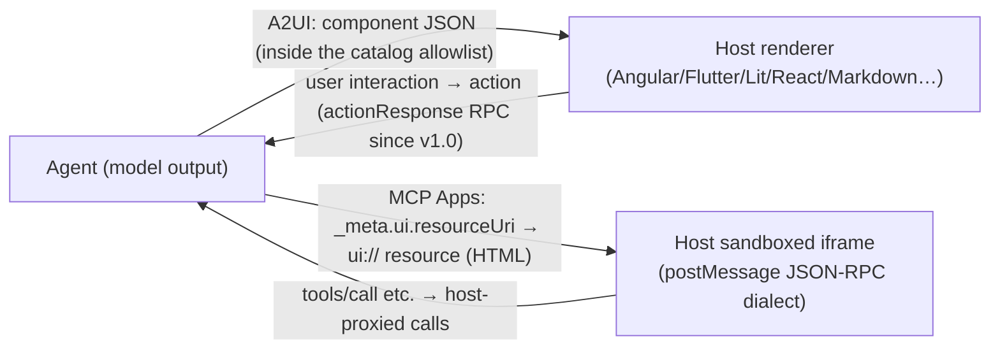

> **Layer**: 4 · Action and Collaboration ｜ **Previous layer exit**: build a traceable retrieval chain with an update path ｜ **This layer exit**: decide whether an agent should emit declarative components or sandboxed host HTML, and write a renderer skeleton with allowlist validation
> **Prerequisites**: [MCP](./mcp) ｜ [AG-UI](ag-ui) ｜ **Next**: [Protocol Watchlist](watchlist)

## 1. Overview

**BLUF**: text conversation is a low-bandwidth interface for many tasks (booking a table means rounds of date/time questions), while letting agents ship raw HTML/JS is heavy and unsafe. This page covers two complementary "UI payload / host extension" approaches:

- **A2UI (Agent to UI)**: agents emit **declarative component descriptions** (JSON) that clients render with their own native components — safe like data, expressive like code. Created by Google (Apache 2.0), with contributions from CopilotKit and the community.
- **MCP Apps**: an official MCP extension — a server's tool declares a `ui://` resource reference, the host renders the returned **interactive HTML** in a sandboxed iframe, and the two sides talk over a JSON-RPC dialect on postMessage.

Division of labor in one line: **A2UI answers "what UI does the agent ask for" (declarative); MCP Apps answers "what UI is embedded in an MCP host" (HTML + sandbox)**; both define payload/host behavior only — **how it travels** belongs to transport protocols (A2A, AG-UI, SSE, WebSocket all work), and **how the frontend is built** belongs to layer 2 [Generative UI](../../02-integration/ui).

### Mental model: the agent describes, the host renders and enforces security



The shared security thesis: **agent-generated UI crosses a trust boundary and must not execute arbitrary code**. A2UI achieves this with "pre-approved component catalogs + declarative data" (no UI injection surface); MCP Apps with "sandboxed iframe + postMessage + host-controlled capability surface (CSP/permissions)".

### Version status (retrieved 2026-09-01 from a2ui.org)

| A2UI version | Status | Highlights |
| --- | --- | --- |
| v1.0 | Candidate | adds client→server RPC (`actionResponse`), action IDs; renames `theme` to `surfaceProperties` |
| **v0.9.1** | **Current (production)** | standardizes the `application/a2ui+json` MIME type; relaxes surfaceId constraints |
| v0.9 | Stable (previous) | philosophical shift to Prompt-First; introduces `createSurface`, client-side functions, custom catalogs, modular schemas |
| v0.8 | Legacy | Structured-Output first: baseline surfaces/components/data binding/adjacency list |

MCP Apps is an extension document on modelcontextprotocol.io (not an independent protocol version line); see §3 for the host support surface.

### When to use / when not to

- Use A2UI: cross-platform native rendering (one description for web/mobile/desktop); incremental LLM generation (flat streaming-JSON friendly); arbitrary code execution forbidden by policy.
- Use MCP Apps: the host is already an MCP client (Claude, VS Code Copilot, etc.); you want the mature web ecosystem (visualization libraries, forms); you accept the sandboxed-iframe model.
- Do not (non-goals for both): transport-layer semantics (→ [AG-UI](ag-ui) / [A2A](a2a)); frontend component implementation details (→ layer 2 [Generative UI](../../02-integration/ui)); scenarios where plain text conversation is enough.

### Decision table

| Dimension | Text chat | **A2UI** | **MCP Apps** | Standalone web app + link |
| --- | --- | --- | --- | --- |
| Expressiveness | low | medium (catalog components) | high (HTML/JS ecosystem) | highest |
| Trust model | no UI risk | declarative data, allowlisted components | sandboxed iframe + host control | your problem |
| Context preservation | in-conversation | in-conversation | **in-conversation** | leaves the conversation |
| Bidirectional data flow | none | action/actionResponse | postMessage JSON-RPC (can call tools) | build your own API |
| Host requirement | none | a renderer | an MCP host + sandbox | none |
| Minimum complexity | lowest | catalog + renderer | MCP server + `ui://` resource | a whole app |

### History milestones

The A2UI version line is in the table above (published on the a2ui.org homepage); release history for the MCP Apps extension is not shown on the retrieved page: unverified.

### DoD self-check for this chapter

- [ ] Run the §2 fixture (component validation + render mock, including negatives) within 15 minutes
- [ ] State the trust-model difference between A2UI and MCP Apps (allowlist vs sandbox)
- [ ] Explain the three concepts: surface, component, data binding (path)
- [ ] Given a requirement, check the host support surface (§3 table) before choosing

## 2. Usage

**Minimal hands-on**: an A2UI-style component payload validator + terminal render mock. It demonstrates the three core ideas: **catalog allowlist** (unregistered components are rejected), **declarative structure validation** (member-name discrimination, reference integrity), and **data binding paths** (`/booking/date`-style paths into the data model). Node ≥ 18, zero dependencies.

> Note: the payload below is modeled on the **concepts** of a2ui.org v0.9.1 (component discrimination, path binding, id references) — a **minimal subset, not the full normative message set**; production work defers to the official v0.9.1/v1.0 specs (marked conceptual + fixture).

`a2ui-render.mjs` (catalog validation + render mock, with negatives):

```javascript fixture
// a2ui-render.mjs — A2UI-style payload validation + terminal render mock (Node ≥ 18, zero deps)
// Demonstrates: catalog allowlist / member-name discrimination / child reference integrity / data path binding
const CATALOG = new Set(["Text", "Button", "TextInput", "DateTimeInput", "Column"]);

// conceptual blueprint: a surfaceUpdate message (v0.8-style fields, teaching subset)
const payload = {
  surfaceUpdate: {
    surfaceId: "booking",
    components: [
      { id: "title", component: { Text: { text: { literalString: "Book dinner" } } } },
      { id: "date", component: { DateTimeInput: { value: { path: "/booking/date" } } } },
      { id: "note", component: { TextInput: { value: { path: "/booking/note" } } } },
      { id: "go-label", component: { Text: { text: { literalString: "Confirm" } } } },
      { id: "go", component: { Button: { child: "go-label",
        action: { name: "confirm_booking" } } } },
    ],
  },
  dataModel: { booking: { date: "2026-09-01T19:00:00Z", note: "" } },
};

// ① catalog allowlist: reject any unregistered component (anti UI-injection)
const isAllowed = (c) => {
  const keys = Object.keys(c.component ?? {});
  if (keys.length !== 1) return { ok: false, why: `expected a single discriminator member, got ${keys}` };
  return CATALOG.has(keys[0])
    ? { ok: true, kind: keys[0] }
    : { ok: false, why: `component ${keys[0]} is not in the catalog allowlist` };
};

// ② structure validation: unique ids, resolvable child refs, path bindings hitting the data model
const validate = ({ components }, dataModel) => {
  const ids = new Set();
  const problems = [];
  for (const c of components) {
    if (ids.has(c.id)) problems.push(`duplicate id: ${c.id}`);
    ids.add(c.id);
    const check = isAllowed(c);
    if (!check.ok) problems.push(`${c.id}: ${check.why}`);
    const body = Object.values(c.component ?? {})[0] ?? {};
    if (body.child && !components.some((x) => x.id === body.child))
      problems.push(`${c.id}: dangling child ref ${body.child}`);
    const bind = body.value ?? body.text ?? {};
    if (bind.path) {
      const hit = bind.path.split("/").filter(Boolean)
        .reduce((n, k) => n?.[k], dataModel);
      if (hit === undefined) problems.push(`${c.id}: path miss ${bind.path}`);
    }
  }
  return problems;
};

// ③ render mock: per-component terminal output; bindings show actual data values
const render = ({ components }, dataModel) => {
  const byId = new Map(components.map((c) => [c.id, c]));
  const valueOf = (body) => {
    if (body.text?.literalString) return body.text.literalString;
    if (body.value?.path) return `${JSON.stringify(
      body.value.path.split("/").filter(Boolean).reduce((n, k) => n?.[k], dataModel))}`;
    return "";
  };
  const line = (c) => {
    const kind = Object.keys(c.component)[0], body = Object.values(c.component)[0];
    if (kind === "Text") return `  [text] ${valueOf(body)}`;
    if (kind === "Button") return `  [button:${body.action.name}] ${valueOf(byId.get(body.child).component[Object.keys(byId.get(body.child).component)[0]])}`;
    return `  [${kind}] bound ${body.value?.path ?? "?"} = ${valueOf(body)}`;
  };
  return components.map(line).join("\n");
};

const problems = validate(payload.surfaceUpdate, payload.dataModel);
if (problems.length) {
  console.error("REJECTED:"); for (const p of problems) console.error(" -", p);
  process.exit(1);
}
console.log(`surface=${payload.surfaceUpdate.surfaceId}`);
console.log(render(payload.surfaceUpdate, payload.dataModel));

// negative: inject an unregistered component + a dangling child reference
const attack = structuredClone(payload);
attack.surfaceUpdate.components.push(
  { id: "evil", component: { IframeEmbed: { src: "https://evil.example" } } });
const attackProblems = validate(attack.surfaceUpdate, attack.dataModel);
console.log("\nnegative case rejected:",
  attackProblems.length > 0 ? attackProblems.join("; ") : "UNEXPECTED PASS");
```

**Run command**:

```bash fixture
node a2ui-render.mjs
```

**Normal output**:

```text fixture
surface=booking
  [text] Book dinner
  [DateTimeInput] bound /booking/date = "2026-09-01T19:00:00Z"
  [TextInput] bound /booking/note = ""
  [text] Confirm
  [button:confirm_booking] Confirm

negative case rejected: evil: component IframeEmbed is not in the catalog allowlist
```

**Acceptance command**: output contains `surface=booking` and a non-empty `negative case rejected:` section.
**Cleanup**: delete the script. No network, no residual state.

### Scenario matrix

| Scenario | Input / action | Output | Fits | Does not fit |
| --- | --- | --- | --- | --- |
| Form generation | booking/config-style requests | component tree + data bindings | input collection without back-and-forth | one-shot factual Q&A |
| Data exploration | "show sales by region" | chart-type custom components | drill-down/metric switching | when a text summary suffices |
| MCP host embedding | a server tool declares `_meta.ui.resourceUri` | a sandboxed HTML app | already inside Claude/VS Code etc. | non-MCP hosts |
| Bidirectional interaction | the user triggers an action | v1.0: `actionResponse` RPC; MCP Apps: postMessage calls | returning results to the agent | read-only display |

## 3. Principles

### A2UI: declarative components + catalog + data binding

- **Surface**: one UI region in a conversation, identified by `surfaceId`; since v0.9 it is created explicitly via `createSurface`, and generation is Prompt-First (the model emits UI messages in the conversation flow rather than one structured output).
- **Components**: a discriminated union — the JSON member name is the type (`{"Text": …}`, `{"Button": …}`); an `id` lets other components reference it (a Button's `child`), forming an adjacency structure rather than nested DOM.
- **Data binding**: `{"path": "/booking/date"}` points into the data model; the renderer separates data from structure, so the agent can update data only (`dataModelUpdate`) without touching structure.
- **Catalog**: the host's pre-approved component set — custom components (charts, maps) can be added; **components outside the catalog are not rendered**, which is where the security boundary lives.
- **Progressive rendering**: messages stream; users watch the interface build up (LLM-friendly: flat JSON, no need to be perfect in one shot).
- **v1.0 candidate additions**: action IDs and the client→server `actionResponse` RPC — interaction results can flow back to the agent.

### MCP Apps: tool declaration + ui:// resource + sandbox

Normative mechanics (modelcontextprotocol.io/extensions/apps/overview, retrieved 2026-09-01):

1. **UI preloading**: the tool description carries `_meta.ui.resourceUri` pointing at a `ui://` resource; hosts may preload before the tool is even called.
2. **Resource fetch**: the host fetches the UI resource from the server (HTML, often bundling JS/CSS; external origins must be listed in `_meta.ui.csp`).
3. **Sandboxed rendering**: web hosts render inside a sandboxed iframe; `_meta.ui.permissions` may request extra capabilities such as microphone/camera.
4. **Bidirectional communication**: app ↔ host over a JSON-RPC dialect on postMessage — some messages are shared with core MCP (`tools/call`), some are similar (`ui/initialize`), most are new with a `ui/` prefix; apps can request tool calls, send messages, and update model context.

SDK surface: the `App` class from `@modelcontextprotocol/ext-apps` is a convenience wrapper, not a requirement; hosts can use `@mcp-ui/client` (React) or the App Bridge (rendering/messaging/proxying/security policy). Host support (officially listed): Claude, Claude Desktop, VS Code GitHub Copilot, Microsoft 365 Copilot, Goose, Postman, MCPJam, Archestra.AI — treat the adoption surface as the official client-matrix page of the day.

### Boundaries and division of labor

| Question | Owner |
| --- | --- |
| What UI the agent delivers (declarative) | **A2UI** |
| What UI is embedded in an MCP host (HTML/sandbox) | **MCP Apps** |
| How events/messages flow | [AG-UI](ag-ui) (frontend interaction) / [A2A](a2a) (inter-agent; A2UI officially lists it as a transport) |
| How frontend components and state are written | layer 2 [Generative UI](../../02-integration/ui) |

### Spec requirements vs local test

| Claim | Official source | Local fixture |
| --- | --- | --- |
| A2UI version line (v0.8→v1.0) | a2ui.org homepage | matches (table transcribed) |
| Member-name component discrimination (`{"Text": …}`) | a2ui.org examples | matches |
| path data binding | a2ui.org examples | matches (with miss detection) |
| catalog allowlist rejects unregistered components | a2ui.org "Secure by Design" | matches (negative rejects `IframeEmbed`) |
| `application/a2ui+json` MIME | v0.9.1 notes | untested (fixture has no transport layer) |
| `dataModelUpdate`/`beginRendering` (v0.9 message family) | a2ui.org examples | not used — the fixture uses a v0.8-style `surfaceUpdate` teaching subset |
| MCP Apps `_meta.ui` / postMessage dialect | MCP extension docs | untested (no host environment) |

## 4. Development

### Integration notes

- **Check hosts before choosing**: for A2UI, verify the target platform has a renderer (Angular/Flutter/Lit/React/Markdown); for MCP Apps, check the host support matrix. If the host lacks support, the most standard payload still renders nothing.
- **Version pinning**: pin A2UI to v0.9.1 (current), or evaluate the v1.0 candidate's new capabilities (actionResponse) first; the two differ in fields (e.g. theme→surfaceProperties).
- **Custom components go through the catalog**: register them host-side first (with permissions and style constraints), then let agents reference them; unregistered components degrade silently to text.
- **MCP Apps security trio**: tighten `csp` for external origins, minimize `permissions`, and restrict the app's callable-tool surface host-side.

### Debug runbooks

```markdown
### Symptom → Evidence → Action → Done when
**Symptom**: agent-generated UI does not appear in the host
**Evidence**: payload validation logs — is the component in the catalog, is the discriminator member unique, are ids/children intact
**Action**: missing allowlist entry → register host-side or switch to base components; broken structure → attach the component schema to the generation prompt with validator feedback retries; binding path miss → align the data model
**Done when**: the same payload validates and renders all components every time
```

```markdown
### Symptom → Evidence → Action → Done when
**Symptom**: an MCP App renders but cannot call tools
**Evidence**: did `ui/initialize` complete in the postMessage session; does the host restrict the app's callable tools
**Action**: finish the initialization handshake before issuing calls; check host policy and server tool exposure; external-resource failures → check csp
**Done when**: in-app actions trigger tools/call and receive results
```

```markdown
### Symptom → Evidence → Action → Done when
**Symptom**: mid-stream JSON breaks and the interface flickers
**Evidence**: does the renderer discard half-finished output as an error
**Action**: implement A2UI's progressive-rendering principle — render completed components/data incrementally, keep already-rendered parts on error frames and request continuation
**Done when**: after an artificially truncated stream, rendered components survive and nothing duplicates after recovery
```

### Anti-patterns

- Disabling catalog validation "to get it running" — that abandons the approach's only security boundary.
- Stuffing a whole DOM tree into the payload — A2UI is a component description, not HTML transport.
- Loading scripts in MCP Apps from origins not listed in csp.
- Confusing responsibilities: transport semantics (runId and the like) inside A2UI payloads, or component structures inside AG-UI events.

## 5. Resource Library

### Four-level reading path

- **Beginner**: the a2ui.org homepage (version table + concept entries) → the MCP Apps overview's "Why not just build a web app?" → §1 of this page.
- **Builder**: A2UI Core Concepts (surfaces/components/binding/catalogs) → the MCP Apps build guide → swap this page's fixture for an official renderer.
- **Operator**: A2UI Transports (combos with A2A/AG-UI etc.) → the MCP Apps security model (sandbox/postMessage/capability surface) → the host support matrix.
- **Researcher**: the A2UI v1.0 candidate spec and Evolution Guide → the A2UI×MCP Apps interop guides (both directions: a2ui-in-mcp-apps / mcp-apps-in-a2ui) → migration paths.

### Resource table

| Name | Level | canonical URL | Use | Claims supported | Next |
| --- | --- | --- | --- | --- | --- |
| A2UI official site | L0 | https://a2ui.org/ | version table, concept entries, renderer ecosystem | the §1 version-status table; "created by Google, Apache 2.0" | enter concepts/ |
| A2UI specification (v0.9.1 / v1.0) | L0 | https://a2ui.org/ (specifications nav) | normative message/component definitions | component discrimination, path binding, actionResponse | read before implementing |
| MCP Apps extension | L0 | https://modelcontextprotocol.io/extensions/apps/overview | mechanics, security model, host support | all MCP Apps claims in §3 | read the build guide |
| A2UI concept: transports | L1 | https://a2ui.org/concepts/transports/ | combinations with A2A/AG-UI etc. | "transport-agnostic" | pair with the ag-ui chapter |
| A2UI×MCP Apps interop | L1 | https://a2ui.org/guides/a2ui-in-mcp-apps/ and /mcp-apps-in-a2ui/ | combining both directions | complementarity | build an integration demo |

All entries retrieved 2026-09-01. Renderer/host lists are snapshots; defer to the current official pages.

### Active falsification and open questions

- **Falsification entry point**: check A2UI fields against the official v0.9.1/v1.0 specs; check MCP Apps mechanics against the extension docs; file an issue on disagreement.
- Open 1: v1.0 is still a candidate; the interoperability maturity of `actionResponse` and other new mechanics is unverified.
- Open 2: the MCP Apps extension's versioning strategy and release history are not shown on the retrieved page.
- Open 3: the fixture uses a v0.8-style `surfaceUpdate` teaching subset; the full v0.9+ message family (`createSurface`/`dataModelUpdate`/`beginRendering`) is not covered by the fixture (spec pages not verified field by field).
- Open 4: the host support matrix changes over time (8 hosts listed officially, snapshot 2026-09-01); recheck before adoption decisions.

**learn-ai stops here**: the payload contract, security boundaries, a runnable validator. **Where to go next**: frontend implementation → layer 2 [Generative UI](../../02-integration/ui); transport → [AG-UI](ag-ui) / [A2A](a2a); MCP basics → [MCP](./mcp).
