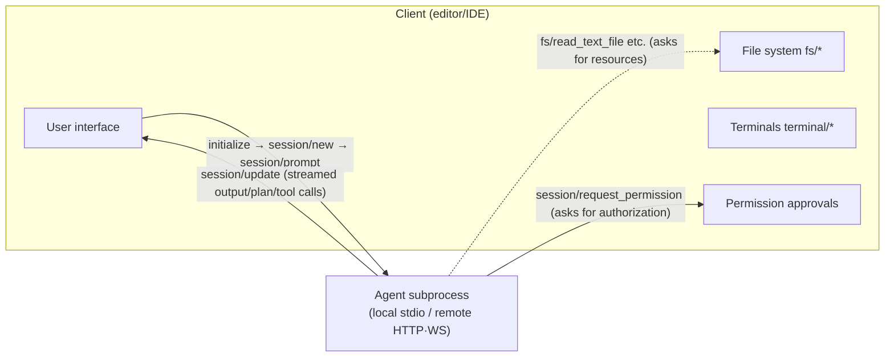

> **Layer**: 4 · Action and Collaboration ｜ **Previous layer exit**: build a traceable retrieval chain with an update path ｜ **This layer exit**: wire a coding agent into any ACP editor and articulate its division of labor with MCP/A2A
> **Prerequisites**: [Protocol Map](./index) ｜ [MCP](./mcp) ｜ **Next**: [AG-UI](ag-ui) ｜ [A2A](a2a)

## 1. Overview

> **Disambiguation (read this first)**: **ACP** means at least four things. This page covers the **Agent Client Protocol** (agentclientprotocol.com), the open protocol between editors/IDEs and coding agents, led by Zed (the site's metadata points to zed.dev, retrieved 2026-09-01). Historically IBM also proposed an Agent Communication Protocol of the same name, later folded into the A2A track (dates and details unverified, see [A2A](a2a)). The AGNTCY ecosystem has an Agent Connect Protocol (a REST interface for invoking remote agents, see the [Protocol Watchlist](watchlist)). OpenClaw has yet another internal protocol of the same name (a product implementation, see Products). When searching or selecting, always confirm the full name and canonical URL first.

**BLUF**: The Agent Client Protocol (ACP) standardizes the "code editor ↔ coding agent" edge. Without it, every editor needs a custom integration for every agent; with it, an agent that implements ACP works with every ACP editor — in the official wording, **like the Language Server Protocol (LSP) for language servers**. Its trust model is distinctive: the agent is a subprocess of the client (local case), and the file system, terminals, and permission approvals are all owned by the **client**; the agent only requests.

### Mental model: the editor holds the keys, the agent collaborates



- **Local agents** run as editor subprocesses, JSON-RPC over stdio (newline-delimited, UTF-8).
- **Remote agents** live in the cloud or on separate infrastructure over HTTP / WebSocket (mentioned on the official page; the transports section currently normatively defines stdio only — Streamable HTTP is a draft in progress).
- Content reuses MCP's JSON representations (ContentBlock) and adds coding-UX types (such as diff display); Markdown is the default for user-readable text. File paths **must be absolute**; line numbers are 1-based.

### Protocol lifecycle (official message flow)

```text
① initialize (negotiate protocolVersion + capabilities) → (if required) authenticate
② session/new, or session/load (requires the loadSession capability)
③ session/prompt ↔ session/update (message chunks/plans/tool calls/command updates)
   ├─ Agent → Client: session/request_permission (tool authorization)
   └─ Client → Agent: session/cancel (interrupt the current turn)
④ the session/prompt response carries a stopReason (end_turn/max_tokens/max_turn_requests/refusal/cancelled)
```

Capability rules: an omitted capability in initialize **means unsupported**; adding capabilities is not a breaking change; `protocolVersion` is a single integer (currently 1), incremented only on breaking changes.

### When to use / when not to

- Use: editor integrations for coding agents (or agent support for editors); local agent scenarios needing permission approval and controlled sharing of file/terminal resources.
- Do not: agent ↔ tools (→ [MCP](./mcp)); agent ↔ agent peer collaboration (→ [A2A](a2a)); event streams between an agent backend and a frontend app (→ [AG-UI](ag-ui)).

### Decision table: ACP vs neighboring protocols

| Dimension | MCP | **ACP (this page)** | A2A |
| --- | --- | --- | --- |
| Direction | host → tools/data | editor → coding agent (client-server) | agent ↔ agent (peers) |
| Control | host owns tool exposure | **the client owns the environment**: files, terminals, permissions | each side owns its own |
| State | server session | **session** (cwd + mcpServers + history) | Task/context owned by the server |
| Trust domain | tool sources the host trusts | the user's desktop (agent is a controlled subprocess) | cross-vendor/cross-org |
| Minimum complexity | tool schema + transport | initialize + session + prompt turn | discovery + auth + async tasks |

Working with MCP (one client, two protocols): the `session/new` parameters include an `mcpServers` list — the editor hands the user's configured MCP servers to the agent to connect; the agent declares `mcpCapabilities` (http/sse). There is also an "MCP over ACP" RFD discussion draft (not finalized).

### History milestones

`protocolVersion` is an integer major version, currently 1; capabilities evolve additively (new capabilities are not breaking changes). The site's updates page records evolution (not verified entry by entry). Earlier history and release dates: unverified.

### DoD self-check for this chapter

- [ ] Run the §2 two-process fixture (editor ↔ agent mock) within 15 minutes
- [ ] Draw the initialize → session/new → prompt → update → permission → stopReason sequence
- [ ] State which stopReason the agent must return after a client cancel
- [ ] Explain how "files/terminals/permissions live in the client" differs from A2A's "opaque peers"

## 2. Usage

**Minimal hands-on**: two zero-dependency Node scripts — a mock coding agent (stdin/stdout JSON-RPC) and a mock editor (launches it via `child_process`). Node ≥ 18, no npm packages, no API keys.

`acp-agent.mjs` (agent-side mock: handles initialize / session/new / session/prompt; issues a `session/request_permission` mid-turn):

```javascript fixture
// acp-agent.mjs — ACP agent mock: newline-delimited JSON-RPC over stdio (Node ≥ 18)
import { createInterface } from "node:readline";
import { randomUUID } from "node:crypto";

let nextId = 100;
const send = (msg) => process.stdout.write(JSON.stringify(msg) + "\n");
const notify = (method, params) => send({ jsonrpc: "2.0", method, params });
const reply = (id, result) => send({ jsonrpc: "2.0", id, result });
const request = (method, params) =>
  new Promise((resolve) => {
    const id = nextId++;
    pendingRequests.set(id, resolve);
    send({ jsonrpc: "2.0", id, method, params });
  });
const pendingRequests = new Map();

let sessionId = null;
let cancelled = false;

const onUpdate = (update) =>
  notify("session/update", { sessionId, update });

const handlePrompt = async (id, text) => {
  cancelled = false;
  onUpdate({ sessionUpdate: "agent_message_chunk", messageId: randomUUID(),
    content: { type: "text", text: `Analyzing request: ${text}` } });
  onUpdate({ sessionUpdate: "tool_call", toolCallId: "call_001",
    title: "Reading configuration file", kind: "read", status: "pending" });

  // Agent → Client: request tool authorization (the client relays to the user)
  const perm = await request("session/request_permission", {
    sessionId,
    toolCall: { toolCallId: "call_001" },
    options: [
      { optionId: "allow_once", kind: "allow_once", name: "Allow once" },
      { optionId: "reject_once", kind: "reject_once", name: "Reject once" },
    ],
  });
  if (perm.outcome === "cancelled" || cancelled) {
    return reply(id, { stopReason: "cancelled" });
  }
  onUpdate({ sessionUpdate: "tool_call", toolCallId: "call_001",
    title: "Reading configuration file", kind: "read", status: "completed" });
  onUpdate({ sessionUpdate: "agent_message_chunk", messageId: randomUUID(),
    content: { type: "text", text: `Done (permission: ${perm.optionId ?? "n/a"}).` } });
  reply(id, { stopReason: "end_turn" });
};

const methods = {
  initialize: (id) => reply(id, {
    protocolVersion: 1, // version negotiation: echo it back when supported
    agentCapabilities: {
      loadSession: false,
      promptCapabilities: { image: false, audio: false, embeddedContext: false },
    },
    agentInfo: { name: "mock-coding-agent", title: "Mock Agent", version: "0.1.0" },
    authMethods: [],
  }),
  "session/new": (id) => {
    sessionId = "sess_" + randomUUID().slice(0, 12);
    reply(id, { sessionId });
  },
  "session/prompt": async (id, { prompt }) => {
    const text = prompt.map((b) => b.text ?? "").join(" ");
    if (text.startsWith("wait")) {
      // slow task: demonstrates client-side session/cancel interruption
      onUpdate({ sessionUpdate: "agent_message_chunk", messageId: randomUUID(),
        content: { type: "text", text: "Long analysis in progress…" } });
      for (let i = 0; i < 20 && !cancelled; i++)
        await new Promise((r) => setTimeout(r, 100));
      return reply(id, { stopReason: cancelled ? "cancelled" : "end_turn" });
    }
    await handlePrompt(id, text);
  },
  "session/cancel": () => { cancelled = true; }, // notification: no response
};

createInterface({ input: process.stdin }).on("line", (line) => {
  if (!line.trim()) return;
  const msg = JSON.parse(line); // the agent also receives the client's request_permission response
  if (msg.id !== undefined && msg.method === undefined) {
    pendingRequests.get(msg.id)?.(msg.result); // resolve the pending permission request
    return;
  }
  methods[msg.method]?.(msg.id, msg.params ?? {});
});
process.stderr.write("[agent] ready on stdio\n"); // stderr is for logs only
```

`acp-editor.mjs` (client mock: spawns the subprocess, walks the whole lifecycle + one cancellation):

```javascript fixture
// acp-editor.mjs — ACP client (editor) mock: spawn the agent subprocess (Node ≥ 18)
import { spawn } from "node:child_process";
import { createInterface } from "node:readline";

const child = spawn(process.execPath, ["acp-agent.mjs"], { stdio: ["pipe", "pipe", "inherit"] });
let nextId = 1;
const pending = new Map();

const send = (msg) => child.stdin.write(JSON.stringify(msg) + "\n");
const request = (method, params) =>
  new Promise((resolve) => {
    const id = nextId++;
    pending.set(id, resolve);
    send({ jsonrpc: "2.0", id, method, params });
  });
const notify = (method, params) => send({ jsonrpc: "2.0", method, params });

const onServerRequest = (msg) => {
  if (msg.method === "session/request_permission") {
    // a real editor shows UI here; the mock auto-selects allow_once
    const option = msg.params.options.find((o) => o.kind === "allow_once");
    send({ jsonrpc: "2.0", id: msg.id,
      result: { outcome: "selected", optionId: option.optionId } });
  }
};

const rl = createInterface({ input: child.stdout });
rl.on("line", (line) => {
  const msg = JSON.parse(line);
  if (msg.id !== undefined && msg.method) return onServerRequest(msg); // server→client request
  if (msg.method === "session/update") {
    const u = msg.params.update;
    console.log(`[update] ${u.sessionUpdate}${u.status ? `:${u.status}` : ""}` +
      `${u.content?.text ? ` ${u.content.text}` : ""}`);
    return;
  }
  pending.get(msg.id)?.(msg.result); // response: resolve the matching request
});

// ① initialize → ② session/new → ③ prompt (with a permission round-trip)
const init = await request("initialize", {
  protocolVersion: 1,
  clientCapabilities: { fs: { readTextFile: true, writeTextFile: true }, terminal: false },
  clientInfo: { name: "mock-editor", title: "Mock Editor", version: "0.1.0" },
});
console.log(`[init] agent=${init.agentInfo.name} v${init.protocolVersion}`);
const { sessionId } = await request("session/new", {
  cwd: process.cwd(), mcpServers: [], // the MCP touchpoint: hand MCP servers to the agent
});
console.log(`[session] ${sessionId}`);
const r1 = await request("session/prompt", {
  sessionId,
  prompt: [{ type: "text", text: "Check this project for configuration issues" }],
});
console.log(`[turn1] stopReason=${r1.stopReason}`);

// ④ cancellation path: interrupt a slow task after 300ms
const slow = request("session/prompt", {
  sessionId, prompt: [{ type: "text", text: "wait: slow full-repo analysis" }],
});
setTimeout(() => notify("session/cancel", { sessionId }), 300);
console.log(`[turn2] stopReason=${(await slow).stopReason}`);
child.kill();
```

**Run command**:

```bash fixture
node acp-editor.mjs
```

**Normal output**:

```text fixture
[agent] ready on stdio
[init] agent=mock-coding-agent v1
[session] sess_9f0c…
[update] agent_message_chunk Analyzing request: Check this project for configuration issues
[update] tool_call:pending
[update] tool_call:completed
[update] agent_message_chunk Done (permission: allow_once).
[turn1] stopReason=end_turn
[update] agent_message_chunk Long analysis in progress…
[turn2] stopReason=cancelled
```

**Negative** (change `protocolVersion` to `99` in `acp-editor.mjs`'s initialize): the agent returns the version it supports (1) per spec, and a client that cannot support it should close and inform the user — in the mock, `init.protocolVersion` printing 1 is the negotiation evidence.
**Acceptance command**: the last two lines are `stopReason=end_turn` and `stopReason=cancelled`.
**Cleanup**: `Ctrl+C` if anything lingers, then delete both scripts.

### Scenario matrix

| Scenario | Input / action | Output | Fits | Does not fit |
| --- | --- | --- | --- | --- |
| Standard turn | an ordinary text prompt | update stream + `end_turn` | everyday Q&A / code edits | — |
| Tool permission | the agent sends `request_permission` | the user picks allow/reject | before writing files, running commands | read-only analysis (may skip asking) |
| Interruption | send `session/cancel` during a prompt | `stopReason=cancelled` | user changes their mind / timeout | a turn that already finished |
| Session resume | `session/load` (needs `loadSession:true`) | replays history updates | continuing across restarts | not implemented in this fixture |
| Resource callbacks | the agent calls `fs/read_text_file` etc. | the client reads/writes on its behalf | when the agent has no direct disk access | not implemented in this fixture |

## 3. Principles

### Bidirectional JSON-RPC and role asymmetry

ACP's two method axes (summary; field-level truth is the official schema):

| Direction | Methods / notifications | Notes |
| --- | --- | --- |
| Client → Agent | `initialize` / `authenticate` / `session/new` / `session/load` / `session/prompt` / `session/set_mode` / `logout` | lifecycle and input |
| Client → Agent (notification) | `session/cancel` | interrupts the current turn, no response |
| Agent → Client | `session/request_permission` | tool authorization request (request-response) |
| Agent → Client (notification) | `session/update` | agent/user/thought message chunks, tool_call, plan, command list, mode changes |
| Agent → Client (capability-gated) | `fs/read_text_file`, `fs/write_text_file`, `terminal/*`, `elicitation/create` | requires the matching client capability declared at initialize |

Key invariants:

- **stopReason enum**: `end_turn` (model finished naturally) / `max_tokens` / `max_turn_requests` / `refusal` / `cancelled`. Cancellation is not an error: after a client `session/cancel`, the agent **must** respond to `session/prompt` with the `cancelled` stopReason, converting the underlying library's abort exceptions into a semantic result — otherwise the client surfaces the cancellation as an error (the official Warning's point).
- **Permission options**: `allow_once` / `allow_always` / `reject_once` / `reject_always` — "remember the choice" is implemented by the client; the agent should still ask each time.
- **Cancellation ordering**: after sending cancel, the client should preemptively mark unfinished tool_calls as cancelled locally and answer all pending `request_permission` with the `cancelled` outcome; the agent may still emit updates before responding to the prompt.
- **stdio discipline**: messages are `\n`-delimited with no embedded newlines; stdout carries ACP messages only, logs go to stderr; both sides must comply.
- **Capability = availability**: `fs.readTextFile`, `terminal`, `elicitation`, boolean config options, and so on are unsupported when omitted; the agent must not call undeclared capabilities.

### Data flow and MCP reuse

The `prompt` of `session/prompt` is a `ContentBlock[]` (isomorphic with MCP ContentBlock: text / resource / image / audio…), and the agent's output chunks are ContentBlocks too. The agent-side `promptCapabilities` declares acceptable input types; the baseline is Text and ResourceLink. The session object carries `cwd` and `mcpServers` — **the client decides the working directory and tool sources; the agent connects to them**.

### Spec requirements vs local test

| Claim | Spec (agentclientprotocol.com) | Local fixture |
| --- | --- | --- |
| initialize echoes the same protocolVersion when supported | MUST | matches |
| Omitted capability = unsupported | MUST | matches (terminal:false never invoked) |
| stopReason=cancelled after cancel | MUST (including exception conversion) | matches |
| Permission outcome: `selected`+optionId / `cancelled` | MUST | matches |
| stdout carries ACP messages only | MUST | matches (logs on stderr) |
| `fs/*`, `terminal/*` callbacks | requires client capability declaration | the fixture declares fs but never triggers a callback (untested) |
| `session/load` history replay | requires `loadSession:true` | not implemented |

## 4. Development

### Integration notes

- **Version pinning**: integer `protocolVersion` negotiation — the client sends its latest supported value; if the agent disagrees it returns its own latest; a client that cannot support that should disconnect. Fix a test matrix (your editor version × agent version) before release.
- **Permission policy**: store `allow_always` memory at the client account layer and make it visible (users must be able to revoke); default to `allow_once`.
- **Timeouts**: `session/prompt` is a long request — the client UI must be cancellable; the agent needs its own timeouts for model/tool calls with stopReason attribution.
- **stderr**: agents log to stderr for the editor to forward/display; never mix it into stdout.

### Debug runbooks

```markdown
### Symptom → Evidence → Action → Done when
**Symptom**: the agent produces no output in the editor
**Evidence**: is the subprocess alive; any agent logs on stderr; any non-JSON lines on stdout
**Action**: check spawn failure/path errors first; then stdout pollution (framework banners printed to stdout break the JSON-RPC stream and must be redirected); dump raw lines one by one
**Done when**: the initialize request-response pair appears in the logs; agent startup logs are visible on stderr
```

```markdown
### Symptom → Evidence → Action → Done when
**Symptom**: clicking cancel shows an error in the UI
**Evidence**: is the final session/prompt response an error or a result.stopReason
**Action**: on the agent side, catch abort exceptions and convert them to stopReason=cancelled (the spec's Warning scenario); on the client side, answer all pending request_permission with cancelled
**Done when**: the cancel path ends with result.stopReason=cancelled and no error dialog
```

```markdown
### Symptom → Evidence → Action → Done when
**Symptom**: the agent's fs/terminal calls report method not found
**Evidence**: does the initialize response declare them in clientCapabilities
**Action**: the editor adds the capability declaration, or the agent produces content in the prompt instead of calling back; surface capability mismatches at initialize time, not mid-run
**Done when**: the capability list matches actual calls; undeclared calls no longer happen
```

### Anti-patterns

- Printing banners/progress into the agent's stdout — it breaks the JSON-RPC stream outright.
- The client swallowing `session/update` and looking only at the final stopReason — losing the streaming UX and tool visibility.
- Defaulting to `allow_always` with no revocation entry point.
- Reading/writing disk inside the agent process, bypassing the `fs/*` callbacks and the permission model.

## 5. Resource Library

### Four-level reading path

- **Beginner**: the official Introduction (the LSP analogy, why ACP) → §1 of this page.
- **Builder**: Protocol Overview (method summary) → Initialization / Session Setup / Prompt Turn → rewrite this page's fixture with the official TypeScript/Rust SDK.
- **Operator**: Tool Calls (permission model) → File System / Terminals / Session Modes → Extensibility (`_meta` and `_`-prefixed custom methods).
- **Researcher**: the official JSON Schema → the RFD list (mcp-over-acp, request-cancellation, session-fork, etc. — all discussion drafts).

### Resource table

| Name | Level | canonical URL | Use | Claims supported | Next |
| --- | --- | --- | --- | --- | --- |
| ACP official docs | L0 | https://agentclientprotocol.com/ | spec entry (Introduction/Protocol/Schema) | this page's lifecycle, methods, stopReason, permission options | read protocol/overview |
| Protocol Schema | L0 | https://agentclientprotocol.com/protocol/schema | field-level SSOT | ContentBlock/ToolCall/permission object shapes | consult when writing types |
| Transports | L1 | https://agentclientprotocol.com/protocol/transports | stdio rules (newline-delimited/UTF-8/stderr) | "stdout carries ACP messages only" | read before custom transports |
| Libraries (TS/Rust/Python/Kotlin) | L1 | https://agentclientprotocol.com/libraries/typescript and siblings | official SDKs | language support list | replace hand-rolled JSON-RPC with an SDK |
| ACP Registry | L2 | https://agentclientprotocol.com/get-started/registry | the compatible agent/client ecosystem | — | check the matrix when selecting |

All entries retrieved 2026-09-01 (the site sitemap shows protocol/schema updated 2026-02-04).

### Active falsification and open questions

- **Falsification entry point**: check any method/field claim on this page against the official schema page; where they disagree the schema wins — file an issue.
- Open 1: the Streamable HTTP transport is still marked "draft proposal in progress"; the remote-agent deployment shape is unsettled.
- Open 2: governance/ownership details (how Zed-led, whether foundation-bound) live on the governance page, not verified verbatim.
- Open 3: RFDs (mcp-over-acp, session-resume, logout, etc.) are discussion drafts, not capability commitments.

**learn-ai stops here**: the protocol contract, the editor-agent boundary, a runnable fixture. **Where to go next**: model internals → Learn LLM; access commands for specific editors/agents → Products; evaluation → the evals site.
