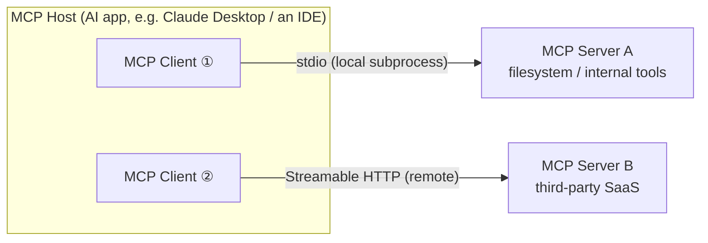

> **Layer**: 4 · Action and Collaboration ｜ **Exit of the layer above**: you can wire model output into sessions and state ｜ **Exit of this layer**: you can implement and debug an MCP server (including path safety and error semantics) and make migration decisions with 2026-07-28 version awareness
> **Prerequisites**: [Tool Calling Contract](../../01-contracts/tool-calling), [Tool Execution Engineering](../tool-execution) ｜ **Next**: [A2A](a2a) (the agent↔agent direction), [Protocol Map](index)

## 1. Overview

**Lead with the answer**: without MCP, connecting M AI applications to N external systems takes M×N bespoke integrations; MCP turns that into M+N — applications implement one client, systems implement one server, and the open protocol sits in between. MCP (Model Context Protocol) is the open standard connecting LLM applications with external data sources and tools: JSON-RPC 2.0 messages, three roles (host/client/server), three server primitives (tools/resources/prompts), and two official transports (stdio, Streamable HTTP).

### Mental model: three roles



- **Host**: the LLM application that initiates connections; it contains one or more clients.
- **Client**: the connector inside the host, maintaining a dedicated connection to one server and presenting tools/resources/prompts to the model.
- **Server**: the service providing context and capabilities — a local subprocess or a remote HTTP service.

One server serves many clients; one host runs many servers; each client pairs with exactly one server.

### When to use / when not to

- Use: the agent needs external tools/data (files, databases, APIs, browsers); the tool set must be reused across applications; you need a unified authorization and audit boundary.
- Do not use:
  - plain in-host function calls — a direct function suffices (rung 3 of the [Complexity Decision Ladder](../../00-orientation/complexity-ladder));
  - agent↔agent collaboration — that is the [A2A](a2a) direction;
  - merely reusing procedural knowledge — [Skills](../skills) are not a protocol.

### Decision table: versus neighboring protocols/mechanisms

| Mechanism | Direction | Control | State | Trust domain | Lowest complexity |
| --- | --- | --- | --- | --- | --- |
| Direct function call | in-process | code is the boundary | none | in-process | write one function |
| MCP (this page) | Agent ↔ tools/data | server declaration + client/host consent | stateless requests since 2026-07-28 | across process/network boundary | one server + tool schemas |
| A2A | Agent ↔ Agent | both sides autonomous + capability discovery (Agent Card) | async Tasks | cross-organization | both ends implement protocol endpoints |
| Skills | knowledge → context | description triggering | static files | inside the host process | one folder |

### Historical milestones (all verified 2026-09-01)

| Revision | Key change |
| --- | --- |
| 2024-11-05 | early revision; defined the HTTP+SSE transport (later deprecated) |
| 2025-03-26 | HTTP+SSE deprecated here, replaced by Streamable HTTP |
| 2025-11-25 | **the last legacy-era revision** (the initialize-handshake era) |
| 2026-07-28 | current revision (modern era): the protocol becomes stateless — the initialize handshake and `Mcp-Session-Id` are removed, `server/discover` is added, requests carry version and capabilities in `_meta`; ping and logging/setLevel removed; Roots/Sampling/Logging enter the deprecation process |

Version awareness is this page's through-line: a large share of online tutorials (including this repository's older notes) describe legacy-era behavior — check the era before the details.

## 2. Usage

Minimal hands-on: a zero-dependency echo server plus a client driving it — no SDK, hand-written JSON-RPC over stdio with Node built-ins, and the full lifecycle (handshake → discovery → call → errors → graceful shutdown) within 15 minutes.

### Step 1: create `server.mjs`

```javascript fixture
// server.mjs — minimal zero-dependency MCP server (node built-ins only)
// Implements the legacy-era surface (initialize handshake, <= 2025-11-25):
// dual-era servers must keep answering legacy clients — that is today's
// interoperability baseline.
// Reads newline-delimited JSON-RPC 2.0 from stdin; writes one reply per line to stdout.
// Logs go to stderr ONLY (stdout is the protocol channel).
import { createInterface } from "node:readline";

const PROTOCOL_VERSION = "2025-11-25"; // latest legacy-era revision

function result(id, payload) {
  return { jsonrpc: "2.0", id, result: payload };
}
function error(id, code, message) {
  return { jsonrpc: "2.0", id, error: { code, message } };
}

function handle(msg) {
  if (msg.method === "initialize") {
    return result(msg.id, {
      protocolVersion: PROTOCOL_VERSION,
      capabilities: { tools: {} },
      serverInfo: { name: "echo-server", version: "1.0.0" },
    });
  }
  if (msg.method === "notifications/initialized") return null; // notification: no reply
  if (msg.method === "tools/list") {
    return result(msg.id, {
      tools: [{
        name: "echo",
        description: "Echoes the input text back, prefixed with 'echo:'.",
        inputSchema: {
          type: "object",
          properties: { text: { type: "string" } },
          required: ["text"],
        },
      }],
    });
  }
  if (msg.method === "tools/call") {
    const { name, arguments: args } = msg.params ?? {};
    if (name !== "echo") {
      return error(msg.id, -32602, `Unknown tool: ${name}`); // Invalid params
    }
    if (typeof args?.text !== "string") {
      return error(msg.id, -32602, "arguments.text must be a string");
    }
    return result(msg.id, { content: [{ type: "text", text: `echo: ${args.text}` }] });
  }
  // Anything else: JSON-RPC "Method not found"
  return error(msg.id, -32601, `Method not found: ${msg.method}`);
}

const rl = createInterface({ input: process.stdin });
rl.on("line", (line) => {
  if (!line.trim()) return;
  let msg;
  try {
    msg = JSON.parse(line);
  } catch {
    console.error(`[server] non-JSON line ignored: ${line.slice(0, 40)}`);
    return;
  }
  const reply = handle(msg);
  if (reply) process.stdout.write(JSON.stringify(reply) + "\n");
});
rl.on("close", () => process.exit(0)); // client closing stdin = graceful shutdown signal
console.error("[server] echo-server ready on stdio");
```

### Step 2: create `client.mjs`

```javascript fixture
// client.mjs — minimal zero-dependency MCP client: spawns the server, drives
// one full interaction, prints every JSON-RPC message; exit 1 on any failed expectation.
import { spawn } from "node:child_process";

const child = spawn(process.execPath, ["server.mjs"], { stdio: ["pipe", "pipe", "inherit"] });

let nextId = 1;
const pending = new Map(); // id -> { method, resolve }
let buf = "";

child.stdout.on("data", (chunk) => {
  buf += chunk;
  let nl;
  while ((nl = buf.indexOf("\n")) !== -1) {
    const line = buf.slice(0, nl); buf = buf.slice(nl + 1);
    if (!line.trim()) continue;
    const msg = JSON.parse(line);
    console.log(`<-- ${JSON.stringify(msg)}`);
    pending.get(msg.id)?.resolve(msg);
    pending.delete(msg.id);
  }
});

function request(method, params) {
  const id = nextId++;
  return new Promise((resolve) => {
    pending.set(id, { method, resolve });
    const msg = { jsonrpc: "2.0", id, method, ...(params ? { params } : {}) };
    console.log(`--> ${JSON.stringify(msg)}`);
    child.stdin.write(JSON.stringify(msg) + "\n");
  });
}
function notify(method) {
  const msg = { jsonrpc: "2.0", method };
  console.log(`--> ${JSON.stringify(msg)}`);
  child.stdin.write(JSON.stringify(msg) + "\n");
}

const failures = [];
const expect = (ok, label) => { console.log(`${ok ? "PASS" : "FAIL"}  ${label}`); if (!ok) failures.push(label); };

// 1. legacy lifecycle: initialize -> notifications/initialized
const init = await request("initialize", {
  protocolVersion: "2025-11-25",
  capabilities: {},
  clientInfo: { name: "minimal-client", version: "1.0.0" },
});
expect(init.result?.serverInfo?.name === "echo-server", "initialize returns serverInfo");
expect(init.result?.capabilities?.tools !== undefined, "server advertises tools capability");
notify("notifications/initialized");

// 2. Discover tools
const list = await request("tools/list", {});
expect(list.result?.tools?.[0]?.name === "echo", "tools/list returns the echo tool");

// 3. Call the echo tool (happy path)
const call = await request("tools/call", { name: "echo", arguments: { text: "hello mcp" } });
expect(call.result?.content?.[0]?.text === "echo: hello mcp", "tools/call echoes the text");

// 4. Negative cases: unknown tool + unknown method
const badTool = await request("tools/call", { name: "nope", arguments: {} });
expect(badTool.error?.code === -32602, "unknown tool -> JSON-RPC -32602");
const badMethod = await request("debug/poke", {});
expect(badMethod.error?.code === -32601, "unknown method -> JSON-RPC -32601");

// 5. Graceful shutdown: close stdin, wait for exit
child.stdin.end();
const code = await new Promise((r) => child.on("exit", r));
expect(code === 0, `server exits 0 on stdin close (got ${code})`);
console.log(failures.length ? `result: ${failures.length} failure(s)` : "result: all checks passed");
process.exit(failures.length ? 1 : 0);
```

### Step 3: run it (happy path)

```bash fixture
node client.mjs; echo "exit=$?"
```

Excerpt of actual output (Node 24; the full run prints every message line by line):

```text fixture
--> {"jsonrpc":"2.0","id":1,"method":"initialize","params":{"protocolVersion":"2025-11-25","capabilities":{},"clientInfo":{"name":"minimal-client","version":"1.0.0"}}}
<-- {"jsonrpc":"2.0","id":1,"result":{"protocolVersion":"2025-11-25","capabilities":{"tools":{}},"serverInfo":{"name":"echo-server","version":"1.0.0"}}}
PASS  initialize returns serverInfo
PASS  server advertises tools capability
--> {"jsonrpc":"2.0","id":3,"method":"tools/call","params":{"name":"echo","arguments":{"text":"hello mcp"}}}
<-- {"jsonrpc":"2.0","id":3,"result":{"content":[{"type":"text","text":"echo: hello mcp"}]}}
PASS  tools/call echoes the text
PASS  unknown tool -> JSON-RPC -32602
PASS  unknown method -> JSON-RPC -32601
PASS  server exits 0 on stdin close (got 0)
result: all checks passed
exit=0
```

### Step 4: negative cases (what the error semantics look like)

The client fixture embeds two negative cases; the raw responses on their own:

```text fixture
<-- {"jsonrpc":"2.0","id":4,"error":{"code":-32602,"message":"Unknown tool: nope"}}
<-- {"jsonrpc":"2.0","id":5,"error":{"code":-32601,"message":"Method not found: debug/poke"}}
```

`-32602` is JSON-RPC Invalid params (a tool name is an argument error); `-32601` is Method not found (unknown at the method layer). MCP reserves its own error codes in the -32020 to -32099 range (e.g. `-32022` for unsupported protocol version) — do not repurpose them.

### Acceptance and cleanup

- Acceptance: `node client.mjs` exits 0 with seven PASS lines; `exit=$?` is 0.
- Cleanup: `rm server.mjs client.mjs`.
- Older fixture: the repository's `examples/mcp-lab/` is an SDK-based teaching example; this page's zero-dependency version is the minimal protocol-layer implementation. Both exist; when reading sources, trust this page's era narration.

### Scenario matrix

| Scenario | Input | Action | Output | Fits | Does not fit |
| --- | --- | --- | --- | --- | --- |
| Basic: local tools | local capabilities like files or computation | a stdio server exposes tools | the in-host model calls them on demand | personal / IDE setups | cross-network sharing |
| Common: bridging HTTP APIs | a third-party REST service | the server converts protocols (MCP upward, plain HTTP client outward) | unified MCP tools | aggregating APIs, centralized auth and audit | a single simple call (plain HTTP is cheaper) |
| Combined: MCP + Skills | "how to use it once connected" | MCP supplies the connection, the Skill the procedure | a clean split of connectivity and steps | tool usage conventions | either/or thinking |

## 3. Principles

### Two eras of lifecycle (the root of version awareness)

MCP completed an era switch at 2026-07-28; classify any MCP material by era first:

| | legacy era (≤2025-11-25) | modern era (2026-07-28 on) |
| --- | --- | --- |
| Session | stateful: the `initialize` handshake establishes a session (HTTP had `Mcp-Session-Id`) | **stateless**: no handshake, no session header |
| Version and capabilities | negotiated once at handshake (`protocolVersion`/`capabilities`) | carried **per request** in `_meta` (`io.modelcontextprotocol/protocolVersion`, `clientCapabilities`, `clientInfo`) |
| Probing | none | servers **MUST** implement `server/discover`, advertising supported versions and capabilities; clients may probe first or call directly and handle the version error |
| Version mismatch | handshake failure | `UnsupportedProtocolVersionError` (`-32022`) whose response carries a `supported` list; the client retries on an intersection |
| Cancellation | `notifications/cancelled` (notification) | unchanged (carried over) |
| Compatibility | — | dual-era implementations support both: a request carrying `_meta` is served modern, an `initialize` request is served legacy |

**Why this design**: statelessness lets servers scale horizontally and requests retry independently (a lost in-flight request is simply re-issued as a new one), and it deletes session stickiness and recovery — the most expensive state machines.

### Primitives: what the server offers, what the client offers (2026-07-28 status)

| Side | Primitive | Control | Status |
| --- | --- | --- | --- |
| server | **tools** (executable functions, model-controlled) | the model decides to call; the host must obtain user consent first | active |
| server | **resources** (read-only contextual data) | application-controlled | active |
| server | **prompts** (reusable message templates) | user-controlled | active |
| client | **elicitation** (the server asking the user for more input) | user confirms | active |
| client | sampling / roots / logging | — | **in the deprecation process** (2026-07-28; migration guidance: integrate with LLM provider APIs directly, pass directories via parameters, log to stderr/OTel) |

Note the era change in the last row: older tutorials present sampling/roots/logging as standard client features; since 2026-07-28 they are deprecated and new implementations should not add dependencies on them. Also: async long-running tasks left the core for the `io.modelcontextprotocol/tasks` extension; in-conversation UI is the `io.modelcontextprotocol/ui` extension (MCP Apps).

### Transports: stdio and Streamable HTTP

| | stdio | Streamable HTTP |
| --- | --- | --- |
| Shape | the client launches the server as a subprocess | a remote HTTP endpoint |
| Framing | **newline-delimited JSON-RPC, one per line, no embedded newlines** | HTTP POST carries JSON-RPC; responses may stream |
| Protocol channel | stdin/stdout; **stdout may contain protocol messages only** | request/response bodies |
| Logs | stderr (clients should not assume stderr output means an error) | normal HTTP semantics + OTel |
| Shutdown | client closes stdin → the server should exit promptly (EOF is the only portable graceful-shutdown signal) | connection/request lifecycle |
| Authorization | process trust + host consent | OAuth (below) |
| Deprecated | — | HTTP+SSE (defined 2024-11-05, deprecated since 2025-03-26) |

The spec is explicit that framing and subprocess lifecycle are separable on stdio: the same "one JSON-RPC per line" runs unchanged over Unix sockets or TCP.

### Authorization

Authorization for remote MCP servers builds on the OAuth family: the MCP server acts as an OAuth resource server. Key 2026-07-28 changes (verified): OAuth 2.0 Dynamic Client Registration (RFC 7591) enters deprecation in favor of **Client ID Metadata Documents**; authorization servers should include `iss` (RFC 9207) and clients must validate it before redeeming the code; credentials must be keyed by issuer and never reused across authorization servers. The three security principles (per the spec): user consent and control, data privacy, and tool safety — tools are arbitrary code execution, and their descriptions and annotations are untrusted input when originating from an untrusted server.

### Spec requirements vs local measurement

| Spec requirement (2026-07-28, verified 2026-09-01) | Local measurement (Section 2 fixture) |
| --- | --- |
| stdout must not contain anything that is not a valid MCP message | the server logs to stderr only; measured output is clean |
| messages are newline-delimited, one per line | the client parses per line; all pass |
| after the client closes stdin, the server should exit promptly | `rl.on("close") → process.exit(0)`; measured exit code 0 |
| unknown method → a JSON-RPC error (legacy servers commonly -32601) | `debug/poke` receives `-32601`, matching the measurement |
| modern requests carry version in `_meta`; servers must implement `server/discover` | **not implemented in the fixture** (it deliberately implements the legacy surface to interoperate with the largest installed base of dual-era clients); to add the modern surface, follow the table above |
| Roots/Sampling/Logging deprecated | the fixture depends on none of them |

### Control-flow panorama (one tool call)

```mermaid
sequenceDiagram
    participant U as User
    participant H as Host (with Client)
    participant S as MCP Server
    U->>H: natural-language request
    H->>S: tools/list (discover tool schemas)
    S-->>H: tool definitions (JSON Schema)
    H->>H: inject tool definitions to the model; the model emits a call intent
    H->>U: request authorization (user consent)
    U->>H: consent
    H->>S: tools/call {name, arguments}
    S-->>H: content result (or isError)
    H->>U: final reply
```

Key boundary: **the model emits a call intent and the host constructs the JSON-RPC** — the model does not speak the protocol directly. Authorization happens host-side (tools are arbitrary code execution).

## 4. Development

### Debugging toolchain

- **MCP Inspector** (official, https://github.com/modelcontextprotocol/inspector): connect to a server interactively, visualize initialize/tools/list/tools/call and raw messages — the first stop for "see the real messages before changing code".
- **Logs**: stdio server logs go to stderr only; enable server-stderr forwarding on the host side to see lifecycle logs.
- **Timeouts**: the host sets a timeout on `tools/call`; the server sets inner timeouts on external dependencies (files, HTTP) and returns an `isError` result instead of hanging.

### Symptom → Evidence → Action → Done when

**Symptom**: the client reports JSON parse errors / a garbled message stream; tools work intermittently.
**Evidence**: the server printed logs or a banner to stdout — non-protocol content on stdout breaks the one-JSON-RPC-per-line framing.
**Action**: route all output to `console.error` (stderr) or a stderr-defaulting logger; add a CI assertion that every stdout line `JSON.parse`s successfully.
**Done when**: Inspector connects without parse errors; the CI assertion stays green.

### Symptom → Evidence → Action → Done when

**Symptom**: after connecting, the client hangs or errors out although both sides "started normally".
**Evidence**: an era mismatch — a modern client against a legacy-only server (or vice versa). Probe with `server/discover`: a `DiscoverResult` or a version error (`-32022`) means the peer is modern; any other error or silence means legacy.
**Action**: implement the dual-era fallback on the client (probe fails → fall back to the `initialize` handshake); or upgrade the server to answer both eras (a request with `_meta` is served modern, an `initialize` request is served legacy).
**Done when**: both Inspector and the target host complete tools/list, each opening the server either way.

### Symptom → Evidence → Action → Done when

**Symptom**: a file tool can read any file on the server (e.g. `.env`, secrets).
**Evidence**: the tool's path parameter has no root confinement. A real lesson from this repository: the `read_file_summary` tool in `examples/mcp-lab` accepted an **absolute path** and passed it straight to `fs.readFile` — the model (or input steering the model) could read any file on the host machine. An argument schema validates types, not boundaries.
**Action**: the **root allowlist pattern** — the server explicitly declares permitted roots at startup; every path parameter is resolved and containment-checked before use, with escapes returned as errors:

```javascript normative
// Path safety: root allowlist (the fix pattern for examples/mcp-lab read_file_summary)
import { readFile } from "node:fs/promises";
import { resolve, relative, isAbsolute } from "node:path";

// 1. Explicitly declare permitted roots (from config/env, never from model input)
const ALLOWED_ROOTS = [resolve(process.env.DATA_ROOT ?? "./data")];

function assertWithinRoots(p) {
  const abs = isAbsolute(p) ? resolve(p) : resolve(process.cwd(), p);
  const ok = ALLOWED_ROOTS.some((root) => {
    const rel = relative(root, abs);
    return rel === "" || (!rel.startsWith("..") && !isAbsolute(rel));
  });
  if (!ok) throw new Error(`path outside allowed roots: ${p}`);
  return abs;
}

// 2. In the tool implementation, validate before reading
export async function readFileSummary(filePath) {
  const abs = assertWithinRoots(filePath);       // escapes throw here
  const content = await readFile(abs, "utf-8");  // touch the fs only after validation
  return content.slice(0, 100);
}
```

**Done when**: negative tests (`../../etc/passwd`, absolute paths outside the allowed roots) all return errors instead of content; positive cases (relative paths inside the roots) are unaffected; the tests are in CI.

### Symptom → Evidence → Action → Done when

**Symptom**: after upgrading the SDK/spec version, the server misbehaves (ping stops working, log levels stop applying, handshake errors).
**Evidence**: check the 2026-07-28 change list: `ping` and `logging/setLevel` were removed (log level is now per-request `_meta`); the `initialize` handshake does not exist in the modern era; result objects gained a required `resultType` (clients treat omitted `resultType` from earlier-protocol servers as `"complete"`).
**Action**: work through the migration list — ping → a business-level heartbeat or removal; logging → stderr/OTel; handshake → per-request `_meta` or keep dual-era answers; renumber error codes if you used `-32001/-32003/-32004`, which became `-32020/-32021/-32022`.
**Done when**: both the target host and Inspector connect in each era; the upgrade PR carries a migration mapping table.

### Anti-patterns

- **"Mount five servers at once"**: tool definitions eat the context budget first; enable the minimum for the task at hand.
- **stdout as a log sink**: see runbook 1 — guaranteed breakage.
- **Unbounded path parameters**: see runbook 3; schemas govern types, not permissions.
- **Treating tool descriptions as trusted input**: the spec states annotations from untrusted servers are untrusted.
- **Using MCP for agent↔agent communication**: wrong direction — use [A2A](a2a).

## 5. Resource Library

Four-level reading route:

- **Beginner**: run the Section 2 fixture; reconnect once with Inspector to watch raw messages.
- **Builder**: read the 2026-07-28 spec's Architecture and Base Protocol pages; add the modern-era `_meta` and `server/discover` to your server.
- **Operator**: put the "stdout purity" and "path escape" tests into CI; track official SDK versions and the CHANGELOG.
- **Researcher**: read the versioning page's compatibility matrix and the SEP records (the statelessness, MRTR, and subscriptions/listen trade-offs).

### Resource table

| Name | Evidence level | Canonical URL | Use | Supported claim | Next |
| --- | --- | --- | --- | --- | --- |
| MCP specification (latest = 2026-07-28) | L0 (official spec) | https://modelcontextprotocol.io/specification/latest | the single source of the protocol contract | era split, primitives, transports, deprecations (retrievedAt 2026-09-01) | read Architecture / Base Protocol |
| Versioning and compatibility | L0 (official spec) | https://modelcontextprotocol.io/specification/2026-07-28/basic/lifecycle | modern/legacy and the compatibility matrix | `_meta` field names, `server/discover`, `-32022` (retrievedAt 2026-09-01) | compare with the Section 3 era table |
| Key Changes (changelog) | L0 (official spec) | https://modelcontextprotocol.io/specification/latest/changelog | deltas between revisions | all 2026-07-28 changes and deprecations (retrievedAt 2026-09-01) | source of the migration list |
| MCP Inspector | L0 (official tool) | https://github.com/modelcontextprotocol/inspector | interactive debugging | the official debugging entry point (retrievedAt 2026-09-01) | hands-on for the Section 4 runbooks |
| MCP SDKs (TypeScript/Python and more) | L0 (official tool) | https://modelcontextprotocol.io/sdk | production implementation | official multi-language SDKs (retrievedAt 2026-09-01) | replace the hand-written implementation |

### Active falsification and open questions

- Falsification entry: if your server's behavior contradicts the spec in either era (e.g. a malformed `server/discover` result), trust the spec schema and revise this page's "spec vs measurement" table.
- Open: post-2026-07-28 revisions (watch specVersion); the final removal timeline for deprecated items (Roots/Sampling/Logging, HTTP+SSE, RFC 7591 registration); extension ecosystem stability (tasks/ui) — all need re-checking against the verification date.

### learn-ai stops here / where to go next

- The model-side contract of tool calling (schemas, selection, argument validation): [Tool Calling Contract](../../01-contracts/tool-calling).
- Execution engineering for idempotency/timeouts/retries/approval: [Tool Execution Engineering](../tool-execution).
- The agent↔agent direction: [A2A](a2a); the panorama: [Protocol Map](index).
- Usage of specific third-party MCP servers (e.g. chrome-devtools-mcp): the Products area.
