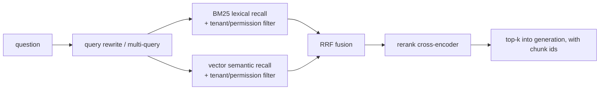

# Advanced Retrieval

> **Group**: 4 · Grounding (reading the world) | **Previous group exit**: wire retrieval into the generation loop—answers cite sources, no-hit refuses, rebuild after updates ([RAG](rag.md)) | **This page exit**: raise recall with hybrid search, query rewriting, and reranking, and make permission filtering and citation fidelity invariants of the retrieval layer
> **Prerequisites**: [RAG: Retrieval-Augmented Generation](rag.md) | **Next**: [Tool Execution Engineering](../05-action/tool-execution), [Evaluation (bridge)](../08-production/evaluation)

## 1. Overview

Baseline RAG (single-leg vector retrieval + top-k) has a recall ceiling: semantic vectors are weak on exact identifiers, and user questions rarely match corpus phrasing. This page is a **verified upgrade ladder**, ordered by investment:

| Upgrade | What it fixes | Effect (Anthropic experiment; retrieval failure rate = 1 − recall@20) |
| --- | --- | --- |
| Baseline (single-leg embeddings) | — | 5.7% |
| + Hybrid search (BM25 + vectors, RRF fusion) | Exact codes / rare tokens not found | Embeddings+BM25 beats embeddings alone (per-post appendix for magnitude) |
| + Contextualized chunks (Contextual Embeddings) | Chunks detached from document context retrieve poorly | 5.7% → 3.7% (−35%) |
| + Contextual BM25 | Same, lexical side benefits too | → 2.9% (−49% cumulative) |
| + Reranking | Noisy shortlist crowds the context | → 1.9% (−67% cumulative) |

The numbers come from the Anthropic Contextual Retrieval post's experiments on its corpus and configuration (retrievedAt 2026-09-01); the direction is trustworthy, the magnitudes need re-measuring on your own golden set. The post's headline conclusion: **these benefits stack**.

Seven things make up this page: **hybrid search** (BM25+vectors, RRF fusion), **query rewriting / multi-query**, **reranking** (cross-encoder idea), **parent-child chunking**, **contextualized chunking**, **ACL and multi-tenant filtering**, and **citation fidelity**. The first five raise recall; the last two are invariants of permission and trustworthiness—exactly what gets dropped first when upgrading retrieval quality.



### When to use / when not to

- **Use**: baseline RAG's false refusals / misses fail the golden set; queries mix in exact tokens like error codes and function names; the corpus is long documents (chunks lose context badly); multi-tenant product.
- **Do not use**: the corpus fits in a context (stuff it first); retrieval quality is not yet measured (build the golden set first, or no upgrade can be proven—see [Evaluation](../08-production/evaluation)).

### Decision table: retrieval architectures

| Architecture | Direction | Control | State | Trust domain | Minimum complexity |
| --- | --- | --- | --- | --- | --- |
| Single-leg vector | Query → embed → ANN | Embedding-model dependency | Index rebuildable | Embedding provider | Baseline (RAG page) |
| Hybrid (BM25+vector+RRF) | Dual recall → rank fusion | Lexical leg fully yours | Both indexes rebuildable | Embedding provider | +1 inverted index |
| Hybrid + rerank | Fused list through a reranking model | Reranker swappable (managed API or self-hosted) | Stateless (per request) | Rerank provider | +1 API call per query |
| + Contextualized chunking | Offline context prefix per chunk | Context generator controllable | Recomputed on index rebuild | Contextualization model | +1 offline pipeline step |

### Historical milestones

- 2009: Reciprocal Rank Fusion published (Cormack, Clarke, Büttcher, SIGIR 2009)—simple reciprocal-rank fusion outperforming several learned fusion methods (DOI: 10.1145/1571941.1572114, verified via Semantic Scholar, retrievedAt 2026-09-01).
- BM25 originates in Robertson et al.'s probabilistic retrieval framework (dates outside this verification pass—marked unverified); the Anthropic post's description of its mechanism is verified: TF-IDF plus term-frequency saturation and document-length normalization.
- 2024-09-19: Anthropic published the Contextual Retrieval post—content verified (see the table above); the publish date was cross-checked against multiple independent secondary sources (retrievedAt 2026-09-01).

## 2. Usage

Minimal hands-on: **pure-TypeScript BM25 + vector dual-leg retrieval + RRF fusion**, zero-key and deterministic. The lexical leg is standard BM25 (k1=1.2, b=0.75, textbook defaults); the "vector" leg reuses the teaching hashing embedder from [Embeddings and Retrieval](embeddings-retrieval.md) (swap for a real embedding model in production). One query prints three rankings for direct comparison.

Save as `advanced-retrieval.ts` (Node 22.18+ / 24 has built-in type stripping—run directly):

```ts
// Teaching fixture: BM25 (lexical, IDF-weighted) + vector retrieval + Reciprocal Rank Fusion.
// Zero API key, deterministic. The "vector" side reuses the hashing bag-of-words embedder
// from the embeddings-retrieval page; production replaces it with a real embedding model.
// Run: node advanced-retrieval.ts

// ---- Shared token machinery (identical to embeddings-retrieval.ts) ----

const DIM = 512;

const STOPWORDS = new Set([
  "a", "an", "and", "are", "as", "at", "be", "but", "by", "do", "does", "for",
  "i", "if", "in", "is", "it", "its", "my", "of", "on", "or", "our", "that", "the",
  "this", "to", "we", "were", "what", "when", "where", "which", "who", "why", "you", "your",
]);

function tokenize(text: string): string[] {
  return (text.toLowerCase().match(/[a-z0-9]+/g) ?? []).filter((token) => !STOPWORDS.has(token));
}

function fnv1a(token: string): number {
  let hash = 0x811c9dc5;
  for (let i = 0; i < token.length; i++) {
    hash ^= token.charCodeAt(i);
    hash = Math.imul(hash, 0x01000193) >>> 0;
  }
  return hash >>> 0;
}

function embed(text: string): number[] {
  const vector = new Array<number>(DIM).fill(0);
  for (const token of tokenize(text)) {
    vector[fnv1a(token) % DIM] += 1;
  }
  const norm = Math.sqrt(vector.reduce((sum, value) => sum + value * value, 0));
  return norm === 0 ? vector : vector.map((value) => value / norm);
}

function cosine(a: number[], b: number[]): number {
  let dot = 0;
  for (let i = 0; i < a.length; i++) dot += a[i] * b[i];
  return dot;
}

// ---- Corpus ----

type Doc = { id: string; text: string };

const corpus: Doc[] = [
  {
    id: "token-reset.md",
    text:
      "To reset the deploy token, an administrator must first confirm the request in the admin console, " +
      "then run nimbus token reset, and finally restart the cli. " +
      "The old token stops working immediately after the reset.",
  },
  {
    id: "deploy.md",
    text:
      "Every deploy uses the deploy token to authenticate. " +
      "Rotate the deploy token each quarter. " +
      "The deploy token authenticates every deploy against the gateway. " +
      "A failed deploy with an expired token returns ERR-4001.",
  },
  {
    id: "errors.md",
    text:
      "ERR-4292 means the request was throttled; the retry delay doubles on each attempt. " +
      "ERR-4001 means the token expired; obtain a fresh one from the console. " +
      "Each error entry also lists the component, the severity, and the owning team.",
  },
  {
    id: "billing.md",
    text: "Invoices list the plan price and the request count. Refunds take five business days.",
  },
];

// ---- BM25: lexical scoring with IDF, TF saturation, length normalization ----
// k1 and b are the standard defaults (k1 = 1.2, b = 0.75).

function bm25Index(docs: Doc[]) {
  const docTokens = docs.map((doc) => tokenize(doc.text));
  const avgdl = docTokens.reduce((sum, tokens) => sum + tokens.length, 0) / docTokens.length;
  const df = new Map<string, number>();
  for (const tokens of docTokens) {
    for (const token of new Set(tokens)) df.set(token, (df.get(token) ?? 0) + 1);
  }
  const idf = (token: string) =>
    Math.log((docs.length - (df.get(token) ?? 0) + 0.5) / ((df.get(token) ?? 0) + 0.5) + 1);
  return { docTokens, avgdl, idf };
}

function bm25Score(queryTokens: string[], docTokens: string[], avgdl: number, idf: (t: string) => number, k1 = 1.2, b = 0.75): number {
  let score = 0;
  for (const token of new Set(queryTokens)) {
    const tf = docTokens.filter((t) => t === token).length;
    if (tf === 0) continue;
    const denominator = tf + k1 * (1 - b + (b * docTokens.length) / avgdl);
    score += idf(token) * ((tf * (k1 + 1)) / denominator);
  }
  return score;
}

// ---- Two retrievers, then RRF fusion ----

function rankBM25(query: string): string[] {
  const { docTokens, avgdl, idf } = bm25Index(corpus);
  const queryTokens = tokenize(query);
  return corpus
    .map((doc, i) => ({ id: doc.id, score: bm25Score(queryTokens, docTokens[i], avgdl, idf) }))
    .filter((hit) => hit.score > 0)
    .sort((a, b) => b.score - a.score || a.id.localeCompare(b.id))
    .map((hit) => hit.id);
}

function rankVector(query: string): string[] {
  const queryVector = embed(query);
  return corpus
    .map((doc) => ({ id: doc.id, score: cosine(queryVector, embed(doc.text)) }))
    .filter((hit) => hit.score > 0.2)
    .sort((a, b) => b.score - a.score || a.id.localeCompare(b.id))
    .map((hit) => hit.id);
}

// Reciprocal Rank Fusion (Cormack et al., SIGIR 2009): score = sum of 1 / (k + rank).
function rrfFuse(rankings: string[][], k = 60): { id: string; score: number }[] {
  const scores = new Map<string, number>();
  for (const ranking of rankings) {
    ranking.forEach((id, index) => {
      scores.set(id, (scores.get(id) ?? 0) + 1 / (k + index + 1));
    });
  }
  return [...scores.entries()]
    .map(([id, score]) => ({ id, score }))
    .sort((a, b) => b.score - a.score || a.id.localeCompare(b.id));
}

// ---- Demo: one query, three rankings ----

const query = "how to reset the deploy token";
const bm25Ranking = rankBM25(query);
const vectorRanking = rankVector(query);
const fused = rrfFuse([bm25Ranking, vectorRanking]);

console.log(`query: "${query}"`);
console.log("BM25 ranking:  ", bm25Ranking.join(" > "));
console.log("Vector ranking:", vectorRanking.join(" > "));
console.log(
  "RRF fused:     ",
  fused.map((hit) => `${hit.id} (${hit.score.toFixed(4)})`).join(" > "),
);
```

Actual output (deterministic—compare character by character):

```text
query: "how to reset the deploy token"
BM25 ranking:   token-reset.md > deploy.md > errors.md
Vector ranking: deploy.md > token-reset.md
RRF fused:      deploy.md (0.0325) > token-reset.md (0.0325) > errors.md (0.0159)
```

Case-by-case reading:

- **Swapped champions**: BM25 ranks `token-reset.md` first—"reset" is rare in this corpus, so its IDF weight is high; the vector leg ranks `deploy.md` first—it has the highest lexical density for "deploy/token", but the hashing bag-of-words has no IDF and cannot tell that "reset" is rarer.
- **RRF does not pick sides**: each ranking's champion earns `1/61 + 1/62`—tied at the top (0.0325; display order under ties is lexicographic); the weak match `errors.md`, present in only one leg, sinks to 0.0159. That is rank fusion by design—**consensus floats up, single-leg noise sinks**—with no need to reconcile score scales (BM25 scores and cosine scores are not directly comparable; RRF only uses ranks).
- The negative case is `errors.md` in the table above: BM25 drags it to third via the shared "token", but the vector leg abstains, and fusion halves its score. In production this corresponds to "a document only one leg should match does not belong in top-k".

Acceptance: `node advanced-retrieval.ts` matches the output above exactly; the two legs' rankings are indeed swapped, the fused top two are tied, and `errors.md` scores half. Cleanup: delete the script.

### Scenario matrix

| Scenario | Input / action | Output | Fits | Does not fit |
| --- | --- | --- | --- | --- |
| Basic: hybrid search | Query → BM25 + vector → RRF | Fused ranking | Queries mixing semantics and exact tokens | Pure numeric/range filtering (use metadata filters) |
| Common: reranking | Fused top-50/150 → rerank → keep top-20 | Few precisely-ranked passages | Tight context budgets | Ultra latency-sensitive paths where shortlists already suffice |
| Combined: multi-tenant | Query + tenant context → filter across both legs | Tenant-scoped top-k | SaaS multi-tenant corpora | Single-tenant, no isolation needs |

## 3. Principles

### 3.1 Hybrid search: BM25 + vectors + RRF

BM25 (Best Match 25) is a lexical scoring function: TF-IDF plus **term-frequency saturation** (ten occurrences are not ten times three) and **document-length normalization** (long documents do not win by size)—mechanism per the Anthropic post (retrievedAt 2026-09-01). It covers the vector leg's blind spot: exact identifiers. Anthropic's example: querying "Error code TS-999", an embedding model may return generic "error code" essays, while BM25 hits the literal "TS-999".

The two legs have different score scales (BM25 unbounded, cosine bounded); direct weighted merging demands heavy tuning. RRF (Reciprocal Rank Fusion) sidesteps scales: `score(d) = Σ 1/(k + rank_i(d))`, ranks only, k=60 being the paper's empirically determined value (Cormack et al., SIGIR 2009, retrievedAt 2026-09-01). OpenAI's hosted hybrid search likewise exposes RRF weights (`embedding_weight` / `text_weight`, retrievedAt 2026-09-01)—a de facto industry standard.

### 3.2 Query rewriting and multi-query

User questions rarely match corpus phrasing. OpenAI Retrieval's `rewrite_query` rewrites conversational questions into retrieval-friendly phrases (official sample: "I'd like to know the height of the main office building." → "primary office building height", retrievedAt 2026-09-01). Multi-query goes further: the model generates N rewrites, each retrieved and the results merged and deduplicated—trading offline cost for recall coverage. The cost is N× retrieval per query and added aggregation latency; N is typically 3–5 with gains validated on a golden set.

### 3.3 Reranking: the cross-encoder idea

Recall (bi-encoder: query and document embedded separately, then compared) is fast and coarse; reranking (cross-encoder: query and document encoded jointly for a score) is precise and slow. Hence the **funnel**: coarse recall top-50/150 → rerank → keep only top-20 for generation. Anthropic's experiments used an initial shortlist of 150, reranked down to 20 (retrievedAt 2026-09-01); Cohere Rerank is the managed service for exactly this shape: query + documents in, relevance scores and ranking out (retrievedAt 2026-09-01). Gains: cleaner context, cheaper generation tokens, sharper citations; costs: one extra API call of latency and spend per query.

### 3.4 Parent-child chunking

Retrieval wants small chunks (precise hits); generation wants large ones (sufficient context). Parent-child decouples the two: small chunks (children) are indexed and do the hitting; on a hit, the belonging parent block (e.g. a full section) goes to generation. This connects to the RAG page's "chunks are retrieval granularity": the granularity conflict is no longer a compromise but two separated roles.

### 3.5 Contextualized chunking (Contextual Retrieval)

Chunking's native defect: detached from its document, a chunk loses references and scope—"the company's revenue grew by 3%" does not say which company or quarter. Anthropic's approach: **before indexing, generate a 50–100 token context prefix for each chunk** (a model writes one "what this chunk is about" sentence per chunk against the whole document), then embed and build the BM25 index on the prefixed text. With prompt caching the one-time cost is about **$1.02 per million document tokens** (assuming 800-token chunks and 8k-token documents). Combined effects: the 49% (+contextual BM25) and 67% (+reranking) figures in the overview table (all retrievedAt 2026-09-01). This is an **offline pipeline improvement**: only the index rebuild changes; the online path is untouched.

### 3.6 ACL and multi-tenancy: permission invariants at the retrieval layer

The retrieval invariant for multi-tenant products: **all retrieval paths share one tenant/permission filter, and filtering happens during recall**. Hybrid architectures raise the stakes—the BM25 leg, the vector leg, and the reranker's input candidates must all carry the filter; missing any one is an unauthorized-access channel. Engineering approach: encode "what the current user may see" as a mandatory (not optional) retriever parameter, and maintain an unauthorized-case regression set (see [Evaluation](../08-production/evaluation)).

### 3.7 Citation fidelity

After upgrading retrieval, citations must upgrade too: answer citations must point to the chunk ids that **actually entered the generation context after reranking**, not the full set of initial hits—otherwise the citation list contains documents the answer never used. Minimal implementation: build `sources` only from the top-k sent into generation (both this page's and the RAG page's fixtures do so), and add a "cited passage actually supports the corresponding sentence" spot check to evaluation.

### Spec vs. local measurement

| Claim | Official/spec position | This page's fixture |
| --- | --- | --- |
| RRF | k=60 (SIGIR 2009 paper); OpenAI exposes embedding/text weights | k=60, equal weights for both legs |
| BM25 parameters | Textbook defaults k1=1.2, b=0.75 | Same |
| Reranking shape | Anthropic: shortlist 150 → rerank to 20 | Not implemented (zero-key) |
| Contextualization | Anthropic: 50–100 token prefix, $1.02/M doc tokens | Not implemented (offline pipeline) |
| Hybrid gains | Anthropic: Embeddings+BM25 beats embeddings alone | Demonstrates swapped champions and fusion behavior; gains not measured |

## 4. Development

### Integration and upgrade order

- **One variable at a time**: hybrid → rewriting → rerank → contextualization; run a golden-set comparison per step and stack the next only after the gain is confirmed (Anthropic's "benefits stack" conclusion also came from per-item experiments).
- **Reranker selection**: start with a managed API (e.g. Cohere Rerank); evaluate self-hosted cross-encoders when latency demands it.
- **Versioning**: version the BM25 index and the vector index separately; contextualized chunking is index-build configuration—changes trigger a full rebuild.

### Symptom → Evidence → Action → Done when

**Symptom**: exact tokens like error codes and function names cannot be found; semantically adjacent essays flood in instead.
**Evidence**: does the BM25 leg exist for such queries; single-leg vector top-k scores uniformly high (semantic generalization).
**Action**: add a BM25 leg + RRF fusion (this page's fixture is the skeleton).
**Done when**: the identifier query set hits the literal target documents every time; the semantic query set's recall does not regress.

### Symptom → Evidence → Action → Done when

**Symptom**: half of top-k is irrelevant; context is wasted and citations noisy.
**Evidence**: manual spot checks of shortlists; per-chunk utilization (did the answer cite it?).
**Action**: over-fetch (top-50/150) then rerank and truncate (top-20).
**Done when**: context tokens per answer drop and citation precision (share of cited passages supporting the answer) rises.

### Symptom → Evidence → Action → Done when

**Symptom**: occasional cross-tenant data leaks in multi-tenant setups.
**Evidence**: run the unauthorized case set (tenant A's query hitting tenant B's documents) across the BM25 leg, the vector leg, and rerank candidates one by one.
**Action**: make the tenant filter a mandatory retriever parameter, injected uniformly in all three places (both recall legs + rerank input).
**Done when**: the unauthorized set is empty; zero tenant-isolation alerts post-launch.

### Symptom → Evidence → Action → Done when

**Symptom**: long documents—hit chunks are "almost right", missing subject or scope.
**Evidence**: inspect hit chunks against their source text to confirm reference loss rather than retrieval error.
**Action**: in investment order, choose parent-child (structure change) or contextualized chunking (offline pipeline; cost reference $1.02/M doc tokens).
**Done when**: citation completeness rises on the same query batch; golden-set recall trends up.

### Anti-patterns

- Going hybrid/rerank without a golden set. You cannot prove gains—or detect regressions.
- Using a reranker as semantic search. Scoring the whole corpus with a cross-encoder is computationally infeasible; it is a precision ranker, not recall.
- Fusing the two legs' raw scores. BM25 and cosine scales differ; direct weighting is a tuning hell—use ranks (RRF).
- Adding ACL to only one retrieval leg. Every recall path and the rerank candidates must filter.
- Sending the initial top-5 straight into generation. Reranking's value comes from the funnel: fetch wide (50–150), keep strict (≈20).

## 5. Resource Library

### Four-level reading route

- **Beginner**: run this page's fixture → the Anthropic post's RAG primer (why hybrid search works).
- **Builder**: the Cohere Rerank guide (managed reranking inputs and outputs) → OpenAI Retrieval's `rewrite_query` and hybrid weights.
- **Operator**: the RRF paper (choice of k and the comparison experiments) → the Anthropic post's implementation considerations (chunk boundaries, contextualizer prompts, chunk-count trade-offs).
- **Researcher**: the HNSW paper (the vector leg's foundation) → [Learn LLM](https://llm.zenheart.site/chapters/11-rag) (deep mechanics and evaluation of retrieval).

### Resource table

| Name | Level | canonical URL | Use | Supported claim | Next |
| --- | --- | --- | --- | --- | --- |
| Anthropic: Contextual Retrieval | L1 | https://www.anthropic.com/news/contextual-retrieval | Mechanisms and experiment data for hybrid/contextualization/reranking | 35%/49%/67%; the TS-999 example; 150→20; $1.02/M | Try its cookbook |
| RRF paper | L0 | https://dl.acm.org/doi/10.1145/1571941.1572114 (open PDF: http://plg.uwaterloo.ca/~gvcormac/cormacksigir09-rrf.pdf) | Rank-fusion formula and k=60 | RRF beats several fusion methods | Compare with weighted fusion |
| Cohere: Rerank guide | L1 | https://docs.cohere.com/docs/rerank-guide | Managed reranking call shape | query+documents → relevance ranking | Wire into the rerank funnel |
| Cohere: Embeddings | L1 | https://docs.cohere.com/docs/embeddings | `input_type` and multilingual embeddings | Asymmetric embedding parameters | Cross-check when moving to real models |
| OpenAI: Retrieval | L1 | https://developers.openai.com/api/docs/guides/retrieval | `rewrite_query`, hybrid RRF weights, thresholds | Rewrite samples; rrf_embedding_weight/text_weight | Hosted comparison |
| HNSW paper | L0 | https://arxiv.org/abs/1603.09320 | ANN index for the vector leg | Multi-layer graph; logarithmic complexity | Index tuning |

All pages retrievedAt 2026-09-01 (RRF verified via Semantic Scholar metadata).

### Active falsification and open questions

- The 35%/49%/67% figures are Anthropic's results on its corpus, embedding configuration (Gemini/Voyage embeddings performed best in their tests), and recall@20 metric; your corpus and metric differ, so the numbers will too—re-validate the direction.
- "Top-20 beats top-10/top-5" is likewise their experimental conclusion—more context also means more noise; find the knee of your own generation-quality curve.
- This page's vector leg is a lexical hash; its disagreement with BM25 comes from IDF/weighting differences, not semantics—rerun with a real embedding model to observe genuinely semantic disagreement.

### Where learn-ai stops / where to go next

This page delivers the recall-upgrade ladder and the permission invariants. Handing retrieval to an Agent as a tool → [Tool Execution Engineering](../05-action/tool-execution); quantifying gains and release gates → [Evaluation (bridge)](../08-production/evaluation) and [evals](https://evals.zenheart.site/); deep mechanics of retrieval algorithms and embeddings → [Learn LLM chapters 11–12](https://llm.zenheart.site/chapters/11-rag).
