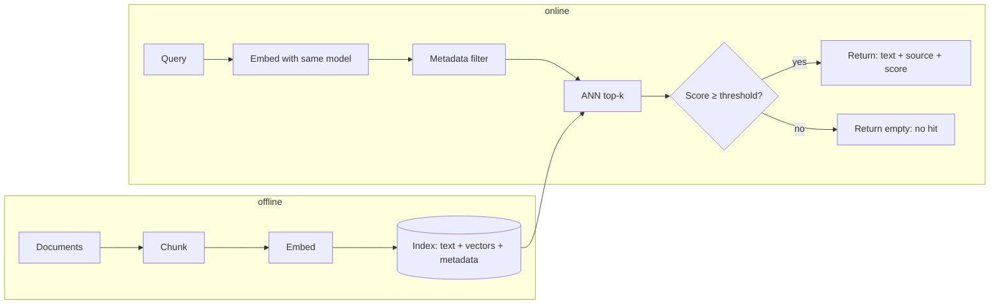

# Embeddings and Retrieval

> **Layer**: 3 · Knowledge Grounding | **Previous layer exit**: run a cancellable, observable end-to-end interaction | **This layer exit**: build a vector retrieval entry with metadata filtering and a no-hit path, and know that changing models requires an index rebuild
> **Prerequisites**: [Model API Contract](../02-inference-interface/model-api) | **Next**: [RAG: Retrieval-Augmented Generation](rag.md), [Advanced Retrieval](advanced-retrieval.md)

## 1. Overview

Keyword matching only sees literal strings: searching "how do I undo a release" will not find a document that says "restore the previous version". **An embedding turns a piece of text into a vector such that texts with similar meaning sit close together**, so differently-phrased questions can hit the passage that covers the topic. Retrieval only decides "which passages deserve a look"; generating answers is [RAG](rag.md).

The OpenAI guide offers a controlled comparison: for "When did we go to the moon?", the most relevant sentence "The first lunar landing occurred in July of 1969." shares **0% keywords but 65% semantic similarity** with the query, while the more literal-looking "When I ate the moon cake, it was delicious." shares 40% keywords but only 28% semantics (OpenAI Retrieval guide, retrievedAt 2026-09-01). That gap is the entire value of semantic search.

A vector retrieval entry consists of four things:

- **Embedding**: one model turns both corpus and queries into vectors; **the index and the query must use the same model—changing models requires rebuilding the index**.
- **Index**: brute-force scan is fine for small corpora; at scale use approximate nearest neighbor (ANN), the mainstream implementation being HNSW graph indexes.
- **Metadata**: every vector carries source path, title, permissions; retrieval can filter before scoring.
- **No-hit path**: scores below a threshold return empty—that is product behavior, not an exception (see the negative cases below).



### When to use / when not to

- **Use**: natural-language questions, variable phrasing, finding "the passage about this" across many documents; similarity tasks such as recommendation, clustering, anomaly detection (use-case list from the OpenAI guide, retrievedAt 2026-09-01).
- **Do not use**: exact identifiers (error codes, function names, order numbers)—grep / full-text / [BM25](advanced-retrieval.md) first; a corpus small enough to stuff into context—just stuff it (see the [Layer 3 decision table](index.md)).

### Decision table: retrieval options

| Option | Direction | Control | State | Trust domain | Minimum complexity |
| --- | --- | --- | --- | --- | --- |
| Keyword / full-text search | Query → inverted index | Fully self-managed | Index rebuildable | Corpus stays in-system | Lowest (built into most systems) |
| Vector retrieval (this page) | Query → nearest neighbors in vector space | Chunking/index/filtering yours; embedding depends on a model | Index rebuildable; model version is an input | Embedding provider enters the trust domain | Medium (embedding + index + pipeline) |
| Long-context stuffing | Corpus → prompt | Prompt-layer concat | Full text resent per request | Entire corpus enters context | Low (but cost grows linearly with scale) |

### Historical milestones

- 2016: HNSW graph index published (Malkov & Yashunin, arXiv:1603.09320): multi-layer proximity graphs, logarithmic complexity, structure similar to a skip list (retrievedAt 2026-09-01).
- Matryoshka representation learning (arXiv:2205.13147): vectors trained so leading dimensions can be truncated without losing core semantics; both the OpenAI `text-embedding-3` family and Cohere `embed-v4.0` implement it (retrievedAt 2026-09-01). The `text-embedding-3` release date is outside this verification pass—marked unverified.

## 2. Usage

Minimal hands-on: a **zero-API-key, pure-TypeScript, deterministic** vector retriever. It uses a hashing bag-of-words as the "teaching embedding"—this is a **lexical vector** that only sees literal overlap; real systems swap `embed()` for a model API call and change nothing else.

Save as `embeddings-retrieval.ts` (Node 22.18+ / 24 has built-in type stripping—run directly):

```ts
// Teaching fixture: deterministic hashing bag-of-words "embedding" + cosine retrieval.
// Teaching only: this is a LEXICAL vector. Real systems call an embedding model API,
// which maps paraphrases close together; this one cannot (see case 2).
// Run: node embeddings-retrieval.ts

const DIM = 512;

const STOPWORDS = new Set([
  "a", "an", "and", "are", "as", "at", "be", "but", "by", "do", "does", "for",
  "i", "if", "in", "is", "it", "its", "my", "of", "on", "or", "our", "that", "the",
  "this", "to", "we", "were", "what", "when", "where", "which", "who", "why", "you", "your",
]);

function tokenize(text: string): string[] {
  return (text.toLowerCase().match(/[a-z0-9]+/g) ?? []).filter((token) => !STOPWORDS.has(token));
}

function fnv1a(token: string): number {
  let hash = 0x811c9dc5;
  for (let i = 0; i < token.length; i++) {
    hash ^= token.charCodeAt(i);
    hash = Math.imul(hash, 0x01000193) >>> 0;
  }
  return hash >>> 0;
}

function embed(text: string): number[] {
  const vector = new Array<number>(DIM).fill(0);
  for (const token of tokenize(text)) {
    vector[fnv1a(token) % DIM] += 1;
  }
  const norm = Math.sqrt(vector.reduce((sum, value) => sum + value * value, 0));
  return norm === 0 ? vector : vector.map((value) => value / norm);
}

function cosine(a: number[], b: number[]): number {
  let dot = 0;
  for (let i = 0; i < a.length; i++) dot += a[i] * b[i];
  return dot;
}

type Doc = { id: string; text: string; meta: { source: string; team: "platform" | "growth" } };

const corpus: Doc[] = [
  {
    id: "deploy#0",
    text: "Deploy version v2 with nimbus deploy. Every deploy writes an entry to the deploy log.",
    meta: { source: "docs/deploy.md", team: "platform" },
  },
  {
    id: "rollback#0",
    text: "Roll back a bad release with nimbus rollback --to v1. Rollback restores the previous release in under a minute.",
    meta: { source: "docs/rollback.md", team: "platform" },
  },
  {
    id: "ratelimit#0",
    text: "Rate limits: the free plan allows 60 requests per minute. Raise the limit by upgrading the plan.",
    meta: { source: "docs/rate-limits.md", team: "growth" },
  },
  {
    id: "billing#0",
    text: "Billing invoices are issued on the first day of each month. Refunds are processed within five business days.",
    meta: { source: "docs/billing.md", team: "growth" },
  },
];

const index = corpus.map((doc) => ({ ...doc, vector: embed(doc.text) }));

type Hit = { id: string; source: string; score: number };

function retrieve(
  query: string,
  opts: { topK?: number; minScore?: number; team?: Doc["meta"]["team"] } = {},
): Hit[] {
  const topK = opts.topK ?? 3;
  const minScore = opts.minScore ?? 0.15;
  const queryVector = embed(query);
  return index
    .filter((doc) => (opts.team ? doc.meta.team === opts.team : true))
    .map((doc) => ({ id: doc.id, source: doc.meta.source, score: cosine(queryVector, doc.vector) }))
    .filter((hit) => hit.score >= minScore)
    .sort((a, b) => b.score - a.score || a.id.localeCompare(b.id))
    .slice(0, topK);
}

function report(label: string, query: string, hits: Hit[]): void {
  console.log(`${label} query: "${query}"`);
  if (hits.length === 0) {
    console.log("  NO HIT (every score below 0.15) -> refuse, do not guess");
    return;
  }
  for (const hit of hits) {
    console.log(`  ${hit.id.padEnd(12)} ${hit.source.padEnd(22)} score=${hit.score.toFixed(3)}`);
  }
}

// Case 1: shared vocabulary -> hit (metadata filter: platform docs only)
report("[1]", "how do i roll back a release", retrieve("how do i roll back a release", { team: "platform" }));

// Case 2: paraphrase, zero shared tokens -> a lexical vector misses it.
// A real embedding model still ranks "undo my deployment" near "roll back a release".
report("[2]", "undo my deployment", retrieve("undo my deployment"));

// Case 3: off-corpus question -> no hit is the correct behavior
report("[3]", "office wifi password", retrieve("office wifi password"));
```

Actual output (deterministic—compare character by character):

```text
[1] query: "how do i roll back a release"
  rollback#0   docs/rollback.md       score=0.471
[2] query: "undo my deployment"
  NO HIT (every score below 0.15) -> refuse, do not guess
[3] query: "office wifi password"
  NO HIT (every score below 0.15) -> refuse, do not guess
```

Case-by-case reading:

- **Case 1, the normal path**: query tokens literally overlap the rollback document, giving the top cosine score; the `team: "platform"` filter runs before scoring (the growth team's rate-limit/billing docs never entered the candidate set).
- **Case 2 is this page's most important output**: same intent, zero lexical overlap—a lexical vector must miss it. That is precisely the gap between the "teaching embedding" and a real embedding model, whose learned semantic space maps paraphrases to nearby positions. Swap `embed()` for a model API (same model for queries and documents) and nothing else changes.
- **Case 3, the negative path**: an off-corpus question returns an empty list. The empty result must travel to the product layer as "not found"—never let an upstream model improvise.

Acceptance: `node embeddings-retrieval.ts` matches the output above exactly (case 1 hits `rollback#0`; cases 2 and 3 are NO HIT). Cleanup: delete the script—no external state.

### Scenario matrix

| Scenario | Input / action | Output | Fits | Does not fit |
| --- | --- | --- | --- | --- |
| Basic: semantic search | NL query → embed → top-k | Text + source + score | Doc QA entry points | Exact-identifier lookup |
| Common: permission/tenant filter | Query + metadata predicate | Filtered top-k | Multi-team/multi-tenant corpora | Bare indexes without metadata |
| Combined: retrieve + refuse | All scores below threshold | Empty result → product-level refusal | Every vector retrieval entry | Throwing on empty results |

## 3. Principles

### 3.1 How similarity is computed

Cosine similarity measures the angle between two vectors: `cos(A, B) = A·B / (|A||B|)`, range −1 to 1, larger is more similar. The OpenAI guide recommends cosine and notes its embeddings are normalized to length 1—the dot product then equals cosine, and rankings match Euclidean distance (retrievedAt 2026-09-01). This page's fixture likewise L2-normalizes, so `cosine()` reduces to a dot product.

### 3.2 Why "similar meaning → small distance" holds at all

This is not an intrinsic property of vectors but the result of a **training objective**: embedding models are trained under constraints that pull related text pairs together and push unrelated ones apart (contrastive-style objectives)—the geometry of the space is manufactured. Training objectives, losses, and the math of the vector space belong to [Learn LLM's embedding chapter](https://llm.zenheart.site/chapters/11-rag); this site stops at the engineering conclusion: **changing models = changing spaces**; vectors from different models are not comparable.

### 3.3 Index structures: from brute force to HNSW

| Structure | Approach | Accuracy | Scale |
| --- | --- | --- | --- |
| Brute-force scan (this page's fixture) | Dot product against every vector | Exact, 100% | Up to thousands |
| ANN indexes | Explore only part of the candidates | Tunable recall (e.g. 95%+) | Millions to billions |
| HNSW (mainstream ANN) | Multi-layer proximity graph, sparse on top, dense below, greedy descent | High recall at logarithmic complexity | Default in mainstream vector DBs |

The HNSW paper (arXiv:1603.09320, retrievedAt 2026-09-01) describes elements assigned to layers with exponentially decaying probability, forming nested proximity-graph hierarchies; search starts at the top layer and descends, with logarithmic complexity; the authors note the similarity to a skip list. Engineering point: ANN **trades recall for latency**—measure recall on a golden set before tuning parameters for production.

### 3.4 Metadata filtering: filter first, score second

Metadata (source path, title, time, permissions, tenant) is stored alongside vectors, and retrieval narrows candidates with predicates. OpenAI vector stores support comparison operators (`eq/ne/gt/gte/lt/lte/in/nin`) and combinators (`and/or`), with up to 16 attribute keys of 256 characters each (retrievedAt 2026-09-01). Engineering rule: **filtering must happen before or during scoring** (pre-filter); retrieving first and deleting from top-k afterwards (post-filter) produces fake empties when the whole top-k gets filtered away.

### 3.5 Chunking: it defines retrieval granularity

Retrieval returns chunks, not whole documents, so **chunk boundaries cap recall**: too large, one chunk mixes topics and the vector gets diluted; too small, context is insufficient and citations stop matching intent. OpenAI vector stores default to `max_chunk_size_tokens=800` and `chunk_overlap_tokens=400`, with allowed ranges 100–4096 and overlap at most half the chunk size (retrievedAt 2026-09-01). Anthropic's reference is "usually no more than a few hundred tokens" per chunk (Contextual Retrieval post, retrievedAt 2026-09-01). General practice: cut at structural boundaries (headings/paragraphs/lists) first, then add modest overlap to survive boundary splits.

### 3.6 How to evaluate recall

The idea: build a golden set—each item is "question → document/chunk that should hit"—run retrieval and compute recall@k (fraction of items whose correct target appears in the top k). Every change to thresholds, top-k, or chunking is validated against this set. Construction methodology, statistics, and release gates live at [evals.zenheart.site](https://evals.zenheart.site/)—this site only covers "know to measure, and what".

### Spec vs. local measurement

| Claim | Official/spec position | This page's fixture |
| --- | --- | --- |
| Distance function | OpenAI recommends cosine; normalized → dot product suffices | L2-normalized bag-of-words, dot = cosine |
| Query/document embedding | Cohere requires `input_type` to distinguish `search_query` / `search_document` | Teaching hash has no such split (add it when moving to a real model) |
| Vector dimensions | OpenAI 3-small 1536 / 3-large 3072, truncatable via `dimensions` | 512 (teaching hash) |
| Default chunking | OpenAI 800 tokens / 400 overlap | None (whole docs indexed) |
| No-hit behavior | Not specified by any spec—product design | Below threshold 0.15, return empty |

## 4. Development

### Integration and upgrades

- **Changing embedding models is a breaking change**: dimensions and semantic space both change. Rebuild the index under a new model version; during migration point an alias at old and new indexes and shift traffic after validation.
- **Version pinning**: record the embedding model name in index metadata; the query side verifies "query model == index model" at startup and fails loudly on mismatch instead of quietly degrading.
- **Compatibility**: distances are comparable only within one model; scores from different models (even same family, different generation) are not comparable across indexes.

### Symptom → Evidence → Action → Done when

**Symptom**: documents that should be retrieved are not; answers miss the point.
**Evidence**: run the golden set for recall@k; inspect missed samples' chunks—length distribution outliers, semantics split at boundaries.
**Action**: re-chunk on structural boundaries with overlap; add a BM25 leg for exact-token queries (→ [Advanced Retrieval](advanced-retrieval.md)).
**Done when**: golden-set recall@k back to target; the miss list is empty or every entry has an explanation.

### Symptom → Evidence → Action → Done when

**Symptom**: after switching embedding models, retrieval is globally broken or all no-hit.
**Evidence**: errors or collapsed score distributions; check query-vector vs. index-vector dimensions.
**Action**: confirm index and query use the same model; rebuild fully with the new model, dual indexes during switchover.
**Done when**: the same golden set scores no lower on the new index; query-side model validation passes.

### Symptom → Evidence → Action → Done when

**Symptom**: too many no-hits; users get lots of "not found".
**Evidence**: list of no-hit queries plus their top-score distribution (near-0 vacuum vs. just-below-threshold borderline).
**Action**: borderline → lower the threshold and confirm precision holds; vacuum → lexical mismatch (fix with rewriting/hybrid search), which threshold tuning cannot solve.
**Done when**: false-refusal rate drops while "should refuse" items still all refuse (test both—see [evals](https://evals.zenheart.site/)).

### Symptom → Evidence → Action → Done when

**Symptom**: retrieval returns documents the user has no permission to see.
**Evidence**: run the unauthorized-access case set with a low-privilege account; check whether filtering happens before or after retrieval.
**Action**: fold ACL/tenant predicates into retrieval filtering (pre-filter); all retrieval paths share one filter builder.
**Done when**: the unauthorized set returns zero hits; normal-user recall is unaffected.

### Anti-patterns

- Treating a hit as fact. High similarity only means "similar", not "correct"; consumers must carry provenance (→ [RAG](rag.md)).
- Using chat-model output as an embedding. Embeddings come from an embedding endpoint—different model, different interface.
- One chunk per article. Granularity too coarse; citations cannot line up with passages.
- Top-k first, permission removal later. Post-filter creates fake empties and can leak metadata.

## 5. Resource Library

### Four-level reading route

- **Beginner**: the OpenAI vector embeddings guide (what, cosine, what for) → run this page's fixture.
- **Builder**: Cohere embeddings docs (`input_type` asymmetric embedding, multilingual, compression) → the OpenAI Retrieval guide (vector stores, attribute filtering, chunk defaults).
- **Operator**: the HNSW paper (how index parameters shape recall-latency) → [evals](https://evals.zenheart.site/) (golden sets and recall methodology).
- **Researcher**: Matryoshka representation learning (arXiv:2205.13147) → [Learn LLM's embedding chapter](https://llm.zenheart.site/chapters/11-rag) (training objectives and geometry).

### Resource table

| Name | Level | canonical URL | Use | Supported claim | Next |
| --- | --- | --- | --- | --- | --- |
| OpenAI: Vector embeddings | L1 | https://developers.openai.com/api/docs/guides/embeddings | Embedding uses, cosine recommendation, normalization, `dimensions` truncation | Use-case list; cosine + normalization; MTEB comparison | Run its cookbook search example |
| OpenAI: Retrieval | L1 | https://developers.openai.com/api/docs/guides/retrieval | Semantic-vs-keyword contrast, attribute filtering, chunk defaults | 0%/65% contrast; filter operators; 800/400 defaults | Try file search as a hosted chain |
| Cohere: Embeddings | L1 | https://docs.cohere.com/docs/embeddings | `input_type` asymmetric embedding, Matryoshka dimensions, compression | search_query/search_document split | Cross-check parameters when moving to a real model |
| HNSW paper | L0 | https://arxiv.org/abs/1603.09320 | ANN graph index structure and complexity | Multi-layer proximity graph; logarithmic complexity | Read your vector DB's tuning docs |
| Matryoshka paper | L0 | https://arxiv.org/abs/2205.13147 | Training method for truncatable vectors | Origin of the `dimensions` feature | → Learn LLM |

All official pages retrievedAt 2026-09-01; fields and prices change—recheck on the day of use.

### Active falsification and open questions

- "Truncated to 256 dims still beats the untruncated older model" is OpenAI's MTEB comparison; evaluate on your own Chinese/code corpora before porting.
- ANN recall varies with parameters (e.g. HNSW ef/M); this page gives no numbers—defaults differ per vector DB; trust your own docs and measurements.

### Where learn-ai stops / where to go next

This page delivers the retrieval entry point. Embedding training objectives and vector geometry → [Learn LLM](https://llm.zenheart.site/chapters/11-rag); wiring retrieval into the generation loop → [RAG](rag.md); hybrid search and reranking → [Advanced Retrieval](advanced-retrieval.md); recall evaluation methodology → [evals](https://evals.zenheart.site/).
