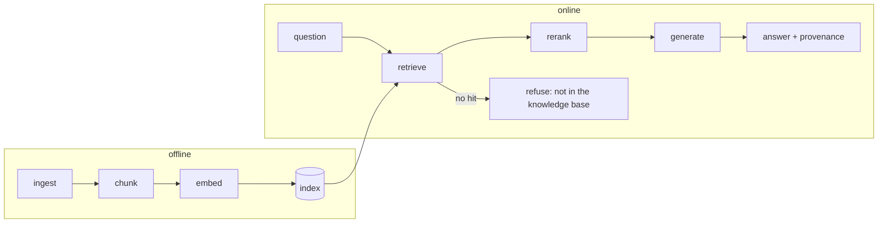

# RAG: Retrieval-Augmented Generation

> **Layer**: 3 · Knowledge Grounding | **Previous layer exit**: run a cancellable, observable end-to-end interaction | **This layer exit**: wire retrieval into the generation loop—answers cite sources, no-hit refuses, and a re-runnable rebuild pipeline exists for corpus updates
> **Prerequisites**: [Embeddings and Retrieval](embeddings-retrieval.md) | **Next**: [Advanced Retrieval](advanced-retrieval.md), [Tool Execution Engineering](../05-action/tool-execution)

## 1. Overview

The model cannot memorize your documents, tickets, and code. **RAG (Retrieval-Augmented Generation) first retrieves a few source-attributed passages, then has the model answer from them; if retrieval finds nothing, it refuses.** The original paper (Lewis et al., NeurIPS 2020) defines it as a combination of "parametric + non-parametric memory": the parametric memory is a pre-trained generator, the non-parametric memory an external vector index; the paper explicitly lists "providing provenance for decisions" and "updating world knowledge" as open problems for pure parametric models—citations and updates are not RAG accessories but the reason it exists (arXiv:2005.11401, retrievedAt 2026-09-01).

A RAG chain splits in two halves: an **offline pipeline** (corpus into index) and an **online path** (question into answer), six stages chained together—any stage failing disguises itself as "the model answered wrong":



| Stage | Responsibility | Failure mode | Symptom |
| --- | --- | --- | --- |
| ingest | fetch, clean, dedupe | dirty/stale documents indexed | answers carry old versions |
| chunk | cut into retrieval units | boundaries split semantics; granularity too coarse | misses; citations mismatch |
| embed | text → vectors | query and index use different models | globally broken results |
| retrieve | top-k recall | threshold/lexical mismatch | false refusals or noise |
| rerank | precise reordering and truncation (→ [Advanced Retrieval](advanced-retrieval.md)) | missing | context crowded out by noise |
| generate | answer from passages | no citation constraint; guessing on no-hit | hallucination; unsourced answers |

### When to use / when not to

- **Use**: answers need private corpora (product docs, tickets, policies, code), need citations, or the knowledge updates over time.
- **Do not use**: a batch of corpus fits in the context—stuff it (Anthropic's reference line: up to about 200,000 tokens with prompt caching, put the whole knowledge base in the prompt, retrievedAt 2026-09-01); you need to change behavior/style rather than facts—that is fine-tuning territory (→ Learn LLM bridge); an assistant scenario wanting whole-repo context injection—see context engineering first.

### Decision table: knowledge injection options

| Option | Direction | Control | State | Trust domain | Minimum complexity |
| --- | --- | --- | --- | --- | --- |
| RAG (this page) | Query → retrieve → context | Chunking/index/filtering/thresholds all yours | Index derived and rebuildable; corpus updates → rebuild index | Only hit fragments reach the model | Medium (this page's fixture is the minimal shape) |
| Long-context stuffing | Corpus → prompt bulk move | Prompt-layer concat | Full text resent per request; caching amortizes | Entire corpus enters context | Lowest (small single-batch corpus) |
| Fine-tuning | Corpus → parameters | Training recipe | Baked into weights; update = retrain | Corpus enters the training pipeline | Highest |

Selection order: **stuff → RAG → fine-tune**. Move to RAG when any of "no longer fits / updates often / needs citations" appears; consider fine-tuning only to change behavior—patching facts with fine-tuning is an anti-pattern; when knowledge changes, rebuild the index, do not retrain.

### Historical milestones

- 2020: RAG paper (Lewis et al., NeurIPS 2020): two formulations (RAG-Sequence conditions on the same retrieved passages across the sequence / RAG-Token can switch passages per token); set then-state-of-the-art on three open-domain QA tasks (arXiv:2005.11401, retrievedAt 2026-09-01).
- 2024-09: Anthropic published Contextual Retrieval (contextualized chunks + BM25 + reranking)—publish date outside this verification pass, marked unverified; content in [Advanced Retrieval](advanced-retrieval.md).

## 2. Usage

Minimal hands-on: a **zero-API-key complete RAG loop**. The retrieval side reuses the exact functions from [Embeddings and Retrieval](embeddings-retrieval.md); "generation" is a deterministic extractive mock—it picks the best-supported sentence from the retrieved passages and labels its source. Real systems swap `generate()` for a chat-model call (with a prompt requiring "answer only from the given passages, cite, say so if not found") and change nothing else.

Save as `rag.ts` (Node 22.18+ / 24 has built-in type stripping—run directly):

```ts
// Teaching fixture: complete RAG loop with a deterministic extractive "generator".
// Zero API key: embed/retrieve are the exact functions from the embeddings-retrieval
// page; the "generation" step extracts the best-supported sentence instead of
// calling a chat model, so the whole loop runs offline and deterministically.
// Run: node rag.ts

// ---- Embedder: identical to embeddings-retrieval.ts (hashing bag-of-words) ----

const DIM = 512;

const STOPWORDS = new Set([
  "a", "an", "and", "are", "as", "at", "be", "but", "by", "do", "does", "for",
  "i", "if", "in", "is", "it", "its", "my", "of", "on", "or", "our", "that", "the",
  "this", "to", "we", "were", "what", "when", "where", "which", "who", "why", "you", "your",
]);

function tokenize(text: string): string[] {
  return (text.toLowerCase().match(/[a-z0-9]+/g) ?? []).filter((token) => !STOPWORDS.has(token));
}

function fnv1a(token: string): number {
  let hash = 0x811c9dc5;
  for (let i = 0; i < token.length; i++) {
    hash ^= token.charCodeAt(i);
    hash = Math.imul(hash, 0x01000193) >>> 0;
  }
  return hash >>> 0;
}

function embed(text: string): number[] {
  const vector = new Array<number>(DIM).fill(0);
  for (const token of tokenize(text)) {
    vector[fnv1a(token) % DIM] += 1;
  }
  const norm = Math.sqrt(vector.reduce((sum, value) => sum + value * value, 0));
  return norm === 0 ? vector : vector.map((value) => value / norm);
}

function cosine(a: number[], b: number[]): number {
  let dot = 0;
  for (let i = 0; i < a.length; i++) dot += a[i] * b[i];
  return dot;
}

// ---- Ingest: chunk each document (fixed size + overlap, deterministic) ----

type Chunk = { id: string; text: string; source: string; vector: number[] };

function chunkText(text: string, size = 12, overlap = 4): string[] {
  const words = text.split(/\s+/);
  const chunks: string[] = [];
  for (let start = 0; start < words.length; start += size - overlap) {
    const chunk = words.slice(start, start + size).join(" ");
    if (chunk.trim().length > 0) chunks.push(chunk);
    if (start + size >= words.length) break;
  }
  return chunks;
}

function ingest(source: string, text: string): Chunk[] {
  return chunkText(text).map((chunk, i) => ({
    id: `${source}#${i}`,
    text: chunk,
    source,
    vector: embed(chunk),
  }));
}

const knowledgeBase = [
  ...ingest(
    "runbook.md",
    "The checkout service returns error 502 when the payment gateway times out after ten seconds. " +
      "To mitigate, the gateway timeout must stay below the service timeout. " +
      "On-call runbook: check the payment gateway dashboard first, then restart the checkout pods. " +
      "Escalate to the payments team if the gateway error rate exceeds five percent for five minutes.",
  ),
  ...ingest(
    "oncall.md",
    "The on-call rotation changes every Monday morning. " +
      "Handover notes must list open incidents and pending follow-ups. " +
      "Acknowledge a page within five minutes or it escalates to the secondary on-call.",
  ),
];

// ---- Retrieve: top-k with a floor threshold ----

function retrieve(query: string, topK = 2, minScore = 0.2): Chunk[] {
  const queryVector = embed(query);
  return knowledgeBase
    .map((chunk) => ({ chunk, score: cosine(queryVector, chunk.vector) }))
    .filter((hit) => hit.score >= minScore)
    .sort((a, b) => b.score - a.score || a.chunk.id.localeCompare(b.chunk.id))
    .slice(0, topK)
    .map((hit) => hit.chunk);
}

// ---- Generate: extractive mock. A real system calls a chat model here. ----

type Answer = { text: string; sources: string[] };

function generate(query: string, chunks: Chunk[]): Answer {
  if (chunks.length === 0) {
    // Refusal tier 1: nothing retrieved -> say no instead of guessing.
    return { text: "I cannot answer: nothing in the knowledge base matches this question.", sources: [] };
  }
  const queryTokens = new Set(tokenize(query));
  let best = { sentence: "", overlap: 0, source: "" };
  for (const chunk of chunks) {
    for (const sentence of chunk.text.split(/(?<=\.)\s+/)) {
      const overlap = tokenize(sentence).filter((token) => queryTokens.has(token)).length;
      if (overlap > best.overlap) best = { sentence, overlap, source: chunk.source };
    }
  }
  if (best.overlap === 0) {
    // Refusal tier 2: retrieved chunks exist but none supports an answer.
    return {
      text: "I cannot answer: retrieved passages do not address this question.",
      sources: chunks.map((chunk) => chunk.source),
    };
  }
  return {
    text: `${best.sentence} [${best.source}]`,
    sources: [...new Set(chunks.map((chunk) => chunk.source))],
  };
}

function ask(query: string): void {
  const chunks = retrieve(query);
  const answer = generate(query, chunks);
  console.log(`Q: ${query}`);
  console.log(`A: ${answer.text}`);
  console.log(`sources: ${answer.sources.length > 0 ? answer.sources.join(", ") : "(none)"}`);
  console.log("");
}

// Normal case: a question the runbook can support, answered WITH its source
ask("what to do when the checkout service returns error 502");

// Negative case: off-corpus question -> refusal instead of hallucination
ask("where is the company summer party");
```

Actual output (deterministic—compare character by character):

```text
Q: what to do when the checkout service returns error 502
A: The checkout service returns error 502 when the payment gateway times out [runbook.md]
sources: runbook.md

Q: where is the company summer party
A: I cannot answer: nothing in the knowledge base matches this question.
sources: (none)
```

Case-by-case reading:

- **Normal path**: retrieval hits a runbook chunk; the extractive generator picks the sentence with the highest query overlap and pins the provenance `runbook.md` onto the answer. `sources` is a structured field the UI renders as clickable citations—not decorative text.
- **Negative path**: an off-corpus question returns empty at the retrieval layer (below threshold) and the generator enters refusal tier 1. Note it does **not** fall back to parametric memory to invent an answer—that is "rather say no".
- When you replace `generate()` with a real model call, the refusal requirement goes into the system prompt. The OpenAI guide's QA sample is worded exactly so: "If the answer cannot be found, say 'I don't know.'" (retrievedAt 2026-09-01).

Acceptance: `node rag.ts` matches the output above exactly (the supported question carries `[runbook.md]`; the off-corpus question refuses with `sources: (none)`). Cleanup: delete the script.

### Scenario matrix

| Scenario | Input / action | Output | Fits | Does not fit |
| --- | --- | --- | --- | --- |
| Basic: document QA | Question → retrieve → generate | Answer + source list | Product docs / policy FAQ | Open-ended chat |
| Common: refusal path | Off-corpus / low-score question | "Not in the knowledge base" | Every RAG entry | Padding answers from outside the threshold |
| Combined: rebuild after update | Document change → fingerprint compare → incremental rebuild | New index entries | Frequently changing knowledge | Full re-embedding every time (wasteful) |

## 3. Principles

### 3.1 Traceability is a product interface

A RAG answer's trustworthiness comes from **every claim tracing back to a source document**. In engineering terms: chunks enter the index with stable ids (`source#index`) and metadata (path, title, permissions, content fingerprint); retrieval passes chunk ids into generation; the answer's citations (`[1]`, `[runbook.md]`) are rendered as clickable backlinks by the consumer. A RAG without citations is just "chat that read something"—it cannot be audited.

### 3.2 The no-hit path: rather say no

No-hit is not an exception branch but product behavior, handled in two tiers: retrieval returns nothing (refusal tier 1); retrieval returned results but none supports the question (refusal tier 2, still listing what was looked at). Both tiers need explicit user copy and instrumentation—the false-refusal rate is a core RAG operating metric (methodology at [evals](https://evals.zenheart.site/)). The opposite is silently passing emptiness to the model and letting it improvise: the direct source of hallucination.

### 3.3 The update pipeline: rebuilding when data changes

RAG's unit of knowledge update is **rebuilding the index**, not retraining the model. A re-runnable incremental pipeline:

```text
document change → compute a content fingerprint per chunk (e.g. SHA-256)
               → compare against the manifest's old fingerprints: same → skip, different → re-embed and upsert
               → document deleted → remove all its chunks by stable-id prefix
               → persist the manifest (id → fingerprint) as the next baseline
```

Stable ids (`docId:chunk:i` style) make updates and deletes deterministic; fingerprint comparison avoids paying to re-embed unchanged content. (Pattern distilled from the on-site semantic-search case study; the case itself lives in the appendices. For upsert semantics, see your vector DB's docs.)

### 3.4 Invariants

- **Index and query use the same embedding model**: changing models requires an index rebuild; validate model name and dimensions at startup.
- **Permission filtering at retrieval time**: ACLs enter retrieval predicates, not post-generation hiding (see [Embeddings and Retrieval](embeddings-retrieval.md)).
- **The answer exit uniformly goes through "cite or refuse"**: any path that bypasses retrieval and generates directly is a hallucination backdoor on this chain.

### Spec vs. local measurement

| Claim | Official/spec position | This page's fixture |
| --- | --- | --- |
| Chunk granularity | Anthropic: usually a few hundred tokens per chunk | 12 words per chunk, 4-word overlap (demo) |
| Refusal prompting | OpenAI sample: "if it cannot be found, say I don't know" | Generator has built-in two-tier refusal, prompt-independent |
| Citation shape | OpenAI file search returns provenance via `file_citation` annotations | `source` field + inline `[runbook.md]` |
| Update semantics | Vector DBs provide upsert (update if exists) | Not implemented (pipeline described in 3.3) |
| Hosted RAG | OpenAI file search: vector stores + built-in semantic/keyword search | This page hand-writes the full chain, for teaching |

## 4. Development

### Integration, testing, rollback

- **Into Layer 2**: after swapping in a real model, stream answer rendering reuses [Streaming](../02-inference-interface/streaming); the citation list arrives once after the stream ends, with `sources`.
- **Version pinning**: the index records the embedding model version; upgrading = new-version index + alias switch + golden-set comparison, never in-place overwrite.
- **Testing**: at least 20 real questions as fixtures—half "should hit" (answers must cite the right document), half "should refuse" (must refuse). Testing only "feels fluent" is not acceptance.
- **Rollback**: keep the previous index version; the traffic switch lives on the alias—rollback is pointing it back.

### Symptom → Evidence → Action → Done when

**Symptom**: the cited passage does not match the answer.
**Evidence**: replay sampled answers against the text their chunk ids point to; check whether boundaries split "symptom" and "fix" into different chunks.
**Action**: re-chunk on structural boundaries (headings/paragraphs) with overlap; rebuild with stable ids.
**Done when**: 20 sampled answers all cite passages that support them.

### Symptom → Evidence → Action → Done when

**Symptom**: many answerable questions get refused.
**Evidence**: refusal list plus those questions' score distribution (separate "vacuum" from "borderline").
**Action**: borderline → adjust the threshold; vacuum → lexical/semantic mismatch—add hybrid search and query rewriting (→ [Advanced Retrieval](advanced-retrieval.md)).
**Done when**: "should hit" items all hit and "should refuse" items still all refuse on the golden set.

### Symptom → Evidence → Action → Done when

**Symptom**: after a document update, answers still give the old version.
**Evidence**: compare index-entry fingerprints against current document content; check whether the update pipeline runs and stale chunks are cleaned.
**Action**: add fingerprint comparison and deletion per 3.3; hook index rebuilds into the document publishing flow.
**Done when**: within N minutes of publishing, the same question's answer points to the new version.

### Symptom → Evidence → Action → Done when

**Symptom**: an unauthorized user asked out restricted content.
**Evidence**: run the unauthorized case set with a low-privilege account; check retrieval logs for ACL predicates.
**Action**: fold ACLs into retrieval filtering; all retrieval entries share one filter builder.
**Done when**: the unauthorized set is empty; normal-user recall unchanged.

### Anti-patterns

- Fine-tuning instead of updating documents. Knowledge changed → rebuild the index; fine-tuning changes behavior, not the fact source.
- Embedding the whole repo as one chunk. Granularity too coarse—retrieval dilutes, citations blur.
- Treating a hit as fact. High similarity only means "similar"; generation must still be constrained to the given passages.
- Letting the model answer on no-hit. Empty results must short-circuit to refusal copy.
- Accepting fluency only. A RAG shipped without a golden set has no acceptance at all.

## 5. Resource Library

### Four-level reading route

- **Beginner**: run this page's fixture → the OpenAI Retrieval guide (what hosted RAG looks like).
- **Builder**: the OpenAI file search tool docs (vector stores, citation annotations, metadata filtering) → the Anthropic Contextual Retrieval post (where retrieval quality ceilings are).
- **Operator**: this page's runbooks → [evals](https://evals.zenheart.site/) (turn citation correctness / false-refusal rate into release gates).
- **Researcher**: the RAG paper (Lewis et al. 2020) → [Learn LLM chapters 11–12](https://llm.zenheart.site/chapters/11-rag) (mechanisms and evaluation of chunking, recall, citation correctness).

### Resource table

| Name | Level | canonical URL | Use | Supported claim | Next |
| --- | --- | --- | --- | --- | --- |
| RAG paper | L0 | https://arxiv.org/abs/2005.11401 | Definition, parametric/non-parametric memory, provenance & update motivation | RAG-Sequence/Token; SOTA on three QA tasks | Read the experimental setup |
| Anthropic: Contextual Retrieval | L1 | https://www.anthropic.com/news/contextual-retrieval | Retrieval failure modes and the 200k-token stuffing reference line | Context loss on chunking; 49%/67% gains (expanded in Advanced Retrieval) | Try its cookbook |
| OpenAI: Retrieval | L1 | https://developers.openai.com/api/docs/guides/retrieval | Semantic search, attribute filtering, chunk defaults, response synthesis | Filter operators; 800/400 defaults | Wire up file search |
| OpenAI: File search | L1 | https://developers.openai.com/api/docs/guides/tools-file-search | Hosted RAG shape and citation annotations | `file_citation`; semantic + keyword hybrid | Compare against a self-built chain |
| OpenAI: Vector embeddings | L1 | https://developers.openai.com/api/docs/guides/embeddings | Refusal wording in the QA sample | "If it cannot be found, say I don't know" | — |

All pages retrievedAt 2026-09-01.

### Active falsification and open questions

- "Up to about 200,000 tokens can be stuffed" is Anthropic's reference line (with prompt caching); windows and prices change—recheck on the day of use.
- This page's extractive generator cannot hallucinate, so it also cannot validate "how well prompt constraints suppress real-model hallucination"—that question belongs to controlled evaluation at [evals](https://evals.zenheart.site/).

### Where learn-ai stops / where to go next

This page delivers the minimal RAG chain with citations and refusals. Retrieval quality upgrades (hybrid / rerank / contextualized chunking) → [Advanced Retrieval](advanced-retrieval.md); handing retrieval to an Agent as a tool → [Tool Execution Engineering](../05-action/tool-execution); mechanisms and evaluation of chunking and recall → [Learn LLM chapters 11–12](https://llm.zenheart.site/chapters/11-rag) and [evals](https://evals.zenheart.site/).
