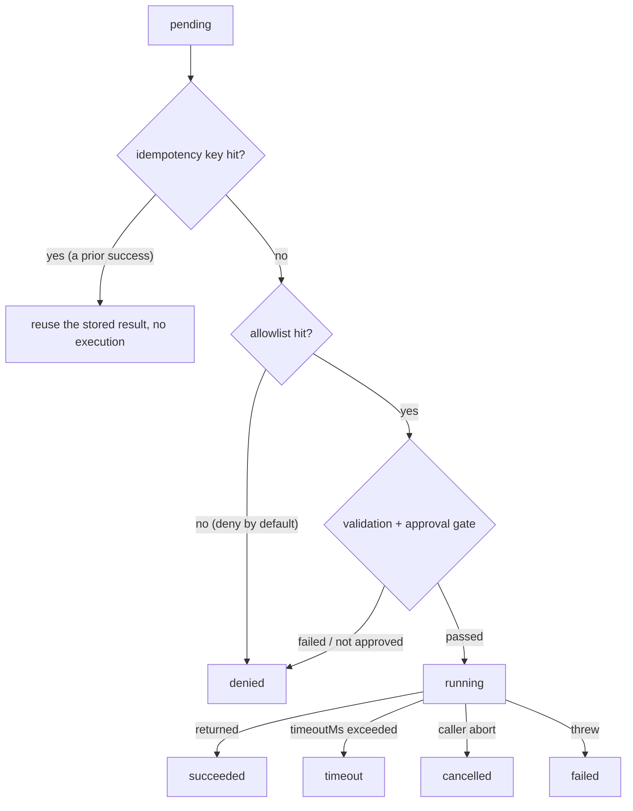
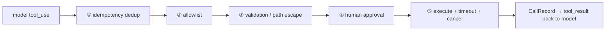

> **Group**: 5 · Action (writing the world)  |  **Previous group exit**: define and validate the tool calling contract (schema, whitelist, argument validation, result return — [Tool Calling Contract](../05-action/tool-calling))  |  **This page exit**: you can put a single model-initiated action into a controlled executor that can deny, time out, cancel, and deduplicate
> **Prerequisites**: [Tool Calling Contract](../05-action/tool-calling), [Structured Output](../02-inference-interface/structured-output)  |  **Next**: [Workflow Patterns](../06-agent-systems/workflow.md), [Recovery and Human-in-the-Loop](../06-agent-systems/recovery-hitl.md), [Security](../08-production/security)

## 1. Overview

**BLUF**: the `tool_use` block a model returns is a *request*, not an execution. The [tool calling contract](../05-action/tool-calling) earlier in this group defines how the model expresses a call; this page defines how **your code executes it**. Any action that changes external state (writing files, sending requests, mutating a database) must pass five gates: **idempotency dedup → allowlist → argument validation → human approval → timeout and cancellation**. Miss any gate, and retries, network jitter, or model hallucinations turn into real-world side effects.

### Mental model: the execution state machine

The model only sees "call → result"; the execution side is an explicit state machine where every edge has an owner:



The key distinction: `denied` happens **before any side effect** (a policy rejection — safe to correct and resend); `failed`/`timeout`/`cancelled` happen **during or after execution** (side effects may have partially happened; retries must be protected by an idempotency key).

### When to use / when not to

- Use: any tool call that will reach production — whether from an agent loop, a workflow, or a single API interaction.
- Skip: pure readonly queries with zero cost can be called directly during prototyping; but the moment a call sits on a retry path, `readonly` is also a side-effect tier that must be registered.
- Skip (group boundary): the full closed loop of multi-step orchestration, pause/resume, and approval queues belongs to the [Agent Systems group](../06-agent-systems/agent-runtime.md) (group 6)—this page delivers the **controlled-execution primitive for a single action**; the `approval` tier only keeps the approval-gate hook, while the approval workflow itself lives in group 6's [Recovery and Human-in-the-Loop](../06-agent-systems/recovery-hitl.md).

### Decision table

| Option | Direction | Control | State | Trust domain | Minimum complexity |
| --- | --- | --- | --- | --- | --- |
| Direct function call (hardcoded) | Write | Fully yours, no model | None | In-process | If steps are enumerable, don't let the model decide |
| Bare tool call (model wired to function) | Write | Model decides when and with what args | Single call result | In-process | Demos and one-off prototypes |
| Controlled executor (this page) | Write | Five gates + call records | Every call auditable | In-process | Any tool call heading to production |
| MCP server tool | Write | Server-side permissions and sandbox | Session state | Cross-process boundary | When tools must be reused across processes/teams (see [Protocol Map](../07-interoperability/)) |

"Direction" follows the read/write-world framing of the [complexity ladder](../00-map/complexity-ladder): from rung 3 upward, every rung of the write world must answer for permissions, idempotency, cancellation, retry, approval, and rollback.

### Four side-effect tiers

| Tier | Definition | Execution policy | Examples |
| --- | --- | --- | --- |
| `readonly` | No external state change | Execute freely, retry at will | Query config, search |
| `reversible` | Undoable via a compensating action | Execute + register compensation | Create draft, add tag |
| `irreversible` | Cannot be undone | Idempotency key required; no auto-retry on failure | Delete data, outbound send |
| `approval` | Irreversible and high blast radius | Human approval required before execution | Production release, money movement |

Historical milestones: this page consolidates the old "Advanced Tool Use" page (a repository archive of an Anthropic engineering post); model-side features (tool search, programmatic calling, call examples) moved to the relevant protocol chapters — this page keeps only the **execution-side** invariants. Earlier timelines unverified; not fabricated.

## 2. Usage

Minimal hands-on: a controlled executor + two mock tools (one readonly, one writing a file), demonstrating **normal / timeout / cancel / allowlist denial** outputs, plus two negatives: idempotency dedup and path-traversal rejection. Zero API keys, zero dependencies.

**Environment**: Node ≥ 22.18 (native type stripping). Save as `tool-execution.ts`, run `node tool-execution.ts`.

```ts
// tool-execution.ts — a controlled tool executor: allowlist + validation + idempotency + timeout + cancel.
// Zero dependencies. Runs natively on Node >= 22.18: node tool-execution.ts
import { mkdir, rm, writeFile } from "node:fs/promises";
import { tmpdir } from "node:os";
import { join, resolve, sep } from "node:path";
import { setTimeout as sleep } from "node:timers/promises";

// ---------- Contracts: four side-effect tiers + a call state machine ----------
type SideEffect = "readonly" | "reversible" | "irreversible" | "approval";
type CallStatus =
  | "pending" | "running" | "succeeded"
  | "failed" | "timeout" | "cancelled" | "denied";

interface ToolDef {
  name: string;
  sideEffect: SideEffect;
  timeoutMs: number;          // deadline: abort on expiry; never wait for the tool to behave
  validate: (input: any) => string | null; // non-null = rejection reason (args / path escape)
  run: (input: any, signal: AbortSignal) => Promise<unknown>;
}

interface CallRecord {
  id: number;
  tool: string;
  status: CallStatus;
  output?: unknown;
  error?: string;
}

const BASE_DIR = join(tmpdir(), "tool-execution-demo");

// ---------- Two mock tools: one readonly, one that writes a file ----------
const readConfig: ToolDef = {
  name: "read_config",
  sideEffect: "readonly",
  timeoutMs: 1000,
  validate: (i) => (typeof i.key === "string" ? null : "key must be a string"),
  run: async (i) => ({ key: i.key, value: "dark-theme" }),
};

const slowSearch: ToolDef = {
  name: "slow_search",
  sideEffect: "readonly",
  timeoutMs: 50, // deliberately small, to demonstrate timeout
  validate: () => null,
  run: async (i, signal) => {
    await sleep(500, undefined, { signal }); // tools MUST honor the signal, or cancel cannot propagate
    return { hits: 42 };
  },
};

const writeReport: ToolDef = {
  name: "write_report",
  sideEffect: "irreversible",
  timeoutMs: 1000,
  validate: (i) => {
    const target = resolve(BASE_DIR, i.path);
    if (target !== BASE_DIR && !target.startsWith(BASE_DIR + sep)) {
      return `path escapes sandbox: ${i.path}`;
    }
    return null;
  },
  run: async (i) => {
    const target = resolve(BASE_DIR, i.path);
    await writeFile(target, i.content, "utf8");
    return { written: i.path, bytes: i.content.length };
  },
};

const deleteEverything: ToolDef = {
  name: "delete_everything",
  sideEffect: "irreversible",
  timeoutMs: 1000,
  validate: () => null,
  run: async () => ({ deleted: true }),
};

// ---------- Executor: registry + allowlist + idempotency + timeout + cancel ----------
class ControlledExecutor {
  private registry = new Map<string, ToolDef>();
  private allowlist = new Set<string>();
  private idempotency = new Map<string, CallRecord>();
  private nextId = 1;

  register(tool: ToolDef, allowed = true) {
    this.registry.set(tool.name, tool);
    if (allowed) this.allowlist.add(tool.name);
  }

  async execute(
    name: string,
    input: any,
    opts: { idempotencyKey?: string; approved?: boolean; signal?: AbortSignal } = {},
  ): Promise<CallRecord> {
    const rec: CallRecord = { id: this.nextId++, tool: name, status: "pending" };
    // state-machine transition log: print old -> new, then update atomically
    const log = (s: CallStatus) => {
      console.log(`[call ${rec.id}] ${name}: ${rec.status} -> ${s}`);
      rec.status = s;
    };

    // 1) Idempotency: a successful call under the same key is reused, never re-executed
    if (opts.idempotencyKey && this.idempotency.has(opts.idempotencyKey)) {
      const prev = this.idempotency.get(opts.idempotencyKey)!;
      rec.status = prev.status; rec.output = prev.output;
      console.log(`[call ${rec.id}] ${name}: deduplicated (reuse call ${prev.id})`);
      return rec;
    }
    // 2) Permission gate: allowlist (deny by default)
    if (!this.allowlist.has(name)) {
      rec.error = "tool not in allowlist";
      log("denied"); return rec;
    }
    const tool = this.registry.get(name)!;
    // 3) Argument validation (including path-escape protection)
    const invalid = tool.validate(input);
    if (invalid) {
      rec.error = `invalid input: ${invalid}`;
      log("denied"); return rec;
    }
    // 4) Human-approval gate: the "approval" tier must carry an explicit approval
    if (tool.sideEffect === "approval" && opts.approved !== true) {
      rec.error = "requires human approval";
      log("denied"); return rec;
    }

    // 5) Execute + timeout + cancel (one AbortController merges both sources)
    const controller = new AbortController();
    let timedOut = false;
    const timer = setTimeout(() => { timedOut = true; controller.abort(); }, tool.timeoutMs);
    opts.signal?.addEventListener("abort", () => controller.abort(), { once: true });

    log("running");
    try {
      rec.output = await tool.run(input, controller.signal);
      log("succeeded");
      if (opts.idempotencyKey) this.idempotency.set(opts.idempotencyKey, rec);
    } catch (err: any) {
      if (timedOut) rec.error = `deadline exceeded after ${tool.timeoutMs}ms`;
      else if (controller.signal.aborted) rec.error = "cancelled by caller";
      else rec.error = String(err);
      log(timedOut ? "timeout" : controller.signal.aborted ? "cancelled" : "failed");
    } finally {
      clearTimeout(timer);
    }
    return rec;
  }
}

// ---------- Demo: normal / timeout / cancel / allowlist denial (+ idempotency & validation negatives) ----------
async function main() {
  await rm(BASE_DIR, { recursive: true, force: true });
  await mkdir(BASE_DIR, { recursive: true });

  const ex = new ControlledExecutor();
  ex.register(readConfig);
  ex.register(slowSearch);
  ex.register(writeReport);
  ex.register(deleteEverything, /* allowed */ false); // registered but NOT in the allowlist

  console.log("== case 1: normal readonly call ==");
  const c1 = await ex.execute("read_config", { key: "theme" });
  console.log(JSON.stringify(c1.output));

  console.log("== case 2: timeout (timeoutMs=50, tool needs 500ms) ==");
  const c2 = await ex.execute("slow_search", { q: "agents" });
  console.log(`status=${c2.status} error=${c2.error}`);

  console.log("== case 3: caller cancels (abort after 20ms) ==");
  const caller = new AbortController();
  setTimeout(() => caller.abort(), 20);
  const c3 = await ex.execute("slow_search", { q: "agents" }, { signal: caller.signal });
  console.log(`status=${c3.status} error=${c3.error}`);

  console.log("== case 4: tool not in the allowlist ==");
  const c4 = await ex.execute("delete_everything", {});
  console.log(`status=${c4.status} error=${c4.error}`);

  console.log("== bonus A: idempotency-key dedup ==");
  const c5 = await ex.execute("write_report",
    { path: "report.txt", content: "hello" }, { idempotencyKey: "report-1" });
  const c6 = await ex.execute("write_report",
    { path: "report.txt", content: "hello" }, { idempotencyKey: "report-1" });
  console.log(`first=${c5.status}, second deduplicated=${c6.id !== c5.id && c6.status === "succeeded"}`);

  console.log("== bonus B: path traversal rejected by validation ==");
  const c7 = await ex.execute("write_report", { path: "../escape.txt", content: "x" });
  console.log(`status=${c7.status} error=${c7.error}`);

  await rm(BASE_DIR, { recursive: true, force: true });
  console.log("cleanup done");
}

main();
```

**Normal output** (deterministic; compare line by line):

```text
== case 1: normal readonly call ==
[call 1] read_config: pending -> running
[call 1] read_config: running -> succeeded
{"key":"theme","value":"dark-theme"}
== case 2: timeout (timeoutMs=50, tool needs 500ms) ==
[call 2] slow_search: pending -> running
[call 2] slow_search: running -> timeout
status=timeout error=deadline exceeded after 50ms
== case 3: caller cancels (abort after 20ms) ==
[call 3] slow_search: pending -> running
[call 3] slow_search: running -> cancelled
status=cancelled error=cancelled by caller
== case 4: tool not in the allowlist ==
[call 4] delete_everything: pending -> denied
status=denied error=tool not in allowlist
== bonus A: idempotency-key dedup ==
[call 5] write_report: pending -> running
[call 5] write_report: running -> succeeded
[call 6] write_report: deduplicated (reuse call 5)
first=succeeded, second deduplicated=true
== bonus B: path traversal rejected by validation ==
[call 7] write_report: pending -> denied
status=denied error=invalid input: path escapes sandbox: ../escape.txt
cleanup done
```

**The negatives are part of that output**: case 2 (timeout), case 3 (cancel), case 4 (allowlist denial), and bonus B (path-traversal rejection) are expected failure paths, not bugs — the point of a controlled executor is to make these paths **visible and assertable**.

**Acceptance command**:

```bash
node tool-execution.ts | grep -c "^status="   # expected: 4 (timeout / cancelled / denied ×2)
```

**Cleanup**: the script cleans up after itself (writes into a temp dir under `os.tmpdir()` and removes it on exit). The code above is the complete fixture; no placeholders.

### Scenario walkthrough

| Scenario | Input | Action | Output | Fits | Does not fit |
| --- | --- | --- | --- | --- | --- |
| Prototype check | One readonly tool | `register` + direct `execute` | CallRecord | Demos, tutorials | Production with retry paths |
| Production single action | Write endpoint + idempotency key | All five gates on | succeeded/denied records | User-confirmed writes | High-frequency readonly (validation cost can be relaxed) |
| Inside an agent loop | Model-returned `tool_use` | `execute` each; return `denied`/`failed` as error `tool_result` | Model self-corrects | Any agent | — |

## 3. Principles

### Five gates: from `tool_use` to `tool_result`



Gate order matters: **cheap, deterministic gates first**. Idempotency dedup and the allowlist are pure in-memory checks that block most illegal replays up front; validation comes next; human approval last (never wake a human for a call that was doomed anyway). This mirrors API-gateway layering: rate limit → auth → validation → business.

### Key invariants

1. **Deny by default**: any tool name not on the allowlist is `denied`. The model can hallucinate tool names; the executor must not execute nonexistent intent.
2. **Idempotency before execution**: the dedup lookup happens before any side effect; the idempotent result is registered only after `succeeded` — failures do not consume the key.
3. **The deadline belongs to the executor**: `timeoutMs` is enforced by the executor (abort), not by tool goodwill. Tools must honor the passed `AbortSignal`, or cancellation cannot propagate (see `slow_search` using `sleep(..., { signal })`).
4. **Timeout ≠ cancel**: both flow through one `AbortController`, but terminal states differ (`timeout` vs `cancelled`) because retry policies differ — timeouts can be retried with backoff; a cancel is caller intent and must not be retried.
5. **denied is correctable, failed needs diagnosis**: `denied` goes back to the model (fix args / pick another tool); `failed` goes to logs and alerts.

### Error semantics: what is retryable

| Error class | Retryable | Why | Handling |
| --- | --- | --- | --- |
| Timeout, network 5xx, rate-limit 429 | Yes (exponential backoff + jitter) | Transient | Must carry an idempotency key |
| Validation failure, allowlist denial | No | Deterministic rejection | Return as error `tool_result`; let the model correct |
| Business failure (insufficient balance, 409 conflict) | No | Deterministic business state | Escalate to business branch or a human |
| Executed but response lost (unknown state) | Query, don't replay | Side effect may have happened | Look up the idempotent result; compensate only if truly absent |

### Spec requirements vs local test

| Official statement | Source | Local fixture counterpart |
| --- | --- | --- |
| Client tools execute in **your code**: the model returns `tool_use`; you execute and send back `tool_result` | Claude tool use docs (L1, retrievedAt 2026-09-01) | `execute()` returns a `CallRecord`; the caller maps it to `tool_result` |
| SDK tool-result blocks carry an error flag (e.g. the third `false` argument in the Go example) | same | The `error` field of `denied`/`failed` records is the error payload |
| `tool_choice: {type:"auto", disable_parallel_tool_use:true}` caps one call per turn | same | The executor handles each `execute` serially |
| Strict mode requires `additionalProperties:false` + all fields required so calls match the schema | OpenAI function calling docs (L1, retrievedAt 2026-09-01) | The fixture hand-writes `validate()`; production should use a JSON Schema validator |
| "The model may return several calls at once" | same | The agent loop executes them one by one — serial by construction |

### Split of duties within the group: contract vs execution

The [tool calling contract](../05-action/tool-calling) answers how the model **expresses** a call (schema, selection, validation); this page answers how the system **executes** it. The contract layer validates **around the model call**; the execution layer validates **before touching the world** — the former stops the model from misspeaking, the latter stops the mistake from happening.

## 4. Development

### Integrating into an agent loop

1. Map each `tool_use` block in the model response to `execute(name, input, { idempotencyKey: hash(use_id or business key) })`.
2. Map `CallRecord` back to `tool_result`: `succeeded` → normal content; `denied`/`failed` → error content so the model self-corrects (Anthropic's reported experience: letting the agent know a tool failed and adapt works better than crashing).
3. Route `approval`-tier tools to the approval queue of [Recovery and Human-in-the-Loop](../06-agent-systems/recovery-hitl.md).

### Version pinning and compatibility

- Node ≥ 22.18 runs `.ts` natively (type stripping); below that, compile with `tsc` or strip types to `.mjs` (logic has zero dependencies).
- Passing `AbortSignal` into `sleep` relies on `node:timers/promises` (Node 16+). `addEventListener("abort")` is the standard Web API.

### Testing

- **Failure injection**: as the fixture demonstrates, swap the `run` function to inject 503/timeout; assert terminal state and idempotent registration.
- **Four-state coverage**: every new tool gets at least four assertions — normal, timeout, cancel, denied.
- **Concurrent idempotency**: two same-key calls arriving concurrently execute only once (a production implementation replaces the `Map` with a locked store or a DB unique constraint).

### Rollback

The executor is pure library code; rolling back means reverting the version. What actually needs rollback design is **side effects that already happened**: `reversible` tiers register compensating actions; `irreversible` tiers must answer "what if this was wrong?" at design time (see the saga discussion in [Workflow Patterns](../06-agent-systems/workflow.md)).

### Symptom → Evidence → Fix → Done

**Symptom**: the user receives duplicate emails / duplicate charges.
**Evidence**: the call log shows two same-argument `succeeded` rows; upstream had a timeout-retry or a double click.
**Fix**: add an idempotency key for that tool (business keys beat random keys, e.g. `orderId + action`); change retry to "query the idempotent result → execute only if absent".
**Done**: a concurrency/replay integration test with the same key produces exactly one side-effect record; the log shows `deduplicated`.

### Symptom → Evidence → Fix → Done

**Symptom**: logs show the model calling a nonexistent or unauthorized tool name (hallucinated tool).
**Evidence**: many `CallRecord.status=denied, error="tool not in allowlist"`.
**Fix**: first confirm this is **intended defense**, not a bug; if the model keeps trying, the tool description is misleading — fix the description in the [tool calling contract](../05-action/tool-calling) layer instead of widening the allowlist.
**Done**: the `denied` rate falls; no dangerous tools were added to accommodate the model.

### Symptom → Evidence → Fix → Done

**Symptom**: after the user cancels, CPU/connections stay occupied, or a file keeps being written.
**Evidence**: `cancelled` already returned, but the tool never checks `signal` internally.
**Fix**: rework the tool's `run` to propagate the `AbortSignal` inside long tasks (pass it to every `await` point); for non-interruptible syscalls, check `signal.aborted` after completion and discard the result.
**Done**: resource usage drops to zero within 100ms of cancel; the side-effect file does not exist or is cleaned up.

### Symptom → Evidence → Fix → Done

**Symptom**: a security audit finds a tool can be steered to arbitrary paths / intranet addresses (path traversal, SSRF).
**Evidence**: `validate` imposes no constraint on paths/URLs; `../` or `http://169.254.169.254/` passes through.
**Fix**: path arguments must `resolve` inside an allowlisted base directory (fixture bonus B); URL arguments validate scheme + domain allowlist and reject resolution to intranet IPs.
**Done**: all escape test cases end `denied`; the pentest checklist is archived under [Security](../08-production/security).

### Anti-patterns

- **Treating "logged 200" as success**: HTTP 200 with an error body — validation must reach business semantics, not transport.
- **Retry without a key**: any `retry` loop that does not consult idempotency first is amplifying side effects.
- **Timeouts by tool goodwill**: putting `setTimeout` inside the tool instead of the executor means there is no deadline.
- **Widening the allowlist to fix one `denied`**: misdiagnosing a policy problem as a tool problem (the right fix is the tool description or argument contract).
- **A rubber-stamp approval tier**: an approval UI with a single "OK" button and no context diff degrades human approval to click fatigue.

## 5. Resource Library

Four-level reading route:

- **Beginner**: finish this page → recite the five gates and the execution state machine; run the fixture's four outputs.
- **Builder**: [Tool Calling Contract](../05-action/tool-calling) (model side) + the Claude tool use docs (client/server split, `tool_result` format).
- **Operator**: OpenAI function calling's strict mode and parallel-call control; [Recovery and Human-in-the-Loop](../06-agent-systems/recovery-hitl.md) (the full approval loop).
- **Researcher**: Building Effective Agents (ACI: design tool interfaces like human interfaces); the model-side evolution in advanced tool use (tool search / programmatic calling).

### Resource table

| Name | Evidence tier | canonical URL | Use | Supported claim | Next |
| --- | --- | --- | --- | --- | --- |
| Tool use with Claude (official docs) | L1 (maintainer) | https://platform.claude.com/docs/en/agents-and-tools/tool-use/overview | Client/server tool split, `tool_use`/`tool_result` round trip, `tool_choice` | "Client tools run in your application; the model returns tool_use, your code executes and returns tool_result" (retrievedAt 2026-09-01) | [Tool Calling Contract](../05-action/tool-calling) |
| Function calling (OpenAI docs) | L1 (maintainer) | https://platform.openai.com/docs/guides/function-calling | Strict mode, parallel-call toggle, tool-definition practices | "Strict requires additionalProperties:false and all fields required"; "when the model calls a function you must execute it and return the result" (retrievedAt 2026-09-01) | Compare with your `validate` |
| Building Effective Agents (Anthropic) | L1 (maintainer) | https://www.anthropic.com/engineering/building-effective-agents | ACI design, poka-yoke tool arguments, stopping conditions | "Invest as much effort in agent-computer interfaces as human-computer interfaces"; the absolute-path fix example (retrievedAt 2026-09-01) | [Agent Runtime](../06-agent-systems/agent-runtime) |
| How we built our multi-agent research system | L1 (maintainer) | https://www.anthropic.com/engineering/built-multi-agent-research-system | Production-agent fault-tolerance posture | "Retry logic + regular checkpoints + resume from where the error occurred, not restart from scratch" (retrievedAt 2026-09-01) | [Multi-Agent Systems](../06-agent-systems/multi-agent.md) |
| Advanced tool use (Anthropic engineering) | L1 (maintainer; repository archive of the old page) | https://www.anthropic.com/engineering/advanced-tool-use | Model-side scaling: tool search / programmatic calling / call examples | Archive numbers (55K-token tool-definition burden etc.) not re-verified this round — treat as unverified | [Protocol Map](../07-interoperability/) (tool scale under MCP) |

### Active falsification and open questions

- Falsification entry: if your system contains a tool call that needs **none** of the five gates and has never had an incident — describe its shape and runtime; the "production minimum" claim of this page needs a narrower boundary.
- Open: the distributed implementation of idempotent stores (concurrent same-key, cross-process locking) is only given an exit here; it sits between [Deployment and Release](../08-production/deployment) and backend engineering.
- Open: how model-side tool search and deferred loading (`defer_loading`) affect executor allowlist semantics (how dynamically discovered tools enter the allowlist) — to be linked back once the MCP protocol chapter lands.

### Where learn-ai stops / where to go next

- After a single controlled action — composing and recovering multi-step: [Workflow Patterns](../06-agent-systems/workflow.md).
- The full protocol of approval queues, pause/resume: [Recovery and Human-in-the-Loop](../06-agent-systems/recovery-hitl.md).
- The full picture of injection, SSRF, and prompt-attack defense: [Security](../08-production/security) (group 8, Production and Operations).
- Proving (not demoing) tool-execution quality: [Testing](../08-production/testing) and [evals](https://evals.zenheart.site/).
