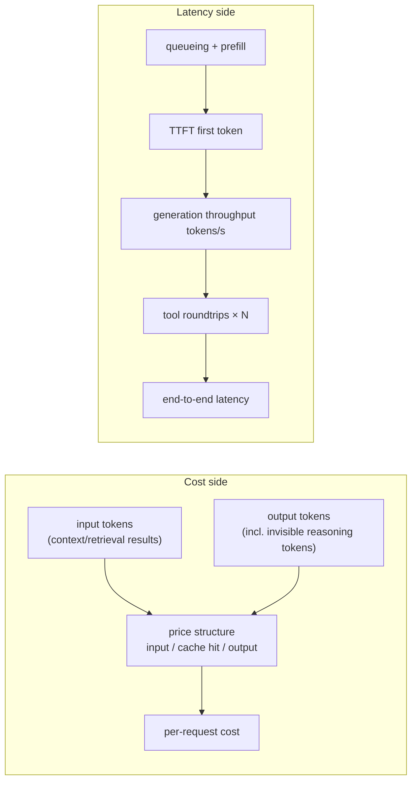

> **Layer**: 5 · Reliable Operations ｜ **Previous layer exit**: can restrict permissions, pause/resume tasks ｜ **This layer exit**: can break down a request's cost and latency and pick the cost-effective lever on the optimization ladder
> **Prerequisites**: [Model API Contract](../02-integration/model-api) (usage field), [Observability](observability) (per-request records) ｜ **Next**: [Deployment and Release](deployment) (budget alerts and breakers)

## 1. Overview

**BLUF**: an AI application's cost and latency are not a vendor-owned black box — they are **decomposable, accountable, optimizable engineering quantities**. Cost = per-request token usage × the price structure (input/output/cache tiers); latency = TTFT (time to first token) + generation throughput + tool roundtrips. The right order is **account first, then optimize** — without [observability](observability)'s per-request records, all optimization is guessing. Dynamic unit prices **always defer to vendor pricing pages** (this page cites structure, not numbers; see the verified table in Principles).

### Mental model: where the money and the milliseconds go



### Decision table: big model or small model

| Scenario trait | Choose the big model | Choose the small model | Optimize first instead |
| --- | --- | --- | --- |
| Task complexity | Multi-step reasoning / strict instruction following | Classification/extraction/format conversion/routine chat | — |
| Cost of failure | One error is expensive (legal/money) | Retryable or negligible errors | — |
| Traffic shape | Long-tail few hard cases | High-volume repetitive traffic | High-volume and similar → cache first |
| Current symptom | Quality below bar | Quality surplus, bill hurts | Exploding context → compress first |

Routing (hard cases up to the big model, easy cases to the small one) gets both — provided an [evaluation](evaluation) threshold decides difficulty.

### When to use / when not to

- Use: any system with a recurring bill or a latency SLO; any "would switching models save money" decision.
- Do not use: personal toys with negligible monthly cost — the hours spent accounting and optimizing cost more than the bill.

Historical milestone: rewritten in 2026-09 from the legacy `engineering/cost-optimization.md` (four strategies: model routing/semantic caching/compression/self-hosting), adding latency breakdown and the optimization ladder, and converting every price claim to "cite the structure + vendor pricing page + retrievedAt".

## 2. Usage

Minimum walkthrough: 15 minutes, zero API keys — **per-request cost tracking + a budget breaker + latency-decomposition recording**. Unit prices are injected as configuration (the sample numbers are **demo config, not vendor quotes**); real projects enter them from vendor pricing pages with the date noted.

### Step 1: save `cost-tracker.mjs`

```javascript
// cost-tracker.mjs — per-request cost accounting + budget breaker + latency breakdown
// (unit prices are demo config, not vendor quotes)
import assert from 'node:assert/strict';

// Price structure: real projects enter this from the vendor pricing page (per 1M tokens)
// and record retrievedAt. The structure itself is the industry-common form:
// input / cache hit / output tiers (isomorphic across OpenAI and Anthropic, verified 2026-09-01).
const PRICES = {
  'model-large':  { input: 5.0, cacheRead: 0.5, output: 25.0, retrievedAt: 'fixture' },
  'model-small':  { input: 0.5, cacheRead: 0.05, output: 2.0, retrievedAt: 'fixture' },
};

function requestCost(model, usage) {
  const p = PRICES[model];
  if (!p) throw new Error(`unknown model: ${model}`);
  const m = (n) => n / 1e6; // tokens -> per-million units
  return p.input * m(usage.inputTokens - (usage.cacheReadTokens ?? 0))
       + p.cacheRead * m(usage.cacheReadTokens ?? 0)
       + p.output * m(usage.outputTokens);
}

// ---- Budget breaker: refuse new requests once the period total exceeds the limit
// (stops runaway loops from burning money) ----
function createBudgetGuard(monthlyLimitUsd) {
  let spent = 0;
  return {
    check: () => { if (spent >= monthlyLimitUsd) throw new Error('budget_exhausted'); },
    record: (usd) => { spent += usd; return spent; },
    spent: () => spent,
  };
}

// ---- Latency breakdown: segment records of one request ----
function latencyProfile(segments) {
  const total = segments.reduce((a, s) => a + s.ms, 0);
  const gen = segments.find((s) => s.name === 'generate');
  return {
    totalMs: total,
    ttftMs: gen?.ttftMs ?? null,
    tokensPerSec: gen ? gen.outputTokens / (gen.ms / 1000) : null,
    toolRoundtrips: segments.filter((s) => s.name === 'tool').length,
  };
}

// ---- Demo (deterministic): three accounting cases ----
const guard = createBudgetGuard(1.0); // demo budget of 1 USD
const r1 = requestCost('model-small', { inputTokens: 2000, cacheReadTokens: 0, outputTokens: 200 });
assert.ok(Math.abs(r1 - (0.5 * 0.002 + 2.0 * 0.0002)) < 1e-9);
guard.record(r1);

const r2 = requestCost('model-large',
  { inputTokens: 50000, cacheReadTokens: 40000, outputTokens: 1500 }); // 80% cache hit
assert.ok(r2 > 0); guard.record(r2);

const profile = latencyProfile([
  { name: 'retrieve', ms: 120 },
  { name: 'generate', ms: 1800, ttftMs: 350, outputTokens: 1500 },
  { name: 'tool', ms: 400 }, { name: 'tool', ms: 300 },
]);
assert.equal(profile.toolRoundtrips, 2);
assert.ok(profile.tokensPerSec > 0 && profile.tokensPerSec < 2000);

console.log('small-model request:', r1.toFixed(6), 'USD');
console.log('big model + 80% cache:', r2.toFixed(6), 'USD');
console.log('cumulative:', guard.spent().toFixed(6), 'USD / limit 1');
console.log('latency breakdown:', JSON.stringify(profile));

guard.record(0.9); // simulate continued traffic
assert.throws(() => guard.check(), /budget_exhausted/); // negative: the breaker works
console.log('budget breaker: budget_exhausted thrown as expected');
```

### Step 2: run

```bash
node cost-tracker.mjs
```

### Step 3: expected output

```text
small-model request: 0.001400 USD
big model + 80% cache: 0.107500 USD
cumulative: 0.108900 USD / limit 1
latency breakdown: {"totalMs":2620,"ttftMs":350,"tokensPerSec":833.3333333333333,"toolRoundtrips":2}
budget breaker: budget_exhausted thrown as expected
```

### Step 4: negative observation

Set case 2's `cacheReadTokens` to 0 (cache fully missed) — the cost rises sharply, showing cache hit rate as the direct cost lever. Lower `monthlyLimitUsd` to 0.05 and the breaker trips after the first record.

### Acceptance and cleanup

- Acceptance: all assertions pass; you can answer "which tier does an 80% cache hit save money on".
- Cleanup: delete the file.

## 3. Principles

### Token cost structure (verified 2026-09-01; unit prices defer to vendor pricing pages)

| Structure item | OpenAI (platform.openai.com/docs/pricing) | Anthropic (docs.claude.com/en/docs/about-claude/pricing) |
| --- | --- | --- |
| Billing tiers | Input / **cached input** / output, per 1M tokens | Base input / **cache writes** (5-minute and 1-hour tiers) / **cache reads** / output |
| Cache-hit price | About a tenth of the input price (e.g. the gpt-5.2 family's cached input is 10% of input) | Cache read at 0.1x input; cache write at 1.25x (5m) / 2x (1h) |
| Batching | Batch API discount (non-time-sensitive requests) | Batch API at 50% off both input and output |
| Invisible reasoning tokens | Billed as output tokens (occupy context but are invisible) | Reasoning billed as output (billing is independent of thinking display) |

Two engineering corollaries: **a cache hit costs roughly a tenth of the input price** (consistent across both vendors) — caching is the first lever for high-repetition-prefix workloads; **invisible reasoning tokens are billed as output** — "the output looks short" does not mean cheap.

### The engineering premise of caching (prefix match)

Prompt caching is a **strict prefix match**: any byte change in the prefix invalidates everything after it. Put stable content first (frozen system prompt, deterministically ordered tool lists) and volatile content last (timestamps, request IDs, the user's question). Verification: read the usage field's cache-hit tokens (e.g. `cache_read_input_tokens`); persistently zero across repeated requests indicates a **silent invalidator** (a timestamp in the system prompt, unsorted JSON serialization, a varying tool set). Cache-failure triage shares the same usage records as [observability](observability).

### Latency breakdown

| Component | Definition | Lever |
| --- | --- | --- |
| TTFT | Request sent to first token | Prefill volume (context length), cache hits (hit segments skip recomputation) |
| Generation throughput | Output tokens per second after the first | Model tier, output-length constraints |
| Tool roundtrips | Serial wait per tool call | Parallel tool calls, tool timeout caps, fewer loop steps |
| End-to-end | The sum above (multiplied by turns in loops) | Architecture: change retrieval, change the prompt, change routing |

Interactive products are TTFT-sensitive (perceived speed); batch work is throughput- and price-sensitive — classify the optimization target before acting.

### The optimization ladder (ordered by ROI, low to high)

1. **Caching**: stable prefix + hit verification. Smallest change, direct return (above).
2. **Prompt compression**: cut redundant instructions, summarize retrieval results, trim history — input tokens drop directly.
3. **Model routing**: easy cases to the small model, hard cases up to the big one; route on [evaluation](evaluation) thresholds, not intuition.
4. **Batching**: non-time-sensitive tasks on the batch tier (both vendors have discount structures).
5. **Distillation/fine-tuning**: cement high-frequency big-model behavior into a small model — high investment, requiring [Learn LLM](https://llm.zenheart.site/) training knowledge plus this repo's [evaluation](evaluation) quality gate.
6. **Architecture**: change retrieval to reduce injection volume, change the agent loop to reduce steps — redesigning back in layers 3/4.

**Account before climbing the ladder**: every rung must validate its return with per-request cost data, or the optimization itself becomes the new cost.

### Spec vs local measurement

No protocol spec to implement here; the "spec" side is the structural claims of the two vendor pricing pages (table above, retrievedAt 2026-09-01), and the "measured" side is this page's tracker computing over the three-tier structure (assertion-verified). Price digits are deliberately absent from the prose — **cite the structure, not the price**.

## 4. Development

### Symptom → Evidence → Action → Done when

**Symptom**: the monthly bill doubles sequentially; no one knows where the growth came from.
**Evidence**: per-request usage records aggregated by "feature × model × tier" (→[observability](observability)); find the dimension contributing the delta.
**Action**: input up → investigate context bloat and cache hit rate; output up → check reasoning-model usage and loop steps; request volume up → check for retry storms.
**Done when**: the main growth item is named with its matching ladder action; the same dimension reconciles downward next cycle.

### Symptom → Evidence → Action → Done when

**Symptom**: cache hit rate stays at zero; caching is decorative.
**Evidence**: the usage field's cache-hit tokens remain 0 across repeated requests; diff the serialized prefixes of two requests.
**Action**: remove the churn in the prefix — move timestamps/request IDs to the tail, fix JSON key ordering, freeze the tool list order.
**Done when**: the cache-hit field is positive and stable for repeated same-prefix requests; hit rate joins the routine dashboard.

### Symptom → Evidence → Action → Done when

**Symptom**: P95 latency degrades; users complain it got slow.
**Evidence**: the latency-breakdown dashboard pins the component — TTFT up (context grew/cache missed), throughput down (output lengthened), tool roundtrips up (more loop steps).
**Action**: treat by component: compress context, cap output length, parallelize tools, set tool timeout caps.
**Done when**: the degraded component returns to its baseline band; the latency breakdown becomes a pre/post-release reconciliation item (→[Deployment and Release](deployment)).

### Anti-patterns

- **Optimize before accounting**: no bill breakdown before fine-tuning or model swaps — returns are unattributable.
- **Total price only, tiers ignored**: the cache-hit and reasoning-token tiers have completely different levers.
- **Propagating demo prices as fact**: prose hardcoding vendor prices always rots — structure + pricing page + retrievedAt is the only compliant form.
- **No budget breaker**: a runaway loop burns the budget overnight (OWASP 2026 raised Unbounded Consumption to LLM06).

## 5. Resource Library

Four-level reading route:

- **Beginner**: run this page's tracker; understand the three price tiers and TTFT/throughput/roundtrips.
- **Builder**: wire per-request usage accounting and a budget breaker into your system; verify prefix stability for caching.
- **Operator**: build the "feature × model × tier" cost dashboard and the latency-breakdown dashboard; validate ladder rungs one at a time.
- **Researcher**: read both vendors' pricing and caching docs in full; cross-check inference-engine performance mechanics (→ Learn LLM).

### Resource table

| Name | Evidence level | Canonical URL | Purpose | Supported claim | Next |
| --- | --- | --- | --- | --- | --- |
| OpenAI API pricing page | L0 (vendor official) | https://platform.openai.com/docs/pricing | Unit prices and tier structure | Input/cached/output tiers; batch discount; reasoning tokens billed as output (retrievedAt 2026-09-01) | Enter current prices into config |
| Anthropic pricing docs | L0 (vendor official) | https://docs.claude.com/en/docs/about-claude/pricing | Unit prices and cache structure | Cache write 1.25x/2x, read 0.1x; batch at 50% (retrievedAt 2026-09-01) | Read its prompt-caching implementation docs |
| OpenTelemetry GenAI semantic conventions | L0 (official spec) | https://github.com/open-telemetry/semantic-conventions-genai | Unified naming for token/latency attributes | `gen_ai.usage.*` and TTFT-class metrics (Development level, retrievedAt 2026-09-01) | [Observability](observability) |
| OWASP GenAI LLM Top 10 2026 | L0 (official list) | https://genai.owasp.org/resource/owasp-genai-llm-top-10-2026/ | Unbounded-consumption risk | LLM06 Unbounded Consumption (retrievedAt 2026-09-01) | [Security](security) |

### Falsification and open questions

- Falsification entry: if your traffic has almost no repeated prefixes (fresh context every time), skip the caching rung — the ladder is tailored to traffic shape, not a checklist.
- Open: the router (easy/hard split) itself adds cost and error rate; when "routing doesn't pay" needs case-by-case eval data, and this repo has no quantified threshold yet.

### learn-ai stops here / where to go next

- Training-side knowledge of distillation/fine-tuning: [Learn LLM](https://llm.zenheart.site/).
- Difficulty thresholds for routing: [Evaluation (Bridge)](evaluation) and [evals](https://evals.zenheart.site/).
- Landing points for budget alerts and pre/post-release reconciliation: [Deployment and Release](deployment).
