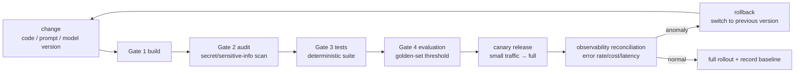

> **Layer**: 5 · Reliable Operations ｜ **Previous layer exit**: can restrict permissions, pause/resume tasks ｜ **This layer exit**: can define the release gate, the rollback path, and the on-call owners, and run a health check with graceful shutdown
> **Prerequisites**: [Testing](testing), [Evaluation (Bridge)](evaluation), [Observability](observability), [Security](security), [Cost and Performance](cost-performance) ｜ **Next**: [Resource Library](../../resources.md) (layer exit)

## 1. Overview

**BLUF**: treating "going live" as a one-time event is the most common source of AI operational incidents. A release should be **a gated pipeline plus an executable rollback**: every change passes the same chain of gates (build → audit → tests → eval threshold), failing ones blocked; after launch, problems switch back to the previous version along a rehearsed path. AI applications have two extra release artifacts — **the prompt and the model version** — whose rollback must be as cheap as code's, or "tweak one line of the prompt" becomes an irreversible operation.

### Mental model: release is a loop, not an arrow



### Decision table: three deployment forms

| Form | Direction | Control | State | Trust domain | Minimum complexity |
| --- | --- | --- | --- | --- | --- |
| Serverless functions | Read/Write | Platform-scheduled, cold starts | Request-scoped, stateless | Cloud-vendor boundary | One function + env vars |
| Containers (this repo's CI form) | Read/Write | You own image and orchestration | Process + health checks | Cluster boundary | Dockerfile + probes |
| Dedicated serving (self-hosted models) | Read/Write | Fully self-managed (GPU/queues) | GPU-memory/batching state | Your own facility | Ops team + capacity planning |

Applications calling external model APIs are fine with the first two forms; only self-hosted inference (→ [Learn LLM](https://llm.zenheart.site/) inference-engine knowledge) needs the third.

### When to use / when not to

- Use: any system with real users that needs on-call and rollback.
- Do not use: local experiments and one-off scripts — but the secrets-via-environment rule applies from the first line of code.

Historical milestone: new in 2026-09 (slug-map `deployment`, no legacy merge source); the gate chain aligns with this repo's `deploy.yml` CI shape (build → deploy to static hosting), with the evaluation gate being this page's increment for AI applications.

## 2. Usage

Minimum walkthrough: 15 minutes, zero API keys, Node built-ins — a **health-check endpoint + graceful shutdown**, the minimal prerequisite for container probes and rolling updates. The script carries its own deterministic self-check.

### Step 1: save `server.mjs`

```javascript
// server.mjs — minimal server with health check + graceful shutdown (zero deps, node >= 18)
import http from 'node:http';
import assert from 'node:assert/strict';

let inFlight = 0;
let draining = false;

const server = http.createServer((req, res) => {
  if (req.url === '/healthz') {
    res.writeHead(200, { 'content-type': 'application/json' });
    res.end(JSON.stringify({ status: draining ? 'draining' : 'ok', inFlight }));
    return;
  }
  inFlight++;
  setTimeout(() => { res.writeHead(200); res.end('done'); inFlight--; }, 300); // simulate one generation request
});

async function shutdown(reason) {
  draining = true; // healthz immediately reports draining; the load balancer removes this instance
  console.log(`Received ${reason}: stop accepting new requests, wait for in-flight (currently ${inFlight})`);
  server.close();
  const deadline = Date.now() + 5000; // wait at most 5s: a hanging request must not stall shutdown
  while (inFlight > 0 && Date.now() < deadline) {
    await new Promise((r) => setTimeout(r, 10));
  }
  console.log(`Graceful shutdown complete: in-flight ${inFlight}${inFlight === 0 ? '' : ' (abandoned on timeout, marked for retry)'}`);
  process.exit(inFlight === 0 ? 0 : 1);
}
process.on('SIGTERM', () => shutdown('SIGTERM')); // container orchestrators' default termination signal
process.on('SIGINT', () => shutdown('SIGINT'));   // local Ctrl+C

const PORT = 18080; // demo port, changeable
server.listen(PORT, async () => {
  // ---- deterministic self-check ----
  const h = await (await fetch(`http://127.0.0.1:${PORT}/healthz`)).json();
  assert.equal(h.status, 'ok');
  const busy = fetch(`http://127.0.0.1:${PORT}/chat`); // start an in-flight request (not awaited)
  await new Promise((r) => setTimeout(r, 20));
  const h2 = await (await fetch(`http://127.0.0.1:${PORT}/healthz`)).json();
  assert.equal(h2.inFlight, 1); // in-flight count visible → the shutdown decision has grounds
  await busy;
  await shutdown('self-check'); // note: Windows cannot deliver SIGTERM; the self-check calls directly.
                                // In Linux containers the signal handlers above run.
});
```

### Step 2: run

```bash
node server.mjs
```

### Step 3: expected output (exit code 0)

```text
Received self-check: stop accepting new requests, wait for in-flight (currently 0)
Graceful shutdown complete: in-flight 0
```

### Step 4: negative observation (shutdown with an in-flight request)

Insert `await shutdown('mid-flight');` before `await busy;` and run: the log shows "wait for in-flight (currently 1)" then drains to zero and exits — replace the 300ms simulated request with one that never resolves (`new Promise(() => {})`), and the 5-second deadline abandons it with exit code 1. This demonstrates that **shutdown must have a deadline**, or a single hang deadlocks a rolling update. Revert and everything is green again.

### Acceptance and cleanup

- Acceptance: the happy path exits 0; you can answer "why healthz still returns during draining (so the LB can deregister) and what it must not return (5xx — it reads as a crash)".
- Cleanup: delete the file (the demo port is released).

## 3. Principles

### Configuration and secrets: environment injection, never in code

- Secrets reach the runtime **only via environment variables/secret managers** (this repo's global rule: credentials never enter committable files); code reads `process.env`, and the repo holds only the variable-name list.
- Model choice, routing switches, and budget caps are configuration too — **switching models does not change code**, the premise of dual-write switching below.
- Detection and rotation of leaked secrets: runbook 3 in [security](security).

### The release-gate chain

| Gate | Checks | On failure | This repo's counterpart |
| --- | --- | --- | --- |
| Gate 1 build | Artifacts build, types pass | Block | `pnpm docs:build` / `pnpm ppt:build` |
| Gate 2 audit | Secret/sensitive-info scan, dependency audit | Block | Leak detection ([security](security)) + supply-chain checks |
| Gate 3 tests | Deterministic suite green | Block | [testing](testing)'s `node --test` / `vitest run` |
| Gate 4 evaluation | Golden-set pass rate ≥ threshold | Block | [Evaluation (Bridge)](evaluation)'s non-zero exit code |
| Canary gate | No metric anomaly in the small-traffic observation window | Auto/manual switchback | "Canary" below |

The gate's value is **impartiality**: a one-line prompt change walks the same chain as a module change — most "prompt incidents" come from prompts being hand-edited as if they were config.

### Rollback: three version axes of an AI application

1. **Code**: conventional CI/CD rollback (previous image/build).
2. **Prompt**: prompts versioned in the repo (e.g. `prompts/v12/classify.txt`), selected at runtime by configuration; rollback = switch back to `v11`.
3. **Model**: the model version is a configuration item; rollback = a config change deploy, minutes not hours. **Dual-write switching**: the new model first runs in shadow mode (results recorded, not returned to users); after [evaluation](evaluation) comparison meets the bar, shift traffic by percentage (1% → 10% → 100%), rolling back on anomaly.

Independent rollback across the three axes covers the vast majority of incidents; only when the **data** (index/memory) itself is corrupted is data-layer recovery needed — that is the [layer 3](../03-grounding/) update-chain problem.

### Canary and observability reconciliation

A canary is not "a little less traffic", it is **a little less traffic with reconciliation**: compare the error-rate, cost, and latency dashboards before and after shifting (→[observability](observability), [cost and performance](cost-performance)), switching back automatically on anomaly. Someone must watch the numbers inside the window, or the canary is just a slow-motion incident.

### The runbook (who owns what)

| Item | First responder | Escalation |
| --- | --- | --- |
| Vendor 5xx/rate limits | On-call engineer (switch to the backup model config) | Platform owner |
| Budget breaker tripped | On-call engineer (hunt runaway loops/attacks) | Security + finance |
| Quality-degradation alert | Feature owner (roll back prompt/model) | Product |
| Secret leak | Security owner (rotate + investigate) | Legal/compliance |

A runbook's acceptance is not "it was written" but **it has been rehearsed**: every row has at least one tabletop exercise or real trigger on record.

### Spec vs local measurement

No protocol spec here; the "spec" side is the common orchestration convention (SIGTERM triggers graceful shutdown, healthz semantics), and the "measured" side is this page's server behavior (draining status reported, exit code 0 after draining, exit code 1 on timeout abandonment).

## 4. Development

### Symptom → Evidence → Action → Done when

**Symptom**: error rate rises after release.
**Evidence**: the canary dashboards (error rate/cost/latency) comparing pre/post shift; trace sampling pinpoints the failing segment (→[observability](observability)).
**Action**: roll back along the version axes — first determine whether the change belongs to code/prompt/model, and switch that axis back; data-axis problems recover via layer 3 instead.
**Done when**: metrics return to the baseline band; the incident record includes "which axis, how many minutes to switch, which gate should tighten".

### Symptom → Evidence → Action → Done when

**Symptom**: the model vendor has widespread 5xx/rate limiting; requests pile up.
**Evidence**: the vendor status page plus your own error-rate dashboard; whether the pile-up triggered a retry storm (the request-volume amplification factor).
**Action**: on-call switches to the backup model config per the runbook; retries get exponential backoff and caps; confirm the budget breaker is in place (retry costs, →[cost and performance](cost-performance)).
**Done when**: error rates recover; the postmortem adds a "vendor-failure playbook" entry (backup model, switch actions, verification commands).

### Symptom → Evidence → Action → Done when

**Symptom**: 502s / truncated requests during rolling updates.
**Evidence**: instance logs — old instances force-killed before in-flight requests drained (the SIGTERM flow never completed); whether healthz still returned 200 while draining (for LB deregistration).
**Action**: add graceful shutdown following this page's minimal-server pattern; on the orchestration side confirm terminationGracePeriod exceeds the longest request.
**Done when**: the next release has zero 502s; a manual `kill -TERM` shows the "wait for in-flight → drain → exit" log.

### Anti-patterns

- **Unversioned prompts**: prompt text scattered across code strings and chat logs — "change one line" cannot be rolled back.
- **Gates apply only to code**: model switches and parameter tweaks bypass the release gate — the two highest-frequency incident sources are exactly outside the gate.
- **Canary nobody watches**: shift to 10% and go to sleep; nobody switches back during the anomaly window.
- **Rollback by memory**: "the last good version was probably Thursday's" — the version axes must be enumerable and one-click switchable.

## 5. Resource Library

Four-level reading route:

- **Beginner**: run this page's minimal server; understand the release loop (gates → canary → reconciliation → rollback).
- **Builder**: wire the gate chain into your repository (build/audit/tests/eval threshold); version prompts in the repo.
- **Operator**: rehearse dual-write switching and failover; write the runbook and tabletop every escalation path.
- **Researcher**: read OWASP LLM06 (unbounded consumption) and the MANAGE function of NIST AI RMF against your gates and runbook.

### Resource table

| Name | Evidence level | Canonical URL | Purpose | Supported claim | Next |
| --- | --- | --- | --- | --- | --- |
| This repo's deploy workflow | internal artifact | https://github.com/zenHeart/learn-ai/blob/tech/.github/workflows/deploy.yml | A live example of gate 1 (build → deploy) | This repo builds three components in CI then merges the deployment (retrievedAt 2026-09-01) | Add gates 2–4 against it |
| OWASP GenAI LLM Top 10 2026 | L0 (official list) | https://genai.owasp.org/resource/owasp-genai-llm-top-10-2026/ | Risk baseline for gate 2 | LLM06 Unbounded Consumption maps to the budget breaker (retrievedAt 2026-09-01) | [Security](security) |
| NIST AI RMF | L0 (official framework) | https://www.nist.gov/itl/ai-risk-management-framework | Governance frame for the runbook | The MANAGE function covers disposition and ownership (retrievedAt 2026-09-01) | Read AI 600-1 |
| OpenTelemetry GenAI semantic conventions | L0 (official spec) | https://github.com/open-telemetry/semantic-conventions-genai | Metric naming for canary reconciliation | `gen_ai.usage.*` and friends (Development level, retrievedAt 2026-09-01) | [Observability](observability) |

### Falsification and open questions

- Falsification entry: if your system changes rarely (quarterly) and has no on-call, the maintenance cost of a fully automated gate chain may exceed its benefit — a manual checklist plus version axes remain non-negotiable.
- Open: dual-write switching in non-idempotent output scenarios (creative tasks) needs human review in the "meets the bar" judgment; how automated thresholds reconcile with human judgment has no case in this repo yet.

### learn-ai stops here / where to go next

- Deployment and capacity knowledge for self-hosted inference engines: [Learn LLM](https://llm.zenheart.site/).
- The detailed engineering of each gate: [Testing](testing), [Evaluation (Bridge)](evaluation), [Security](security), [Cost and Performance](cost-performance).
- The full resource index after this layer: [Resource Library](../../resources.md).
