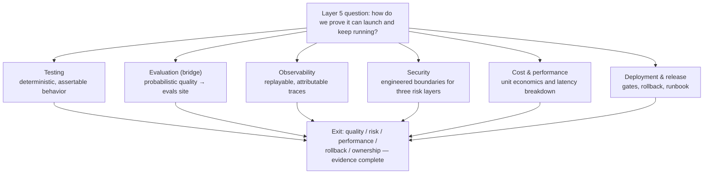

> **Layer**: 5 · Reliable Operations ｜ **Previous layer exit**: can restrict permissions, pause/resume tasks ｜ **This layer exit**: can substantiate quality, risk, performance, rollback, and ownership with replayable evidence
> **Prerequisites**: [Recovery and Human-in-the-Loop](../04-action/agent-runtime/recovery-hitl) ｜ **Next**: [Testing](testing), [Evaluation (Bridge)](evaluation), [Observability](observability), [Security](security), [Cost and Performance](cost-performance), [Deployment and Release](deployment); after this layer, the [Resource Library](../../resources.md)

## 1. Overview

**BLUF**: Between "the feature works" and "we can run this in production" lies an entire layer of work. A demo needs one success; operations need **replayable evidence** — the ability to reconstruct what happened during an incident, to predict the impact of a change, and to point at a rollback path and an owner. This layer consolidates the engineering of layers 1–4 into five kinds of launch evidence: quality, risk, performance, rollback, and ownership.

### Mental model: six evidence chains

The six chains are not six sequential stages; they are six facets of the same artifacts. One trace is simultaneously observability evidence, cost evidence, and incident-replay material.

### Symptom routing table

| Symptom ("the feature works, but…") | Go to | Evidence you gain |
| --- | --- | --- |
| Change one prompt, no idea what broke | [Testing](testing) | Deterministic test pyramid: assertable blast radius |
| "Better/worse" is only a vibe | [Evaluation (Bridge)](evaluation) | Golden set + threshold as a release gate (methodology → evals site) |
| Production incident, only scattered logs to guess from | [Observability](observability) | Replayable trace/span + correlation ID |
| Worried about injection, overreach, leaks, but "the model will refuse" | [Security](security) | Combined defense: input filter + permission boundary + output scanner |
| Nobody can explain the monthly bill or P95 latency | [Cost and Performance](cost-performance) | Per-request cost tracking + latency breakdown + optimization ladder |
| Releases by manual copy, rollback by memory | [Deployment and Release](deployment) | Gate chain, versioned rollback, runbook |

### Decision table: how each evidence type is obtained

| Evidence type | Direction | Control | State | Trust domain | Minimum complexity |
| --- | --- | --- | --- | --- | --- |
| Quality (testing + eval) | Read | You write assertions/datasets | Fixtures + golden set | Inside CI | One node:test file |
| Risk (security) | Read/Write | Filters + permission boundary + audit | Rules + audit log | Application trust domain | One layer of I/O filtering |
| Performance (cost + latency) | Read | Sampling & budget config | Time series | Observability backend | Per-request usage accounting |
| Rollback (deployment) | Write | Version + traffic switch | Versioned artifacts | Deployment trust domain | Version number + dual-write switch |
| Ownership (runbook) | — | Roster + escalation path | Docs + alert routing | Organization | One page of who owns what |

### Cross-cutting statement

Security, cost, and observability **do not first appear in this layer**: permission boundaries are introduced in [Tool Execution](../04-action/tool-execution), token usage arrives with the usage field of the [Model API](../02-integration/model-api), redaction matters as soon as [Context Engineering](../01-contracts/context) begins. Layers 1–4 handle these concerns locally in their own scenarios; **layer 5 consolidates them into systematic launch evidence** — no longer "done right somewhere", but "provable everywhere".

### When to use / when not to

- Use: any system crossing from "personal demo" to "has users, has on-call, has a bill".
- Do not use: one-off scripts, local experiments, learning toys — building five evidence chains for them is over-engineering. Judge with the [Complexity Decision Ladder](../00-orientation/complexity-ladder).

Historical milestone: this layer's structure was frozen in 2026-09 with Issue #116, upgrading and merging the legacy `engineering/` pages (testing/evals/observability/security/cost-optimization) plus the `testing/` and `evaluation/` directories; earlier provenance unverified, not fabricated.

## 2. Usage

This page is the routing layer and has no runnable artifact; "usage" = a launch-readiness self-audit (on paper, ≤15 min). Acceptance: for the system you want to launch, every one of the five evidence types resolves to "concrete artifact + named owner" — any blank cell is your gap.

### Drill: the five-question audit

Answer each question for the target system; record "where the evidence lives (file/dashboard/doc)" and "who owns it":

1. **Quality**: on the last prompt change, which tests ran in CI? How much did the eval score move? (→ [Testing](testing) / [Evaluation](evaluation))
2. **Risk**: an injection payload hits your input endpoint — which layer blocks it, and where is the block logged? (→ [Security](security))
3. **Performance**: pick a random production request from yesterday — can you find its token cost and per-segment latency within a minute? (→ [Observability](observability) / [Cost and Performance](cost-performance))
4. **Rollback**: what is the previous version of the current one? Which exact actions switch back to it? (→ [Deployment and Release](deployment))
5. **Ownership**: at 2 a.m. the model vendor returns 5xx — which dashboard does the on-call look at first, and what is the first action? (→ the runbook in [Deployment and Release](deployment))

### Usage boundary

- This layer does not teach "how to test / how to instrument" — that is the six sub-chapters' job; this page only routes symptoms to the right evidence chain.
- The **depth** of each evidence type scales with business risk: an internal tool does not need bank-grade audit logs, but it does need the minimum version that answers the five questions.

## 3. Principles

### Why consolidation happens in layer 5

Every layer from 1 to 4 exits on "it works": the schema validates, the interaction is cancellable end to end, retrieval is traceable, permissions pause and resume. But "works" is a **single-run property**; operations demand a **continuing property** — the ten-thousandth request as reliable as the first, the tenth change as predictable as the first. The instrument that upgrades single-run to continuing is evidence:

- Predictable behavior ← testing + evaluation (comparable before/after change)
- Explainable failures ← observability (replayable traces)
- Verifiable boundaries ← security (attack paths with block records)
- Accountable spend ← cost & performance (per-request accounting)
- Reversible changes ← deployment (versions that switch back)

### Replayability is the layer-wide invariant

All five evidence types share one acceptance criterion: **it can be replayed afterwards**. Tests can re-run, datasets can reproduce, traces can be exported and re-inspected, attack samples can be re-fired against the filter, costs can be recomputed per request, versions can be redeployed. Any observation of the form "we saw it then, can't find it now" is not evidence — that is the line between real observability and "happened to see it".

### Division of labor with external owners

This layer deliberately stops at two places: evaluation methodology (datasets/scorers/judges/statistics/red-teaming) is owned by [evals](https://evals.zenheart.site/) — this repo only answers "when is evidence needed and how it plugs into the release gate"; the mechanics of the model-alignment risk layer (reward hacking, jailbreak propensity) are owned by [Learn LLM](https://llm.zenheart.site/) — this repo only does application-side engineering. Details in `_phase0/bridge-register.md`.

### Spec vs local measurement

This routing page has no spec to implement; each sub-chapter carries its own "spec vs measured" column (e.g. OTel GenAI conventions, the OWASP 2026 list, Vitest version requirements).

## 4. Development

This page has no code integration; "development" = using the five-question audit as a launch-review gate.

### Symptom → Evidence → Action → Done when

**Symptom**: review gets rejected with "how do you prove it's correct?" and the team can only replay the demo.
**Evidence**: no five-question audit in the review materials; no reconcilable artifacts between change history and production behavior.
**Action**: fill in the audit; for any blank cell, build the minimum version first (one test file, one trace, one page of runbook all count).
**Done when**: the review materials contain the audit table with concrete artifact paths and named owners per row.

### Symptom → Evidence → Action → Done when

**Symptom**: the incident postmortem runs three pages and concludes "the model misbehaved".
**Evidence**: no exportable trace in the incident window; request logs carry only status codes, no token usage or tool-call records.
**Action**: add correlation-ID propagation and span recording per [Observability](observability); put "replay the incident window" first in the postmortem template.
**Done when**: the next similar incident starts its postmortem by exporting the window's traces instead of scrolling chat logs.

### Symptom → Evidence → Action → Done when

**Symptom**: the bill doubles and nobody knows which feature, user, or request class caused it.
**Evidence**: the only cost number is the vendor's monthly invoice; no per-request/per-feature usage accounting.
**Action**: establish per-request cost tracking per [Cost and Performance](cost-performance) (usage field → record → aggregate); decomposition before optimization.
**Done when**: the month's cost splits along "feature × model × input/output/cache" and you can name the largest item.

### Anti-patterns

- **Evidence theater**: screenshots and numbers assembled to pass review, not replayable afterwards — the layer-5 form of "looks successful but under-evidenced".
- **All six chains, fully armed**: bank-grade audit and full-rate trace sampling for an internal tool turns evidence cost into the new operational burden.
- **Evidence detached from the system**: tests run against mocks, traces enabled only in staging — the production path is exactly the uncovered one.

## 5. Resource Library

Four-level reading route:

- **Beginner**: read this page's routing table; run a five-question audit on your own system; find the largest gap.
- **Builder**: enter [Testing](testing) and [Observability](observability) — the two chains that compound first (change safety + explainable failures).
- **Operator**: enter [Security](security), [Cost and Performance](cost-performance), [Deployment and Release](deployment); fold risk, spend, and rollback into daily routine.
- **Researcher**: read the L0/L1 specs below (OWASP, NIST, OTel) for the field's framing of "reliable AI operations".

### Resource table

| Name | Evidence level | Canonical URL | Purpose | Supported claim | Next |
| --- | --- | --- | --- | --- | --- |
| OWASP GenAI LLM Top 10 2026 | L0 (official list) | https://genai.owasp.org/resource/owasp-genai-llm-top-10-2026/ | Baseline for risk evidence | Published 2026-08-04; ranking calibrated on 7,714 real incidents (retrievedAt 2026-09-01) | [Security](security) |
| NIST AI RMF 1.0 | L0 (official framework) | https://www.nist.gov/itl/ai-risk-management-framework | Voluntary governance framework | Released 2023-01-26, voluntary; GenAI Profile (NIST AI 600-1) 2024-07-26 (retrievedAt 2026-09-01) | [Security](security) governance section |
| OpenTelemetry GenAI semantic conventions | L0 (official spec) | https://github.com/open-telemetry/semantic-conventions-genai | Naming baseline for observability evidence | GenAI conventions moved to a dedicated repo in 2026-06; covers GenAI clients/MCP/provider conventions (retrievedAt 2026-09-01) | [Observability](observability) |
| evals site | sibling (cross-repo owner) | https://evals.zenheart.site/ | Sole owner of evaluation methodology | This repo keeps only release-gate integration (bridge-register 2026-09-01) | [Evaluation (Bridge)](evaluation) |

### Falsification and open questions

- Falsification entry: if you find a real system that operates reliably while lacking one of the five evidence types, the necessity assumption for that type has a hole — first check whether it uses an equivalent evidence form outside this table, then consider revising this layer's exit.
- Open: how to grade the depth of the six chains by business risk (which scenarios may explicitly waive which evidence) — to be backfilled as sub-chapter runbooks accumulate cases.

### learn-ai stops here / where to go next

- Evaluation methodology, dataset construction, judges and statistics: [evals](https://evals.zenheart.site/).
- How model alignment and post-training shape risk behavior: [Learn LLM](https://llm.zenheart.site/).
- The full resource index after this layer: [Resource Library](../../resources.md).
