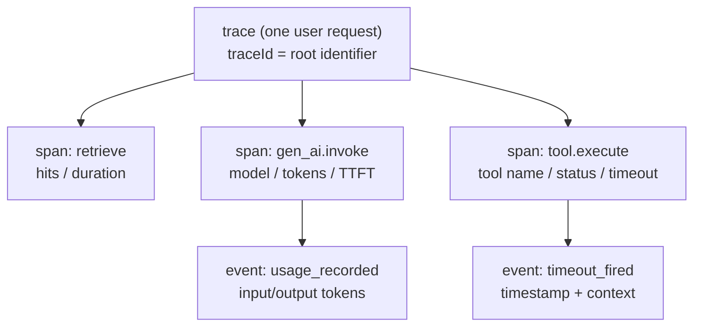

> **Layer**: 5 · Reliable Operations ｜ **Previous layer exit**: can restrict permissions, pause/resume tasks ｜ **This layer exit**: can make one AI request's full trajectory replayable, attributable, and redacted
> **Prerequisites**: [Model API Contract](../02-integration/model-api) (usage field), [Tool Execution Engineering](../04-action/tool-execution) ｜ **Next**: [Cost and Performance](cost-performance) (accounting on observability data), [Deployment and Release](deployment) (alerts and runbooks)

## 1. Overview

**BLUF**: traditional software can log "request in, response out"; an AI application cannot — one request is a chain of "retrieve → generate → tool → generate again", and when it fails you must answer **which segment, what input, which model, how many tokens**. Observability turns that execution tree into a **replayable trajectory**: trace (one request) → span (one operation) → event (a point in time within the tree), plus a correlation ID threaded through the chain and redaction applied before persistence.

### Mental model: trace → span → event



A correlation-ID group (messageId/taskId/traceId — pick one set and thread it) is tied to the root; any segment failure can be traced along the tree to "which span, what input, which model, which step".

### Decision table: three telemetry signals compared

| Signal | Direction | Control | State | Trust domain | Minimum complexity |
| --- | --- | --- | --- | --- | --- |
| Logs | Read | You write each line | Append-only files | Log backend | `console.log` + structure |
| Metrics | Read | Pre-defined aggregates | Time series | Metrics backend | One counter |
| Traces (this page's claim) | Read | Span instrumentation | Tree + causality | Observability backend | Minimal span collector (below) |

Failure attribution in AI applications is mostly a **structural question** (which segment, what combination), not a single-number question — hence traces first, metrics aggregated from traces, logs supplementing spans.

### When to use / when not to

- Use: any multi-segment chain (RAG, agent loops, multi-tool orchestration); any system needing cost attribution (see [Cost and Performance](cost-performance)).
- Do not use: single, stateless, no-troubleshooting-need scripts; toys where trace-sampling costs exceed their value.

Historical milestone: rewritten in 2026-09 from the legacy `engineering/observability.md` (TTFT/token metrics + proxy-tooling idea), aligned with the current state of the OpenTelemetry GenAI semantic conventions (see Principles).

## 2. Usage

Minimum walkthrough: 15 minutes, zero API keys, Node built-ins — a minimal span collector with tree printing, duration stats, a threaded correlation ID, and attribute redaction.

### Step 1: save `trace-demo.mjs`

```javascript
// trace-demo.mjs — minimal span collector: tree output + timing stats + redaction
// Name-based redaction: match sensitive key-name patterns (api keys/passwords/credential tokens),
// precisely avoiding legitimate "token-count" attributes like gen_ai.usage.input_tokens.
const SENSITIVE = /(api_?key|secret|password|authorization|access_?token|refresh_?token|session_?token)/i;
const redact = (attrs) => Object.fromEntries(
  Object.entries(attrs).map(([k, v]) => [k, SENSITIVE.test(k) ? '[REDACTED]' : v]),
);

const spans = []; // in-process collection; production swaps in OTLP export
function startSpan(name, attrs = {}, parent = null) {
  const span = { name, attrs: redact(attrs), parentId: parent?.id ?? null,
    id: spans.length + 1, startedAt: process.hrtime.bigint(), status: 'ok', events: [] };
  spans.push(span);
  return span;
}
function endSpan(span, status = 'ok') {
  span.status = status;
  span.durationMs = Number(process.hrtime.bigint() - span.startedAt) / 1e6;
}
const addEvent = (span, name, attrs = {}) => span.events.push({ name, attrs: redact(attrs) });

// ---- Demo: one request trajectory with a failure path ----
const trace = { traceId: 'tr-' + Date.now().toString(36), messageId: 'msg-042' }; // correlation-ID group
const root = startSpan('chat.request', { ...trace });

const retrieve = startSpan('retrieve', { query: 'invoice refund', topK: 3 }, root);
await new Promise((r) => setTimeout(r, 5));
addEvent(retrieve, 'hits_recorded', { hits: 2 });
endSpan(retrieve);

const invoke = startSpan('gen_ai.invoke',
  { 'gen_ai.request.model': 'demo-model', messageId: trace.messageId }, root);
await new Promise((r) => setTimeout(r, 8));
addEvent(invoke, 'usage_recorded',
  { 'gen_ai.usage.input_tokens': 1200, 'gen_ai.usage.output_tokens': 80 }); // OTel GenAI attribute names
endSpan(invoke);

const tool = startSpan('tool.execute', { tool: 'refund_api', args: { order: 'A1' } }, root);
await new Promise((r) => setTimeout(r, 12));
addEvent(tool, 'timeout_fired', { limitMs: 10 }); // negative: tool timeout
endSpan(tool, 'error');
endSpan(root, tool.status === 'error' ? 'error' : 'ok');

// ---- Tree output + timing stats ----
const byParent = new Map();
for (const s of spans) byParent.set(s.parentId, [...(byParent.get(s.parentId) ?? []), s]);
const print = (span, depth = 0) => {
  console.log(`${'  '.repeat(depth)}${span.name} [${span.status}] ${span.durationMs.toFixed(1)}ms ${
    JSON.stringify(span.attrs)}`);
  span.events.forEach((e) => console.log(`${'  '.repeat(depth + 1)}· ${e.name} ${JSON.stringify(e.attrs)}`));
  (byParent.get(span.id) ?? []).forEach((c) => print(c, depth + 1));
};
print(root);
const total = spans.reduce((a, s) => a + s.durationMs, 0);
console.log(`spans=${spans.length} total=${total.toFixed(1)}ms errors=${
  spans.filter((s) => s.status === 'error').length}`);
```

### Step 2: run

```bash
node trace-demo.mjs
```

### Step 3: expected output (milliseconds vary by machine; the structure is stable)

```text
chat.request [error] 26.1ms {"traceId":"tr-mx8","messageId":"msg-042"}
  retrieve [ok] 5.3ms {"query":"invoice refund","topK":3}
    · hits_recorded {"hits":2}
  gen_ai.invoke [ok] 8.4ms {"gen_ai.request.model":"demo-model","messageId":"msg-042"}
    · usage_recorded {"gen_ai.usage.input_tokens":1200,"gen_ai.usage.output_tokens":80}
  tool.execute [error] 12.2ms {"tool":"refund_api","args":{"order":"A1"}}
    · timeout_fired {"limitMs":10}
spans=4 total=52.0ms errors=2
```

The replay value is immediate: the request failed overall, but attribution lands on the `tool.execute` timeout while the model call itself was fine.

### Step 4: negative check (redaction works)

Change the `gen_ai.invoke` attributes to `{ 'gen_ai.request.model': 'demo', apiKey: 'sk-live-123' }` and re-run: the field prints as `"apiKey":"[REDACTED]"` — sensitive attributes are replaced **before persistence**, so logs and exports never see plaintext.

### Acceptance and cleanup

- Acceptance: the tree contains 4 spans across 2 nesting levels; error status propagates to the root; the redaction negative works.
- Cleanup: delete the file (in-process collection, no external state).

## 3. Principles

### AI-specific signal checklist

| Signal | Source | Attribution it supports |
| --- | --- | --- |
| Token usage and cost | The model API's usage field ([Model API Contract](../02-integration/model-api)) | Cost-spike triage (→[Cost and Performance](cost-performance)) |
| Tool-call trajectory | Tool-execution spans (name, args, status, duration) | Overreach/timeout/retry attribution (→[Tool Execution](../04-action/tool-execution)) |
| Retrieval hits | The retrieve span's hits/scores | "Wrong answer" — retrieval problem or generation problem |
| Agent trajectory | One span per loop step (plan/act/observe) | Where a multi-step task diverged |
| Hallucination signals | Empty retrieval hits with confident output; citations not matching hits | Minimal clues for faithfulness (verification belongs to [evaluation](evaluation)) |
| TTFT / throughput / tool roundtrips | Stream first-byte and span timestamps | Latency breakdown (→[Cost and Performance](cost-performance)) |

### Threading the correlation ID

A user message receives its identifier at the entry point (messageId; add taskId/traceId across systems), and **every span, log line, and tool call carries it afterwards**. A broken link (a span losing the ID) means that segment goes missing from the replay — the ailment of runbook 3 below.

### Sampling and redaction

- **Sampling**: when full capture is not sustainable, sample per trace (keep errors, keep slow, keep a random baseline) — but **sampling decides how much to keep, not what to record**; attribute design is independent of sampling.
- **Redaction**: secrets and personal data are replaced before persistence (this page's `redact`); plaintext prompts/completions are not captured by default — turning that on is an explicit switch (mirroring OTel GenAI's content-capture switch `OTEL_INSTRUMENTATION_GENAI_CAPTURE_MESSAGE_CONTENT`).

### Spec vs local measurement (OpenTelemetry GenAI semantic conventions)

| Item | Official status (verified 2026-09-01) | Local measurement (this page) |
| --- | --- | --- |
| Home repository | Moved in 2026-06 with main-repo v1.42.0 to the dedicated `open-telemetry/semantic-conventions-genai`; the old docs page is a migration stub | Custom span names, no OTel SDK attached |
| Coverage | Spans/metrics/events for GenAI clients, MCP, and provider-specific conventions | A minimal subset covering retrieve/invoke/tool spans |
| Attribute naming | `gen_ai.system`, `gen_ai.request.model`, `gen_ai.usage.*`, latency attributes and TTFT/TPOT metrics | The demo adopts the same names (`gen_ai.request.model`, `gen_ai.usage.*`) for future OTel compatibility |
| Maturity | As of mid-2026 all genai.* conventions are at **Development** stability, with no published stabilization timeline | Treat as a naming reference, not a hard contract; the attribute set may change |

Does not duplicate [Learn LLM](https://llm.zenheart.site/) model internals; metric-platform selection comparisons are out of scope for this repo.

## 4. Development

### Symptom → Evidence → Action → Done when

**Symptom**: users report "answers got worse"; no idea where to start.
**Evidence**: export traces from the time window and group by outcome — do the bad group's retrieve spans show significantly fewer/lower hits than the good group; did `gen_ai.request.model` mix in another model version for the bad group.
**Action**: low hits → retrieval-side triage (index freshness/chunking); mixed models → check release records (→[Deployment and Release](deployment)).
**Done when**: an attribution conclusion of "worse in retrieval / generation / model version" is stated with a trace evidence chain.

### Symptom → Evidence → Action → Done when

**Symptom**: costs spike while request volume is flat.
**Evidence**: aggregate tokens per trace — the shift in the input/output/cache-hit distribution; find the span pattern where mean input exploded (e.g. a tool result stuffed into context).
**Action**: compress that source's context injection; cap per-request tokens and emit an event on breach.
**Done when**: token means return to the baseline band; the new cap event feeds an alert.

### Symptom → Evidence → Action → Done when

**Symptom**: during replay the trajectory is "missing a segment".
**Evidence**: the correlation ID differs before/after the gap (an async branch dropped it), or a boundary component was never instrumented.
**Action**: hoist the ID into the calling context to force propagation (the `parent` chain in the example); add a minimal span to the uninstrumented boundary component.
**Done when**: any production trace sampled at random is ID-continuous from entry to exit, with no orphan spans.

### Anti-patterns

- **Record outcomes, not paths**: logs contain only the final answer — attribution by segment is impossible in replay.
- **Filter sensitive data after the fact**: plaintext hits disk first and gets cleaned later — the leak already happened; redact before persistence.
- **Observability disjoint from security**: tool arguments in traces are exactly the forensic evidence of injection payloads (→[security](security)); both share one redaction rule set.
- **Metrics in isolation**: P95 numbers without traces mean you still guess when the number moves.

## 5. Resource Library

Four-level reading route:

- **Beginner**: run this page's collector; understand trace/span/event and correlation IDs.
- **Builder**: wire the collector into your own chain (start with retrieve/invoke/tool spans); align attribute names with OTel GenAI.
- **Operator**: define the sampling strategy and redaction rules; build the "export window → attribute" triage flow.
- **Researcher**: read the model definitions in the OTel GenAI dedicated repo; track the Development → Stable progression.

### Resource table

| Name | Evidence level | Canonical URL | Purpose | Supported claim | Next |
| --- | --- | --- | --- | --- | --- |
| OpenTelemetry GenAI semantic conventions (dedicated repo) | L0 (official spec) | https://github.com/open-telemetry/semantic-conventions-genai | Naming baseline for GenAI spans/metrics/events | Covers GenAI clients, MCP, and provider conventions; extends the main semconv repo (retrievedAt 2026-09-01) | Read its docs/ directory |
| OTel semconv legacy docs page (migration stub) | L0 (official) | https://opentelemetry.io/docs/specs/semconv/gen-ai/ | Migration-status check | The page is a "moved to the dedicated repo" notice, no longer maintained (retrievedAt 2026-09-01) | Prefer the dedicated repo |
| OTel GenAI stability-status analysis | L4 (third-party analysis) | https://praesidia.ai/blog/opentelemetry-genai-semantic-conventions-status | Adoption decision input | As of mid-2026 all genai.* are Development-level; repo moved 2026-06 (retrievedAt 2026-09-01) | Weigh deferring hard dependence |
| evals site | sibling (cross-repo owner) | https://evals.zenheart.site/ | Quality-signal handoff to evaluation | Split per bridge-register (2026-09-01) | [Evaluation (Bridge)](evaluation) |

### Falsification and open questions

- Falsification entry: if your system is single-segment, stateless, and its only failure mode is "the call failed", the marginal value of traces approaches that of logs — downgrade to structured logging and skip the span tree.
- Open: the OTel GenAI conventions remain at Development stability and the attribute set may still move; this repo's demo aligns with current naming, and hard contractual dependence waits for Stable.

### learn-ai stops here / where to go next

- Metrics and math on the inference-engine side (vLLM/SGLang): [Learn LLM](https://llm.zenheart.site/).
- Turning observability data into cost accounting and latency breakdown: [Cost and Performance](cost-performance).
- Alert routing and the on-call handbook: [Deployment and Release](deployment).
