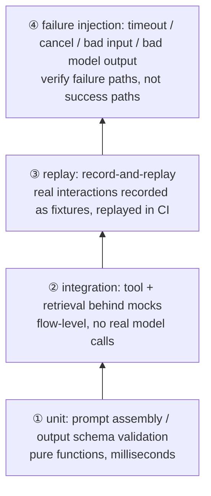

> **Layer**: 5 · Reliable Operations ｜ **Previous layer exit**: can restrict permissions, pause/resume tasks ｜ **This layer exit**: can write deterministic tests for a probabilistic system and state which problems belong to evaluation
> **Prerequisites**: [Structured Output](../01-contracts/structured-output), [Tool Execution Engineering](../04-action/tool-execution) ｜ **Next**: [Evaluation (Bridge)](evaluation) (probabilistic quality), [Observability](observability) (production evidence)

## 1. Overview

**BLUF**: An AI application cannot be tested end-to-end deterministically, but it **can be decomposed into deterministic, testable boundaries** — output validators, the timeout/cancel/permission paths of tool execution, prompt assembly, replay fixtures. Give the deterministic parts to tests (this page); give probabilistic quality to evaluation ([the evaluation bridge](evaluation), methodology owned by the [evals site](https://evals.zenheart.site/)). The boundary in one sentence: **if you can write "given this input, this assertion must hold", it's a test; if you can only write "given this input, it's probably better", it's an eval.**

### Mental model: the four-level test pyramid



The higher the level, the closer to reality — and the more expensive and slower; **there should be fewer of them**. Levels ①② form the CI workhorse, ③ provides regression protection, ④ guards the failure modes introduced in layer 4 (idempotency, cancellation, timeouts).

### Decision table: compared with adjacent verification approaches

| Approach | Direction | Control | State | Trust domain | Minimum complexity |
| --- | --- | --- | --- | --- | --- |
| Deterministic testing (this page) | Read | You write assertions, fully controlled | Fixed fixtures | Inside CI, zero keys | One node:test file |
| Evaluation (evals) | Read | You set dataset and threshold; results carry variance | Golden set + scores | Eval site / CI with keys | One golden set + scorer |
| Manual acceptance | Read | Human judgment | No residue | Individual memory | One screenshot |
| Production observability | Read | Passive sampling | Time-series data | Production traffic | See [Observability](observability) |

### When to use / when not to

- Use: for all "your code" — validators, executors, assemblers, orchestration logic; and for all failure paths (timeout, cancel, bad input).
- Do not use: for the content quality of model output (→ evaluation); for the availability of the vendor API (→ observability probes and deployment); for "is the model in a good mood today".

### Testing disciplines specific to AI

1. **Snapshot the structure, never the content**: when snapshotting model output, assert only the schema shape (fields present, types correct, enums valid), never the exact wording.
2. **Fixtures are fixed and checked in**: recorded requests/responses live as files in the repo; CI never depends on live state.
3. **Zero-key tests**: CI uses a mock provider returning canned responses; real model calls appear only in evaluation and manual acceptance.

Historical milestone: rewritten in 2026-09 from the legacy `engineering/testing.md` and the `testing/` directory (AI automation practice, MidScene UI automation); tool cases moved to appendices (owned by others). The Vitest docs state it requires Vite >= v6.0.0 and Node >= v20.0.0 (retrievedAt 2026-09-01); this page's example uses Node's built-in `node:test`, zero-install.

## 2. Usage

Minimum walkthrough: 15 minutes, zero API keys, Node built-ins only. Covers pyramid levels ① (validator) and ④ (failure injection).

### Step 1: save the test file

Save the following as `ai-deterministic.test.mjs` (self-contained: code under test + tests; split them in a real project):

```javascript
// ai-deterministic.test.mjs — node >= 20, zero deps, run with node --test
import { test } from 'node:test';
import assert from 'node:assert/strict';

// ---- Under test ①: structured-output validator (layer-1 failure acceptance) ----
const CATEGORIES = ['billing', 'technical', 'other'];

export function validateClassification(raw) {
  let parsed;
  try {
    parsed = JSON.parse(raw);
  } catch {
    return { ok: false, errors: ['not_json'] };
  }
  const errors = [];
  if (typeof parsed !== 'object' || parsed === null) errors.push('not_object');
  else {
    if (!CATEGORIES.includes(parsed.category)) errors.push('bad_category');
    if (typeof parsed.confidence !== 'number'
        || parsed.confidence < 0 || parsed.confidence > 1) errors.push('bad_confidence');
    if (typeof parsed.reason !== 'string' || parsed.reason.length === 0) errors.push('bad_reason');
  }
  return errors.length ? { ok: false, errors } : { ok: true, value: parsed };
}

// ---- Under test ②: tool executor (layer-4 timeout/cancel/allowlist) ----
export async function runTool(registry, name, args, { timeoutMs = 100, signal } = {}) {
  const tool = registry[name];
  if (!tool) return { ok: false, error: 'tool_not_allowed' };
  return await Promise.race([
    tool(args, signal),
    new Promise((resolve) =>
      setTimeout(() => resolve({ ok: false, error: 'timeout' }), timeoutMs).unref?.(),
    ),
  ]);
}

// ---- Tests: happy path + negatives, all deterministic ----
test('validator: valid output passes', () => {
  const r = validateClassification('{"category":"billing","confidence":0.9,"reason":"invoice issue"}');
  assert.equal(r.ok, true);
  assert.equal(r.value.category, 'billing');
});

test('validator: invalid JSON rejected', () => {
  assert.deepEqual(validateClassification('{oops'), { ok: false, errors: ['not_json'] });
});

test('validator: out-of-range confidence and unknown category rejected', () => {
  const r = validateClassification('{"category":"hack","confidence":7,"reason":"x"}');
  assert.equal(r.ok, false);
  assert.ok(r.errors.includes('bad_category'));
  assert.ok(r.errors.includes('bad_confidence'));
});

const registry = {
  echo: async (args) => ({ ok: true, output: args.text }),
  hang: () => new Promise(() => {}), // never resolves: for failure injection
};

test('executor: normal tool returns result', async () => {
  const r = await runTool(registry, 'echo', { text: 'ping' });
  assert.deepEqual(r, { ok: true, output: 'ping' });
});

test('executor: tool outside allowlist rejected', async () => {
  const r = await runTool(registry, 'rm', { path: '/' });
  assert.equal(r.error, 'tool_not_allowed');
});

test('executor: timeout path (no return within 20ms)', async () => {
  const r = await runTool(registry, 'hang', {}, { timeoutMs: 20 });
  assert.equal(r.error, 'timeout');
});

test('executor: cancel signal interrupts execution', async () => {
  const ac = new AbortController();
  const cancellable = (args, signal) => new Promise((resolve, reject) => {
    const t = setTimeout(() => resolve({ ok: true }), 1000);
    signal?.addEventListener('abort', () => { clearTimeout(t); resolve({ ok: false, error: 'cancelled' }); });
  });
  setTimeout(() => ac.abort(), 10);
  const r = await runTool({ slow: cancellable }, 'slow', {}, { signal: ac.signal });
  assert.equal(r.error, 'cancelled');
});
```

### Step 2: run

```bash
node --test ai-deterministic.test.mjs
```

### Step 3: expected output (all passing)

```text
✔ validator: valid output passes
✔ validator: invalid JSON rejected
✔ validator: out-of-range confidence and unknown category rejected
✔ executor: normal tool returns result
✔ executor: tool outside allowlist rejected
✔ executor: timeout path (no return within 20ms)
✔ executor: cancel signal interrupts execution

# pass 7
# fail 0
```

### Step 4: negative output (deliberately break it to see the failure shape)

Change `CATEGORIES.includes(parsed.category)` in the validator to `true` (i.e. drop the check) and re-run:

```text
✖ validator: out-of-range confidence and unknown category rejected
  … assertion failure: expected array to include 'bad_category'
# fail 1
```

CI blocks the merge with a non-zero exit code — the minimal form of "deterministic tests wired into the release gate".

### Acceptance and cleanup

- Acceptance: all 7 cases green; `node --test` exit code 0.
- Cleanup: delete the file (self-contained, no external state).

## 3. Principles

### What each pyramid level tests, and what it mocks

| Level | Under test | How the model is handled | Typical assertion |
| --- | --- | --- | --- |
| ① unit | Prompt assembly, output validation, param serialization | Absent (pure code) | "Given input, produce a string containing X / reject bad input" |
| ② integration | Tool registry, retrieval pipeline, orchestration loop | Mock provider returns canned responses | "Flow calls in order; failure at step N yields correct overall behavior" |
| ③ replay | Recorded real interactions | Recording replayed (offline) | "New code behaves equivalently on the same recording, or upgrades explicitly" |
| ④ failure injection | Timeout/cancel/bad input/bad model output | Mock returns malformed/timing-out responses | "Failure is wrapped as an expected error — never a raw throw, never a hang" |

### The key invariant of record-and-replay

Replay tests the **stability of your code against fixed input**, not the stability of the model: on the same recording, versions A and B must parse, route, and select tools equivalently; if not, it is either a fix (update the recording with justification) or a regression (block it). The legacy AI-UI-automation practice (record the model's decisions, replay first, re-decide on failure and update the recording) is the same pattern applied to the UI domain; case details moved to appendices.

### Spec vs local measurement

| Item | Spec / official | Local measurement (this page) |
| --- | --- | --- |
| Framework version requirements | Vitest requires Node >= v20.0.0, Vite >= v6.0.0 (vitest.dev, retrievedAt 2026-09-01) | `node:test` is built into Node >= 18, zero-install |
| Test file naming | Vitest recognizes `.test.` / `.spec.` by default | node:test also matches `*.test.mjs` |
| Single-run command | `vitest run` | `node --test <file>` |
| CI integration | Non-zero exit code blocks | Same (`# fail 1` → exit code 1) |

Does not duplicate the model internals of [Learn LLM](https://llm.zenheart.site/) or the evaluation methodology of [evals](https://evals.zenheart.site/).

## 4. Development

### Symptom → Evidence → Action → Done when

**Symptom**: CI on the same branch is sometimes green, sometimes red (flaky).
**Evidence**: re-run 10 times with `node --test --test-reporter=spec` and tally failures; failures cluster in cases depending on real time/network/models.
**Action**: demote the case — timing-sensitive ones move to an injected clock; real-API ones move to a mock provider or into evaluation; assertions on exact model wording become schema assertions.
**Done when**: 20 consecutive green CI runs; every demoted case has a new home in evaluation or replay.

### Symptom → Evidence → Action → Done when

**Symptom**: tests all green, but the mock drifts from the real API in production (e.g. real responses have a stop_reason branch the mock lacks).
**Evidence**: diff the mock fixtures against the vendor API docs; check the error-branch list in the [Model API contract](../02-integration/model-api).
**Action**: add the missing error shapes (429/5xx/truncation/refusal) to fixtures per the contract page; add a CI check that diffs fixtures against the contract.
**Done when**: every error branch listed on the contract page appears at least once in a fixture and is asserted.

### Symptom → Evidence → Action → Done when

**Symptom**: replay tests fail en masse while the feature looks fine (upstream format drift).
**Evidence**: failure diffs concentrate on one field path (e.g. the structure of `choices[0].message.content`); structure diff of new vs old recordings.
**Action**: if the upstream change is explicit, migrate the recordings wholesale in a separately reviewed commit with the old/new structure diff attached; otherwise treat as a regression.
**Done when**: recordings are versioned (directory carries the contract version), the migration is traceable, CI is green again.

### Anti-patterns

- **Snapshot the content**: snapshots storing full model text turn any temperature jitter red — snapshot schema shape only.
- **Real model calls in CI**: slow, costly, non-deterministic — the classic "high coverage, weak evidence".
- **Only happy paths**: zero tests for timeout/cancel/bad input leaves layer-4 failure modes naked in layer 5.
- **Tests as evals**: regex-asserting probabilistic behaviors like "the model should apologize" — that is [evaluation](evaluation) territory.

## 5. Resource Library

Four-level reading route:

- **Beginner**: run this page's example; internalize the boundary "deterministic = assertable, probabilistic → evaluation".
- **Builder**: add negative tests to your project's validators and executors; introduce record-replay to protect one real interaction.
- **Operator**: remediate flakiness (re-run tally → demote → attribute); wire `node --test`/`vitest run` into the CI release gate.
- **Researcher**: compare Vitest/Jest testing models in the official docs; read the evals site on the testing–evaluation continuum.

### Resource table

| Name | Evidence level | Canonical URL | Purpose | Supported claim | Next |
| --- | --- | --- | --- | --- | --- |
| Vitest official docs | L1 (maintainer) | https://vitest.dev/guide/ | Modern frontend test framework | Requires Vite >= v6.0.0, Node >= v20.0.0; `vitest run` for single runs (retrievedAt 2026-09-01) | Read snapshot/mock chapters when migrating |
| Node.js built-in test runner | L1 (maintainer) | https://nodejs.org/api/test.html | Zero-dependency test baseline | node:test is built into Node, no install cost | This page's example builds on it |
| evals site | sibling (cross-repo owner) | https://evals.zenheart.site/ | Sole owner of probabilistic quality verification | The testing/evaluation boundary is frozen in bridge-register (2026-09-01) | [Evaluation (Bridge)](evaluation) |
| Testing/evaluation boundary (bridge-register) | internal artifact | https://github.com/zenHeart/learn-ai/blob/tech/_phase0/bridge-register.md | Cross-repo division of labor | This repo keeps deterministic testing (2026-09-01) | — |

### Falsification and open questions

- Falsification entry: if you find an "apparently probabilistic" assertion (e.g. JSON validity rate of structured output) that is fully deterministic under fixed seed/temperature 0, it should sink into this page's deterministic tests — the dividing line is reproducibility, not "does it look like a test".
- Open: no repo-wide convention yet for contract-versioning replay recordings; to be backfilled as replay practice accumulates.

### learn-ai stops here / where to go next

- Evaluation methodology (datasets, scorers, judges, statistical power): [evals](https://evals.zenheart.site/).
- Engineering treatment of failure modes (idempotency/compensation/human approval): [Tool Execution Engineering](../04-action/tool-execution).
- How passing tests become launch evidence: the release gate in [Deployment and Release](deployment).
