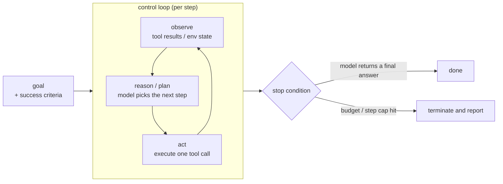

> **Layer**: 4 · Action and Collaboration / Agent Runtime ｜ **Exit of the layer above**: you can execute a single tool call safely and orchestrate fixed steps into a workflow ｜ **Exit of this layer**: you can build a minimal agent loop with stopping conditions and a budget, and you know which page owns state, recovery, and interface automation
> **Prerequisites**: [Tool Calling Contract](../05-action/tool-calling) · [Tool Execution Engineering](../05-action/tool-execution.md) · [Workflow Patterns](workflow.md) ｜ **Next**: [Agent Design Patterns](design-patterns.md) · [Agent State and Memory](state-memory.md) · [Recovery and Human-in-the-Loop](recovery-hitl.md) · [Computer Use](computer-use.md)

## 1. Overview

**Lead with the answer**: an agent runtime is the layer of code that puts a model, context, tools, and state inside a control loop, places that loop in an environment, and runs it until a stopping condition fires. Anthropic summarizes an agent as an LLM "using tools based on environmental feedback in a loop"; OpenAI's definition is isomorphic: agents are applications that "plan, call tools, collaborate across specialists, and keep enough state to complete multi-step work". You do not train the model — you write this runtime layer.

### The agent definition formula

```text
Agent = model
      + context (instructions, history, retrieved facts)
      + tools (a schema-constrained action space)
      + state (data that survives across steps)
      + control loop (observe -> reason/plan -> act -> observe)
      + environment (the single source of truth)
```

Memory, planning, human approval, and recovery are cross-cutting parts: they attach to the formula's state and loop as needed; they are not a sixth required component. Each has its own page: [design patterns](design-patterns.md), [state and memory](state-memory.md), [recovery and approval](recovery-hitl.md), [computer use](computer-use.md).

### Mental model: one loop



Each turn of the loop costs one model call plus some tool executions. **Environmental feedback is the only source of truth for progress**: the model must see the tool result to pick the next step — this is a correctness requirement, not an optimization.

### Decision table: agent vs adjacent shapes

| | Single tool call | Workflow | **Agent loop** | Multi-agent |
| --- | --- | --- | --- | --- |
| Direction | Write (once) | Write (multiple, fixed path) | Read/write loop, dynamic path | Cross-agent delegation |
| Control | Code | **Code-defined path** | **Model decides step by step** | Orchestrator + sub-agent autonomy |
| State | One call result | Multi-step artifacts | Session + memory + checkpoints | Isolated per-agent state |
| Trust domain | In-process | In-process | Within host + permission boundary | Same shape → [multi-agent](multi-agent.md); cross-domain → [protocols](../07-interoperability/index.md) |
| Minimum complexity | function call | static orchestration | loop + stop condition + permissions | delegation mechanism |

Anthropic's boundary in one sentence: **workflows orchestrate LLMs and tools through predefined code paths; agents dynamically direct their own processes and tool usage**. Both are agentic systems; the selection criterion is "can the steps be statically enumerated".

### When to use / when not to

- Use: the number of steps is unpredictable, the model must re-route on feedback, and the environment yields verifiable progress (test results, query returns).
- Do not use: steps are statically enumerable (→ [Workflow Patterns](workflow.md)); there is only one action (→ [Tool Execution Engineering](../05-action/tool-execution.md)); you cannot write down stopping conditions and a budget — the loop spends money and makes mistakes, so do not ship it without guardrails.

### Subtree navigation

| Problem you are solving | Read |
| --- | --- |
| How to build the loop, when it stops | This page |
| Which structure inside the loop (ReAct, routing, planner-executor…) | [Agent Design Patterns](design-patterns.md) |
| Where cross-step state lives, how to restore after a crash | [Agent State and Memory](state-memory.md) |
| Retry / rollback / compensation after failures, when humans must approve | [Recovery and Human-in-the-Loop](recovery-hitl.md) |
| No stable API / DOM, only a visual UI | [Computer Use](computer-use.md) |
| Reusing tools as manuals instead of code | [Agent Skills](skills.md) |
| Tools across processes / domains | [MCP](../07-interoperability/mcp.md) |

History milestones: the ReAct paper was submitted to arXiv on 2022-10-06 (v3 on 2023-03-10, ICLR camera-ready); Anthropic's "Building Effective Agents" was published 2024-12 (the page itself notes "the tooling landscape described in this post has changed since December 2024"); this subtree was frozen in 2026-09 with Issue #116. Other timelines are unverified; we do not fabricate them.

## 2. Usage

**Minimal hands-on**: ≤ 15 minutes, zero API keys, works from a clean checkout. Pinned to Node ≥ 22.6 (`--experimental-strip-types` runs TS directly). Model responses are replayed from a **scripted sequence** — the loop, budget, and stopping conditions are real runtime code; only the model API is replaced by a deterministic stand-in.

### Steps

1. Create an empty directory and save the code below as `minimal-agent-loop.ts`.
2. Run `node --experimental-strip-types minimal-agent-loop.ts`.

```ts
// minimal-agent-loop.ts
// Zero-key, deterministic agent runtime.
// Model responses are scripted; the loop, budget, and stop conditions are real.
// Run: node --experimental-strip-types minimal-agent-loop.ts   (Node >= 22.6)

/** What the "model" returns each turn: a tool call or a final answer. */
type ModelTurn =
  | { kind: "tool_call"; tool: string; args: Record<string, string> }
  | { kind: "final"; text: string };

/** A tool is a named function the runtime can execute. */
interface Tool {
  name: string;
  run: (args: Record<string, string>) => Promise<string>;
}

/** Scripted stand-in for a model API. Deterministic: replays `script`. */
class ScriptedModel {
  private cursor = 0;
  private readonly script: ModelTurn[];
  constructor(script: ModelTurn[]) {
    this.script = script;
  }
  async nextTurn(): Promise<ModelTurn> {
    if (this.cursor >= this.script.length) {
      throw new Error("script_exhausted: model has no more turns");
    }
    return this.script[this.cursor++];
  }
}

interface Budget {
  maxSteps: number; // hard stop: loop iterations
  maxTokens: number; // hard stop: simulated token spend
}

/** The runtime: drives model + tools until a stop condition fires. */
async function runAgent(
  model: ScriptedModel,
  tools: Record<string, Tool>,
  goal: string,
  budget: Budget,
): Promise<string> {
  const transcript: string[] = [`goal: ${goal}`];
  let tokens = 0;

  for (let step = 1; step <= budget.maxSteps; step++) {
    tokens += 120; // fixed per-step cost: observation + reasoning + action
    if (tokens > budget.maxTokens) {
      throw new Error(`budget_exceeded: tokens ${tokens} > ${budget.maxTokens}`);
    }

    const turn = await model.nextTurn(); // reason: the model decides
    if (turn.kind === "final") {
      // stop: the model produced a final answer
      transcript.push(`step ${step}: final -> ${turn.text}`);
      console.log(transcript.join("\n"));
      return turn.text;
    }

    const tool = tools[turn.tool]; // act: dispatch
    if (!tool) {
      throw new Error(`unknown_tool: ${turn.tool}`);
    }
    const observation = await tool.run(turn.args);
    transcript.push(
      `step ${step}: ${turn.tool}(${JSON.stringify(turn.args)}) -> ${observation}`,
    );
    // observe: the observation feeds the next model turn.
    // (The scripted model ignores it; a real model sees it as the tool result.)
  }
  throw new Error(`max_steps_exceeded: ${budget.maxSteps}`); // stop: budget
}

// --- fixture tools: pure functions, no I/O, no keys ---
const tools: Record<string, Tool> = {
  get_order: {
    name: "get_order",
    run: async (args) => `order ${args.orderId}: status=shipped, total=129.00`,
  },
  get_refund_policy: {
    name: "get_refund_policy",
    run: async () => "policy: refunds allowed within 30 days of delivery",
  },
};

// --- scenario 1 (positive): two tool calls, then a final answer ---
const okScript: ModelTurn[] = [
  { kind: "tool_call", tool: "get_order", args: { orderId: "A-1" } },
  { kind: "tool_call", tool: "get_refund_policy", args: {} },
  { kind: "final", text: "Order A-1 shipped recently; refund window still open." },
];

// --- scenario 2 (negative): a model that never stops calling tools ---
const loopScript: ModelTurn[] = [
  { kind: "tool_call", tool: "get_order", args: { orderId: "A-1" } },
  { kind: "tool_call", tool: "get_order", args: { orderId: "A-1" } },
  { kind: "tool_call", tool: "get_order", args: { orderId: "A-1" } },
];

async function main() {
  console.log("== scenario 1: normal run ==");
  await runAgent(new ScriptedModel(okScript), tools, "Can I still refund A-1?", {
    maxSteps: 4,
    maxTokens: 1000,
  });

  console.log("\n== scenario 2: budget stops the loop ==");
  try {
    await runAgent(new ScriptedModel(loopScript), tools, "Keep checking A-1", {
      maxSteps: 2,
      maxTokens: 1000,
    });
  } catch (err) {
    console.log(`expected failure: ${(err as Error).message}`);
  }
}

main();
```

### Expected output

```text
== scenario 1: normal run ==
goal: Can I still refund A-1?
step 1: get_order({"orderId":"A-1"}) -> order A-1: status=shipped, total=129.00
step 2: get_refund_policy({}) -> policy: refunds allowed within 30 days of delivery
step 3: final -> Order A-1 shipped recently; refund window still open.

== scenario 2: budget stops the loop ==
expected failure: max_steps_exceeded: 2
```

### Negative output (failure demo)

Change scenario 2's `maxSteps` from `2` to `8` and rerun: the script has only three turns, so the fourth raises

```text
Error: script_exhausted: model has no more turns
```

The lesson: **the model does not stop itself; the runtime must backstop it**. The real-world equivalent is a model calling tools repeatedly "to be more thorough" — which is why step and token caps live in code, not in the prompt.

### Acceptance command

```bash
node --experimental-strip-types minimal-agent-loop.ts
```

Pass criteria: scenario 1 returns a final answer after three steps; scenario 2 terminates with `max_steps_exceeded` instead of looping forever; no network access occurs.

### Cleanup

Delete the directory.

## 3. Principles

### What each loop phase answers

| Phase | Owner | Question answered | Typical failure mode |
| --- | --- | --- | --- |
| observe | Runtime | What does the environment look like now (tool results, errors, resources) | Tool results truncated or dropped → the model hallucinates progress |
| reason / plan | Model | What is the next step and why | Hallucinated tool names, unexecutable plans |
| act | Runtime | Execute one action under constraints | Privilege escalation, non-idempotent retries, timeouts without cancellation |

### Key invariants

1. **Stopping conditions exist before the loop does**: success criteria go into the prompt; step and token caps go into code. Without both, do not ship.
2. **Observations must be fed back**: every tool result enters the next model turn (the transcript convention in the fixture; the message history in real systems).
3. **The environment is the only source of truth**: judge "done or not" by tool results and verification, not by the model's self-report.
4. **Budgets decrease monotonically**: deduct every step, terminate on exhaustion — this is a cost and safety hard cap, not a statistics metric.

### State and lifecycle (brief)

One run's lifecycle is `load goal -> loop N steps -> final or termination`. Data that survives across steps (transcript, todos, external side-effect records) is state: where it lives, when to checkpoint, and how to restore after a crash belongs to [state and memory](state-memory.md); retry / rollback / compensation and human approval after failures belong to [recovery and approval](recovery-hitl.md).

### Spec claims vs local measurement

| Claim | Source (vendor / paper) | Local measurement |
| --- | --- | --- |
| Agents are systems "using tools based on environmental feedback in a loop" | Anthropic, "Building Effective Agents" | `runAgent` is that loop in ~40 lines |
| Stopping conditions (e.g. max iterations) are required to stay in control | Same | `max_steps_exceeded` in scenario 2 |
| Agents must "keep enough state to complete multi-step work" | OpenAI Agents docs | The fixture's transcript and `tokens` counter |
| Frameworks add abstraction that obscures prompts and complicates debugging; start with APIs directly | Anthropic | The hand-written loop fits on one page, breakpoints and replays work |

## 4. Development

### Integration and selection

- **Who owns the loop**: if you want control over parsing and executing every `tool_use` block, own the loop with the model API (OpenAI's framing: Responses API = you own it, Agents SDK = it is managed for you); if you want ready-made sessions, approval flows, and traces, use an Agent SDK. The core loop is a few dozen lines, so migration in either direction is cheap.
- **Version pinning**: tool definitions couple to model behavior — Anthropic states tool definitions deserve the same engineering attention as prompts. Pin the model version and the tool set together in production; any change to either requires re-evaluation.

### Symptom -> Evidence -> Action -> Done criteria

**Symptom**: the agent calls the same tool for a dozen turns with no progress.
**Evidence**: the trace shows N consecutive steps with identical observations; the run ends with `max_steps_exceeded`.
**Action**: confirm the observation is actually fed back into the model input; add "report failure after two identical results" to the prompt; tighten `maxSteps`.
**Done criteria**: replaying the session terminates after two repeats and outputs the failure reason.

### Symptom -> Evidence -> Action -> Done criteria

**Symptom**: the runtime throws `unknown_tool` and the task aborts.
**Evidence**: the model's tool name is not in the registry (typo or hallucination).
**Action**: return the error text to the model as an observation so it renames and retries, instead of crashing; disambiguate the tools — mutually exclusive names, descriptions with clear boundaries, because tool definitions are prompts for the model.
**Done criteria**: the next turn of the same session calls a legal tool; new tools get a name/description review before shipping.

### Symptom -> Evidence -> Action -> Done criteria

**Symptom**: one task's token cost exceeds budget by 3x.
**Evidence**: usage shows per-step input tokens growing linearly with step count (history replay); a long tail in the step distribution.
**Action**: add a token hard cap (the fixture's `maxTokens`); prune old tool results; switch long tasks to [compaction and external memory](state-memory.md).
**Done criteria**: p95 cost falls back inside budget; over-limit tasks terminate explicitly with a report instead of silently burning money.

### Anti-pattern list

- Calling a RAG pipeline an agent — retrieval is not a loop.
- Shipping without stopping conditions — "more thorough" is not a termination semantic.
- Using an autonomous loop for fixed steps — use a workflow.
- Going multi-agent on day one — first get one loop with two tools to green.
- Treating "the demo worked" as acceptance — missing any of stopping condition, budget, or permission boundary means insufficient evidence.

## 5. Resource Library

Four-level reading route:

- **Beginner**: read this page and run the minimal loop; restate the definition formula and the four invariants.
- **Builder**: read [design patterns](design-patterns.md) to pick the loop's structure; read [state and memory](state-memory.md) to add checkpoints.
- **Operator**: read [recovery and approval](recovery-hitl.md), then layer 5's [observability](../08-production/observability) and [cost and performance](../08-production/cost-performance).
- **Researcher**: read the ReAct paper and Learn LLM chapters 13 / 16 / 21 for the mechanism derivations.

### Resource table

| Name | Evidence level | Canonical URL | Purpose | Supported claim | Next |
| --- | --- | --- | --- | --- | --- |
| Building Effective Agents (Anthropic) | L1 (maintainer) | https://www.anthropic.com/research/building-effective-agents | Workflow/agent boundary and composition patterns | "tools in a loop" and "stopping conditions" definitions (retrievedAt 2026-09-01) | [Agent Design Patterns](design-patterns.md) |
| Agents guide (OpenAI) | L1 (maintainer) | https://platform.openai.com/docs/guides/agents | Production-SDK view of agent composition | "plan / call tools / keep state" definition; owned vs managed loop (retrievedAt 2026-09-01) | [Recovery and Human-in-the-Loop](recovery-hitl.md) |
| ReAct: Synergizing Reasoning and Acting (Yao et al., 2022) | L4 (research) | https://arxiv.org/abs/2210.03629 | The original argument for interleaved reasoning and acting | Reasoning traces help the model track and revise plans (retrievedAt 2026-09-01) | [Agent Design Patterns](design-patterns.md) |
| Learn LLM chapters 13 / 16 / 21 | sibling | https://llm.zenheart.site/chapters/ | Hand-written loops, LangGraph, multi-agent mechanics | Mechanism derivations belong to Learn LLM (retrievedAt 2026-09-01) | [multi-agent](multi-agent.md) |
| What is an agent? (Simon Willison) | L2 (authoritative secondary) | https://simonwillison.net/2025/Sep/18/agents/ | The minimal definition "autonomously using tools in a loop" | Cited by Anthropic's context engineering essay (retrievedAt 2026-09-01, cited via Anthropic's original text) | This page's overview |

### Active falsification and open questions

- Falsification entry: if you can construct a scenario that requires an agent to pass acceptance yet cannot express stopping conditions and permission boundaries, this page's "no stopping condition, no launch" rule has a hole — revise the rule rather than route around the scenario.
- Open: sensible default token budgets depend on model pricing and task distribution; this page gives no number. Measure with the methods in [cost and performance](../08-production/cost-performance).

### learn-ai stops here / where to go next

- Choosing the structure inside the loop: [Agent Design Patterns](design-patterns.md).
- Mechanism derivations for hand-written loops / LangGraph / multi-agent: Learn LLM [chapter directory](https://llm.zenheart.site/chapters/).
- Proving the agent is done well: [evals](https://evals.zenheart.site/) and this repo's [testing](../08-production/testing).
