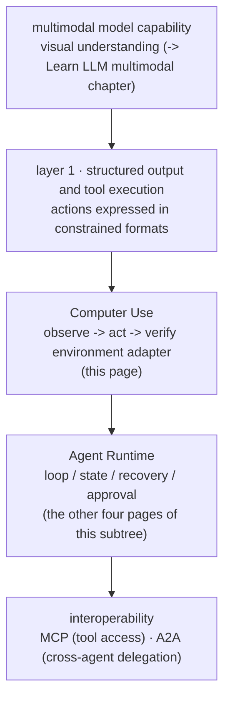

> **Group**: Agent Systems ｜ **Exit of the layer above**: you can build a minimal agent loop and know how to install recovery and human approval ｜ **Exit of this layer**: you can decide whether an interface-automation need calls for an API, DOM automation, or Computer Use, and you can equip Computer Use with a sandbox, approval gates, and injection defenses
> **Prerequisites**: [Agent Runtime](agent-runtime.md) · [Tool Execution Engineering](../05-action/tool-execution.md) ｜ **Next**: [Multi-Agent Systems](multi-agent.md) · [Security](../08-production/security) · [A2A](../07-interoperability/a2a.md)

## 1. Overview

**Lead with the answer**: the technical essence of Computer Use is **a control loop** — the model takes visual / semantic observations (screenshots, accessibility trees) as input, emits **constrained interface actions** (screenshot, click, type, zoom), and re-observes after every action to verify the result. It is not a new top-level capability category; it is the crossing point of three existing parts: **action capability** (layer 1's structured output and tool execution) + **an environment adapter** (translating pixels / DOM into model-readable form and model actions into environment-executable form) + **the agent runtime** (this subtree's loop, state, recovery, and approval).

### Placement map: which capabilities it crosses



Read bottom-up: the model can understand interfaces (multimodal) and actions can be expressed structurally (tool execution) before driving a UI is even possible; driving a UI safely and reliably requires the full runtime around it; and if the real goal is "delegate this task", the exit is A2A, not simulated clicks.

### Minimum-complexity decision table

| Environment condition | Minimum-complexity solution | Why not Computer Use |
| --- | --- | --- |
| The target system has a stable API | Direct API + schema ([tool calling contract](../05-action/tool-calling)) | Deterministic, fast, cheap, testable |
| The page has stable DOM / selectors | Playwright / CDP deterministic automation | Coordinate drift and visual misjudgment **disappear entirely** |
| Only a visual UI exists (no API, no stable DOM) | **Computer Use + sandbox + human approval** | This is its only ticket of entry |
| You need to delegate a task to another agent | [A2A](../07-interoperability/a2a.md), not a desktop-action protocol | Semantic delegation beats simulated clicks |

Evaluate top-down: **each step down is forced**. Prove the two rows above infeasible before using Computer Use — "there's an API but I don't want to request access" is not a valid reason.

### Non-goals (what this page is not)

| Not | What it is / where to go |
| --- | --- |
| A browser automation library | Playwright is deterministic driving code; Computer Use is a model **deciding** the next action inside a loop. They compose well: Computer Use judges intent, Playwright executes the stable segments |
| Vision model internals | Multimodal tokenization and visual encoding belong to Learn LLM's multimodal chapter; this page only borrows the fact that "the model can see images" |
| MCP | MCP is a tool-access protocol; Computer Use is the **execution environment** for one class of "interface tools" — it can be exposed via MCP, but the layers differ |
| A2A | A2A delegates task semantics; Computer Use manipulates pixels and focus. A delegation need is not an automation need |

### When to use / when not to

- Use: legacy systems with GUI-only surfaces; long-tail cross-application operations (form filling, verification, submission); as a **complement** to deterministic automation for structurally unstable parts.
- Do not use: a stable API / DOM exists (see the decision table); precision and speed are required (the vendor itself documents high latency and wrong coordinates); unsupervised high-risk operations (payments, deletions, outbound sends must pass an [approval gate](recovery-hitl.md)).

History milestones: Anthropic's computer use toolset is currently `computer_toolset_20260801` (17 member tools); earlier beta versions were `computer_20250124` and `computer_20251124` (per official docs, retrievedAt 2026-09-01). Earlier capability timelines are unverified; we do not fabricate them.

## 2. Usage

**Minimal hands-on**: ≤ 15 minutes, zero API keys, **no browser dependency**. A pure string DOM mock exercises the same Computer Use contract: `observe` (snapshot the element table) -> `act` (click / type by ref) -> `verify` (assert the postcondition), plus an **element drift** negative case — a stale reference misses after re-render. Real-browser end-to-end validation is deferred to Phase 5 (see [testing](../08-production/testing)).

### Steps

1. Create an empty directory and save the code below as `computer-use-dom-mock.ts`.
2. Run `node --experimental-strip-types computer-use-dom-mock.ts`.

```ts
// computer-use-dom-mock.ts
// Zero-key, deterministic observe -> act -> verify loop over a string DOM mock.
// Demonstrates the Computer Use control loop and the "element drift" failure
// where a stale element reference misses after the page re-renders.
// Real-browser validation is deferred to Phase 5.
// Run: node --experimental-strip-types computer-use-dom-mock.ts   (Node >= 22.6)

/** A page element as the "vision" layer would report it: role + name + ref. */
interface Element {
  ref: string;
  role: string;
  name: string;
}

/**
 * Pure string "DOM". In real Computer Use this is a screenshot plus pixel
 * coordinates; here the same contract (observe refs, act on refs, verify)
 * is exercised without a browser.
 */
let page: Element[] = [
  { ref: "username", role: "textbox", name: "Username" },
  { ref: "password", role: "textbox", name: "Password" },
  { ref: "submit", role: "button", name: "Sign in" },
];

/** Observe: snapshot the interface state the model will act on. */
function observe(): Element[] {
  return page.map((el) => ({ ...el })); // copy: snapshots go stale
}

/** Act: click / type against a ref. Returns what the environment did. */
function act(command: { action: "click" | "type"; ref: string; text?: string }): string {
  const el = page.find((e) => e.ref === command.ref);
  if (!el) return `error: no element with ref "${command.ref}"`;
  if (command.action === "type") {
    if (el.role !== "textbox") return `error: ${command.ref} is not typeable`;
    return `typed "${command.text}" into ${el.ref}`;
  }
  return `clicked ${el.ref} (${el.name})`;
}

/** Verify: check the postcondition; the model must not assume success. */
function verify(predicate: (els: Element[]) => boolean): boolean {
  return predicate(observe());
}

// --- happy path: fill the form, submit, verify the outcome ---
function happyPath(): void {
  act({ action: "type", ref: "username", text: "zen" });
  act({ action: "type", ref: "password", text: "hunter2" });
  act({ action: "click", ref: "submit" });
  // submit navigates: replace the page with the signed-in view
  page = [{ ref: "welcome", role: "heading", name: "Welcome back, zen" }];
  const ok = verify((els) => els.some((e) => e.name.includes("Welcome back")));
  console.log(`happy path verified: ${ok}`); // true
}

// --- negative path: stale snapshot after a re-render ("element drift") ---
function driftPath(): void {
  // restore a fresh login page first (happyPath navigated away)
  page = [
    { ref: "username", role: "textbox", name: "Username" },
    { ref: "password", role: "textbox", name: "Password" },
    { ref: "submit", role: "button", name: "Sign in" },
  ];
  const snapshot = observe(); // taken before the page changed
  page = [
    { ref: "banner", role: "banner", name: "Cookie notice" }, // inserted on top
    { ref: "submit-v2", role: "button", name: "Sign in" }, // ref re-assigned
  ];

  const target = snapshot.find((e) => e.ref === "submit")!; // stale reference
  const result = act({ action: "click", ref: target.ref });
  console.log(`stale click result: ${result}`); // error: no element with ref "submit"

  // recovery rule: after a failed act, re-observe before retrying
  const fresh = observe().find((e) => e.role === "button")!;
  console.log(`re-observed click: ${act({ action: "click", ref: fresh.ref })}`);
}

happyPath();
driftPath();
```

### Expected output

```text
happy path verified: true
stale click result: error: no element with ref "submit"
re-observed click: clicked submit-v2 (Sign in)
```

### Negative output (failure demo)

The negative case is built in: in the drift scenario, clicking with the **old snapshot's** ref returns `error: no element with ref "submit"`. Retrying the same ref unchanged is the wrong response (the page has not changed, so it will fail again); the correct response is **re-observe after the failure**, then relocate — which is exactly why the loop rule "re-observe after every action" exists.

### Acceptance command

```bash
node --experimental-strip-types computer-use-dom-mock.ts
```

Pass criteria: the happy path verifies as true; the drift click errors with the stale ref in the message; the re-observed click succeeds.

### Cleanup

Delete the directory.

## 3. Principles

### How the loop turns: the official agent loop

Anthropic's docs define the core of computer use as an agent loop: the model returns several **member tool calls** (`screenshot`, `left_click`, `type`, `zoom`, …), your application **executes them in order in your own environment**, returns one `tool_result` per call, and calls the model again; "the repetition of steps 3 and 4 without user input" is that loop. Three loop rules come straight from the official docs:

1. **Batches run in order and stop at the first failure**: all later blocks are marked not executed — later actions depend on the focus state established earlier.
2. **Every batch ends with a `screenshot`** (or the host attaches one): the model must see the current screen before deciding the next step.
3. **Coordinates live in the screenshot's pixel space**: if you scale screenshots down, map the model's coordinates back up proportionally to the real screen.

The officially recommended prompt states verify bluntly: "After each step, take a screenshot and carefully evaluate if you have achieved the right outcome... Only when you confirm a step was executed correctly should you move on to the next one."

### What the environment adapter provides

Between the model and the desktop you provide five things (the composition of the official reference implementation): a virtual display (e.g. Xvfb) + a lightweight desktop environment + preinstalled applications + action implementations (translating "click" into real mouse events) + the agent loop itself. Everything runs inside a container / VM — **the model never connects directly to any environment; your application is the sole execution channel**, which is exactly where privilege is enforced.

### Injection: page content is untrusted input

From the official security section: in some circumstances "Claude will follow commands found in content even when they conflict with your instructions" — instructions embedded in webpages, or even images, can override your task. The guardrails are layered:

1. **Isolation**: no production credentials and no sensitive data access inside the sandbox.
2. **Detection**: the vendor runs injection classifiers over screenshots and steers the model toward human confirmation on hits.
3. **Approval**: consequential actions (payment, send, delete) pass an [approval gate](recovery-hitl.md) per block — the docs warn explicitly that a batch can complete a multistep action within one turn, so the approval check must run **before each block**.

### Known limitations (vendor-stated)

| Limitation | Engineering response |
| --- | --- |
| Latency higher than direct human operation | Use for speed-insensitive scenarios (information gathering, regression testing) |
| Coordinates can be wrong / hallucinated | Verify after every action; re-observe on drift |
| Tool selection can be wrong | Smaller tasks, explicit instructions; one application at a time |
| Scrolling fails to take effect | Keyboard alternatives (Page Down, etc.) |
| Screenshot history bloats cost | Pruning policy (official suggestion: keep roughly the last 3, prune in batches about every 25 turns) |

### Spec claims vs local measurement

| Claim (official docs) | Local measurement (string DOM mock) |
| --- | --- |
| The loop = model emits actions, host executes, results feed back | The three functions `observe -> act -> verify` carry the same contract |
| Failed actions must surface errors and trigger replanning | `act` returns `error: no element with ref …` |
| Re-observe after each step to verify the result | `verify` asserts against a **fresh** observe |
| Snapshots go stale; old references drift | The drift scenario: the old ref's click fails, the re-observed one succeeds |
| Real browser behavior | **Not measured** — deferred to Phase 5 with Playwright driving real pages |

## 4. Development

### Four guardrails before launch

1. **Sandbox and allowlist**: a dedicated container / VM, network allowlisted per domain, no production credentials. The reference implementation is a Docker container plus an Xvfb virtual display.
2. **Least-privilege action set**: trim member tools to the task (disable `left_click_drag` if dragging is not needed); isolate filesystem and clipboard.
3. **HITL for sensitive operations**: payments, deletions, outbound sends, logins (the vendor notes explicitly that login scenarios raise injection risk) must pass an approval gate, checked **before each block** of a batch.
4. **Retry / idempotency / cancellation**: clicks are not idempotent (submitting twice = two orders) — verify current state before retrying; canceling = not running the unexecuted blocks of a batch (the official halt semantics support this natively).

### Symptom -> Evidence -> Action -> Done criteria

**Symptom**: clicks consistently miss in one direction.
**Evidence**: row one of the official diagnostic table — the model's coordinates are based on the screenshots you return and were applied unscaled to a differently sized real screen.
**Action**: scale every coordinate by the ratio (screen size / screenshot size) before executing; mind the device pixel ratio on high-DPI displays.
**Done criteria**: clicks land on the target element; drift returns to zero.

### Symptom -> Evidence -> Action -> Done criteria

**Symptom**: on some page, the agent suddenly starts performing actions unrelated to the task (say, opening a "download" link inside an ad).
**Evidence**: the trace shows the pre-action screenshot containing newly injected page content; nothing in the task prompt justifies the action.
**Action**: treat it as injection — terminate the run immediately; enable the screenshot injection classifier; the sensitive-action gate should have intercepted it anyway; afterwards, add the page to the untrusted list and audit the executed actions.
**Done criteria**: replaying the same page gets intercepted by the classifier / approval gate; the audit confirms no unauthorized side effects remain.

### Symptom -> Evidence -> Action -> Done criteria

**Symptom**: long-session costs explode; requests start getting rejected.
**Evidence**: dozens of screenshots piling up in requests; past 20 images the stricter per-image limits kick in.
**Action**: cap resolution (official baselines 1280x720 / 1024x768, avoid above 1920x1080); prune old screenshots in batches (never per-turn — that defeats prompt caching).
**Done criteria**: ≤ 20 images per request; p95 cost falls back; cache hit rate recovers.

### Symptom -> Evidence -> Action -> Done criteria

**Symptom**: the target button exists, yet clicks keep missing or hitting the wrong element.
**Evidence**: the element is tiny or lost detail to screenshot downscaling; visually similar neighbors are present.
**Action**: keep the `zoom` member enabled so the model can inspect; use **positional descriptions** in prompts ("the blue Submit button in the bottom-right"); break the interaction into smaller steps.
**Done criteria**: the step hits its target across N consecutive replays; mis-hits on neighbors drop to zero.

### Anti-pattern list

- Using Computer Use to "skip requesting access" when an API exists — trading a deterministic problem for a probabilistic one.
- Running directly on the host without a sandbox — one injection and everything is lost.
- Executing a multi-step batch containing a payment with no per-block approval — an irreversible chain can complete within one turn.
- Treating a demo video as acceptance — tests without drift / injection / cost negative cases are not evidence.

## 5. Resource Library

Four-level reading route:

- **Beginner**: run this page's string DOM mock; understand observe / act / verify and the drift negative case.
- **Builder**: run one real task with the official computer-use-demo (Docker reference), entirely inside a sandbox.
- **Operator**: add the injection classifier, approval gates, and screenshot pruning to production instances; wire per-step screenshots into [observability](../08-production/observability).
- **Researcher**: read the multimodal mechanics (Learn LLM) and GUI-agent evaluation literature (WebShop / OSWorld-style benchmarks).

### Resource table

| Name | Evidence level | Canonical URL | Purpose | Supported claim | Next |
| --- | --- | --- | --- | --- | --- |
| Computer use tool (Anthropic docs) | L0 (official docs) | https://docs.anthropic.com/en/docs/agents-and-tools/tool-use/computer-use-tool | Agent loop, batch semantics, injection defense, limitation list | All quotes and diagnostic tables on this page come from here (retrievedAt 2026-09-01) | browser use tool docs |
| Browser use tool (Anthropic docs) | L0 (official docs) | https://docs.anthropic.com/en/docs/agents-and-tools/tool-use/browser-use-tool | The closer-fitting toolset for in-page tasks | "For tasks that stay inside webpages, the browser use tool is the closer fit" (cross-referenced from the computer use page, retrievedAt 2026-09-01) | Official docs |
| computer-use-demo (anthropic-quickstarts) | L1 (maintainer code) | https://github.com/anthropics/anthropic-quickstarts/tree/main/computer-use-demo | Docker + Xvfb reference environment | The five-part sandbox environment, implemented (retrievedAt 2026-09-01) | Clone and run |
| Playwright | L1 (maintainer) | https://playwright.dev/ | Deterministic automation for stable DOMs | "reliable web automation for testing, scripting, and AI agents" (retrievedAt 2026-09-01, search-snapshot level verification) | [Testing](../08-production/testing) |
| ReAct (Yao et al., 2022) | L4 (research) | https://arxiv.org/abs/2210.03629 | The loop origin of observe-act alternation | Early evidence on GUI interaction tasks like WebShop (retrievedAt 2026-09-01) | Full paper |
| Learn LLM · multimodal | sibling | https://llm.zenheart.site/chapters/ | Visual encoding and multimodal mechanics | How the model "sees" is not expanded in this repo (retrievedAt 2026-09-01) | Learn LLM |

### Active falsification and open questions

- Falsification entry: if your GUI automation task passes acceptance stably under Playwright, Computer Use is over-engineering for it — record the cost gap and downgrade.
- Open: this page's fixture simulates the contract with a string DOM; **real-browser end-to-end validation is deferred to Phase 5** (re-running the drift negative case with Playwright driving a real page); the vendor publishes no detection-rate number for the screenshot injection classifier, so none is cited.

### learn-ai stops here / where to go next

- How the model understands screenshots: Learn LLM's multimodal chapter.
- Deterministic UI automation and testing: this repo's [testing](../08-production/testing).
- Delegating tasks to other agents: [A2A](../07-interoperability/a2a.md).
- The full attack surface of injection and isolation: layer 5 [security](../08-production/security).
