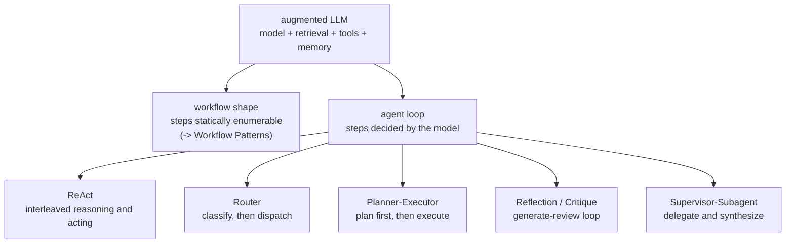

> **Group**: Agent Systems ｜ **Exit of the layer above**: you can build a minimal agent loop with stopping conditions and a budget ｜ **Exit of this layer**: you can pick the right control structure for a loop already justified to be autonomous, and name each structure's failure modes
> **Prerequisites**: [Agent Runtime](agent-runtime.md) ｜ **Next**: [Multi-Agent Systems](multi-agent.md) · [Workflow Patterns](workflow.md)

## 1. Overview

**Lead with the answer**: design patterns are the **control structure of the loop** — they decide "who decides the next step, and when". This page covers the five structures most common in production: ReAct, Router, Planner-Executor, Reflection (critique), and Supervisor-Subagent. The selection principle comes before all patterns: **if a workflow solves it, do not use an agent** (Anthropic: "finding the simplest solution possible, and only increasing complexity when needed"); patterns pick the skeleton for a loop whose autonomy is already justified — they are not a reason to upgrade a simple task into an agent.

### Mental model: the pattern family tree



The same augmented LLM yields different shapes depending on where control sits: fully in code is a workflow, handed to the model step by step is an agent loop, and the five patterns are different divisions of labor inside that loop.

### Five-pattern decision table

| Pattern | Problem it solves | Autonomy | Relative cost | Typical failure mode |
| --- | --- | --- | --- | --- |
| ReAct | Each step needs a "think" before acting | Stepwise reasoning in one loop | Extra reasoning tokens per step | Reasoning never lands; spinning in place |
| Router | Inputs fall into clear categories, each with its own handling | Only the classify step | +1 classification call | Misclassification amplifies errors downstream |
| Planner-Executor | Complex task: plan first, execute stepwise | One-shot planner autonomy | +1 planning call | Unexecutable plans; plans go stale mid-run |
| Reflection | First-pass quality is not enough; polish against criteria | Generate + review dual loop | 2x+ tokens and latency | Review never converges; cost doubles |
| Supervisor-Subagent | Subtasks need isolated contexts | Delegated autonomy | One fresh context per sub-agent | Over-decomposition; context breaks at seams |

### When to use / when not to

- Use: you have already confirmed via the [complexity ladder](../00-map/complexity-ladder) that an agent is warranted (you can write stopping conditions and permission boundaries), and now must answer "how to divide labor inside the loop".
- Do not use: steps are statically enumerable — go to [Workflow Patterns](workflow.md); you need cross-agent delegation and state isolation — go to [Multi-Agent Systems](multi-agent.md); single-step tasks — [Tool Execution Engineering](../05-action/tool-execution.md).

History milestones: the ReAct paper was submitted 2022-10 (arXiv 2210.03629); Anthropic's "Building Effective Agents" (2024-12) documented the production patterns routing / orchestrator-workers / evaluator-optimizer. How the five patterns evolved across frameworks is unverified; we do not fabricate it.

## 2. Usage

**Minimal hands-on**: ≤ 15 minutes, zero API keys. A fixed script replays model responses to drive a real ReAct loop — Thought -> Action -> Observation interleaved until a Final Answer — plus a hallucinated-action negative case.

### Steps

1. Create an empty directory and save the code below as `react-loop.ts`.
2. Run `node --experimental-strip-types react-loop.ts`.

```ts
// react-loop.ts
// Zero-key, deterministic ReAct: Thought -> Action -> Observation -> ... -> Final Answer.
// The "model" is a fixed script; the loop mechanics and failure paths are real.
// Run: node --experimental-strip-types react-loop.ts   (Node >= 22.6)

/** One scripted model step: a thought plus either an action or a final answer. */
type ReActTurn =
  | { thought: string; action: { name: string; args: Record<string, string> } }
  | { thought: string; finalAnswer: string };

const knowledgeBase: Record<string, string> = {
  "refund policy": "refunds allowed within 30 days of delivery",
  "order A-42": "delivered 2026-08-20, total 129.00",
};

const actions: Record<string, (args: Record<string, string>) => string> = {
  search: (args) =>
    args.topic in knowledgeBase
      ? knowledgeBase[args.topic]
      : `no_result for "${args.topic}"`,
  finish: () => "", // handled by the loop, never dispatched
};

const script: ReActTurn[] = [
  {
    thought: "I need the delivery date to decide if a refund is possible.",
    action: { name: "search", args: { topic: "order A-42" } },
  },
  {
    thought: "Delivered 2026-08-20. Now I need the refund window.",
    action: { name: "search", args: { topic: "refund policy" } },
  },
  {
    thought: "Delivery + 30-day window means the refund is still possible.",
    finalAnswer:
      "Order A-42 was delivered 2026-08-20 and refunds are allowed within 30 days, so a refund is still possible.",
  },
];

function runReAct(script: ReActTurn[], maxSteps = 6): string {
  for (let step = 1; step <= maxSteps; step++) {
    const turn = script[step - 1];
    if (!turn) throw new Error(`max_steps_exceeded: no turn ${step} in script`);
    console.log(`Thought: ${turn.thought}`);

    if ("finalAnswer" in turn) {
      console.log(`Final Answer: ${turn.finalAnswer}`);
      return turn.finalAnswer;
    }

    const handler = actions[turn.action.name];
    if (!handler) {
      // Negative path: the model hallucinated an action name with no tool.
      throw new Error(
        `unknown_action: "${turn.action.name}" is not a registered action`,
      );
    }
    console.log(`Action: ${turn.action.name} ${JSON.stringify(turn.action.args)}`);
    const observation = handler(turn.action.args);
    console.log(`Observation: ${observation}\n`);
  }
  throw new Error(`max_steps_exceeded: no final answer within ${maxSteps} steps`);
}

// --- positive run ---
console.log("== ReAct run: refund eligibility ==");
runReAct(script);

// --- negative run: hallucinated action name ---
console.log("\n== ReAct run: hallucinated action ==");
try {
  runReAct([
    {
      thought: "I will email the warehouse directly.",
      action: { name: "send_email", args: { to: "warehouse" } },
    },
  ]);
} catch (err) {
  console.log(`expected failure: ${(err as Error).message}`);
}
```

### Expected output

```text
== ReAct run: refund eligibility ==
Thought: I need the delivery date to decide if a refund is possible.
Action: search {"topic":"order A-42"}
Observation: delivered 2026-08-20, total 129.00

Thought: Delivered 2026-08-20. Now I need the refund window.
Action: search {"topic":"refund policy"}
Observation: refunds allowed within 30 days of delivery

Thought: Delivery + 30-day window means the refund is still possible.
Final Answer: Order A-42 was delivered 2026-08-20 and refunds are allowed within 30 days, so a refund is still possible.

== ReAct run: hallucinated action ==
expected failure: unknown_action: "send_email" is not a registered action
```

### Negative output (failure demo)

The negative case is built into the second run. Note the difference from the positive run: the model "thought of" a reasonable action (email the warehouse), but the action is not in the registry — **sound reasoning does not mean an executable action**. The production handling is to return `unknown_action` to the model as an observation for retry, not to crash the process.

### Acceptance command

```bash
node --experimental-strip-types react-loop.ts
```

Pass criteria: the positive run completes two Thought/Action/Observation rounds and returns a Final Answer; the negative run raises `unknown_action` with the action name in the message.

### Cleanup

Delete the directory.

## 3. Principles

### ReAct: interleaved reasoning and acting

From the paper: reasoning traces help the model "induce, track, and update action plans as well as handle exceptions", while actions let it "interface with external sources... to gather additional information". The structure is exactly the fixture:

```text
Thought: I need the delivery date to decide refund eligibility
Action: search {"topic": "order A-42"}
Observation: delivered 2026-08-20
Thought: delivery is inside the 30-day window
Final Answer: refund is possible
```

- Fits: investigation-style tasks where the next step depends on the previous result (retrieval, debugging, data analysis).
- Does not fit: single deterministic operations; pure generation tasks (one call suffices).
- Failure modes: reasoning never lands (thinking without doing); spinning in place (same Action repeated — backstopped by stopping conditions).

### Router: classify, then dispatch

A classification step routes input to a dedicated prompt, tool set, or model. Anthropic's production example: route easy questions to a small, cost-efficient model and hard ones to a capable model. The classifier need not be an LLM — a traditional classifier is cheaper and calibratable.

- Fits: clear input categories, each needing a different downstream (prompt / tools / model / plain code).
- Does not fit: ambiguous category boundaries; only one category of input.
- Failure modes: misclassification amplifies the error down the whole branch; boundary inputs look "unlike" both sides.

### Planner-Executor: plan first, then execute

A planner produces a step list in one shot; an executor runs the steps (each a tool call, a sub-loop, or code). This maps to Anthropic's orchestrator-workers, where subtasks are **not pre-defined** but split dynamically per input. The key constraints: every planned step carries a **verifiable done criterion**, and there is a replan trigger for "observation contradicts plan" — the world changes and plans go stale.

- Fits: tasks where the subtask list is unpredictable (multi-file changes, multi-source research).
- Does not fit: two-step tasks (the planning overhead is wasted).
- Failure modes: unexecutable plans (referencing nonexistent resources); a stale plan executed without replanning as the world changes.

### Reflection / Critique: generate-review loop

One role generates, another reviews against explicit criteria, feedback goes back to the generator, until a threshold or max iterations. This is Anthropic's evaluator-optimizer; its two fit signals: outputs **demonstrably improve when a human articulates feedback**, and **the model can provide such feedback**.

- Fits: technical docs, code generation, translation polish with clear, measurable criteria.
- Does not fit: overly subjective criteria; deterministic tools available (code style belongs to a linter, not a review model); real-time paths.
- Failure modes: never converging (the reviewer can always nitpick) — a max iteration count and quality threshold are mandatory; plateauing without stopping (stop when two consecutive rounds improve by less than epsilon).

### Supervisor-Subagent: delegate and synthesize

The main agent delegates subtasks to sub-agents with **fresh contexts**; each explores deeply and returns only a distilled summary (Anthropic's multi-agent research observation: a sub-agent may burn tens of thousands of tokens but returns roughly 1,000–2,000 tokens of summary). This is both a labor pattern and a [state-management strategy](state-memory.md): noise stays isolated in sub-contexts.

- Fits: independent subtasks that each need heavy exploration (code review, deep research, long test-log analysis).
- Does not fit: subtasks strongly coupled through shared context; anything the main agent solves with a few tool calls itself.
- Failure modes: over-decomposition (delegating every tiny task); broken seams (the summary drops details the main agent needed).

### Spec claims vs local measurement

| Claim | Source (paper / vendor) | Local measurement |
| --- | --- | --- |
| Reasoning traces help track and revise plans and handle exceptions | ReAct paper abstract | Every Thought in the fixture references the previous Observation |
| Actions bring external information into reasoning | Same | The `search` result directly changes the next decision |
| Models can hallucinate nonexistent actions | Runtime engineering consensus | The negative case's `unknown_action: "send_email"` |
| Evaluator-optimizer only with clear criteria and measurable improvement | Anthropic | The fixture does not implement it (adding it without clear criteria is an anti-pattern) |

## 4. Development

### Integration notes

- **Make pattern composition explicit**: a production system often routes into a planner-executor whose steps run ReAct with reflection at the exit. Each pattern's stopping conditions and budgets are **independent**; when nesting, the outer budget must cover the sum of the inner ones.
- **Framework mapping**: LangGraph and the Agents SDKs ship these shapes (OpenAI's docs map supervisor to agents-as-tools and handoffs). Before adopting a framework, confirm you can read a per-step trace — a framework where you cannot see "who decided the next step" destroys debuggability.

### Symptom -> Evidence -> Action -> Done criteria

**Symptom**: the Router sends refund tickets into the tech-support lane.
**Evidence**: routing logs show near-tied category scores (e.g. 0.51 vs 0.49); downstream handling takes abnormally long.
**Action**: add a confidence threshold with a fallback lane (human or general path) below it; regression-test the classifier with historical misroutes.
**Done criteria**: the misroute rate drops below target; boundary samples all land in fallback instead of a random lane.

### Symptom -> Evidence -> Action -> Done criteria

**Symptom**: the Planner's plan fails at step 3 every time.
**Evidence**: steps reference nonexistent files / endpoints; no dry-run validation ran before execution.
**Action**: require a done-criterion command in the plan schema; run the criterion before executing (it should fail) to confirm decidability; trigger replan when observations contradict the plan instead of pushing through.
**Done criteria**: replaying that plan gets caught by pre-execution validation; after replanning it passes or reports infeasibility explicitly.

### Symptom -> Evidence -> Action -> Done criteria

**Symptom**: the Reflection loop runs 12 rounds, cost is 6x, the quality score does not move.
**Evidence**: review comments get increasingly trivial; scores improve by less than noise for N consecutive rounds.
**Action**: set max iterations (2–3 by default) and a quality threshold; add plateau detection (stop when two consecutive rounds improve by < epsilon); first check whether a deterministic tool fits better than a model reviewer.
**Done criteria**: p95 iterations ≤ the cap; plateauing tasks terminate within 2 rounds keeping the best output so far.

### Symptom -> Evidence -> Action -> Done criteria

**Symptom**: the Supervisor spawns 8 sub-agents and their syntheses contradict each other.
**Evidence**: subtask granularity is file-level; summaries omit key constraints the main agent needs.
**Action**: adopt the rule "if the main agent can do it, do not delegate"; partition subtasks by **need for isolated context**, not by file; require summaries to carry "conclusion + evidence + uncertainties".
**Done criteria**: sub-agent count drops while syntheses stay consistent; cases of key information lost at seams go to zero.

### Anti-pattern list

- Stacking patterns to "look advanced" — every pattern adds at least one model call.
- Treating Reflection as a universal quality backstop — fix prompts and tools first; a review model cannot rescue a wrong action space.
- Supervisor decomposition at file granularity — delegation cost (context rebuild) exceeds the benefit.
- Router without fallback — misclassification has no safety net.

## 5. Resource Library

Four-level reading route:

- **Beginner**: run this page's ReAct fixture and map the output onto Thought / Action / Observation.
- **Builder**: add a Router or a Planner to your own loop and measure cost and quality before and after.
- **Operator**: read Anthropic's five patterns in the original essay and map them onto your production traces.
- **Researcher**: read the full ReAct paper and Learn LLM chapter 16 (LangGraph).

### Resource table

| Name | Evidence level | Canonical URL | Purpose | Supported claim | Next |
| --- | --- | --- | --- | --- | --- |
| Building Effective Agents (Anthropic) | L1 (maintainer) | https://www.anthropic.com/research/building-effective-agents | Production framing of routing / orchestrator-workers / evaluator-optimizer | "simplest solution first"; pattern fit signals (retrievedAt 2026-09-01) | [Workflow Patterns](workflow.md) |
| ReAct (Yao et al., 2022) | L4 (research) | https://arxiv.org/abs/2210.03629 | The original mechanism of interleaved reasoning and acting | The reasoning/acting complementarity argument (retrievedAt 2026-09-01) | Full paper |
| Agents guide (OpenAI) | L1 (maintainer) | https://platform.openai.com/docs/guides/agents | The supervisor shape in SDK terms (agents-as-tools, handoffs) | Production implementations of delegation and specialist agents (retrievedAt 2026-09-01) | [Multi-Agent Systems](multi-agent.md) |
| Effective context engineering for AI agents (Anthropic) | L1 (maintainer) | https://www.anthropic.com/engineering/effective-context-engineering-for-ai-agents | Sub-agents as a context-isolation strategy | Sub-agents burn tens of thousands of tokens and return 1,000–2,000-token summaries (retrievedAt 2026-09-01) | [State and Memory](state-memory.md) |
| Learn LLM chapter 16 | sibling | https://llm.zenheart.site/chapters/ | How these patterns are implemented in LangGraph | Mechanism derivations belong to Learn LLM (retrievedAt 2026-09-01) | [multi-agent](multi-agent.md) |

### Active falsification and open questions

- Falsification entry: if a pure workflow matches the pattern-loaded agent version on acceptance for some task, the pattern is a liability in that scenario — remove it and record the case on the pattern page.
- Open: there is no authoritative cross-framework name mapping (e.g. LangGraph graph shapes vs this page's five patterns); this page gives the conceptual mapping only and does not claim framework-by-framework correspondence.

### learn-ai stops here / where to go next

- Full mechanics of delegation and state isolation: [Multi-Agent Systems](multi-agent.md).
- The shape for statically enumerable steps: [Workflow Patterns](workflow.md).
- Graph-structure implementation details of these patterns: Learn LLM chapter 16.
