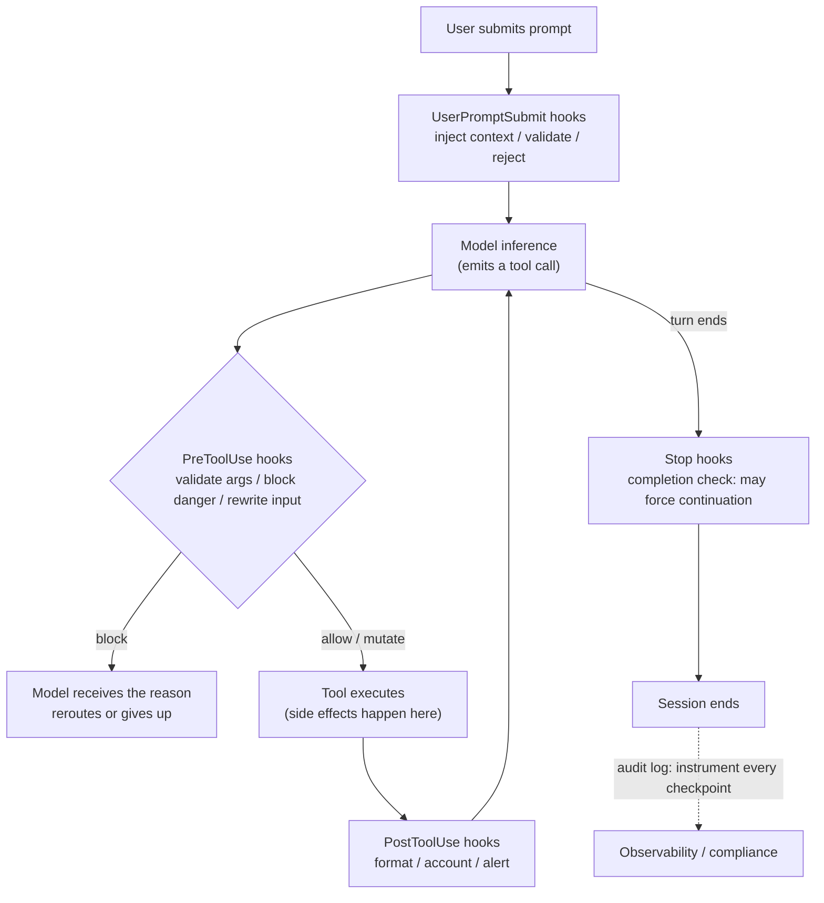

> **Group**: Agent Systems ｜ **Exit of the layer above**: you can build a minimal agent loop with stopping conditions and a budget ｜ **Exit of this layer**: you can mount automated policy gates at host lifecycle points (block / allow / mutate), pick the right failure mode (fail-closed vs fail-open) for each hook, and keep hook, Skill, and HITL responsibilities straight
> **Prerequisites**: [Agent Runtime](agent-runtime.md) · [Agent State and Memory](state-memory.md) ｜ **Next**: [Recovery and Human-in-the-Loop](recovery-hitl.md) (the human gate), [Agent Skills](skills.md) (the knowledge pack)

## 1. Overview

**Conclusion first**: when a rule must be **guaranteed to run** rather than **suggested to follow**, promote it from an instruction (prompt / CLAUDE.md) to a hook — user code the host calls automatically at fixed lifecycle points. Hooks solve the **automated policy enforcement point problem**: they are control-plane callbacks, not knowledge, not tools, not protocols. A hook never enters context and never grants the model a new capability; it inserts deterministic code between "the model wants to act" and "the act actually happens".

### Mental model: checkpoints on the agent loop



Key invariant: **hooks run before or immediately after side effects, without relying on the model's goodwill**. PreToolUse is the only position that can change the outcome *before the fact* — miss it and the tool has already executed; all that remains is accounting and remediation.

### When to use / when not to

- Use:
  - deterministic checks that must run on every tool call (dangerous-command blocking, sensitive-file protection, argument normalization);
  - audit and observability instrumentation (who called what and when, written to a compliance log);
  - event-driven automation (auto-format after edits, inject environment state at session start, cleanup at end);
  - turning "team hard rules" from prompt suggestions into executable gates.
- Do not use:
  - when the rule itself needs semantic judgment → that is prompt instructions or a host-side LLM evaluation;
  - high-risk decisions that need human judgment → a human approval gate (see [Recovery and Human-in-the-Loop](recovery-hitl.md)); hooks and HITL divide labor, they do not substitute;
  - knowledge the model loads on demand → a [Skill](skills.md).

### Decision table: versus adjacent mechanisms

| Mechanism | Essence | Execution guarantee | Who decides | Typical use |
| --- | --- | --- | --- | --- |
| Instruction (prompt / CLAUDE.md) | suggestion in context | none — the model can deviate | model | style preferences, domain background |
| **Hook (this page)** | **control-plane callback** | **host guarantees the call** | **deterministic code** | **guardrails, audit, automation** |
| Skill | knowledge pack (progressive disclosure) | triggering is semantic matching | model + host | reusable procedures |
| Permission system (allowlist / deny rules) | host hard boundary | enforced | rule table | the "never allow" list |
| HITL approval gate | human judgment point | forced pause | human | irreversible / high-cost / low-confidence |

Division of labor with the [recovery-hitl approval gate](recovery-hitl.md): **a hook is an automated policy gate** (rules are enumerable and machine-decidable, e.g. "always reject `rm -rf`"); **HITL is the human gate** (rules are not enumerable and consequences are irreversible, e.g. "a human signs off before dropping the production database"). Mature hosts chain them: the hook filters what machines can judge, and the remaining uncertain traffic escalates to a person.

### Historical milestones

- Claude Code introduced hooks in 2025 (the old site's page is archived in this repo's git history, in commits before `b00c69d8f`); as of 2026-09-01 the official reference has grown to roughly 30 events and 5 handler types (verified at code.claude.com).
- The event list evolves quickly (PreCompact, PermissionRequest, TeammateIdle and others were added later); this page freezes only the stable core — per-event schemas belong to the official reference.

## 2. Usage

Minimal practice: in 30 minutes, implement a mini hook runner — register a pre-tool hook that validates arguments and a post hook that accounts, demonstrate the three outcomes **block / allow / mutate**, and use a hook that itself throws to contrast **fail-closed vs fail-open**. Zero dependencies, zero API keys, Node >= 23.6 (native TS).

### Step 1: write the hook runner

```typescript fixture
// hooks-runner.ts — mini hook runner: lifecycle interception around tool calls
// Zero dependencies; Node >= 23.6 runs TS natively (node hooks-runner.ts)

// ---------- Types: a hook is a control-plane callback; inputs and outputs are plain data ----------

type ToolCall = { tool: string; input: Record<string, unknown> };

type HookDecision =
  | { action: "allow" }
  | { action: "block"; reason: string }
  | { action: "mutate"; input: Record<string, unknown> };

type PreToolHook = {
  name: string;
  run: (call: ToolCall) => HookDecision;
};

type PostToolHook = {
  name: string;
  run: (call: ToolCall, result: unknown) => void; // accounting/observability: side effects only, no decision
};

// fail-closed / fail-open: the policy when the hook itself throws
type FailPolicy = "closed" | "open";

// ---------- runner: put tool execution inside a hook pipeline ----------

const auditLog: string[] = [];

function runToolCall(
  execute: (input: Record<string, unknown>) => unknown,
  preHooks: PreToolHook[],
  postHooks: PostToolHook[],
  call: ToolCall,
  failPolicy: FailPolicy,
): { status: "ok" | "blocked"; result?: unknown; reason?: string } {
  let input = call.input;

  // (1) pre phase: validate / block / rewrite arguments (block wins over later hooks)
  for (const hook of preHooks) {
    let decision: HookDecision;
    try {
      decision = hook.run({ tool: call.tool, input });
    } catch (err) {
      // a hook's own failure != the tool call's failure: the explicit policy decides
      const msg = err instanceof Error ? err.message : String(err);
      if (failPolicy === "closed") {
        auditLog.push(`[hook-error:${hook.name}] fail-closed -> blocked (${msg})`);
        return { status: "blocked", reason: `hook ${hook.name} failed (fail-closed): ${msg}` };
      }
      auditLog.push(`[hook-error:${hook.name}] fail-open -> allowed (${msg})`);
      continue;
    }
    if (decision.action === "block") {
      auditLog.push(`[pre:${hook.name}] BLOCK ${call.tool} (${decision.reason})`);
      return { status: "blocked", reason: decision.reason };
    }
    if (decision.action === "mutate") {
      input = decision.input;
      auditLog.push(`[pre:${hook.name}] MUTATE ${call.tool} input`);
    }
  }

  // (2) execute the tool itself (reached only after pre hooks pass/rewrite)
  const result = execute(input);

  // (3) post phase: accounting and observability; a throwing post hook degrades to a warning
  for (const hook of postHooks) {
    try {
      hook.run({ tool: call.tool, input }, result);
    } catch (err) {
      const msg = err instanceof Error ? err.message : String(err);
      auditLog.push(`[post:${hook.name}] DEGRADED (${msg})`);
    }
  }
  return { status: "ok", result };
}

// ---------- Demo: a deploy tool + three hooks ----------

const deploy = (input: Record<string, unknown>) =>
  `deployed ${input.app} to ${input.region ?? "?"} (replicas=${input.replicas ?? 1})`;

const validateParams: PreToolHook = {
  name: "validate-params",
  run: (call) => {
    if (call.input.app === undefined) return { action: "block", reason: "missing required param: app" };
    if (!/^[a-z][a-z0-9-]*$/.test(String(call.input.app)))
      return { action: "block", reason: `app must be kebab-case, got "${call.input.app}"` };
    return { action: "allow" };
  },
};

const normalizeRegion: PreToolHook = {
  name: "normalize-region",
  run: (call) => {
    const region = String(call.input.region ?? "");
    if (region === "") return { action: "allow" };
    if (region !== region.toLowerCase()) return { action: "mutate", input: { ...call.input, region: region.toLowerCase() } };
    return { action: "allow" };
  },
};

const accounting: PostToolHook = {
  name: "accounting",
  run: (call, result) => {
    auditLog.push(`[post:accounting] OK ${call.tool}: ${String(result)}`);
  },
};

// ---------- Three outcomes + one fail-closed negative case ----------

console.log("1) ALLOW:", JSON.stringify(
  runToolCall(deploy, [validateParams, normalizeRegion], [accounting],
    { tool: "deploy", input: { app: "web", region: "AP-Southeast-1" } }, "closed")));

console.log("2) BLOCK:", JSON.stringify(
  runToolCall(deploy, [validateParams, normalizeRegion], [accounting],
    { tool: "deploy", input: { app: "Web", region: "sg" } }, "closed")));

console.log("3) MUTATE+ALLOW:", JSON.stringify(
  runToolCall(deploy, [normalizeRegion], [accounting],
    { tool: "deploy", input: { app: "api", region: "AP-NORTHEAST-1" } }, "closed")));

// Negative case: a pre hook that itself throws — the same call ends differently under each policy
const brokenHook: PreToolHook = {
  name: "flaky-policy",
  run: () => { throw new Error("policy service unreachable"); },
};

console.log("4a) fail-closed:", JSON.stringify(
  runToolCall(deploy, [brokenHook], [accounting],
    { tool: "deploy", input: { app: "web", region: "sg" } }, "closed")));

console.log("4b) fail-open:", JSON.stringify(
  runToolCall(deploy, [brokenHook], [accounting],
    { tool: "deploy", input: { app: "web", region: "sg" } }, "open")));

console.log("audit log:");
for (const line of auditLog) console.log("  " + line);
```

### Step 2: run

```bash fixture
node hooks-runner.ts
```

Output (verified, Node 24):

```text fixture
1) ALLOW: {"status":"ok","result":"deployed web to ap-southeast-1 (replicas=1)"}
2) BLOCK: {"status":"blocked","reason":"app must be kebab-case, got \"Web\""}
3) MUTATE+ALLOW: {"status":"ok","result":"deployed api to ap-northeast-1 (replicas=1)"}
4a) fail-closed: {"status":"blocked","reason":"hook flaky-policy failed (fail-closed): policy service unreachable"}
4b) fail-open: {"status":"ok","result":"deployed web to sg (replicas=1)"}
audit log:
  [pre:normalize-region] MUTATE deploy input
  [post:accounting] OK deploy: deployed web to ap-southeast-1 (replicas=1)
  [pre:validate-params] BLOCK deploy (app must be kebab-case, got "Web")
  [pre:normalize-region] MUTATE deploy input
  [post:accounting] OK deploy: deployed api to ap-northeast-1 (replicas=1)
  [hook-error:flaky-policy] fail-closed -> blocked (policy service unreachable)
  [hook-error:flaky-policy] fail-open -> allowed (policy service unreachable)
  [post:accounting] OK deploy: deployed web to sg (replicas=1)
```

How to read it: in case 1, `AP-Southeast-1` is **rewritten** to lowercase by a pre hook before being allowed (mutate+allow); case 2 violates the naming rule and is **blocked** — the model receives the reason and reroutes; in case 4 the same broken hook is tripped by `closed` but passes under `open` — **the policy string decides the security property**, which is the empirical proof of the failure-semantics table in section 3.

### Acceptance and cleanup

- Acceptance: the five outputs match the above; the audit log records one BLOCK and one fail-closed trail.
- Cleanup: delete `hooks-runner.ts`.
- Host integration (optional): rewrite `validateParams` as a standalone script that reads JSON on stdin and emits a decision in your host's convention (Claude Code's configuration shape is in section 4).

### Scenario matrix

| Scenario | Input | Action | Output | Fits | Does not fit |
| --- | --- | --- | --- | --- | --- |
| Basic: audit instrumentation | every tool call | post hook appends a log line | a compliance audit trail | full low-risk recording | anything needing pre-facto blocking |
| Common: guardrail blocking | dangerous commands / sensitive paths | pre hook returns block | the call never happens; the model gets the reason | enumerable deterministic rules | rules needing semantic judgment |
| Combo: argument normalization | case / default drift | pre hook returns mutate + allow | execution with corrected arguments | lossless reversible fixes | business-meaningful rewrites (should be human-confirmed) |
| Combo: hook + HITL | high-risk operations | pre hook filters the machine-decidable part; the rest escalates to a human gate | a two-layer defense | production-grade dangerous operations | fully automated low-risk pipelines |

## 3. Principles

The following is verified against the Claude Code official hooks reference (code.claude.com/docs/en/hooks, retrievedAt 2026-09-01); it is currently the most complete public implementation, and its mechanics work as a cross-host mental model.

### Event model: three cadences plus a long tail

| Cadence | Events | Can it change the outcome? |
| --- | --- | --- |
| Once per session | `SessionStart` (with resume/fork source), `SessionEnd` | Start can inject context; End can only clean up — it **cannot block session termination** |
| Once per turn | `UserPromptSubmit`, `Stop`, `StopFailure` | the first two can reject / force continuation; StopFailure is alerting only |
| Every tool call | `PreToolUse`, `PostToolUse`, `PostToolUseFailure` | Pre can allow/deny/ask/rewrite input; Post can rewrite results and feed back to the model |

Long tail (partial): `PreCompact`/`PostCompact` (around compaction), `Notification`, `PermissionRequest` (about to show a permission dialog; the hook may allow/deny on the user's behalf), `PermissionDenied`, `SubagentStop`, `FileChanged`, `ConfigChange`, `PreModelSwitch`/`PostModelSwitch`. The list evolves fast; the official reference is authoritative.

### Execution and communication model

- **Input**: event context reaches the hook as JSON on stdin (command type); it includes `tool_name`, `tool_input`, `tool_use_id`, session identifiers, and more.
- **Filtering**: the `matcher` filters on the event's field (`tool_name` for tool events); regex style such as `Edit|Write`. Note the matcher is a convenience for **narrowing scope**, not a security boundary.
- **Output**: a dual channel of exit code + stdout JSON — exit 2 = block (stderr is the reason); exit 0 + JSON takes the structured-decision path (`permissionDecision`, `updatedInput`, `additionalContext`, `systemMessage`, etc.); any other exit code = non-blocking error and the action proceeds.
- **Concurrency**: multiple hooks matched on the same event run **in parallel**; conflicting PreToolUse decisions resolve by precedence `deny > defer > ask > allow`.
- **Configuration as code**: hooks are declared in versioned settings files (user / project / managed policy / plugins), which merge rather than replace each other.

### Decision semantics: block / allow / ask / mutate

| Decision | Meaning | What the model sees | Side effect |
| --- | --- | --- | --- |
| `allow` | pass | nothing (or an `additionalContext` hint) | none |
| `deny` / exit 2 | reject | the reason (stderr or reason) | the call never happens |
| `ask` | escalate to human confirmation | the confirmation dialog shown to the user, labeled with the hook's source | forces a prompt even in auto mode |
| `mutate` (`updatedInput`) | rewrite then pass | nothing (it sees the rewritten execution result) | PreToolUse can rewrite tool input; PostToolUse can rewrite tool results |

`ask` is the official seam between hooks and HITL: machines filter first, and whatever is uncertain escalates to a person in one step.

### Failure semantics: the fail-closed vs fail-open decision table

What to do when the hook itself errors (throws, times out, wrong path) is the core design decision of a policy gate. Verified Claude Code behavior:

| Failure | Claude Code behavior | Property | Design implication |
| --- | --- | --- | --- |
| exit 2 | blocks; even a JSON allow cannot override | **fail-closed** | an explicit rejection is always a hard signal |
| other non-zero exit / JSON parse failure | non-blocking error; action proceeds with a transcript notice | **fail-open** | the host defaults to availability |
| mistyped script path (exit 127) | same as above — non-blocking; the gate **silently stops working** | fail-open trap | policy gates must monitor their own liveness |
| command/http/mcp_tool hook timeout (PreToolUse) | canceled, output discarded; the call continues through the normal permission flow | **fail-open** | the docs say it outright: don't count on a stalled hook to act as a gate |
| Agent SDK callback hook timeout (PreToolUse) | blocks the tool call | **fail-closed** | official wording: a callback may be "a policy gate that must not fail open" |
| `UserPromptSubmit` timeout | output discarded (including `additionalContext`); the prompt still reaches Claude | fail-open (context loss) | losing an injection hook is degradation, not an incident |

**Selection rule**: gates that block irreversible side effects (deletion, outbound sends, production changes) → fail-closed (prefer false kills; a human can wave through); observability/accounting/formatting hooks → fail-open (monitoring traffic must not have the power to stop the business); context-injection hooks → fail-open plus silent tolerance of loss. Claude Code ships command hooks fail-open by default and SDK callbacks fail-closed — split exactly along "which one is more likely to be a hard policy gate". When building your own runner, declare the policy per hook explicitly instead of one global default.

### Boundaries: hook vs permission system, hook vs Skill

- **vs the permission system**: the host's allow/deny rules are the hard boundary; the docs state explicitly that matcher/if filtering is best-effort and **hard allows and denies belong to the permission system, not hooks**. Hooks are event-driven automation and policy enrichment around the permission system.
- **vs Skills**: a hook is a **control-plane callback** — the host guarantees your code runs at lifecycle points, costing no context; a Skill is a **knowledge pack** — progressively disclosed into context, triggered by semantic matching, and the model may not follow it. The two compose: Claude Code skill frontmatter can declare hooks that register when the skill is invoked and stay active for the session.

## 4. Development

### Integration and host differences

- **Claude Code** (verified): hooks are declared in settings JSON (user `~/.claude/settings.json`, project `.claude/settings.json`, managed policy) plus plugin/skill/agent frontmatter; the structure is three layers — event name → matcher group → handler array; handlers come in five types (`command` / `http` / `mcp_tool` / `prompt` / `agent`). The `/hooks` command opens a read-only browser of configured hooks and their sources. Debug log: `claude --debug` (read `~/.claude/debug/<session-id>.txt`).
- **Devin CLI** (existence verified): official docs provide lifecycle hooks with a matcher field (regex against `tool_name`) — same shape, different field names and event set.
- **Cursor / Kiro**: the old site carried a comparison table, but **no equivalent mechanism could be verified in their current official docs, so this page does not reproduce it**; defer to each vendor's official documentation.

### Symptom → Evidence → Treatment → Done

**Symptom**: a hook false-kills legitimate calls — valid operations get blocked and every reroute the model tries is rejected too.
**Evidence**: blocks for the same tool cluster in the transcript / audit log; the rejection reasons show an over-broad rule was hit (e.g. `rm *` also catching `rm temp.log`).
**Treatment**: narrow the rule — switch from wildcard blocking to argument-level judgment (parse the stdin JSON's `tool_input` first, then decide); prefer allowlists over denylists; downgrade block to mutate for "rewritable" cases (normalize then allow); confirm this is genuinely the hook's job — anything not machine-decidable moves to the HITL approval gate.
**Done**: the previously false-killed case passes (or passes after normalization); the attack case is still blocked; the audit log distinguishes both outcomes.

### Symptom → Evidence → Treatment → Done

**Symptom**: the hook itself times out — the session slows, even stalling before every prompt (`UserPromptSubmit`-style hooks block model processing until they finish).
**Evidence**: transcript records of hook timeouts and discarded output; host logs show hook runtimes at or beyond the timeout.
**Treatment**: set an explicit `timeout` and move heavy work off the critical path — run slow checks `async` in the background (results feed alerts, not interception), cache dependencies (e.g. policy-service responses), split into a "fast intercept" hook and a "slow audit" hook; an interception gate must be synchronous and fast — if it cannot be, re-divide responsibilities among the hook, the permission system, and HITL.
**Done**: the session is no longer blocked by hooks; under the timeout path, the interception gate's fail-closed/fail-open behavior matches the declaration in the section 3 table; degraded hooks lose observability only, never the defense line.

### Symptom → Evidence → Treatment → Done

**Symptom**: a hook silently stops working — the gate is in the configuration, yet dangerous operations pass straight through.
**Evidence**: the transcript never shows any record of that hook (not even an error); common root causes are a mistyped script path (exit 127 counts as a non-blocking error), a matcher typo, or a broken path-separator comparison on Windows (`tool_input.file_path` carries backslashes on Windows; a forward-slash comparison never matches and the call sails through).
**Treatment**: use `/hooks` (or the host's equivalent) to confirm the configuration is live and where it came from; fire one test call that should match and verify the gate is actually closed; normalize separators before comparing paths; add a "heartbeat" self-check to critical gates (e.g. at SessionStart, verify dependencies are reachable and report via `systemMessage`).
**Done**: the should-match test call is blocked with the correct reason; when the path is deliberately broken, the dead gate is discoverable in the next session's visible notice or logs — not by incident.

### Versioning and migration

- The event list and decision fields evolve quickly (about 30 events as of this page's 2026-09-01 verification); diff the official hooks reference's event table before upgrading the host.
- When migrating across hosts, the portable part is the **pipeline structure** (pre validate → execute → post account, plus explicit failure policies), not the configuration format; write policy logic as a pure script that reads JSON and returns a decision, and keep the configuration layer a thin wrapper.

### Anti-pattern list

- **Using a hook as the permission system**: matchers are best-effort filters; hard boundaries belong to the host's allow/deny rules.
- **One global failure policy**: interception gates and observability hooks need opposite fail-closed/fail-open settings; not declaring one hands your security property to the host default.
- **Slow calls inside a hook**: a synchronous hook blocks the whole session; policy services must be fast or cached.
- **Vague block reasons**: the rejection reason is the model's next-turn input; write "violates rule B-12: app names must be kebab-case", not "not allowed".
- **Intercepting in a post hook**: side effects have already happened; PostToolUse can only remediate and account — interception must move up to PreToolUse.

## 5. Resource Library

Four-level reading route:

- **Beginner**: understand this page and use hooks others wrote in your host; retell the pre/post positions and the three decision outcomes.
- **Builder**: run the section 2 runner; write one pre-tool interception hook and one post audit hook for a real host, and verify the failure policy with the negative case.
- **Operator**: establish a team hook review checklist (failure policy, timeout, path normalization, block-reason quality); include "gate-liveness self-check" in routine checks.
- **Researcher**: read the official hooks reference's event schemas and precedence rules end to end; compare the trade-offs of a second implementation such as Devin CLI.

### Resource table

| Name | Evidence tier | Canonical URL | Use | Supported claim | Next |
| --- | --- | --- | --- | --- | --- |
| Claude Code hooks reference | L0 (official reference) | https://code.claude.com/docs/en/hooks | event schemas, exit-code semantics, decision fields | every mechanics claim in section 3 (retrievedAt 2026-09-01) | cross-check the event table |
| Claude Code guide: Automate actions with hooks | L0 (official guide) | https://code.claude.com/docs/en/hooks-guide | scenario walkthroughs and examples | the division of labor "use the permission system for hard allows/denies" (retrievedAt 2026-09-01) | copy examples |
| Devin CLI lifecycle hooks | L1 (official docs) | https://docs.devin.ai/cli/extensibility/hooks/lifecycle-hooks | second-implementation comparison | the isomorphic matcher-by-tool_name-regex mechanism (snippet-level verification 2026-09-01) | compare event sets |
| This repo's old hooks page archive | internal evidence | `git show a1083a691:docs/zh/tech/patterns/agent/hooks.md` | historical source material | provenance of the old comparison table (distilled; the Cursor/Kiro parts unverified and not reproduced) | archaeology |

### Active falsification and open questions

- Falsification entry: if a host you test behaves contrary to this page's decision table (for example, a command hook timeout actually blocking the call), defer to that host's official documentation and add a row to the table noting the host and version.
- Open: whether Cursor / Kiro expose an equivalent mechanism is unverified (the old comparison table was not carried over); the Claude Code event list keeps growing, so per-event schemas are not maintained here; "30 events" is a snapshot as of the verification date, not a stable promise.

### Where learn-ai stops / where to go next

- The human approval gate and recovery strategies (the other half after the hook blocks): [Recovery and Human-in-the-Loop](recovery-hitl.md).
- Packaging "how to" into on-demand knowledge: [Agent Skills](skills.md).
- Hooks hang on the loop; the loop's own stopping conditions and budget: [Agent Runtime](agent-runtime.md).
- The five gates on the execution side (idempotency, allowlist, validation, approval, timeout): [Tool Execution Engineering](../05-action/tool-execution.md).
