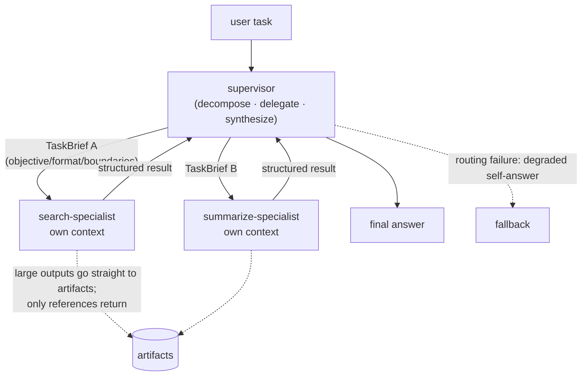

> **Group**: Agent Systems ｜ **Exit of the group above** ([Action](../05-action/tool-calling)): you can execute a single tool call safely ｜ **Exit of this page**: you can judge when multi-agent is worth it, write the four-element delegation contract, delegate to specialists via a supervisor topology, and degrade gracefully on routing failure instead of crashing
> **Prerequisites**: [Agent Runtime](agent-runtime.md), [Workflow Patterns](workflow.md) ｜ **Next**: [A2A](../07-interoperability/a2a.md) (protocols only across boundaries), [Observability](../08-production/observability), [Cost and Performance](../08-production/cost-performance)

## 1. Overview

**BLUF**: multi-agent is not "a stronger single agent" — it is an architecture that **trades coordination for capacity**. Independent context windows enable parallel exploration and compression (subagents distill vast raw material into conclusions and return them), buying coverage a single agent cannot reach; the price is roughly **15× the tokens of a chat**, coordination complexity, and error propagation. The test has three clauses, and all must hold: **the task is valuable enough to pay for it, the sub-directions are naturally parallel, and the information exceeds a single context**. Missing any, go back to a [workflow](workflow.md) or a single agent.

**Scope up front**: this page covers only orchestration of subagents spawned **inside one trust domain** (same host / process); delegating tasks to agents **across processes, organizations, or trust domains** is not expanded here — go through [A2A](../07-interoperability/a2a.md) first, picking the connection direction on the [Protocol Map](../07-interoperability/) (criteria in "Key boundary" below).

### Mental model: supervisor + specialists + artifacts



Three components: the **supervisor** (decomposes tasks, writes delegation briefs, synthesizes results), **specialists** (subagents that each own an isolated context window, toolset, and prompt), and **artifacts** (large outputs land in storage and only references travel back — avoiding information loss from multi-hop retelling).

### When to use / when not to

- Use (Anthropic's production framing): high-value tasks + heavy parallelism + information beyond one context + many complex tools to interface with; the archetype is open-ended research (breadth-first queries).
- Skip: tasks where all agents must share one context, or where inter-agent dependencies are dense — most **coding** tasks lack true parallelism and fit poorly; real-time coordination and delegation between agents is not yet a strength. Enumerable steps belong in a [workflow](workflow.md); single-context problems belong to a single agent.

### Decision table: ladder placement

| Option | Direction | Control | State | Trust domain | Minimum complexity |
| --- | --- | --- | --- | --- | --- |
| Single agent ([Agent Runtime](agent-runtime)) | Read-write loop | Model + stopping conditions | One context | Within host | Default starting point |
| Same-domain multi-agent (this page) | Read-write loop × N | Supervisor delegates and routes | Per-agent contexts + synthesis point | Same host/process | Parallelism/specialization beats coordination cost |
| Cross-boundary collaboration ([Protocol Map](../07-interoperability/)) | Read-write across boundaries | Protocol negotiation (A2A etc.) | Tasks/messages/artifacts | Cross-process/org/trust domain | Needed only when a second trust domain appears |

**Key boundary**: subagents spawned inside one process **do not need a protocol** — function calls and structured briefs suffice; only collaboration that crosses processes, organizations, or trust domains enters the protocol branch such as [A2A](../07-interoperability/a2a.md).

### Gains vs costs

| Dimension | Gain | Cost |
| --- | --- | --- |
| Context | Parallel exploration in separate windows; compressed returns | Synthesis-point bottleneck; retelling loss (game of telephone) |
| Specialization | Distinct tools/prompts/trajectories reduce path dependency | Tools and prompts to maintain ×N |
| Parallelism | 3–5 subagents at once; time cut by up to 90% | Total tokens ≈15× chat; needs budget guardrails |
| Reliability | A failed subagent can be rescued by the supervisor | Errors propagate across agents; emergent behavior is hard to predict |
| Debugging | Delegation traces shard naturally | The global causal chain must be assembled across shards |

### Orchestration topologies

| Topology | Structure | Fits | Failure mode |
| --- | --- | --- | --- |
| **Supervisor** (orchestrator-workers) | A central agent decomposes and delegates, then synthesizes | Open tasks with non-predefinable subtasks | Supervisor becomes the information bottleneck; sequential waiting |
| **Router** | Classify, then dispatch to a specialized agent; no synthesis | Triage with clear input classes | Silent failure on misclassification |
| **Pipeline** | Fixed order, intermediate products passed along | Stage-explicit processing chains | Retelling loss amplifies stage by stage |
| **Debate/verify** (generator-verifier) | Generate-and-evaluate pairs in a loop | Quality-critical outputs with clear criteria | Oscillation without convergence; needs a max-iteration cap |

Anthropic's five patterns (generator-verifier / orchestrator-subagent / agent teams / message bus / shared state) expand these four; evolution criteria are in the resource library.

History milestones: this chapter consolidates the old "Multi-Agent Coordination Patterns" page (a repository archive of a Claude blog post, 2026-04-10); the five patterns remain in the resource library while the body reorganizes around four topologies and adds the delegation contract and degraded-fallback semantics. Earlier timelines unverified; not fabricated.

## 2. Usage

Minimal hands-on: a supervisor-pattern mock — two specialist agents receive structured briefs (the four `TaskBrief` elements) and return results, demonstrating normal routing, degraded fallback on routing failure, and contract rejection. Specialists are deterministic mocks, not LLMs: what is being verified is the **orchestration layer's** contract and degradation, not model capability. Zero API keys, zero dependencies.

**Environment**: Node ≥ 22.18. Save as `multi-agent.ts`, run `node multi-agent.ts`.

```ts
// multi-agent.ts — a supervisor-pattern mock: delegation contract + specialist routing + degraded fallback.
// Zero dependencies, zero API keys (specialists are deterministic mocks, not LLM calls).
// Runs natively on Node >= 22.18: node multi-agent.ts
import { setTimeout as sleep } from "node:timers/promises";

// ---------- Delegation contract: four required fields (objective / outputFormat / boundaries / taskType) ----------
interface TaskBrief {
  taskType: "search" | "summarize";
  objective: string;     // what question to answer
  outputFormat: string;  // what structure to return
  boundaries: string;    // what to do and what NOT to do
}

interface SpecialistResult {
  specialist: string;
  payload: unknown;
}

// ---------- Specialist agents: each with its own isolated context (mocked via closures) ----------
const specialists: Record<TaskBrief["taskType"], {
  name: string;
  handle: (brief: TaskBrief) => Promise<SpecialistResult>;
}> = {
  search: {
    name: "search-specialist",
    handle: async (brief) => {
      await sleep(10);
      // real system: this is a subagent loop with its own context window
      return { specialist: "search-specialist", payload: { query: brief.objective, hits: ["doc-a", "doc-b"] } };
    },
  },
  summarize: {
    name: "summarize-specialist",
    handle: async (brief) => {
      await sleep(10);
      return { specialist: "summarize-specialist", payload: { summary: "2 findings: cost is dominated by tool calls; retries need idempotency keys." } };
    },
  },
};

// ---------- Supervisor: validate the delegation contract -> route -> degrade on routing failure ----------
class Supervisor {
  private trace: string[] = [];

  async delegate(brief: TaskBrief): Promise<{ mode: "delegated" | "degraded" | "rejected"; result?: unknown; reason?: string }> {
    // 1) Delegation-contract check: a brief without an objective is rejected outright
    //    (prevents subagent spin-up with no steering, or duplicated work)
    if (!brief.objective || brief.objective.trim().length === 0) {
      this.trace.push("rejected: brief missing objective");
      return { mode: "rejected", reason: "brief missing objective — subagent cannot be steered" };
    }
    const specialist = specialists[brief.taskType];
    // 2) Degraded fallback on routing failure: the supervisor answers itself instead of crashing
    if (!specialist) {
      this.trace.push(`degraded: no specialist for taskType=${brief.taskType}`);
      return {
        mode: "degraded",
        result: { answer: `supervisor fallback for "${brief.objective}" (no specialist: ${brief.taskType})` },
      };
    }
    // 3) Normal delegation: structured task in, structured result out
    const result = await specialist.handle(brief);
    this.trace.push(`delegated: ${brief.taskType} -> ${result.specialist}`);
    return { mode: "delegated", result: result.payload };
  }

  getTrace() { return this.trace; }
}

async function main() {
  const supervisor = new Supervisor();

  console.log("== case 1: search task -> routed to search-specialist ==");
  const r1 = await supervisor.delegate({
    taskType: "search", objective: "find docs about agent cost",
    outputFormat: "list of doc ids", boundaries: "only internal wiki, max 5 queries",
  });
  console.log(JSON.stringify(r1));

  console.log("== case 2: summarize task -> routed to summarize-specialist ==");
  const r2 = await supervisor.delegate({
    taskType: "summarize", objective: "summarize search findings for the cost report",
    outputFormat: "3 sentences", boundaries: "no new searches",
  });
  console.log(JSON.stringify(r2));

  console.log("== case 3: unknown taskType=translate -> routing failure degrades gracefully ==");
  const r3 = await supervisor.delegate({
    taskType: "translate" as any, objective: "translate the report to English",
    outputFormat: "translated text", boundaries: "keep terminology",
  });
  console.log(JSON.stringify(r3));

  console.log("== case 4: negative — a brief missing its objective is rejected by the contract ==");
  const r4 = await supervisor.delegate({
    taskType: "search", objective: "", outputFormat: "list", boundaries: "wiki only",
  });
  console.log(JSON.stringify(r4));

  console.log("== supervisor trace (failure localization: who handled what) ==");
  for (const line of supervisor.getTrace()) console.log(`  ${line}`);
}

main();
```

**Normal output** (deterministic):

```text
== case 1: search task -> routed to search-specialist ==
{"mode":"delegated","result":{"query":"find docs about agent cost","hits":["doc-a","doc-b"]}}
== case 2: summarize task -> routed to summarize-specialist ==
{"mode":"delegated","result":{"summary":"2 findings: cost is dominated by tool calls; retries need idempotency keys."}}
== case 3: unknown taskType=translate -> routing failure degrades gracefully ==
{"mode":"degraded","result":{"answer":"supervisor fallback for \"translate the report to English\" (no specialist: translate)"}}
== case 4: negative — a brief missing its objective is rejected by the contract ==
{"mode":"rejected","reason":"brief missing objective — subagent cannot be steered"}
== supervisor trace (failure localization: who handled what) ==
  delegated: search -> search-specialist
  delegated: summarize -> summarize-specialist
  degraded: no specialist for taskType=translate
  rejected: brief missing objective
```

**What to look at**: case 3's `mode:"degraded"` — the routing failure did not throw or crash; the supervisor answered itself and left a trace. Case 4's `mode:"rejected"` — the delegation contract turned an unsteerable brief away **before** spawning anything.

**Acceptance command**:

```bash
node multi-agent.ts | grep -c '"mode"'   # expected: 4 (delegated ×2 / degraded / rejected)
```

**Cleanup**: purely in-memory; no side effects.

### Scenario walkthrough

| Scenario | Input | Action | Output | Fits | Does not fit |
| --- | --- | --- | --- | --- | --- |
| Open research | One broad question | Supervisor splits 3–5 sub-directions, delegates in parallel | Synthesis + citations | Breadth-first, beyond one context | Queries with a fixed answer chain (a single agent is cheaper) |
| Multi-dimension review | One document | One specialist per dimension (security/perf/style) | Per-dimension findings | Independent, parallelizable dimensions | Tightly coupled dimensions (they overturn each other) |
| Support triage | User request | Router classifies and dispatches | Specialized path handles it | Clearly classifiable inputs | Ambiguous classes (silent misclassification failures) |

## 3. Principles

### Why multi-agent works: capacity and compression

Anthropic's production data analysis: on the BrowseComp benchmark, **token usage alone explains 80% of performance variance** (with tool-call count and model choice, 95%). The essence of the multi-agent architecture is **scaling token usage for tasks beyond a single agent's limits**: each subagent explores in its own context window and returns the most important tokens after compression. In internal evals, an Opus 4 lead + Sonnet 4 subagents beat single-agent Opus 4 by **90.2%** (breadth-first research queries).

### The delegation contract: teaching the supervisor to delegate

Subagent output quality is capped by the delegation brief. Anthropic's minimal four-element contract (a missing element is case 4's `rejected`):

| Element | Question it answers | Consequence if missing |
| --- | --- | --- |
| `objective` | What to answer | The subagent cannot be steered; it spins or duplicates others' work |
| `outputFormat` | What structure to return | The synthesis side fails to parse; retelling loss amplifies |
| Tool & source guidance | What to use, what not to | Searching the web for facts that only exist in Slack |
| `boundaries` | Do what, don't do what | Several subagents collide on the same work |

With matching **scaling rules** (written into the supervisor prompt): simple fact-finding, 1 agent with 3–10 tool calls; direct comparisons, 2–4 subagents with 10–15 calls each; complex research, 10+ with clear division. Early systems without scaling rules once spawned 50 subagents for a simple query.

### State: shared or isolated

| Mode | Mechanism | Fits | Risk |
| --- | --- | --- | --- |
| Isolated + message return | Subagents communicate only via structured results to the supervisor | Default: exploratory, compressible tasks | Synthesis-point bottleneck |
| Shared store | Agents read/write the same files/DB/knowledge base | Collaborative construction (findings influence each other) | Duplicated work; **reactive loops** (A writes → B responds → A responds again, burning tokens indefinitely) — needs explicit termination conditions |
| Artifact bypass | Large outputs go straight to the filesystem; only references return | Long reports, code, datasets | Reference decay needs governance |

### Failure localization

The debugging unit of a multi-agent system is the **delegation**: every `delegate` records a brief digest, routing outcome, and subagent terminal state. Behavior is emergent — a small supervisor-prompt change can unpredictably change subagent behavior — so evaluation targets the **end state**, not the step-by-step path: assert the final state is correct rather than the path matching a preset. Cross-shard causal chains are assembled from traces (into the [Production](../08-production/) group's [Observability](../08-production/observability)).

### Spec requirements vs local test

| Official statement (Anthropic's multi-agent research-system retrospective) | Local fixture counterpart |
| --- | --- |
| Orchestrator-worker pattern: the lead agent plans and spawns parallel subagents (retrievedAt 2026-09-01) | `Supervisor.delegate` routes to `specialists` |
| Delegation briefs need objective, output format, tool/source guidance, task boundaries | The four `TaskBrief` fields; missing `objective` → `rejected` |
| Simple queries once spawned 50 subagents → scaling rules embedded | This chapter lists scaling rules in Principles (not implemented in the fixture; it is a prompt-layer concern) |
| Token usage: agents ≈ 4× chat, multi-agent ≈ 15× chat | The fixture's mock specialists cost zero tokens — the decision tables keep the constraint |
| Large outputs written to the filesystem with references returned, reducing retelling loss | The artifacts bypass in the mental-model diagram |

## 4. Development

### Integration

1. The supervisor is itself, in the sense of [Tool Execution Engineering](../05-action/tool-execution.md), a tool below the `approval` tier: the spawn-subagent action passes an allowlist and a budget gate.
2. Each specialist is an independent agent loop (see [Agent Runtime](agent-runtime)): its own context, toolset, and prompt; no shared memory.
3. When a delegation product crosses a threshold (say 2K tokens), switch to the artifact bypass: write a file, return a path reference.
4. Budget guardrails: per-run subagent cap, per-subagent tool-call cap, total token cap — any one tripping stops further spawns and synthesizes what exists.

### Testing

- **Three routing branches**: deterministic assertions for delegated / degraded / rejected (the fixture is the template).
- **Contract negatives**: a brief missing each element must be rejected.
- **End-state evaluation**: assert the final product end-to-end, not the intermediate path (multi-agent paths are non-deterministic).

### Rollback

Rolling back the orchestration layer = reverting the supervisor prompt and routing table. Beware emergence: a small change can largely alter subagent behavior; after rollback, re-run the end-state eval set instead of eyeballing one example.

### Symptom → Evidence → Fix → Done

**Symptom**: two subagents return nearly identical content, and a third direction goes uncovered.
**Evidence**: the two briefs' objectives overlap heavily and neither has boundaries; traces show repeated search terms.
**Fix**: complete the delegation contract — split objectives to be mutually exclusive, write "do not do X" explicitly in boundaries; add a "self-check coverage after splitting" step to the supervisor prompt.
**Done**: the brief set for one task has pairwise non-overlapping objectives; duplicate retrieval disappears from traces.

### Symptom → Evidence → Fix → Done

**Symptom**: even simple questions spawn a dozen subagents; the bill explodes.
**Evidence**: no scaling rules; trace shows subagent count uncorrelated with question complexity.
**Fix**: write the "1 / 3–10, 2–4 / 10–15, 10+" scaling ladder into the supervisor prompt; add a hard per-run spawn cap.
**Done**: subagent count for simple queries stabilizes at 1; the cap gate has test coverage.

### Symptom → Evidence → Fix → Done

**Symptom**: the supervisor's synthesis loses detail, even distorts subagent findings.
**Evidence**: subagent raw outputs are long and all transit through the supervisor's context (retelling loss).
**Fix**: switch large products to the artifact bypass — subagents write directly to storage and return a reference plus a digest; the supervisor reads on demand.
**Done**: key facts in the final product trace back to artifact originals; supervisor context usage drops noticeably.

### Symptom → Evidence → Fix → Done

**Symptom**: after a multi-agent failure, nobody can locate which link introduced the error.
**Evidence**: only final-answer logs exist; no per-delegation traces.
**Fix**: record per `delegate` (brief digest, routing decision, subagent terminal state, artifact reference); switch evaluation to end-state assertions plus trace sampling.
**Done**: any failure can be attributed to a specific delegation in the trace; the end-state eval set is green.

### Anti-patterns

- **Multi-agent for scale's sake**: tasks without parallelism (most coding) harvest only coordination overhead.
- **One-line delegation**: "research the semiconductor shortage"-style briefs breed duplicated work — all four contract elements, no exceptions.
- **Unguarded spawning**: any "spawn another on demand" path needs a hard cap.
- **Shared state without termination conditions**: reactive loops burn tokens until the budget hits zero.
- **Multi-agent as a fix for single-agent prompt problems**: fix the single agent's tool descriptions and prompts before splitting — splitting copies the problem rather than solving it.

## 5. Resource Library

Four-level reading route:

- **Beginner**: finish this page → recite "the three-clause test + the four delegation elements"; run the fixture's three-branch output.
- **Builder**: [Agent Runtime](agent-runtime) (what a specialist is) + integrate this page's contract code into a supervisor.
- **Operator**: the production sections of the multi-agent research retrospective (checkpoints, rainbow deployment, end-state evaluation); token budgeting in [Cost and Performance](../08-production/cost-performance).
- **Researcher**: evolution criteria across the five coordination patterns; formal analysis of shared state and reactive loops.

### Resource table

| Name | Evidence tier | canonical URL | Use | Supported claim | Next |
| --- | --- | --- | --- | --- | --- |
| How we built our multi-agent research system (Anthropic) | L1 (maintainer) | https://www.anthropic.com/engineering/built-multi-agent-research-system | Architecture, delegation contract, scaling rules, production reliability | "Token usage explains 80% of variance; agents ≈4×, multi-agent ≈15× chat; parallelism cut time by up to 90%" (retrievedAt 2026-09-01) | Read the production-reliability section closely |
| Multi-agent coordination patterns (Claude blog) | L1 (maintainer) | https://claude.com/blog/multi-agent-coordination-patterns | Five patterns and pairwise evolution criteria | Five coordination patterns (verified via this repo's old-page archive 2026-04-10; not re-verified this round) | Map onto this chapter's four topologies |
| Building multi-agent systems: when and how | L1 (maintainer) | https://claude.com/blog/building-multi-agent-systems-when-and-how-to-use-them | Pre-investment judgment | "When multi-agent is worth it" (cited via the old page; not re-verified this round) | Cross-check the three-clause test |
| Building Effective Agents (Anthropic) | L1 (maintainer) | https://www.anthropic.com/engineering/building-effective-agents | Positioning of the orchestrator-workers pattern | The boundary where an orchestrator decomposes subtasks dynamically (retrievedAt 2026-09-01) | [Workflow Patterns](workflow.md) |
| Learn LLM (sibling site) | sibling | https://llm.zenheart.site/ | Model-side roots of multi-agent behavior | Model mechanics belong to Learn LLM (retrievedAt 2026-09-01) | Stop points above |

### Active falsification and open questions

- Falsification entry: if you run a **dependency-dense** task on multi-agent both well and cheaply — share the task shape and bill comparison, and the three-clause test of this page needs revision.
- Open: coordination semantics for asynchronous multi-agent (subagents communicating while running in parallel) are still evolving per Anthropic itself; this chapter covers only the synchronous supervisor pattern.
- Open: how identity, authorization, and settlement for cross-organization multi-agent map onto the A2A task model — to be expanded in the [Protocol Map](../07-interoperability/) branch.

### Where learn-ai stops / where to go next

- What a specialist is — the single-agent loop and state memory: [Agent Runtime](agent-runtime).
- Cross-process/org/trust-domain agent collaboration: [A2A](../07-interoperability/a2a.md) (read the [Protocol Map](../07-interoperability/) first to pick by connection direction).
- Delegation-level traces and end-state evaluation: [Observability](../08-production/observability), [evals](https://evals.zenheart.site/) (Production group).
- Accounting for the 15× tokens: [Cost and Performance](../08-production/cost-performance).
