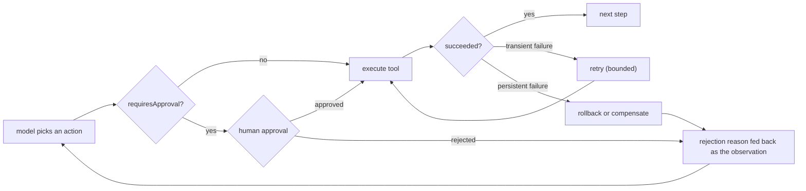

> **Group**: Agent Systems ｜ **Exit of the layer above**: you can save and restore an agent's site with checkpoints ｜ **Exit of this layer**: you can pick the right recovery strategy for a failed action (retry / rollback / compensation) and install fail-closed human approval gates at irreversible, high-cost, and low-confidence points
> **Prerequisites**: [Agent Runtime](agent-runtime.md) · [Agent State and Memory](state-memory.md) ｜ **Next**: [Computer Use](computer-use.md) · [Security](../08-production/security)

## 1. Overview

**Lead with the answer**: loops that write to the world will fail; the question is not "whether" but "what state the system is in afterwards". This page provides two things: **recovery strategy selection** (retry / rollback / compensation, each with different preconditions) and **human approval gates** (human-in-the-loop, HITL — pause before irreversible, high-cost, or low-confidence actions, then continue from the interruption point once a human decides). The gate's default semantic is **fail-closed**: no approver, no execution.

### Mental model: the gate sits in the loop, recovery behind it



The approval gate inserts itself between "the model decides" and "the world changes"; recovery strategies handle "the world already changed but the outcome is wrong".

### Decision table: recovery and gating approaches compared

| | Bare run (no recovery) | + retry | + checkpoint resume | + approval gate | All-human |
| --- | --- | --- | --- | --- | --- |
| Direction | Write, fails dirty | Write, idempotent retry | Write, restorable to a point | Write, pauses before high-risk | Humans do everything |
| Control | Model | Code retry policy | Snapshot granularity | **Humans hold veto power** | Humans |
| State | No recovery semantics | Attempt counter | Snapshot + completed set | Pending approvals (persistable) | Tickets |
| Trust domain | In-process | In-process | Storage boundary | Humans + storage boundary | Humans |
| Minimum complexity | none | retry counter | see [State and Memory](state-memory.md) | gate + timeout | no automation |

### When human approval is mandatory

Three triggers; hit any one, install a gate:

1. **Irreversible**: no reverse operation can undo the action (data deletion, outbound sends, payments).
2. **High cost**: a large failure blast radius (bulk operations, production changes, amounts above a threshold).
3. **Low confidence**: the model is uncertain about parameters or intent, classifier boundary inputs, or a first execution of a new task type.

### When to use / when not to

- Use: the agent writes to the world (continuing [tool execution engineering](../05-action/tool-execution.md)); side effects cannot be auto-undone; compliance requires a human approval trail.
- Do not use: read-only tasks (gates only slow them down); reversible, low-cost actions (auto-rollback is cheaper than waiting for a human); interruption frequency so high that users start rubber-stamping — that is gate failure, not gate success.

History milestones: the OpenAI Agents SDK productized HITL as `needs_approval` + interruptions + a serializable `RunState` (current shape retrievedAt 2026-09-01); LangGraph builds interruption and resume on the checkpointer primitive. Earlier timelines are unverified; we do not fabricate them.

## 2. Usage

**Minimal hands-on**: ≤ 15 minutes, zero API keys. One execution loop with an approval gate covering four scenarios: **approve + transient retry**, **reject with the reason fed back to the model**, **fail-closed with no approver**, and **persistent failure triggering compensation**. Model responses are replayed from a script.

### Steps

1. Create an empty directory and save the code below as `approval-gate.ts`.
2. Run `node --experimental-strip-types approval-gate.ts`.

```ts
// approval-gate.ts
// Zero-key, deterministic loop with human approval gates, retry, and compensation.
// The "model" is scripted; the gate, retry, and compensation mechanics are real.
// Run: node --experimental-strip-types approval-gate.ts   (Node >= 22.6)

type ApprovalDecision = { approved: true } | { approved: false; reason: string };

interface Tool {
  name: string;
  requiresApproval: boolean;
  /** `attempt` lets a tool fail transiently on the first call (retry demo). */
  run: (args: Record<string, string>, attempt: number) => Promise<string>;
  compensate?: (args: Record<string, string>) => Promise<string>;
}

/** Policy: what a human must see before deciding. This is the approval UX contract. */
interface ApprovalRequest {
  tool: string;
  args: Record<string, string>;
  effect: string; // what will happen in the world
  reversible: boolean; // can it be undone automatically?
  cost: string; // money / blast radius
}

type HumanApprover = (req: ApprovalRequest) => ApprovalDecision;

/** Fail-closed gate: no decider => the action does not run. */
function gate(req: ApprovalRequest, approve: HumanApprover | null): ApprovalDecision {
  if (!approve) return { approved: false, reason: "no approver connected" };
  return approve(req);
}

async function withRetry(
  tool: Tool,
  args: Record<string, string>,
  maxAttempts = 2,
): Promise<string> {
  let lastError: unknown;
  for (let attempt = 1; attempt <= maxAttempts; attempt++) {
    try {
      return await tool.run(args, attempt);
    } catch (err) {
      lastError = err; // transient error: retry with backoff in a real system
      console.log(`retry: attempt ${attempt} failed (${(err as Error).message})`);
    }
  }
  throw lastError;
}

async function runTool(
  tool: Tool,
  args: Record<string, string>,
  approve: HumanApprover | null,
): Promise<string> {
  if (tool.requiresApproval) {
    const decision = gate(
      {
        tool: tool.name,
        args,
        effect: toolEffect(tool.name),
        reversible: Boolean(tool.compensate),
        cost: "USD 129.00 refund",
      },
      approve,
    );
    if (!decision.approved) {
      // The rejection reason is fed back to the model as the observation.
      return `approval_rejected: ${decision.reason}`;
    }
  }
  try {
    return await withRetry(tool, args);
  } catch (err) {
    if (tool.compensate) {
      await tool.compensate(args); // reverse side effects before surfacing
      return `tool_failed_and_compensated: ${(err as Error).message}`;
    }
    return `tool_failed: ${(err as Error).message}`;
  }
}

function toolEffect(name: string): string {
  return name === "issue_refund" ? "moves USD 129.00 from merchant to customer" : "reads data";
}

// --- fixture tools ---
const tools: Record<string, Tool> = {
  get_order: {
    name: "get_order",
    requiresApproval: false,
    run: async (args) => `order ${args.orderId}: delivered 2026-08-20, total 129.00`,
  },
  issue_refund: {
    name: "issue_refund",
    requiresApproval: true,
    // Fails transiently on attempt 1 to demonstrate retry.
    run: async (args, attempt) => {
      if (attempt === 1) throw new Error("payment gateway 503");
      return `refund ${args.orderId} issued`;
    },
    compensate: async (args) => `reversal queued for ${args.orderId}`,
  },
  ship_label: {
    name: "ship_label",
    requiresApproval: true,
    run: async () => {
      throw new Error("carrier API down"); // persistent failure
    },
    compensate: async (args) => `label ${args.labelId} voided`,
  },
};

// --- scripted model turns ---
type Turn = { tool: string; args: Record<string, string> } | { final: string };

async function run(script: Turn[], approve: HumanApprover | null): Promise<void> {
  for (const turn of script) {
    if ("final" in turn) {
      console.log(`model: ${turn.final}`);
      return;
    }
    const result = await runTool(tools[turn.tool], turn.args, approve);
    console.log(`${turn.tool} -> ${result}`);
  }
}

async function main() {
  // Scenario A: human approves; transient failure retries inside.
  console.log("== scenario A: approve ==");
  await run(
    [
      { tool: "get_order", args: { orderId: "A-42" } },
      { tool: "issue_refund", args: { orderId: "A-42" } },
      { final: "Refund issued for A-42 after human approval." },
    ],
    () => ({ approved: true }),
  );

  // Scenario B: human rejects; the model sees the reason and cancels.
  console.log("\n== scenario B: reject ==");
  await run(
    [
      { tool: "issue_refund", args: { orderId: "A-42" } },
      { final: "Refund cancelled: customer is outside the 30-day window." },
    ],
    () => ({ approved: false, reason: "delivery is older than 30 days" }),
  );

  // Scenario C: fail-closed — no approver connected.
  console.log("\n== scenario C: no approver (fail closed) ==");
  await run(
    [
      { tool: "issue_refund", args: { orderId: "A-42" } },
      { final: "Refund not executed." },
    ],
    null,
  );

  // Scenario D: persistent failure after approval triggers compensation.
  console.log("\n== scenario D: approve, then compensate ==");
  await run(
    [
      { tool: "ship_label", args: { labelId: "L-7" } },
      { final: "Shipping aborted; the label was voided." },
    ],
    () => ({ approved: true }),
  );
}

main();
```

### Expected output

```text
== scenario A: approve ==
get_order -> order A-42: delivered 2026-08-20, total 129.00
retry: attempt 1 failed (payment gateway 503)
issue_refund -> refund A-42 issued
model: Refund issued for A-42 after human approval.

== scenario B: reject ==
issue_refund -> approval_rejected: delivery is older than 30 days
model: Refund cancelled: customer is outside the 30-day window.

== scenario C: no approver (fail closed) ==
issue_refund -> approval_rejected: no approver connected
model: Refund not executed.

== scenario D: approve, then compensate ==
retry: attempt 1 failed (carrier API down)
retry: attempt 2 failed (carrier API down)
ship_label -> tool_failed_and_compensated: carrier API down
model: Shipping aborted; the label was voided.
```

### Negative output (failure demo)

Change the fail-closed branch in `gate` to "no approver means allow" (`return { approved: true }`) and rerun scenario C: the action executes with no human approval. This is a common root cause of production incidents — **treating an approval-service timeout as a default approve**. There is exactly one correct semantic: cannot reach the decider means rejected.

### Acceptance command

```bash
node --experimental-strip-types approval-gate.ts
```

Pass criteria: A retries once and succeeds after approval; B's rejection reason appears in the observation; C executes nothing; D retries twice, compensates, and reports.

### Cleanup

Delete the directory.

## 3. Principles

### The three recovery strategies: different preconditions

| Strategy | Precondition | Cost | Residual risk |
| --- | --- | --- | --- |
| Retry | The action is idempotent, or it failed before the side effect | Lowest | Retry storms amplify load |
| Rollback | A restorable snapshot / transaction boundary exists | Medium (returns to a checkpoint) | The window between snapshot and rollback is lost |
| Compensation | A semantically inverse operation exists (refund ↔ charge) | High (appends another side effect) | The inverse operation can itself fail |

Choose top to bottom: **retry before rollback, rollback before compensation**. Compensation is the saga-pattern idea — distributed systems have no atomic rollback, so you append reverse actions to pull the world back to consistency. For side-effect boundaries and idempotency keys, see [tool execution engineering](../05-action/tool-execution.md); for snapshot granularity, see [state and memory](state-memory.md).

### Checkpoint granularity and restore points

The restore point must sit **before the side effect**, and the recovery flow first checks "did this action already happen". The granularity table (per step / per phase / per side-effect boundary) is in [state and memory](state-memory.md); this page adds one rule: **an approval gate is itself a natural checkpoint boundary** — this is exactly how OpenAI's `RunState` is used: the run pauses at a pending approval, its state serializes to storage, a human decides, the state deserializes and resumes, and approval decisions (including sticky always-approve) persist with the state.

### The approval UX contract: what the approver must see

A decidable approval request carries at least five fields (the fixture's `ApprovalRequest` is the minimum):

| Field | Question answered | Consequence if missing |
| --- | --- | --- |
| intent / tool + args | What will be done, to what | The approver signs blind |
| effect | What changes in the world | The approver underestimates impact |
| reversible | Can it be auto-undone | Irreversible actions treated as reversible |
| cost | Amount / blast radius | High-cost actions approved indiscriminately |
| provenance | Why the model wants this (trace digest) | Injection or drift goes undetected |

Rejections must **carry a reason** back to the model (the fixture's `approval_rejected: <reason>`) — otherwise the model will simply re-propose the identical call.

### Timeouts and escalation paths

Approval is asynchronous waiting and must have timeout semantics:

1. **SLA**: pending approvals get a deadline (minutes to days, per business).
2. **Timeout defaults to reject**: the same semantic as fail-closed — a timeout is not an approval.
3. **Escalation**: after timeout, notify a second reviewer / an escalation queue / downgrade to a manual task; record the escalation reason for audit.

OpenAI's fail-closed detail is worth copying: when the SDK cannot safely inspect tool arguments (malformed JSON, valid JSON but not an object, non-standard constants like `NaN`), it **skips the approval callback and requires manual approval** — a parse failure is itself a low-confidence signal.

### Spec claims vs local measurement

| Claim | Source (vendor) | Local measurement |
| --- | --- | --- |
| Tools declare `needs_approval`; runs pause as interruptions and resume from the breakpoint after a decision | OpenAI Agents SDK HITL docs | The fixture's `requiresApproval` + `gate` + observation feedback |
| Fail-closed when arguments cannot be safely parsed | Same | Scenario C: with `approve = null`, the action does not run |
| Rejection messages are customizable and returned to the model | Same | Scenario B: `approval_rejected: <reason>` |
| Pending state is serializable and resumable across processes | Same | The fixture replays a script instead of serializing; serialization itself is covered in [state and memory](state-memory.md) |
| Retry requires idempotency | [Tool Execution Engineering](../05-action/tool-execution.md) | `withRetry` caps at 2 attempts, then switches to compensation |

## 4. Development

### Integration notes

- **Gate placement**: declare it on the tool (`requiresApproval`), not scattered through business code — the gate travels with the tool definition, so every loop calling the same tool passes the same gate.
- **Sticky approvals**: "always approve for this run" must be explicit (OpenAI's `always_approve`) and scoped to the current run only; never inherited across sessions.
- **Audit**: every approve / reject / timeout decision, with the request's five fields, lands in the audit log and feeds the [Production](../08-production/) group's [observability](../08-production/observability).

### Symptom -> Evidence -> Action -> Done criteria

**Symptom**: an approval request goes unanswered and the task hangs overnight.
**Evidence**: the pending queue shows the request past SLA with no decision record; no timeout semantic exists.
**Action**: add a timeout to approval requests; on timeout, reject by default and escalate (notify a second reviewer / move to a manual queue); the task treats "approval timeout" as an ordinary rejection.
**Done criteria**: injecting a never-responding approver ends the task within SLA as "rejected + escalation recorded".

### Symptom -> Evidence -> Action -> Done criteria

**Symptom**: after a human rejects, the model re-proposes the identical call next turn, five times in a row.
**Evidence**: the trace shows consecutive `approval_rejected` turns with identical args; the rejection reason never entered the model input.
**Action**: ensure the rejection reason is fed back as an observation; cap re-proposals of the same tool + args after rejection, and surface to the user instead of retrying past the cap.
**Done criteria**: a rejected call re-routes or terminates within one re-proposal; repeat-re-proposal cases join the regression tests.

### Symptom -> Evidence -> Action -> Done criteria

**Symptom**: after a gateway timeout and retry, the customer receives two refunds.
**Evidence**: two near-simultaneous success records on the payment side; the tool has no idempotency key and retries blindly.
**Action**: add an idempotency key to non-idempotent tools (runId + stepId); before retrying, query the external system "did this key already succeed"; when the query is uncertain, compensate instead of resending.
**Done criteria**: under fault injection, exactly one success per idempotency key; the second is deduped externally or intercepted by the local query.

### Symptom -> Evidence -> Action -> Done criteria

**Symptom**: after a checkpoint resume, an already-approved refund executes again.
**Evidence**: the snapshot point sits after the side effect; the recovery flow performs no "already happened" check.
**Action**: move the snapshot before the side effect (see [state and memory](state-memory.md)); on recovery, query by idempotency key before executing; persist the approval decision with the snapshot so the approver is not asked twice.
**Done criteria**: a crash-injection replay shows exactly one side effect and exactly one approval request.

### Anti-pattern list

- Treating approval-service timeouts as default approvals — fail-closed is the only correct semantic.
- Rejecting without a reason — that observation is the model's only corrective input.
- Unbounded retries of non-idempotent tools — retry storms plus duplicated side effects.
- Approval UIs showing parameters but not effect and reversibility — that makes humans rubber stamps.
- Trading safety for more interruptions — once approval fatigue sets in, every gate is decorative.

## 5. Resource Library

Four-level reading route:

- **Beginner**: run this page's fixture and map the four scenarios onto the gate + retry + compensation interplay.
- **Builder**: add `requiresApproval` and an idempotency key to your own high-risk tools; implement rejection-reason feedback.
- **Operator**: set SLAs and escalation paths for pending approvals; wire approval audits into [observability](../08-production/observability).
- **Researcher**: read the OpenAI HITL docs and saga-pattern literature for the consistency argument behind compensating transactions.

### Resource table

| Name | Evidence level | Canonical URL | Purpose | Supported claim | Next |
| --- | --- | --- | --- | --- | --- |
| Human-in-the-loop (OpenAI Agents SDK) | L1 (maintainer) | https://openai.github.io/openai-agents-python/human_in_the_loop/ | Production semantics of needs_approval / interruptions / RunState | Fail-closed parsing, sticky approvals, serializable pending state (retrievedAt 2026-09-01) | Official example repo |
| Persistence (LangGraph) | L1 (maintainer) | https://docs.langchain.com/oss/python/langgraph/persistence | Interruption and resume built on the checkpointer primitive | HITL requires thread-scoped persistent state (retrievedAt 2026-09-01; the page has moved to docs.langchain.com) | [State and Memory](state-memory.md) |
| Building Effective Agents (Anthropic) | L1 (maintainer) | https://www.anthropic.com/research/building-effective-agents | The positioning of agents pausing at checkpoints for human feedback | "pause for human feedback at checkpoints or when encountering blockers" (retrievedAt 2026-09-01) | [Agent Runtime](agent-runtime.md) |
| Computer use tool (Anthropic docs) | L0 (official docs) | https://docs.anthropic.com/en/docs/agents-and-tools/tool-use/computer-use-tool | Approval for sensitive actions must run before each block in a batch | Consequential actions in batches need per-block confirmation (retrievedAt 2026-09-01) | [Computer Use](computer-use.md) |
| This repo · Tool Execution Engineering | this repo | [tool-execution](../05-action/tool-execution.md) | Idempotency / timeouts / cancellation / side effects | The precondition engineering for retry and compensation | [Security](../08-production/security) |

### Active falsification and open questions

- Falsification entry: if "automatic rollback" always replaces the human gate in your scenario with no acceptance regression (error rate, cost, recovery time), the gate is redundant there — record the case and remove it.
- Open: sensible approval SLA lengths and escalation depth depend on organizational structure; this page gives no defaults. Measure with your own approval-log response-time distribution.

### learn-ai stops here / where to go next

- Approval for sensitive operations in interface automation: [Computer Use](computer-use.md).
- The injection and privilege-escalation attack surface: the [Production group's security](../08-production/security).
- Distributed-consistency theory of sagas / compensating transactions: see distributed-transaction literature (not expanded in this repo).
