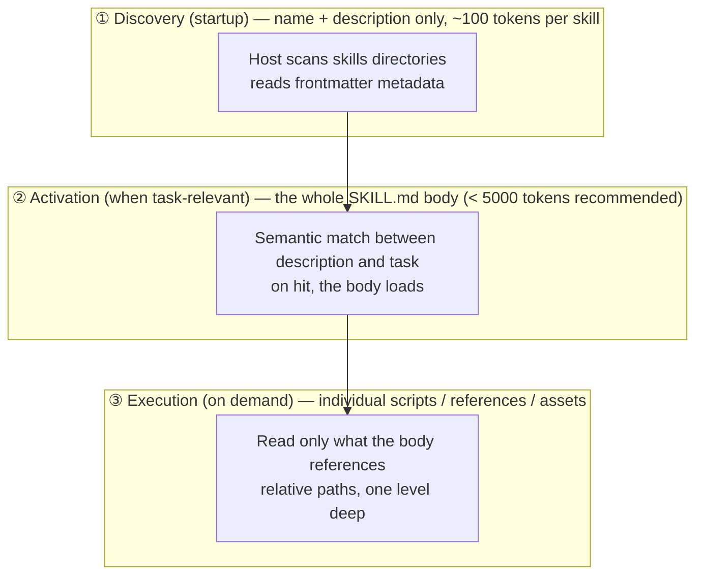

> **Layer**: 4 · Action and Collaboration ｜ **Exit of the layer above**: you can wire model output into sessions and state ｜ **Exit of this layer**: you can package a repeated procedure into a Skill that hosts load on demand and trigger reliably
> **Prerequisites**: [Context Engineering](../03-context/context-engineering), [Tool Calling Contract](../05-action/tool-calling) ｜ **Next**: [Agent Plugins](plugins.md) (packaging and distribution), [Protocol Map](../07-interoperability/index.md)

## 1. Overview

**Lead with the answer**: when the same "how to do it" instructions reappear across conversations, package them as a Skill — a folder with a `SKILL.md`. Skills solve **the packaging and discovery problem for reusable procedural knowledge**: they are an instruction/package format, not a wire protocol. There is no network conversation and no capability negotiation; a Skill decides *what knowledge enters context, when, and at what size*.

### Mental model: one folder + three loading tiers



The key invariant: **most skills stay at tier ①**. One hundred skills cost only ~10k tokens of metadata budget; only the skill matched by the task puts its body into context. This is progressive disclosure — context engineering (layer 1) applied to capability packaging.

### When to use / when not to

- Use: team workflow standards, output conventions, domain procedures (how to ship, how to write the weekly report, how to query a system), repeated procedures that carry scripts.
- Do not use:
  - connecting to external systems for data or actions — that is tool calling and [MCP](../07-interoperability/mcp.md);
  - one-off instructions — write them into the prompt;
  - task execution that needs its own context and permission isolation — that is a subagent (see [Agent Runtime](agent-runtime.md)).

### Decision table: versus neighboring mechanisms

| Mechanism | Direction | Control | State | Trust domain | Lowest complexity |
| --- | --- | --- | --- | --- | --- |
| Prompt (single instruction) | read | rewritten by hand each time | none | in-process | write it in the conversation |
| Skill (this page) | read (may execute scripts) | description drives triggering | file is the asset, no runtime state | inside the host process | one folder with SKILL.md |
| Tool / MCP server | read/write external | function boundary + argument validation | server process | across process boundary | one function + schema |
| Subagent | read/write | own context + own tool permissions | session state | isolated inside host | runtime configuration |

Rule of thumb (community convention): after the same instructions repeat more than ~5 times, promote them from prompt to Skill.

### Historical milestones

- Anthropic launched Claude Skills in 2025-10 (community record; first-party date unverified); the format was later opened as the Agent Skills specification (agentskills.io).
- The agentskills.io specification page carries no version label (verified 2026-09-01); the `allowed-tools` field is marked Experimental in the spec.

## 2. Usage

Minimal hands-on: build a Skill directory in 15 minutes and validate its structure with a zero-dependency validator. No API key; Node LTS is enough.

### Step 1: create the minimal Skill directory

```text fixture
skills-lab/
├── commit-helper/
│   ├── SKILL.md              # required: frontmatter + instruction body
│   └── scripts/
│       └── analyze-diff.sh   # optional: executable script
└── validate-skill.mjs        # the validator (next step)
```

`commit-helper/SKILL.md`:

```markdown fixture
---
name: commit-helper
description: Generates conventional commit messages from staged changes. Use when the user asks for a commit message or wants to amend one.
---

# Commit Message Helper

## When to Use

The user asks for a commit message for staged changes.

## Process

1. Run `scripts/analyze-diff.sh` to get the staged change summary.
2. Pick a type (feat/fix/docs/refactor/test/chore) and a scope.
3. Write a subject in imperative mood, max 50 characters.
```

`commit-helper/scripts/analyze-diff.sh`:

```bash fixture
#!/bin/bash
# Prints a compact summary of staged changes for commit message generation.
git diff --cached --stat
echo "---"
git diff --cached --name-only
```

### Step 2: write the zero-dependency structural validator

The Skills specification has no mandatory schema validation step, so the lint strategy is to validate structure yourself. The validator below asserts exactly the structural claims of the spec (required frontmatter fields, the name rules, name/directory agreement), using Node built-ins only:

```javascript fixture
// validate-skill.mjs — zero-dependency Agent Skills structural validator
// Usage: node validate-skill.mjs <skill-dir>
// Exit 0 = all checks pass; 1 = at least one failure
import { readFileSync } from "node:fs";
import { basename, join } from "node:path";

const skillDir = process.argv[2];
if (!skillDir) {
  console.error("usage: node validate-skill.mjs <skill-dir>");
  process.exit(1);
}

const failures = [];
const check = (ok, label) => {
  console.log(`${ok ? "PASS" : "FAIL"}  ${label}`);
  if (!ok) failures.push(label);
};

// 1. SKILL.md exists and starts with a frontmatter block
let raw;
try {
  raw = readFileSync(join(skillDir, "SKILL.md"), "utf-8");
  check(true, "SKILL.md exists");
} catch {
  check(false, "SKILL.md exists");
  console.error(`result: ${failures.length} failure(s)`);
  process.exit(1);
}

const fmMatch = raw.match(/^---\r?\n([\s\S]*?)\r?\n---/);
check(fmMatch !== null, "frontmatter block delimited by ---");

// 2. Extract top-level key: value pairs (sufficient for required fields)
const fm = {};
if (fmMatch) {
  for (const line of fmMatch[1].split(/\r?\n/)) {
    const m = line.match(/^([A-Za-z-]+):\s*(.*)$/);
    if (m && !line.startsWith(" ")) fm[m[1]] = m[2].trim();
  }
}

// 3. name: required, 1-64 chars, lowercase alphanumerics + hyphens,
//    no leading/trailing/consecutive hyphen, must match the parent directory
const name = fm.name ?? "";
check(!!name, "frontmatter has non-empty name");
check(/^[a-z0-9]+(-[a-z0-9]+)*$/.test(name) && name.length <= 64,
  "name matches ^[a-z0-9]+(-[a-z0-9]+)*$ and is <= 64 chars");
check(name === basename(skillDir), `name matches directory name (expected "${basename(skillDir)}")`);

// 4. description: required, 1-1024 chars
const description = fm.description ?? "";
check(description.length >= 1 && description.length <= 1024,
  `description is 1-1024 chars (got ${description.length})`);

// 5. Non-empty Markdown body after the frontmatter
const body = fmMatch ? raw.slice(fmMatch[0].length).trim() : "";
check(body.length > 0, "markdown body is non-empty");

console.log(failures.length === 0
  ? `result: all checks passed for "${name}"`
  : `result: ${failures.length} failure(s): ${failures.join("; ")}`);
process.exit(failures.length === 0 ? 0 : 1);
```

### Step 3: run it (happy path)

```bash fixture
cd skills-lab
node validate-skill.mjs commit-helper
```

Actual output (Node 24):

```text fixture
PASS  SKILL.md exists
PASS  frontmatter block delimited by ---
PASS  frontmatter has non-empty name
PASS  name matches ^[a-z0-9]+(-[a-z0-9]+)*$ and is <= 64 chars
PASS  name matches directory name (expected "commit-helper")
PASS  description is 1-1024 chars (got 126)
PASS  markdown body is non-empty
result: all checks passed for "commit-helper"
```

### Step 4: negative case (what failure looks like)

Create a violating `pdf-helper/SKILL.md` — uppercase name that disagrees with the directory, missing description:

```markdown fixture
---
name: PDF-Helper
---

Helps with PDFs.
```

```bash fixture
node validate-skill.mjs pdf-helper; echo "exit=$?"
```

Actual negative output:

```text fixture
PASS  SKILL.md exists
PASS  frontmatter block delimited by ---
PASS  frontmatter has non-empty name
FAIL  name matches ^[a-z0-9]+(-[a-z0-9]+)*$ and is <= 64 chars
FAIL  name matches directory name (expected "pdf-helper")
FAIL  description is 1-1024 chars (got 0)
PASS  markdown body is non-empty
result: 3 failure(s): name matches ^[a-z0-9]+(-[a-z0-9]+)*$ and is <= 64 chars; name matches directory name (expected "pdf-helper"); description is 1-1024 chars (got 0)
exit=1
```

### Acceptance and cleanup

- Acceptance: happy path exits 0 and the negative case exits 1, with output matching the above.
- Cleanup: `rm -rf skills-lab`.
- Host onboarding (optional): hosts such as Claude Code discover skills from their skills directories (project- or user-level `skills/`); in this repository Skills live only at `.claude/skills/<name>/SKILL.md` (files dropped directly under `.claude/` are never discovered).

### Scenario matrix

| Scenario | Input | Action | Output | Fits | Does not fit |
| --- | --- | --- | --- | --- | --- |
| Basic: standardize a procedure | team release steps | write the steps into the SKILL.md body | every run follows the same checklist | instruction-only flows | flows needing external data |
| Common: wrap scripts | a repeated command sequence | put scripts in `scripts/`, state when to run in the body | the host executes them on demand | deterministic sub-steps | steps requiring model judgment |
| Combined: Skill + MCP | "what steps to follow once connected" | MCP provides the connection, the Skill provides the procedure | connection and procedure split cleanly | tool usage conventions | either/or thinking — they complement, not replace |

## 3. Principles

### The SKILL.md structural contract (per the verified spec)

| Field | Required | Constraints |
| --- | --- | --- |
| `name` | yes | 1-64 chars; lowercase letters, digits, hyphens only; no leading/trailing hyphen, no consecutive `--`; **must match the parent directory name** |
| `description` | yes | 1-1024 chars; should state both *what it does* and *when to use it* |
| `license` | no | license name or reference to a bundled license file |
| `compatibility` | no | 1-500 chars; environment requirements (target product, system packages, network) |
| `metadata` | no | map of string keys to string values; client-defined metadata |
| `allowed-tools` | no | space-separated string of pre-approved tools; **marked Experimental** in the spec, support varies by implementation |

Directory conventions: `SKILL.md` is required; `scripts/` (executable code), `references/` (docs read on demand), and `assets/` (templates, data, other static resources) are recommended. File references in the body use **relative paths, one level deep** — avoid deep reference chains.

### The three-tier budget of progressive disclosure

| Tier | Loads when | Budget | Content |
| --- | --- | --- | --- |
| ① Metadata | host startup, all skills | ~100 tokens per skill | name + description |
| ② Body | skill activated by a matching task | < 5000 tokens recommended; body under 500 lines | the SKILL.md Markdown body |
| ③ Resources | when the body references them | on demand, per file | scripts / references / assets |

### Triggering is semantic matching, not keyword registration

The host uses the model's semantic understanding to score task ↔ description relevance. Corollary: write the description around **intent and scenario** (verbs, objects, boundaries), not keyword stuffing; a vague description ("Helps with PDFs.") triggers unreliably, a concrete one ("Extracts text and tables from PDF files... Use when working with PDF documents...") triggers reliably. The description is the only field that affects triggering — the best body never loads if the description does not match.

### Spec requirements vs local measurement

| Spec requirement (agentskills.io, verified 2026-09-01) | Local measurement (validator fixture) |
| --- | --- |
| name must match the parent directory | the `PDF-Helper` negative case is caught by check group 3 |
| description is 1-1024 chars | the missing description is caught (got 0) |
| body has no format restrictions, but splitting into referenced files is recommended | the validator asserts non-emptiness only, matching the spec's stance |
| the official validator is `skills-ref validate` | this page's zero-dependency validator covers a subset of its structural checks; prefer the official library in CI |

### Versus tools; versus the asset directory

- **Skills vs tools**: a Skill is knowledge packaging (it tells the model *which steps to follow*); a tool is a callable function (it hands the model an executable interface). Scripts inside a Skill still execute through the host's tool capability — Skills add no execution mechanism, they organize knowledge and entry points.
- **This page vs the asset directory**: this page is the canonical methodology (format, triggering, validation); the [/zh/skills/ asset directory](/zh/skills/) is this repository's skill registry projection listing actual skill assets. Change methodology here; add assets there.

## 4. Development

### Integration and host differences

- **Claude Code**: discovers skills from project- and user-level skills directories; this repository's convention is `.claude/skills/<name>/SKILL.md`.
- **Claude.ai / API**: upload inside the product or use the `/v1/skills` endpoint (product capabilities shift with versions; integration detail belongs to Products and is not duplicated here).
- For cross-host distribution, write to the agentskills.io format; host-specific behavior (trigger implementation, script sandboxing) stays out of the Skill body.

### Symptom → Evidence → Action → Done when

**Symptom**: it does not trigger when it should — the task clearly matches, but the skill never loads.
**Evidence**: no activation entry for the skill in host logs/debug output; comparing task wording with the description shows missing intent and scenario words.
**Action**: rewrite the description — add verbs (extract/create/merge), objects and file types, a "Use when..." sentence, and a "Not for..." boundary sentence; retry the task with 2-3 natural phrasings.
**Done when**: both the explicit request ("write a commit message with commit-helper") and the natural one ("help me write a commit message") trigger; neighboring unrelated tasks do not.

### Symptom → Evidence → Action → Done when

**Symptom**: it triggers on unrelated tasks; skills interfere with each other.
**Evidence**: an over-broad description (e.g. "handles documents"), or one skill stuffed with several domains; activation logs show false hits.
**Action**: split into single-purpose skills; state exclusions explicitly in the description ("Not for ..."); converge granularity to "one skill = one domain/workflow".
**Done when**: boundary tests (nearby-task requests) stop triggering consistently while normal tasks are unaffected.

### Symptom → Evidence → Action → Done when

**Symptom**: scripts never run, or fail when they do.
**Evidence**: the body references scripts by absolute or nested paths; the script lacks execute permission; the script depends on a runtime absent from the host sandbox.
**Action**: switch to skill-root-relative paths (`scripts/analyze-diff.sh`, one level deep); add execute permission (`chmod +x`); make scripts self-contained or declare dependencies in `compatibility`.
**Done when**: a clean checkout runs the body's steps end to end once.

### Symptom → Evidence → Action → Done when

**Symptom**: activating the skill floods the context; responses turn slow and expensive.
**Evidence**: SKILL.md exceeds 500 lines or the body exceeds 5000 tokens; large reference material is inlined in the body.
**Action**: keep only the procedure skeleton in the body and move detail into `references/`; reference them "menu style" (describe what exists, read which file on demand).
**Done when**: the body is back under 500 lines; total token consumption for the same task drops versus before migration.

### Versioning and migration

- The spec currently carries no version label; the field-level compatibility risk is `allowed-tools` (Experimental) — production skills must not lean on it as a security boundary. Permission confinement is the host's tool-authorization job (see [Tool Execution Engineering](../05-action/tool-execution.md)).
- The official `skills-ref` library's `validate` subcommand fits CI: run structural lint first, then trigger tests (positive + boundary negative).

### Anti-patterns

- **Inventing skills in a vacuum**: packaging without 5+ real repetitions produces capability orphans nobody triggers.
- **Keyword-stuffed descriptions**: triggering is semantic; keyword lists are neither necessary nor sufficient.
- **Using SKILL.md as a warehouse**: inlining reference material defeats the three-tier budget.
- **Skills as a security boundary**: `allowed-tools` is an Experimental convenience field, not a permission model; sensitive operations need host-level approval.

## 5. Resource Library

Four-level reading route:

- **Beginner**: read this page and use existing skills inside a host; retell the three loading tiers and the description's role.
- **Builder**: build one skill with Section 2 and pass the validator; cross-check every frontmatter field against the spec page.
- **Operator**: wire the validator and trigger tests into CI; set up review and retirement cadence for team skills.
- **Researcher**: read real skills in the anthropics/skills repository and study their description style and body-splitting strategy.

### Resource table

| Name | Evidence level | Canonical URL | Use | Supported claim | Next |
| --- | --- | --- | --- | --- | --- |
| Agent Skills specification | L0 (official spec) | https://agentskills.io/specification | the single source of the format contract | field table, directory conventions, disclosure budget (retrievedAt 2026-09-01) | compare with the Section 3 table |
| skills-ref validator | L0 (official tool) | https://github.com/agentskills/agentskills/tree/main/skills-ref | `skills-ref validate` structural validation | the official lint entry point (retrievedAt 2026-09-01) | wire into CI |
| Anthropic engineering blog: Agent Skills | L1 (maintainer) | https://www.anthropic.com/engineering/equipping-agents-for-the-real-world-with-agent-skills | design motivation and the case for progressive disclosure | the "package knowledge, don't hardcode" engineering stance (retrievedAt 2026-09-01) | read the orchestration examples |
| anthropics/skills repository | L1 (maintainer) | https://github.com/anthropics/skills | the official example skill set | description style of real-world skills (retrievedAt 2026-09-01) | imitate granularity and splitting |

### Active falsification and open questions

- Falsification entry: if a host's triggering/loading behavior for the same SKILL.md contradicts the "spec vs local measurement" table, trust the spec and that host's documentation, then revise the table on this page.
- Open: the agentskills.io spec carries no version label, so field evolution (especially `allowed-tools`) needs re-checking against the verification date; host differences (trigger implementations, script sandboxes) are recorded per-product under Products — this page maintains no per-host matrix.

### learn-ai stops here / where to go next

- Triggering bottoms out in context and semantic matching: [Context Engineering](../03-context/context-engineering).
- Permissions, idempotency, and approval for script execution: [Tool Execution Engineering](../05-action/tool-execution.md).
- Packaging skills with MCP servers for distribution: [Agent Plugins](plugins.md).
- This repository's skill asset registry (projection): [/zh/skills/](/zh/skills/).
