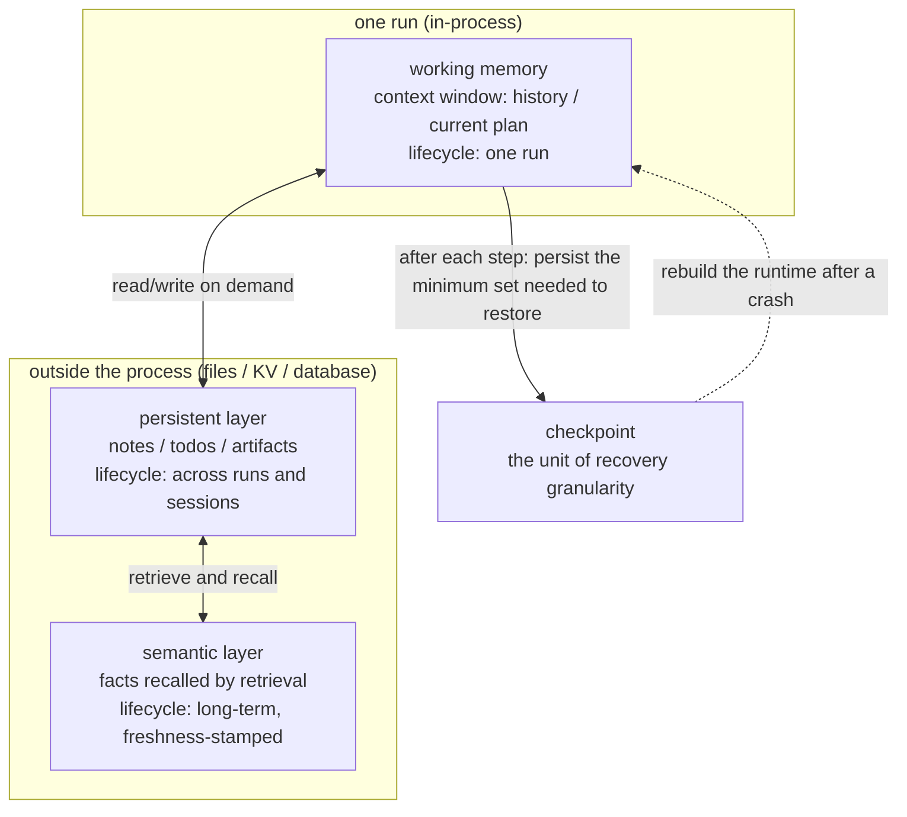

> **Group**: Agent Systems ｜ **Exit of the layer above**: you can build a minimal agent loop with stopping conditions and a budget ｜ **Exit of this layer**: you can place cross-step state in the right layer (working / persistent / semantic) and use checkpoints to resume after a crash with no duplicated work
> **Prerequisites**: [Agent Runtime](agent-runtime.md) · [Context Engineering](../03-context/context-engineering) ｜ **Next**: [Recovery and Human-in-the-Loop](recovery-hitl.md)

## 1. Overview

**Lead with the answer**: state is "data that survives across steps"; memory is "data that survives across runs". This page answers three questions: where state lives (three layers), how to recover after a crash (checkpoints), and how it degrades over time (bloat and rot). The boundary with [context engineering](../03-context/context-engineering): that page governs which tokens enter the window for **a single call**; this page governs the lifecycle of **cross-step / cross-run** state — where it lives, how long, how it is restored, and how it is retired.

### Mental model: three layers plus a checkpoint line



Only two questions define the layers: **how long it lives** (one run / across runs / long-term) and **how it enters the context** (replay / read on demand / retrieval).

### Decision table: state approaches compared

| | Context replay only | + persistent notes | + semantic retrieval | + checkpoint resume |
| --- | --- | --- | --- | --- |
| Direction | Read (replay history) | Read/write (persisted) | Read (recall) | Read/write (snapshot) |
| Control | Runtime fully | Runtime decides what to write | You own indexing and refresh | You own snapshot granularity |
| State | In-memory history | Out-of-process KV / files | Vector store / index | One full site per snapshot |
| Trust domain | In-process | Storage boundary | Data-source boundary | Storage boundary (must be trusted) |
| Minimum complexity | none | NOTES.md / todo file | -> [grounding](../04-grounding/) | serialize every step |

Upgrade rule: **add the next layer only when the current one fails** — persist notes only when history no longer fits the window; add retrieval only when notes become unsearchable; build checkpoints only when crashes become unaffordable.

### When to use / when not to

- Use: the task spans many steps with valuable intermediate products; the run may be interrupted by crashes, timeouts, or human approval; history length approaches the context budget.
- Do not use: single-call tasks; acceptance passes without state — pre-building a memory system for an imaginary long task is speculative construction.

History milestones: LangGraph productized this structure as two primitives, checkpointers (short-term, thread-scoped) and stores (long-term, cross-thread) (docs retrievedAt 2026-09-01); Anthropic's 2025 context engineering essay introduced compaction, structured note-taking, and sub-agents as the three long-horizon techniques. Earlier memory-system timelines are unverified; we do not fabricate them.

## 2. Usage

**Minimal hands-on**: ≤ 15 minutes, zero API keys. A checkpointed state machine: snapshot after every step, simulate a process crash after step 2 (discard all in-memory state), rebuild the runtime from the snapshot, and finish — **with no duplicated steps**. Plus a negative case of resuming a run that never checkpointed.

### Steps

1. Create an empty directory and save the code below as `checkpoint-resume.ts`.
2. Run `node --experimental-strip-types checkpoint-resume.ts`.

```ts
// checkpoint-resume.ts
// Zero-key, deterministic agent state machine with checkpoint + crash + resume.
// "Disk" is a Map of serialized snapshots; a crash is simulated by discarding
// the live runtime and rebuilding it from the last checkpoint.
// Run: node --experimental-strip-types checkpoint-resume.ts   (Node >= 22.6)

interface AgentState {
  goal: string;
  completedSteps: string[];
  notes: Record<string, string>; // persistent layer: survives restarts
  nextStepIndex: number;
}

/** Fake durable storage: survives "process crashes" in this simulation. */
const disk = new Map<string, string>();

function saveCheckpoint(runId: string, state: AgentState): void {
  disk.set(`checkpoint:${runId}`, JSON.stringify(state));
}

function loadCheckpoint(runId: string): AgentState {
  const raw = disk.get(`checkpoint:${runId}`);
  if (!raw) throw new Error(`no_checkpoint: nothing saved for run ${runId}`);
  return JSON.parse(raw) as AgentState;
}

/** Working memory: only lives inside one runtime instance. */
class WorkingMemory {
  readonly recent: string[] = [];
  push(entry: string): void {
    this.recent.push(entry);
    if (this.recent.length > 2) this.recent.shift(); // bounded window
  }
}

/** The plan is fixed here; a real runtime would let the model choose steps. */
const PLAN: Array<{ id: string; note: string }> = [
  { id: "fetch-orders", note: "fetched 3 orders" },
  { id: "classify", note: "1 order needs a refund" },
  { id: "draft-reply", note: "reply drafted for order A-42" },
];

function runToCompletion(runId: string, crashAfter: number | null): AgentState {
  let state = loadCheckpoint(runId); // resume if a checkpoint exists
  const memory = new WorkingMemory(); // working memory does NOT survive

  while (state.nextStepIndex < PLAN.length) {
    const step = PLAN[state.nextStepIndex];
    state.completedSteps.push(step.id);
    state.notes[step.id] = step.note; // persistent layer
    state.nextStepIndex += 1;
    memory.push(step.id); // working layer
    saveCheckpoint(runId, state); // checkpoint after every step

    if (crashAfter !== null && state.nextStepIndex === crashAfter) {
      console.log(
        `-- crash simulated after ${crashAfter} steps; live state discarded --`,
      );
      return runToCompletion(runId, null); // fresh runtime resumes from disk
    }
  }
  return state;
}

// --- first attempt: crash after step 2; rebuilt attempt: resume and finish ---
const runId = "run-001";
saveCheckpoint(runId, {
  goal: "process today's refund queue",
  completedSteps: [],
  notes: {},
  nextStepIndex: 0,
});

const final = runToCompletion(runId, 2);
console.log("completedSteps:", final.completedSteps.join(", "));
console.log("notes:", JSON.stringify(final.notes));
// completedSteps has no duplicates: checkpoints make the run step-idempotent.

// --- negative: resuming a run that never checkpointed ---
try {
  loadCheckpoint("run-404");
} catch (err) {
  console.log(`expected failure: ${(err as Error).message}`);
}
```

### Expected output

```text
-- crash simulated after 2 steps; live state discarded --
completedSteps: fetch-orders, classify, draft-reply
notes: {"fetch-orders":"fetched 3 orders","classify":"1 order needs a refund","draft-reply":"reply drafted for order A-42"}
expected failure: no_checkpoint: nothing saved for run run-404
```

### Negative output (failure demo)

Delete the initial `saveCheckpoint(runId, …)` call and rerun: the very first `loadCheckpoint` raises

```text
Error: no_checkpoint: nothing saved for run run-001
```

The lesson: **recovery presupposes snapshots**. Without persistence there is no recovery — the production equivalent is "start the task now, add persistence later", and such a task's first crash is its last progress.

### Acceptance command

```bash
node --experimental-strip-types checkpoint-resume.ts
```

Pass criteria: after the crash, `completedSteps` has exactly three entries with no duplicates; `notes` has all three; `run-404` raises `no_checkpoint`.

### Cleanup

Delete the directory.

## 3. Principles

### Lifecycle and failure mode of each layer

| Layer | Capacity | How it enters context | Failure mode |
| --- | --- | --- | --- |
| working (context window) | Bounded, billed per token | Full replay every turn | Context rot: more tokens, worse recall |
| persistent (notes / files) | Out of process, near-unlimited | Read on demand (load before the next step) | Rot: stale facts overwrite fresh ones |
| semantic (retrieval store) | Near-unlimited | Retrieve top-k | Recall errors: stale or irrelevant entries returned |

Context rot is the hard constraint of the working layer: Anthropic, citing needle-in-a-haystack style research, states that **as tokens in the window increase, the model's ability to accurately recall information from it decreases**. Filling the window is not free.

### The boundary between pruning and memory (this page vs context engineering)

- **Pruning / compaction** belongs to [context engineering](../03-context/context-engineering): when the window nears its limit, summarize old content and clear raw tool outputs already consumed, then continue **within the same task**. The trade-off is fidelity — over-aggressive compaction loses details whose importance only shows up later.
- **Memory (persistent / semantic)** belongs to this page: facts "needed again later" are written outside the window and read back across runs. The criterion is **reuse count**: a one-off intermediate result stays in the transcript; repeatedly referenced facts (decisions, constraints, glossaries) are worth persisting.

Anthropic's three long-horizon tools map exactly onto the layers: compaction (working), structured note-taking (persistent), and sub-agent isolation (keeping noise out of the main working layer).

### Checkpoint granularity

Granularity is the most important design decision; three options:

| Granularity | Recovery cost | Re-execution risk | Fits |
| --- | --- | --- | --- |
| Every step | Low (little replay) | Low | Steps with side effects (fixture default) |
| Per phase | Medium | Medium (in-phase steps must be idempotent) | Long pure-compute phases |
| Side-effect boundaries only | High | Lowest | Mandatory audit trail around dangerous actions |

Rule: **snapshot before side effects**, and on recovery first check "did this side effect already happen" (see the idempotency keys in [recovery and approval](recovery-hitl.md)). The fixture snapshots every step; the monotonically increasing `nextStepIndex` guarantees step-level idempotence.

### State bloat and rot

- **Bloat**: snapshots and notes grow unbounded — LangGraph's docs list "checkpoints growing unboundedly" as a common failure, with retention policies and periodic pruning as the fix. Prune in **batches**: touching the history prefix every turn defeats prompt caching.
- **Rot**: stale facts overwrite fresh ones. Fixes: stamp every note with provenance and write time, check freshness on read; make conflict resolution explicit (version numbers or a single writer) instead of silent last-write-wins.

### Concurrency and consistency

Two loops writing the same state produce lost updates. The two cheapest fixes:

1. **Single writer**: only one runtime may hold write rights for a given runId (lock / queue / leader).
2. **Optimistic locking with versions**: record the version on read, reject and re-read on mismatch. The fixture sidesteps this with single-threaded recursion — in production, multiple workers resuming the same task is a real scenario.

### Spec claims vs local measurement

| Claim | Source (vendor) | Local measurement |
| --- | --- | --- |
| Checkpointers carry thread-scoped short-term memory; stores carry cross-thread long-term memory | LangGraph Persistence docs | The fixture's `AgentState` (within a run) vs `notes` (survives rebuild) map to the two layers |
| After a crash, resume from a checkpoint and continue the task | Same | After the simulated crash, execution resumes from `nextStepIndex=2` to completion |
| Compaction summarizes and reopens the window near the limit | Anthropic context engineering essay | Not implemented in the fixture (context engineering page territory) |
| Notes let an agent continue multi-stage work across context resets | Same | `notes` remain readable after the "process rebuild" |

## 4. Development

### Integration notes

- **Storage selection**: SQLite or files for development, Postgres-class for production — LangGraph's docs explicitly warn that in-memory checkpointers do not survive restarts. Semantic-layer selection returns to the [grounding](../04-grounding/) group and is not repeated here.
- **Serialization contract**: a snapshot must contain **everything needed to rebuild the runtime** (state, plan cursor, tool-result digests). OpenAI's framing: serialize run state and version-tag pending tasks, so model / prompt changes do not deserialize into the wrong code path.

### Symptom -> Evidence -> Action -> Done criteria

**Symptom**: after a resume, the same refund executes twice.
**Evidence**: the trace shows the restore point after `issue_refund`, with no "side effect already happened" marker in the snapshot.
**Action**: move the snapshot point to **before** the side effect; on recovery, query the external system to confirm whether the action already happened (idempotency key); skip it if so.
**Done criteria**: a chaos test injecting a crash between snapshot and recovery replays with exactly one external side effect.

### Symptom -> Evidence -> Action -> Done criteria

**Symptom**: a long-running task's latency grows linearly with runtime.
**Evidence**: checkpoint count in storage scales with step count and never decreases; every restore scans all snapshots.
**Action**: add a retention policy (e.g. last N snapshots plus key milestones); prune in batches to preserve the cache prefix.
**Done criteria**: per-step latency decouples from total task length (flat); storage usage is bounded.

### Symptom -> Evidence -> Action -> Done criteria

**Symptom**: the agent orders against a three-hour-old "in stock" conclusion and the order fails.
**Evidence**: the note has no timestamp; readers never check freshness.
**Action**: stamp every note with `writtenAt` and provenance on write; set per-data-category TTLs on read (inventory: query now; policy: long-lived).
**Done criteria**: expired facts trigger a re-query instead of direct use; rot cases join the regression tests.

### Symptom -> Evidence -> Action -> Done criteria

**Symptom**: two workers resume the same task and overwrite each other's notes.
**Evidence**: interleaved writes to the same key in storage; each side lost the other's updates.
**Action**: single writer per runId (queue or lock); or optimistic version locking — record the version on read, and on mismatch re-read and merge.
**Done criteria**: a concurrent-resume test shows no lost updates; the loser retries explicitly instead of silently overwriting.

### Anti-pattern list

- Treating the whole message history as memory — that is the working layer; it rots when the window fills.
- Pre-building three memory layers for an imaginary long task — run with a transcript first to learn the real length.
- Snapshot points entirely after side effects — recovery means re-execution.
- Pruning the history prefix every turn — it defeats prompt caching every single time.

## 5. Resource Library

Four-level reading route:

- **Beginner**: run this page's checkpoint fixture; restate the layers' "how long it lives / how it enters context" criteria.
- **Builder**: add persistent notes and per-step snapshots to your own agent; inject one crash and verify the resume.
- **Operator**: read the LangGraph Persistence troubleshooting list and set a retention policy for production storage.
- **Researcher**: read Anthropic's context engineering essay and Learn LLM chapter 16 for the mechanics of compaction and memory.

### Resource table

| Name | Evidence level | Canonical URL | Purpose | Supported claim | Next |
| --- | --- | --- | --- | --- | --- |
| Persistence (LangGraph) | L1 (maintainer) | https://docs.langchain.com/oss/python/langgraph/persistence | The checkpointer-vs-store primitive split | Thread-scoped short-term vs cross-thread long-term; snapshot bloat failure (retrievedAt 2026-09-01; re-verified this round, the page has moved to docs.langchain.com, the old langchain-ai.github.io URL redirects) | Production storage selection |
| Effective context engineering for AI agents (Anthropic) | L1 (maintainer) | https://www.anthropic.com/engineering/effective-context-engineering-for-ai-agents | The three long-horizon techniques: compaction / notes / sub-agents | Context rot; sub-agents return distilled summaries (retrievedAt 2026-09-01) | [Context Engineering](../03-context/context-engineering) |
| Human-in-the-loop (OpenAI Agents SDK) | L1 (maintainer) | https://openai.github.io/openai-agents-python/human_in_the_loop/ | `RunState`'s serializable run state and versioning of pending tasks | Run state serializes and resumes; version-tag pending tasks before model / prompt changes (retrievedAt 2026-09-01) | [Recovery and Human-in-the-Loop](recovery-hitl.md) |
| Learn LLM chapter 16 | sibling | https://llm.zenheart.site/chapters/ | LangGraph state mechanism derivations | Mechanism derivations belong to Learn LLM (retrievedAt 2026-09-01) | [multi-agent](multi-agent.md) |
| This repo's grounding group | this repo | [04-grounding](../04-grounding/) | Retrieval and freshness for the semantic layer | Semantic memory is a retrieval problem | [Embeddings and Retrieval](../04-grounding/) |

### Active falsification and open questions

- Falsification entry: if your task passes all acceptance criteria with "transcript only, no persistence", the three-layer structure is over-engineering for it — record the case and downgrade.
- Open: the semantic layer's refresh cadence (real-time vs scheduled batch) depends on the business's freshness tolerance; this page gives no default.

### learn-ai stops here / where to go next

- Recovery strategies (retry / rollback / compensation) and human approval: [Recovery and Human-in-the-Loop](recovery-hitl.md).
- Which tokens enter the window on a single call: [Context Engineering](../03-context/context-engineering).
- Retrieval mechanics for semantic memory: Learn LLM chapter 11 and this repo's [grounding](../04-grounding/) group.
