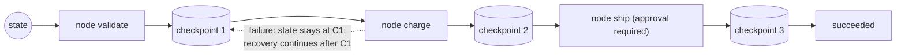

> **Group**: Agent Systems  |  **Exit of the group above** ([Action](../05-action/tool-calling)): you can execute a single tool call safely  |  **Exit of this page**: you can implement a checkpointed multi-step flow — recover from persisted state after failure without redoing side effects, and pause for a human before irreversible steps
> **Prerequisites**: [Tool Execution Engineering](../05-action/tool-execution.md)  |  **Next**: [Agent Runtime](agent-runtime.md), [Recovery and Human-in-the-Loop](recovery-hitl.md), [Observability](../08-production/observability)

## 1. Overview

**BLUF**: a workflow is a system where "LLMs and tools are orchestrated through **predefined code paths**"; an agent is a system where "the model **dynamically directs** its own process and tool usage" (Anthropic's framing). That boundary decides everything: **if steps can be statically enumerated and recovery paths written in advance, use a workflow** — it is predictable, testable, and replayable; hand control to an agent loop only when the number and order of steps depends on what is discovered mid-run. This page delivers a minimal checkpointed engine: recover from persisted state after failure, replay completed steps without redoing side effects, and pause for a human before irreversible nodes.

### Mental model: nodes, state, and checkpoints



Three components: **nodes** (one unit of work: an LLM call, a tool execution, or a plain code check), **state** (business data shared across nodes), and **checkpoints** (a persisted snapshot after each node completes). Recovery = **replaying** events/checkpoints from the start; completed nodes reuse their recorded outputs and side effects never re-execute.

### When to use / when not to

- Use: multi-step flows with enumerable steps — draft→review→polish, extract→validate→load, approval chains.
- Skip: problems a single step solves (go straight to [tool execution](../05-action/tool-execution.md)); steps that cannot be predicted and need model-driven exploration (go to [Agent Runtime](agent-runtime)).

### Decision table 1: code workflow vs agent loop

| Dimension | Code workflow | Agent loop |
| --- | --- | --- |
| Control | Yours: steps, order, and branches are code | The model's: it decides the next step each turn |
| Predictability | High: same input, same path; precisely testable | Low: non-deterministic; needs stopping conditions |
| Cost | One controlled call per step; token budget is knowable | Unbounded loop count; needs a budget ceiling |
| Debugging | Breakpoints sit on nodes; the checkpoint names the spot | Requires full traces to reconstruct model decisions |
| Failure recovery | Replay from checkpoints; mature options | Relies on agent self-correction + outer guardrails |

**One-line rule**: if you can draw the whole flowchart, choose a workflow; if you cannot (the graph depends on what the run discovers), choose an agent.

### Decision table 2: ladder placement

| Option | Direction | Control | State | Trust domain | Minimum complexity |
| --- | --- | --- | --- | --- | --- |
| Single tool call ([previous page](../05-action/tool-execution.md)) | Write (once) | Five gates | Single call record | In-process | One action |
| Code workflow (this page) | Write (multiple) | You orchestrate steps | Multi-step state + checkpoints | In-process | Enumerable multi-step |
| Agent loop ([next page](agent-runtime)) | Read-write loop | Model decisions + stopping conditions | Session/memory/checkpoints | Within host | Unpredictable steps |
| Multi-agent ([page after](multi-agent.md)) | Read-write loop × N | Delegation and routing | Per-agent contexts + shared points | In host / cross-boundary | Parallelism/specialization beats coordination cost |

### Five workflow patterns (Anthropic's naming)

| Pattern | Problem it solves | Example |
| --- | --- | --- |
| Prompt chaining | Task decomposes into fixed substeps, each simpler | Generate copy → translate |
| Routing | Inputs fall into classes; each gets a specialized path | Support triage; easy questions to a smaller model |
| Parallelization (sectioning / voting) | Subtasks are independent, or multiple views are needed | Partitioned review; multi-prompt voting |
| Orchestrator-workers | Subtasks **cannot be predefined**; a central LLM decomposes dynamically | Multi-file code changes |
| Evaluator-optimizer | Clear evaluation criteria; iteration has measurable payoff | Literary translation polish |

Note the boundary: orchestrator-workers already sits on the transition band between workflow and agent — "the orchestrator dynamically decides subtasks" is agent-style control, even though the overall path is still closed by code. Production systems routinely combine them (outer workflow, inner agent nodes).

Historical milestones: this page consolidates the old "AI Agent Workflow Patterns and Advanced Tool Calling" page; its "advanced tool calling" half (tool search etc.) moved to the resource library of [Tool Execution Engineering](../05-action/tool-execution.md). The old three execution modes (sequential/parallel/evaluate-optimize) map to chaining / parallelization / evaluator-optimizer above. Earlier timelines unverified; not fabricated.

## 2. Usage

Minimal hands-on: a mini workflow engine — step registry + in-memory checkpoint store + failure replay + a human-approval node. A three-step order flow (validate → charge → ship) demonstrates: step 2 failing mid-run, recovery from checkpoint, approval finishing the run, and the rejected-approval negative. Zero API keys, zero dependencies.

**Environment**: Node ≥ 22.18. Save as `workflow-engine.ts`, run `node workflow-engine.ts`.

```ts
// workflow-engine.ts — a mini workflow engine: step registry + in-memory checkpoints + failure replay + human approval.
// Zero dependencies. Runs natively on Node >= 22.18: node workflow-engine.ts
import { setTimeout as sleep } from "node:timers/promises";

// ---------- Contracts ----------
type RunStatus = "running" | "succeeded" | "failed" | "awaiting_approval" | "cancelled";
type StepStatus = "pending" | "running" | "done" | "failed" | "skipped";

interface OrderState {
  orderId: string;
  amount: number;
  validated?: boolean;
  paymentId?: string;
  shipped?: boolean;
}

interface StepDef {
  name: string;
  requiresApproval?: boolean; // human-approval node: pause instead of pass-through
  run: (state: OrderState) => Promise<Partial<OrderState>>;
}

interface RunRecord {
  status: RunStatus;
  state: OrderState;
  steps: Map<string, { status: StepStatus; output?: Partial<OrderState> }>;
  waitingOn?: string; // which node an awaiting_approval run is paused at
}

// ---------- Engine: in-memory checkpoint store (swap for a DB/file in production) ----------
class WorkflowEngine {
  private runs = new Map<string, RunRecord>();

  private checkpoint(runId: string, step: string, output: Partial<OrderState>) {
    const run = this.runs.get(runId)!;
    run.steps.set(step, { status: "done", output });
    Object.assign(run.state, output);
    console.log(`  [checkpoint] run=${runId} step=${step} saved ${JSON.stringify(output)}`);
  }

  // Start or resume: steps already marked done reuse their checkpointed output; side effects are NEVER re-executed
  async start(runId: string, steps: StepDef[], input: OrderState): Promise<RunRecord> {
    if (!this.runs.has(runId)) {
      this.runs.set(runId, { status: "running", state: input, steps: new Map() });
      console.log(`[run ${runId}] start`);
    } else {
      console.log(`[run ${runId}] resume: replay from checkpoint`);
    }
    const run = this.runs.get(runId)!;

    for (const step of steps) {
      const saved = run.steps.get(step.name);
      if (saved?.status === "done") {
        console.log(`  [replay] step=${step.name} reused (side effect NOT re-executed)`);
        continue;
      }
      // Human-approval node: persist the pause point first, continue only on a decision
      if (step.requiresApproval && run.waitingOn !== step.name) {
        run.status = "awaiting_approval";
        run.waitingOn = step.name;
        run.steps.set(step.name, { status: "pending" });
        console.log(`  [pause] step=${step.name} awaiting human approval (persisted)`);
        return run;
      }
      run.steps.set(step.name, { status: "running" });
      console.log(`  [exec] step=${step.name}`);
      try {
        const output = await step.run(run.state);
        this.checkpoint(runId, step.name, output);
      } catch (err: any) {
        run.steps.set(step.name, { status: "failed" });
        run.status = "failed";
        console.log(`  [fail] step=${step.name} error=${err.message}`);
        return run; // state is persisted: recovery resumes from the checkpoint
      }
    }
    run.status = "succeeded";
    console.log(`[run ${runId}] ${run.status}`);
    return run;
  }

  // Approve/reject: continue from the pause point, or wind down
  async decide(runId: string, steps: StepDef[], approve: boolean): Promise<RunRecord> {
    const run = this.runs.get(runId)!;
    const stepName = run.waitingOn!;
    if (!approve) {
      run.steps.set(stepName, { status: "skipped" });
      run.status = "cancelled";
      run.waitingOn = undefined;
      console.log(`[run ${runId}] ${run.status} (step=${stepName} rejected)`);
      return run;
    }
    run.waitingOn = undefined;
    const step = steps.find((s) => s.name === stepName)!;
    console.log(`  [approved] step=${stepName}`);
    const output = await step.run(run.state);
    this.checkpoint(runId, stepName, output);
    run.status = "succeeded";
    console.log(`[run ${runId}] ${run.status}`);
    return run;
  }
}

// ---------- Step definitions: all side effects mocked, outputs deterministic ----------
const steps: StepDef[] = [
  {
    name: "validate_order",
    run: async (s) => {
      await sleep(10);
      if (!s.orderId.startsWith("ORD-")) throw new Error("invalid orderId format");
      return { validated: true };
    },
  },
  {
    name: "charge_payment",
    run: async (s) => ({ paymentId: `PAY-${s.orderId.slice(4)}` }),
  },
  {
    name: "ship_order",
    requiresApproval: true, // shipping is irreversible: a human-approval node
    run: async () => ({ shipped: true }),
  },
];

async function main() {
  const engine = new WorkflowEngine();
  const input: OrderState = { orderId: "ORD-1042", amount: 199 };

  console.log("== drill 1: step 2 fails (injected transient fault), run stops at a checkpoint ==");
  const origCharge = steps[1].run;
  steps[1].run = async () => { throw new Error("payment gateway 503"); };
  const r1 = await engine.start("run-1", steps, input);
  console.log(`result: status=${r1.status}, validate saved=${r1.steps.get("validate_order")?.status}`);

  console.log("\n== drill 2: fault recovered, resume; validate replays from checkpoint, not re-executed ==");
  steps[1].run = origCharge;
  const r2 = await engine.start("run-1", steps, input); // same runId: continue from persisted state
  console.log(`result: status=${r2.status}, waitingOn=${r2.waitingOn}`);

  console.log("\n== drill 3: approve the human-approval node, run finishes ==");
  const r3 = await engine.decide("run-1", steps, true);
  console.log(`result: status=${r3.status}, state=${JSON.stringify(r3.state)}`);

  console.log("\n== negative: approval rejected; run cancelled with side effects stopped before shipping ==");
  const r4 = await engine.start("run-2", steps, { orderId: "ORD-2088", amount: 59 });
  const r5 = await engine.decide("run-2", steps, false);
  console.log(`result: status=${r5.status}, ship=${r5.steps.get("ship_order")?.status}, state=${JSON.stringify(r5.state)}`);
}

main();
```

**Normal output** (deterministic):

```text
== drill 1: step 2 fails (injected transient fault), run stops at a checkpoint ==
[run run-1] start
  [exec] step=validate_order
  [checkpoint] run=run-1 step=validate_order saved {"validated":true}
  [exec] step=charge_payment
  [fail] step=charge_payment error=payment gateway 503
result: status=failed, validate saved=done

== drill 2: fault recovered, resume; validate replays from checkpoint, not re-executed ==
[run run-1] resume: replay from checkpoint
  [replay] step=validate_order reused (side effect NOT re-executed)
  [exec] step=charge_payment
  [checkpoint] run=run-1 step=charge_payment saved {"paymentId":"PAY-1042"}
  [pause] step=ship_order awaiting human approval (persisted)
result: status=awaiting_approval, waitingOn=ship_order

== drill 3: approve the human-approval node, run finishes ==
  [approved] step=ship_order
  [checkpoint] run=run-1 step=ship_order saved {"shipped":true}
[run run-1] succeeded
result: status=succeeded, state={"orderId":"ORD-1042","amount":199,"validated":true,"paymentId":"PAY-1042","shipped":true}

== negative: approval rejected; run cancelled with side effects stopped before shipping ==
[run run-2] start
  [exec] step=validate_order
  [checkpoint] run=run-2 step=validate_order saved {"validated":true}
  [exec] step=charge_payment
  [checkpoint] run=run-2 step=charge_payment saved {"paymentId":"PAY-2088"}
  [pause] step=ship_order awaiting human approval (persisted)
[run run-2] cancelled (step=ship_order rejected)
result: status=cancelled, ship=skipped, state={"orderId":"ORD-2088","amount":59,"validated":true,"paymentId":"PAY-2088"}
```

**What to look at**: the `[replay]` line in drill 2 — on recovery, `validate_order`'s output is reused from the checkpoint and the side effect never re-runs; the `[pause]` lines — the approval pause point itself is persisted, so `decide` still works after a process restart.

**Acceptance command**:

```bash
node workflow-engine.ts | grep -c "\[checkpoint\]"   # expected: 5 (two runs land 5 checkpoints total)
```

**Cleanup**: purely in-memory; no file side effects.

### Scenario walkthrough

| Scenario | Input | Action | Output | Fits | Does not fit |
| --- | --- | --- | --- | --- | --- |
| Content pipeline | Documents | chaining: extract→validate→load | Per-step checkpoints | Fixed-step transformations | Steps must be added dynamically from findings |
| Approval flow | Order | approval node pauses + `decide` | awaiting_approval → succeeded/cancelled | Before irreversible actions | Auto-rollback-able steps (no need to wake a human) |
| Transient-fault recovery | 503/timeout | re-run `start` with the same runId | Resumes from checkpoint | Flows whose side effects cannot be redone | Readonly flows (harmless to rerun; simple retry is enough) |

## 3. Principles

### Three recovery semantics for state

| Recovery semantics | How | Fits | Cost |
| --- | --- | --- | --- |
| **Replay** | Re-run code from the start; recorded events/checkpoints restore state; completed nodes' side effects never re-execute | Systems with a persisted event stream (Temporal's Event History; this fixture's step records) | Node code must be deterministic |
| **Checkpoint resume** | Continue execution directly from the latest snapshot | When snapshotting is cheaper than replay | Snapshot consistency needs design |
| **Compensation (saga)** | Register a reverse action for every write step; on failure, execute them in reverse | Cross-service writes that cannot commit atomically | Compensation itself can fail; needs retry and human fallback |

Temporal turns replay into a system: the Event History is the source of truth; recovery **starts by re-running the code** and uses the recorded history to guide it back to the pre-crash state. Therefore workflow code must be **deterministic** — time is read from context, randomness is captured once and reused, and all external interaction (API/DB/LLM/files) goes into Activities whose results are recorded once and reused (never recomputed) during replay. The fixture's `[replay]` is the smallest version of that semantics.

### A human-approval node = a persisted pause

Approval is not a UI popup but **a persisted state of the state machine**: `awaiting_approval` is written to durable storage together with `waitingOn` (which node it is stuck on). Process crashes and redeployments (Anthropic's production experience: rainbow deployments to avoid disrupting running agents) must not lose the pause point. LangGraph groups this family of capabilities under checkpointers: graph-state snapshots keyed by `thread_id`, backing conversation continuity, human-in-the-loop, time travel, and fault tolerance — with the explicit note that the in-memory `MemorySaver` does not survive restarts; production swaps in `SqliteSaver`/`PostgresSaver`.

### Observability: one trace per step

The debugging unit of a multi-step flow is "the step", not "the run": every node records runId, step, input digest, output digest, duration, and terminal state. Without per-step traces, "the flow is stuck" is a guessing game; with them, the stuck point localizes to a node and branch (details in the [Production](../08-production/) group's [Observability](../08-production/observability)).

### Spec requirements vs local test

| Official statement | Source | Local fixture counterpart |
| --- | --- | --- |
| Workflows orchestrate LLMs and tools through predefined code paths; agents dynamically direct themselves | Building Effective Agents (L1, retrievedAt 2026-09-01) | The `steps` array is the predefined path; this page has no model-driven branching |
| Workflow recovery = re-run code + replay the event history; workflows must be deterministic; external interactions live in Activities whose results are recorded once | Temporal docs (L1, retrievedAt 2026-09-01) | `[replay]` reuses stored outputs; mock steps produce deterministic outputs |
| Checkpointers persist graph state per thread, backing HITL and fault tolerance; the in-memory one does not survive restarts | LangGraph persistence docs (L1, retrievedAt 2026-09-01) | The fixture uses an in-memory `Map`; the text states plainly that production needs durable storage |
| The five workflow-pattern names | Building Effective Agents (L1, retrievedAt 2026-09-01) | Restated in decision table 1 / overview |

### The essence of control

The difference between workflow and agent is not "does an LLM participate" but **where the control flow lives**: in a workflow the control flow is code (the LLM is a called node); in an agent the control flow is the model (code is just the loop shell). Every secondary difference follows — predictability, testing style (workflows unit-test nodes; agents eval whole trajectories), failure recovery (workflows lean on checkpoints; agents on stopping conditions and outer guardrails).

## 4. Development

### Integration

1. **Node-ify LLM calls**: wrap each model call in a `StepDef`; its (structured, per the [tool calling contract](../05-action/tool-calling)) output goes into state; prompts are assembled by code.
2. **Node-ify tools**: write-world nodes go through the controlled executor of [Tool Execution Engineering](../05-action/tool-execution.md), with idempotency keys of `runId + step`.
3. **Storage**: replace the `runs` Map with DB tables (runId primary key, state JSON column, step-detail table); "same-runId re-entry" rides on the primary-key uniqueness constraint.
4. **Triggers**: make the entry idempotent — a duplicate trigger for the same business record reuses the existing run instead of creating a new one.

### Version pinning and compatibility

- Node ≥ 22.18 runs `.ts` natively; the logic has zero dependencies, so downgrading just means stripping types.
- When upgrading a workflow definition, mind **in-flight runs**: completed nodes carry old-version outputs, and new replay code must tolerate old records (Temporal solves the same problem with versioning; the minimal approach is keep step names stable and only append optional fields).

### Testing

- **Failure injection**: as in the fixture, swap `run` to inject a 503; assert the checkpoint is intact after failure and `[replay]` hits on recovery.
- **Both approval branches**: deterministic assertions for approve and reject.
- **Re-entry**: a double trigger with the same runId produces exactly one chain of side effects.

### Rollback

Rolling back the flow definition = reverting code; **in-flight runs are not rolled back** — let them finish under the old definition (or explicitly `cancelled` them) while new runs take the new definition. Never "hot-edit the definition and replay in-flight runs": replay semantics require the code to agree with the recorded history.

### Symptom → Evidence → Fix → Done

**Symptom**: the process crashes mid-flow; after restart nobody knows which steps already ran, and ops reconciles by hand.
**Evidence**: no checkpoint store (or memory-only); logs cannot answer "which step did run X reach".
**Fix**: introduce persisted checkpoints (write on every step completion); make recovery a single entry — "re-enter `start` with the same runId; replay skips completed steps".
**Done**: after kill -9 and restart, the same runId resumes, the log shows `[replay]`, no duplicated side effects; the manual reconciliation step is deleted.

### Symptom → Evidence → Fix → Done

**Symptom**: the same order is processed twice (charged twice / emailed twice).
**Evidence**: two different runIds carrying the same business record number; no idempotency check at the entry.
**Fix**: look up an existing run by business key at the entry; add a second idempotency layer at the tool level (defense in depth, see [Tool Execution Engineering](../05-action/tool-execution.md)).
**Done**: a duplicate-trigger integration test leaves one active run; the second request returns the first one's result.

### Symptom → Evidence → Fix → Done

**Symptom**: a human-approval node sits unclicked for three days; the flow's state is lost and must be rerun entirely.
**Evidence**: `awaiting_approval` lives in memory; or approvals have no timeout policy.
**Fix**: persist the pause point (`waitingOn` to durable storage) + an approval timeout policy (auto-reject into a human ticket on expiry, rather than waiting silently).
**Done**: `decide` still works after a restart; the timeout path has test coverage and raises an alert.

### Symptom → Evidence → Fix → Done

**Symptom**: after recovery, the replay diverges (branching differs from pre-crash).
**Evidence**: node code contains `Date.now()` / randomness / unrecorded external calls — values differ on replay and the code takes a different branch.
**Fix**: make node code deterministic: read time and randomness from state/records; route all external interaction through the record-once-reuse-on-replay Activity pattern.
**Done**: replaying a fixed event history N times follows the identical path (a replay-consistency test).

### Anti-patterns

- **"Retry = start over"**: whole-flow retries without checkpoints turn enumerable side effects into unenumerable ones.
- **Non-persisted approval nodes**: the pause point lives only in memory/UI session; a restart loses it.
- **Stuffing dynamism into a workflow**: letting the model rewrite the flow graph inside a node "for flexibility" — that is an agent's job; mixing them disables both debugging toolkits.
- **Hot-editing in-flight definitions**: replay semantics require code to agree with history; hot-editing forges history.
- **"It ran, ship it" without per-step traces**: a multi-step system without step-level traces turns fault localization into folklore.

## 5. Resource Library

Four-level reading route:

- **Beginner**: finish this page → recite the workflow-vs-agent boundary and the three recovery semantics; run the fixture's failure-recovery drill.
- **Builder**: the five patterns in Building Effective Agents + this repo's [Tool Execution Engineering](../05-action/tool-execution.md) (execution inside nodes).
- **Operator**: Temporal's Event History / replay / determinism constraints; LangGraph's checkpointer thread model and production storage choices.
- **Researcher**: the original saga / compensating-transaction literature; the transition band from orchestrator-workers to agents ([Agent Runtime](agent-runtime)).

### Resource table

| Name | Evidence tier | canonical URL | Use | Supported claim | Next |
| --- | --- | --- | --- | --- | --- |
| Building Effective Agents (Anthropic) | L1 (maintainer) | https://www.anthropic.com/engineering/building-effective-agents | Workflow/agent definitions, five patterns, simplicity first | "Workflows orchestrate via predefined code paths; agents direct themselves" (retrievedAt 2026-09-01) | [Agent Runtime](agent-runtime) |
| Temporal Workflows (official docs) | L1 (maintainer) | https://docs.temporal.io/workflows | Event History, replay, determinism constraints, Activities | "Recovery = re-run code and replay history; activity results are recorded once and reused in replay" (retrievedAt 2026-09-01) | Study the durable-execution family |
| LangGraph Persistence (official docs) | L1 (maintainer) | https://docs.langchain.com/oss/python/langgraph/persistence | Checkpointer/store split, thread_id, HITL | "Checkpointers back human-in-the-loop and fault tolerance; MemorySaver does not survive restarts" (retrievedAt 2026-09-01; the page has moved to docs.langchain.com) | Compare with the fixture's in-memory store |
| How we built our multi-agent research system | L1 (maintainer) | https://www.anthropic.com/engineering/built-multi-agent-research-system | Production requirements on checkpoints and deployment | "Retry logic + regular checkpoints to resume from failure; rainbow deployments avoid disrupting runs" (retrievedAt 2026-09-01) | [Multi-Agent Systems](multi-agent.md) |
| Multi-agent coordination patterns (Claude blog) | L1 (maintainer) | https://claude.com/blog/multi-agent-coordination-patterns | Evolution judgments between patterns | Five coordination patterns (verified via this repo's old-page archive 2026-04-10; not re-verified this round) | [Multi-Agent Systems](multi-agent.md) |

### Active falsification and open questions

- Falsification entry: if one of your flows **cannot** have its steps statically enumerated yet runs stably as a workflow — the enumeration rule is too strict; describe the flow's shape and revise decision table 1.
- Open: consistency protocols for distributed checkpoints (compensation-failure handling in cross-service sagas) get semantics here but no implementation; that lands between backend engineering and [Deployment](../08-production/deployment).
- Open: no benchmark comparing workflow engines (Temporal vs LangGraph vs self-built); this page asserts no ranking and lists only recovery-semantics differences.

### Where learn-ai stops / where to go next

- Unpredictable steps that need model-driven control: [Agent Runtime](agent-runtime).
- The full agent-side loop of approval, pause, and recovery: [Recovery and Human-in-the-Loop](recovery-hitl.md).
- Collecting and querying per-step traces: [Observability](../08-production/observability) (Production group).
- Proving flow correctness (replay tests, golden-path assertions): [Testing](../08-production/testing) and [evals](https://evals.zenheart.site/).
