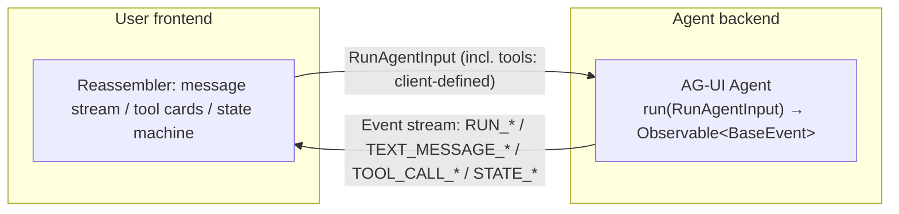
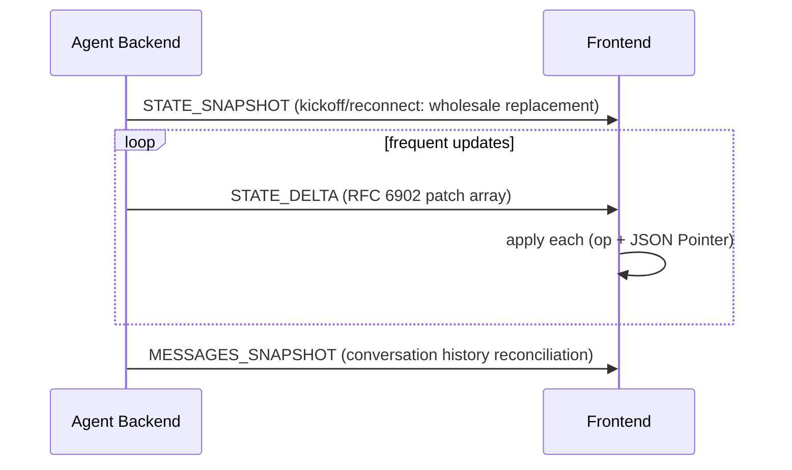

> **Group**: Interoperability ｜ **Previous group exit**: build a traceable retrieval chain with an update path ｜ **This group exit**: consume an agent backend's event stream in a frontend and reconcile state correctly, and know how it divides labor with "raw SSE" and A2UI
> **Prerequisites**: [Protocol Map](index.md) ｜ **Next**: [A2UI and MCP Apps](a2ui-mcp-apps.md)

## 1. Overview

**BLUF**: AG-UI (Agent–User Interaction Protocol) is an **open, lightweight, event-based** protocol that standardizes the bidirectional connection between a user-facing application and any agentic backend. The problem it solves: every team pushes agent output to the frontend over a private SSE/WebSocket format, so each new backend forces a parser rewrite. AG-UI standardizes those events — lifecycle, text deltas, tool calls, state sync, interrupts — so the frontend implements once and connects anywhere.

> **Versus A2UI (official disambiguation)**: similar names, different layers. A2UI is a generative UI **specification** (agents deliver UI component descriptions); AG-UI is the Agent↔user-app **interaction protocol** (connection and event semantics). They compose: AG-UI carries, A2UI says what UI to carry. (See [A2UI and MCP Apps](a2ui-mcp-apps.md))

### Mental model: one event stream, each side takes what it needs



- **Core abstraction**: `run(input: RunAgentInput) -> Observable<BaseEvent>`; the standard HTTP client `HttpAgent` calls any endpoint that accepts a POST of `RunAgentInput` and returns a stream of `BaseEvent`.
- **Transport-agnostic**: SSE, webhooks, WebSockets, HTTP binary all work — AG-UI standardizes **event semantics**, not the pipe.
- **The client is not necessarily a web app**: the protocol describes an event stream, not a rendering target — a terminal, a mobile app, or a chat platform can each act as the AG-UI client (stated explicitly in the official Overview, re-checked 2026-09-01).
- **Three-way complementarity** (official positioning): MCP connects agent↔tools/data; A2A connects agent↔agent; AG-UI connects agent↔user (through user-facing apps). One agent can use all three at once.

### Event families (docs.ag-ui.com is authoritative)

| Family | Events | Key fields |
| --- | --- | --- |
| Lifecycle | `RUN_STARTED` / `RUN_FINISHED` / `RUN_ERROR`; `STEP_STARTED` / `STEP_FINISHED` | `threadId`, `runId` (`parentRunId` enables branching/time travel), `stepName` |
| Text messages | `TEXT_MESSAGE_START` / `TEXT_MESSAGE_CONTENT` / `TEXT_MESSAGE_END` | `messageId`, `role` (developer/system/assistant/user/tool), `delta` (non-empty chunk) |
| Tool calls | `TOOL_CALL_START` / `TOOL_CALL_ARGS` / `TOOL_CALL_END`; `TOOL_CALL_RESULT` | `toolCallId`, `toolCallName`, `parentMessageId`, argument `delta` (JSON fragment) |
| State management | `STATE_SNAPSHOT` / `STATE_DELTA` / `MESSAGES_SNAPSHOT` | `snapshot` (full replacement); `delta` = RFC 6902 JSON Patch array |
| Activity | `ACTIVITY_SNAPSHOT` / `ACTIVITY_DELTA` | `messageId`, `activityType` (e.g. PLAN/SEARCH), structured `content` |
| Special | `RAW` / `CUSTOM` | pass-through / custom named events |

Every event extends `BaseEvent`: `type` (always), optional `timestamp`, `rawEvent`, `metadata`; most events may carry `subagentRunId` attributing the producer (subagent attribution).

**State sync semantics** (where frontends most often go wrong):

- `STATE_SNAPSHOT`: **wholesale replacement** of local state — for kickoff, reconnects, major resets.
- `STATE_DELTA`: changes only; the frontend applies them as RFC 6902 JSON Patch (op: add/remove/replace/move/copy/test + JSON Pointer paths) — for frequent small updates.

### When to use / when not to

- Use: wiring agents into chat/workbench frontends; needing streamed text + tool-call visibility + a frontend state mirror; needing humans in the loop (interrupt/resume, client-tool approval).
- Do not: agent ↔ tools (→ [MCP](mcp.md)); agent ↔ agent (→ [A2A](a2a.md)); editor ↔ coding agent (→ [ACP](acp-agent-client.md)); delivering static UI component descriptions only (→ [A2UI](a2ui-mcp-apps.md), which composes with AG-UI).

### Decision table: AG-UI vs "just stream tokens over SSE"

| Dimension | Raw SSE (private format) | **AG-UI** |
| --- | --- | --- |
| Direction | mostly backend→frontend one-way | bidirectional: `RunAgentInput` (incl. client tools) + event stream |
| Semantics | per-vendor ad hoc: text, progress, errors interleaved as strings | standard event families: lifecycle/text/tool/state/interrupt each typed |
| State | the frontend guesses how to assemble | explicit SNAPSHOT/Delta (JSON Patch) sync |
| Interrupt/resume | homegrown | a Run ends with an interrupt outcome; a new Run carries `resume[]` answers |
| Frontend cost | rewrite the parser per backend | implement once, connect to any compatible backend |

### History milestones

The official docs carry no protocol version number (retrieved 2026-09-01); event types and semantics such as `RunFinished.outcome` and `resume` follow the current docs.ag-ui.com pages, with unfinalized changes published under `drafts/`. Earlier history and release dates: unverified.

### DoD self-check for this chapter

- [ ] Run the §2 fixture (SSE mock + state-reconciling client) within 15 minutes
- [ ] State the difference in application rules between SNAPSHOT and Delta
- [ ] List which event families may appear between RUN_STARTED and RUN_FINISHED
- [ ] Describe how a new Run carries `resume[]` after an interrupt

## 2. Usage

**Minimal hands-on**: an SSE mock emitting an AG-UI-style event sequence, and a client that parses and reassembles messages and state. Node ≥ 18, zero dependencies, no API keys.
(Note: the real `HttpAgent` **POSTs** `RunAgentInput` to get the stream; the fixture simplifies the handshake to GET while keeping event payload shapes. Marked fixture.)

`agui-agent.mjs` (event-stream mock):

```javascript fixture
// agui-agent.mjs — AG-UI-style SSE event stream mock (Node ≥ 18, zero deps)
import { createServer } from "node:http";

const ev = (o) => `data: ${JSON.stringify(o)}\n\n`;
const threadId = "thread_demo", runId = "run_1";

createServer((req, res) => {
  if (req.url !== "/agent") { res.writeHead(404); return res.end(); }
  res.writeHead(200, {
    "Content-Type": "text/event-stream",
    "Cache-Control": "no-cache",
    Connection: "keep-alive",
  });
  const push = (o) => res.write(ev(o));
  const wait = (ms) => new Promise((r) => setTimeout(r, ms));

  (async () => {
    push({ type: "RUN_STARTED", threadId, runId });
    await wait(50);
    // —— text message stream ——
    push({ type: "TEXT_MESSAGE_START", messageId: "msg_1", role: "assistant" });
    for (const delta of ["Parsing request…", "Searching…", "Producing plan." ])
      push({ type: "TEXT_MESSAGE_CONTENT", messageId: "msg_1", delta }), await wait(50);
    push({ type: "TEXT_MESSAGE_END", messageId: "msg_1" });
    // —— state: full snapshot first, then delta ——
    push({ type: "STATE_SNAPSHOT",
      snapshot: { todos: ["parse input", "call tool"], done: 0 } });
    push({ type: "STATE_DELTA",
      delta: [{ op: "replace", path: "/done", value: 1 }] });
    // —— tool call (arguments streamed as JSON fragments) ——
    push({ type: "TOOL_CALL_START", toolCallId: "call_1", toolCallName: "search_docs" });
    push({ type: "TOOL_CALL_ARGS", toolCallId: "call_1", delta: '{"query":"a2a"}' });
    push({ type: "TOOL_CALL_END", toolCallId: "call_1" });
    await wait(50);
    push({ type: "RUN_FINISHED", threadId, runId });
    res.end();
  })();
}).listen(3124, "127.0.0.1", () => console.log("AG-UI mock on :3124/agent"));
```

`agui-client.mjs` (SSE parsing + message/state reassembly, with a minimal JSON Patch applier):

```javascript fixture
// agui-client.mjs — parse an AG-UI event stream and reconcile state (Node ≥ 18, zero deps)
const messages = new Map(); // messageId -> {role, text}
let state = null;           // STATE_SNAPSHOT replaces wholesale; STATE_DELTA patches

function applyPatch(doc, { op, path, value }) {
  const parts = path.split("/").filter(Boolean);
  let node = doc;
  for (let i = 0; i < parts.length - 1; i++) node = node[parts[i]];
  const key = parts.at(-1);
  if (op === "add" || op === "replace") node[key] = value;
  else if (op === "remove") delete node[key];
  return doc;
}

const onEvent = (e) => {
  switch (e.type) {
    case "RUN_STARTED":
      return console.log(`[run] started thread=${e.threadId} run=${e.runId}`);
    case "TEXT_MESSAGE_START":
      return messages.set(e.messageId, { role: e.role, text: "" });
    case "TEXT_MESSAGE_CONTENT":
      return messages.get(e.messageId).text += e.delta;
    case "TEXT_MESSAGE_END":
      return console.log(`[message] (${messages.get(e.messageId).role}) ${
        messages.get(e.messageId).text}`);
    case "STATE_SNAPSHOT":
      state = e.snapshot; // wholesale replacement
      return console.log("[state] snapshot", JSON.stringify(state));
    case "STATE_DELTA":
      for (const p of e.delta) applyPatch(state, p); // apply each patch
      return console.log("[state] after delta", JSON.stringify(state));
    case "TOOL_CALL_START":
      return console.log(`[tool] ${e.toolCallName}(${e.toolCallId}) …`);
    case "TOOL_CALL_ARGS":
      return console.log(`[tool] args chunk: ${e.delta}`);
    case "RUN_FINISHED":
      return console.log("[run] finished");
    case "RUN_ERROR":
      return console.log(`[run] ERROR ${e.message}`);
    default:
      console.log(`[event] ${e.type}`);
  }
};

const res = await fetch("http://127.0.0.1:3124/agent");
if (!res.ok || !res.headers.get("content-type")?.includes("text/event-stream"))
  throw new Error(`unexpected: ${res.status}`);
const reader = res.body.getReader();
const decoder = new TextDecoder();
let buf = "";
for (;;) {
  const { done, value } = await reader.read();
  if (done) break;
  buf += decoder.decode(value, { stream: true });
  const frames = buf.split("\n\n");
  buf = frames.pop(); // the last frame may be incomplete; leave it for the next round
  for (const f of frames) {
    const line = f.split("\n").find((l) => l.startsWith("data: "));
    if (line) onEvent(JSON.parse(line.slice(6)));
  }
}
if (!state || state.done !== 1) throw new Error("state not reconciled");
console.log("[verify] final state ok:", JSON.stringify(state));
```

**Run commands** (two terminals):

```bash fixture
node agui-agent.mjs   # terminal 1
node agui-client.mjs  # terminal 2
```

**Normal output**:

```text fixture
[run] started thread=thread_demo run=run_1
[message] (assistant) Parsing request…Searching…Producing plan.
[state] snapshot {"todos":["parse input","call tool"],"done":0}
[state] after delta {"todos":["parse input","call tool"],"done":1}
[tool] search_docs(call_1) …
[tool] args chunk: {"query":"a2a"}
[event] TOOL_CALL_END
[run] finished
[verify] final state ok: {"todos":["parse input","call tool"],"done":1}
```

**Negative**: change the mock's `STATE_DELTA` path to `/missing/deep` — the client's `applyPatch` will write into `undefined` and throw a `TypeError`, which is exactly where real frontends need defensive handling and alerting around patch application.
**Acceptance command**: the client ends with `[verify] final state ok:` and `done === 1`.
**Cleanup**: `Ctrl+C` both terminals, delete both scripts.

### Scenario matrix

| Scenario | Input / action | Output | Fits | Does not fit |
| --- | --- | --- | --- | --- |
| Streaming chat | an ordinary prompt | TEXT_MESSAGE_* deltas reassembled | chat/report generation | one-shot JSON output |
| State mirroring | the agent pushes SNAPSHOT+Delta | frontend state matches backend | form/dashboard collaboration | stateless Q&A |
| Tool visibility | TOOL_CALL_* events | tool cards + streamed arguments | showing execution, approvals | — |
| Interrupt/resume | a Run ends with `outcome:interrupt` | a new Run carries `resume[]` answers | HITL approval, structured input | not implemented in this fixture |
| Client tools | definitions passed via `RunAgentInput.tools` | the agent calls back into the frontend | UI actions, approval workflows | not implemented in this fixture |

## 3. Principles

### Run model and invariants

- **Run boundary**: a Run starts with `RUN_STARTED` and ends with `RUN_FINISHED` (success) or `RUN_ERROR` (failure); `RunFinished` may carry an `outcome` (discriminated union) where `type: "interrupt"` carries an interrupts list — **interruption is a terminal-outcome model**: this Run ends, and after the user answers, a new Run's `resume: [{interruptId, status, payload?}]` links back.
- **Message delta invariant**: the CONTENT deltas of one `messageId`, concatenated in order, equal the full message; a changed `messageId` means a new message.
- **Tool bidirectionality**: backend-defined tools stay in the backend; **client-defined tools are passed to the agent inside `RunAgentInput.tools`**, and the agent calls back for execution — this is the channel for approval/UI-action HITL. Client-tool failures must use the protocol's error channel, otherwise success and failure are indistinguishable.
- **Branching/time travel**: `RunStarted.parentRunId` points at a prior run within the same thread, forming an append-only log.
- **Transport**: the official `HttpAgent` supports HTTP SSE (text, easy to debug) and HTTP binary (performance); the protocol itself is transport-agnostic.

### State sync (the deep end of the spec)



Design rationale (official): snapshots establish baselines (kickoff, reconnect, major changes); deltas save bandwidth (small changes during streaming, large state objects). Frontend essentials: **establish a baseline before applying patches**, defend patch application (a missing path must not crash), and force a fresh snapshot after reconnection before resuming deltas.

### Spec requirements vs local test

| Claim | Official docs (docs.ag-ui.com) | Local fixture |
| --- | --- | --- |
| Event type enumeration (six families) | defined one by one on the events page | the mock emits five (Activity not demonstrated) |
| STATE_SNAPSHOT wholesale replacement | MUST | matches |
| STATE_DELTA = RFC 6902 patch array | MUST | matches (minimal add/replace/remove applier) |
| SSE frame format `data: {json}` | HttpAgent SSE transport | matches |
| Transport: POST RunAgentInput → event stream | HttpAgent definition | the fixture simplifies to GET (marked fixture) |
| interrupt + resume semantics | interrupts page | untested |
| `parentRunId` branching | events page | untested |

## 4. Development

### Integration notes

- **Transport choice**: default to SSE (readable, capturable); switch to HTTP binary only when throughput demands it.
- **Dedup and ordering**: SSE is ordered by nature; before assuming order in binary/WebSocket scenarios, confirm the transport preserves it.
- **Reconnection policy**: after a drop, do not resume deltas from the old state — re-trigger a snapshot baseline, then continue with deltas.
- **Subagent attribution**: multi-agent backends should attach `subagentRunId`; group display by attribution.
- **Version awareness**: AG-UI docs carry no version number; diff the official events page and `drafts/` page around upgrades.

### Debug runbooks

```markdown
### Symptom → Evidence → Action → Done when
**Symptom**: frontend text is missing characters or out of order
**Evidence**: capture the event stream; compare the CONTENT sequence of one messageId against the final text
**Action**: check for dropped frames (SSE buffering/proxy truncation); check whether concatenation follows arrival order; only TEXT_MESSAGE_END finalizes
**Done when**: the concatenated text matches MESSAGES_SNAPSHOT (when present) character for character
```

```markdown
### Symptom → Evidence → Action → Done when
**Symptom**: frontend state disagrees with the backend
**Evidence**: was the last STATE event a snapshot or a delta; do the delta paths hit existing structure
**Action**: missing baseline → wait for / request a snapshot; anomalous paths → defend in apply and report, never swallow silently; after reconnect force a fresh snapshot
**Done when**: replaying the full event sequence yields a frontend state equal to the backend terminal state
```

```markdown
### Symptom → Evidence → Action → Done when
**Symptom**: the UI stays in a loading state after RUN_ERROR
**Evidence**: whether RUN_FINISHED or RUN_ERROR arrived; whether RUN_STARTED pairs with a terminal event
**Action**: treat "any terminal event received" as the sole loading-state exit condition, with a timeout fallback
**Done when**: every error path exits the loading state and shows e.message/e.code
```

### Anti-patterns

- Rendering "success" on the first frame after `RUN_STARTED` — Run results live in the terminal event and `outcome`.
- Applying deltas without a snapshot baseline (or reusing a stale baseline after reconnect).
- Stuffing client-tool failures into `content` instead of the error channel — the agent cannot tell success from failure.
- Emitting custom events by reusing existing types with magic fields instead of `CUSTOM` — it breaks consumers' upgrade path.

## 5. Resource Library

### Four-level reading path

- **Beginner**: the official Overview (positioning and the three-way complementarity diagram) → §1 of this page.
- **Builder**: Events (full event-family table) → Messages / Tools → extend this page's fixture with `RunAgentInput.tools` and a client-tool callback.
- **Operator**: State Management (snapshot/delta rules) → Interrupts (HITL) → Serialization (history restore/branching/compaction).
- **Researcher**: Subagents (attribution) → Capabilities (capability discovery) → drafts/ (tracking unfinalized proposals).

### Resource table

| Name | Level | canonical URL | Use | Claims supported | Next |
| --- | --- | --- | --- | --- | --- |
| AG-UI Overview | L0 | https://docs.ag-ui.com/introduction | protocol positioning, A2UI disambiguation, MCP/A2A complementarity | all positioning claims in §1 | read agentic-protocols |
| Events | L0 | https://docs.ag-ui.com/concepts/events | SSOT for event families and fields | the event table, BaseEvent, state semantics | consult when building a reassembler |
| Architecture | L1 | https://docs.ag-ui.com/concepts/architecture | the run abstraction, HttpAgent, transports | `RunAgentInput`→`Observable<BaseEvent>` | switch to the official SDK |
| MCP, A2A, and AG-UI | L1 | https://docs.ag-ui.com/agentic-protocols | three-protocol complementarity and the handshake notes | "one agent can use all three" | pair with this repo's mcp/a2a chapters |
| Interrupts | L1 | https://docs.ag-ui.com/concepts/interrupts | HITL interrupt/resume semantics | outcome:interrupt + resume[] | required reading before approval flows |

All entries retrieved 2026-09-01. SDK install counts/adoption: no official data, so none are stated.

### Active falsification and open questions

- **Falsification entry point**: event names/fields follow the current docs.ag-ui.com/concepts/events page; file an issue on disagreement.
- Open 1: the protocol carries no version number and no cross-version compatibility policy was found — snapshot the docs before taking a production dependency.
- Open 2: the generative-ui proposal under `drafts/` is still evolving; do not cite it as shipped capability.
- Open 3: details of the official "handshakes" with MCP/A2A (announced but not expanded on the pages verified this round) — marked unverified.

**learn-ai stops here**: the event contract, state reconciliation, a runnable fixture. **Where to go next**: streaming fundamentals (SSE lifecycle) → [Streaming](../02-inference-interface/streaming); UI component descriptions → [A2UI and MCP Apps](a2ui-mcp-apps.md); frontend implementation → [Generative UI](../02-inference-interface/ui).
