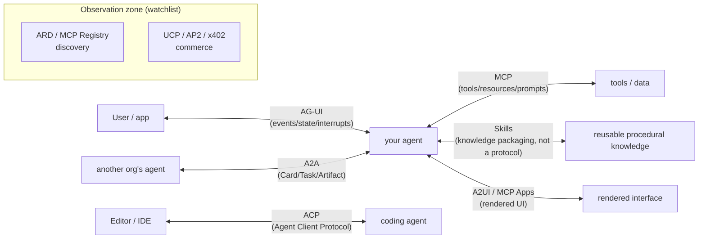
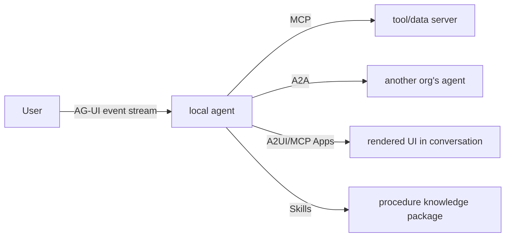

> **Group**: Interoperability  |  **Exit of the group above**: you can wire model output into sessions and state  |  **Exit of this group**: given a cross-boundary requirement you can pick the protocol by connection direction and justify rejecting the rest
> **Prerequisites**: [Tool Execution Engineering](../05-action/tool-execution.md), [Complexity Decision Ladder](../00-map/complexity-ladder)  |  **Next**: proceed by map to [MCP](mcp.md), [A2A](a2a.md), [ACP](acp-agent-client.md), [AG-UI](ag-ui.md), [A2UI and MCP Apps](a2ui-mcp-apps.md)

## 1. Overview

**Lead with the answer**: the protocols of the interoperability group are not competitors; they **each occupy one connection direction**. The first selection question is not "which protocol is better" but "**what are the two ends I am connecting**": agent to tools, editor to coding agent, agent to user interface, or agent to agent. Once the direction is fixed, the candidate set usually shrinks to one; trust domain and state needs then confirm the choice.

### Mental model: grouped by connection direction

Note: **Skills are not a protocol** — they are a knowledge packaging format (no wire layer), drawn here only to occupy the "reusable knowledge" direction; [Plugins](../06-agent-systems/plugins.md) likewise occupies the "capability bundling" direction.

### Protocol landscape table

| Connection direction | Protocol/format | Status | One-line responsibility | Detail |
| --- | --- | --- | --- | --- |
| Reusable knowledge → agent | Agent Skills | canonical | instruction + resource packaging with progressive disclosure | [Skills](../06-agent-systems/skills.md) |
| Capability bundle → distributable | Agent Plugins | watchlist | plugin.json manifest + fixed discovery locations | [Plugins](../06-agent-systems/plugins.md) |
| Agent ↔ tools/data | MCP | canonical | JSON-RPC: tools/resources/prompts | [MCP](mcp.md) |
| Editor/IDE ↔ coding agent | ACP (Agent Client Protocol) | canonical | standardized editor–coding-agent communication | [ACP](acp-agent-client.md) |
| Agent ↔ user/app | AG-UI | canonical | event-stream/state/interrupt user-interaction protocol | [AG-UI](ag-ui.md) |
| Agent ↔ Agent | A2A | canonical | cross-framework agent interoperability (Card→Task→Artifact) | [A2A](a2a.md) |
| Agent ↔ rendered UI | A2UI / MCP Apps | canonical | interactive UI elements rendered inside conversations | [A2UI and MCP Apps](a2ui-mcp-apps.md) |
| discovery / registry | ARD, MCP Registry | watchlist | capability and resource discovery | [Protocol Watchlist](watchlist.md) |
| commerce (payments/settlement) | UCP, AP2, x402 | watchlist | agent commerce payment rails | [Protocol Watchlist](watchlist.md) |

### ACP triple-homonym disambiguation (check this table before reading any ACP material)

"ACP" is a collision-prone acronym shared by at least three different things:

| # | Full name | What it is | Boundary | Status |
| --- | --- | --- | --- | --- |
| ① | **Agent Client Protocol** (agentclientprotocol.com) | the standard protocol between editors/IDEs and coding agents; JSON-RPC over stdio locally, HTTP/WebSocket remotely; reuses MCP's JSON representations | "ACP" on this site's interoperability pages always means **this one**; details in the [ACP chapter](acp-agent-client.md) | active (Zed and editor ecosystems) |
| ② | IBM/BeeAI **Agent Communication Protocol** | a historical agent↔agent communication scheme | folded into the A2A line; when old material mentions it, read it as an A2A predecessor | historical |
| ③ | OpenClaw internal **Agent Communication Protocol** | OpenClaw's private internal protocol, unrelated to ① and ② | product implementation detail, see [OpenClaw source: ACP (zh)](/zh/products/openclaw/source-code/acp) | product-private |

Citation rule: unqualified "ACP" anywhere in this site's interoperability pages means ①; mentioning ② requires the "IBM/BeeAI" qualifier and a historical note; mentioning ③ requires the "OpenClaw" qualifier and a link into the Products area.

### Selection decision table

| Need | Direction | Trust domain | State need | Lowest-complexity choice |
| --- | --- | --- | --- | --- |
| Agent calls tools / reads data | Agent → tools | tool boundary | server process / stateless requests | MCP |
| Editor adopts a coding agent | Editor ↔ agent | local process or remote | session / streaming diffs | ACP① |
| Frontend app renders agent progress | Agent → user UI | app boundary | event stream / interrupts | AG-UI |
| Two independent agents collaborate | Agent ↔ Agent | cross-org / cross-framework | async Task/Artifact | A2A |
| Agent outputs interactive UI | Agent → rendered UI | host rendering boundary | UI payload | A2UI / MCP Apps |
| Just reusing a procedure | knowledge → context | inside host process | none | Skills (not a protocol) |
| One function inside the same host | in-process | in-process | none | a direct function call (no protocol) |

The last row is a defensive reminder: protocols solve communication and discovery **across boundaries**; in-process calls need functions. When the rung 6 trigger of the [Complexity Decision Ladder](../00-map/complexity-ladder) has not fired, introduce none of the protocols on this page.

### Combination example: the protocol jigsaw of one real collaboration

One session can use four directions at once: AG-UI carries user-facing progress, MCP connects tools, A2A delegates subtasks to a remote agent, and Skills decide "which steps to follow". The protocols complement each other; "one protocol for everything" is never a reasonable architecture.

### When to use / when not to

- Use: any selection for cross-process/cross-org/cross-trust-domain connectivity; reviewing "should we adopt protocol X".
- Do not use: learning a protocol's internal message structures — go to its detail page.

Historical milestones: this map was frozen in 2026-09 with Issue #116; each protocol's own versions (MCP 2026-07-28, A2A 1.0.0, ACP v1 stable + v2 Draft, Agent Plugins 1.0.0) are maintained on their detail pages (re-checked 2026-09-01: no version drift for MCP and A2A; ACP has a v2 Draft — see its detail page).

## 2. Usage

This page is a selection map with no runnable artifact; "usage" = a decision drill (paper only, ≤15 minutes). Acceptance: all four scenarios resolve to a unique protocol with a stated reason to reject the others.

### Drill: four scenarios

**Scenario A**: swap in a new coding agent inside VS Code without writing integration code.
- Expected: ACP①. The direction is Editor ↔ coding agent.
- Rejection check: not MCP (that is Agent ↔ tools); not A2A (the two ends are not two autonomous agents).

**Scenario B**: let your agent read and write the company wiki and ticketing system.
- Expected: MCP. The direction is Agent ↔ tools/data.
- Rejection check: if the wiki only needs "which steps to follow when querying", that is Skills; connection and procedure are two directions.

**Scenario C**: two departments' agents (different frameworks) must exchange long-running tasks.
- Expected: A2A. The direction is Agent ↔ Agent across team trust domains with async tasks.
- Rejection check: for subtask delegation inside one runtime, use the runtime's native subagent mechanism — no A2A.

**Scenario D**: the agent's analysis must stream live into your React app, with interrupt support.
- Expected: AG-UI. The direction is an Agent → user-interface event stream.
- Rejection check: if it is just "render a chart inside the chat", that is A2UI / MCP Apps host rendering, not an app-level event stream.

### Usage boundary

- This map decides **which direction**; each protocol's versions, messages, and security live on its detail page.
- Watchlist protocols never enter the decision table: without production evidence they are recorded, not recommended.

## 3. Principles

### Why organize by "connection direction" instead of "feature strength"

Protocol cost comes from **boundaries**, not features: every protocol boundary adds a set of version negotiation, authorization, and failure semantics. Connection direction is the natural coordinate of a boundary — the identity of the two ends (user/editor/agent/tool) determines who initiates, who renders, who pays, and who is accountable. Feature comparisons (whose messages are richer) are meaningless without a direction constraint: however rich AG-UI's event stream, it cannot replace MCP's tool authorization.

### MCP and A2A complement, not compete (official position)

The A2A documentation states explicitly: "MCP and A2A are not competitors — they are highly complementary" — **MCP covers agent↔tool** (connecting APIs and resources), **A2A covers agent↔agent** (discovery, delegation, sharing results). A selection conflict never requires choosing between them (retrievedAt 2026-09-01).

### Admission rule for the observation zone

A protocol enters the watchlist with only "an official spec or an active maintainer"; promotion into the canonical decision table requires real consumption evidence from learn-ai or a sibling, or multiple independent implementations in the ecosystem. ARD, MCP Registry, UCP, AP2, and x402 all remain in the observation zone; details and verification dates live in the [Protocol Watchlist](watchlist.md).

### Spec requirements vs local measurement

This page is a selection pattern with no spec to implement; the "spec vs measurement" columns live on the four canonical protocol detail pages ([MCP](mcp.md), [A2A](a2a.md), [ACP](acp-agent-client.md), [AG-UI](ag-ui.md)).

## 4. Development

This page has no code integration; "development" = using the map as an architecture-review gate.

### Symptom → Evidence → Action → Done when

**Symptom**: a review argues "MCP or A2A" with feature lists on both sides.
**Evidence**: nobody stated the connection direction first — the identity of the two ends (agent↔tool or agent↔agent) is undefined.
**Action**: fill in the direction/trust-domain/state columns of the selection table first; the candidate set collapses to one.
**Done when**: the design document states the two ends and the direction, and the conclusion follows directly from the table.

### Symptom → Evidence → Action → Done when

**Symptom**: readers understand "ACP" in a document differently and the thread derails.
**Evidence**: no qualifier — it could be Agent Client Protocol, the IBM historical ACP, or the OpenClaw private ACP.
**Action**: add qualifiers per the disambiguation table; the site default is ①, the others always carry prefixes.
**Done when**: every occurrence of ACP in that document maps to exactly one row of the table.

### Symptom → Evidence → Action → Done when

**Symptom**: a proposal cites a watchlist protocol (e.g. x402) as a critical-path dependency.
**Evidence**: the protocol has no consumption evidence on this site and is absent from the decision table.
**Action**: downgrade it to an "observation item": move the main path to a canonical protocol or an explicit custom layer, and list the watchlist protocol as an optional experiment.
**Done when**: the critical path depends on no watchlist entry; the experiment has an independent switch and a fallback.

### Anti-patterns

- **Picking a protocol before fixing the direction**: substituting feature lists for connection-direction analysis.
- **One word, three meanings**: using ACP without a qualifier.
- **Treating the observation zone as a shelf**: adopting an evidence-free new protocol on the critical path.

## 5. Resource Library

Four-level reading route:

- **Beginner**: read this page; retell the landscape table and the triple disambiguation.
- **Builder**: run the zero-dependency server+client fixture in [MCP](mcp.md); then read ACP/AG-UI by direction.
- **Operator**: use the selection table as a review template; track protocol version announcements.
- **Researcher**: read the A2A site's "How A2A Works with MCP" and each spec's original text to verify the complementarity position.

### Resource table

| Name | Evidence level | Canonical URL | Use | Supported claim | Next |
| --- | --- | --- | --- | --- | --- |
| A2A site (incl. MCP complementarity) | L0 (official) | https://a2a-protocol.org/latest/ | the official statement of the A2A/MCP division | "MCP↔tools, A2A↔agents, complementary not competing" (retrievedAt 2026-09-01) | [A2A](a2a.md) |
| Agent Client Protocol site | L0 (official) | https://agentclientprotocol.com/ | the definition of ACP① | "standardizes communication between code editors/IDEs and coding agents" (retrievedAt 2026-09-01) | [ACP](acp-agent-client.md) |
| MCP specification | L0 (official spec) | https://modelcontextprotocol.io/specification/latest | the spec for the agent↔tools direction | protocol responsibilities and versions (retrievedAt 2026-09-01) | [MCP](mcp.md) |
| AG-UI docs | L0 (official) | https://docs.ag-ui.com/introduction | the spec for the agent↔user direction | event/state/interrupt model (retrievedAt 2026-09-01, re-check on detail page) | [AG-UI](ag-ui.md) |

### Active falsification and open questions

- Falsification entry: if a real requirement maps to two protocols (or zero) under the selection table, the map's direction coordinates are incomplete — revise the table rather than hiding the scenario.
- Open: promotion reviews for watchlist protocols (ARD/Registry/UCP/AP2/x402) continue in the [Protocol Watchlist](watchlist.md); the A2UI vs MCP Apps boundary is maintained on [its detail page](a2ui-mcp-apps.md).

### learn-ai stops here / where to go next

- Principles and fixtures of the four canonical protocols: [MCP](mcp.md), [A2A](a2a.md), [ACP](acp-agent-client.md), [AG-UI](ag-ui.md).
- The prerequisite overview: [Complexity Decision Ladder](../00-map/complexity-ladder) — if rung 6 has not fired, you need none of this page's protocols.
