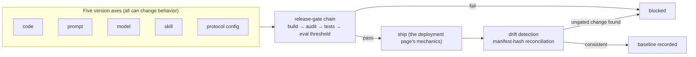

> **Group**: 5 · Reliable Operations  |  **Previous layer exit**: can restrict permissions, pause/resume tasks  |  **This page exit**: can enumerate your system's five version axes and answer for each "what to version / how to roll back / how to trace", with drift machine-detectable
> **Prerequisites**: [Deployment and Release](deployment.md) (mechanics and rollback), [Evaluation (Bridge)](evaluation.md) (gate thresholds), [Observability](observability.md) (trace reconciliation)  |  **Next**: [Resource Library](../../resources.md) (layer exit)

## 1. Overview

**BLUF**: [Deployment and Release](deployment.md) answers "**how to ship**" — pipelines, canary, graceful shutdown; this page answers "**what is being shipped**". A traditional application has one change surface (code); an AI / agent system has **five**: code, prompt, model, skill, and protocol config. Each axis can independently change system behavior — and each can independently cause an incident. The whole discipline of AgentOps is one sentence: **all five axes are versioned alike, gated alike, and rollback-able alike** — any axis that is an exception becomes the door through which "one unreviewed prompt tweak takes down production".

### Mental model: five axes, one gate



### Decision table: three questions per axis

| Axis | What to version | How to roll back | How to trace |
| --- | --- | --- | --- |
| Code | Behavioral logic: app code, validators, executors | Switch to the previous build/image | git commit ↔ build number ↔ deploy record |
| Prompt | Behavioral spec: system prompts, task instructions, few-shot examples | Switch to the previous version directory (e.g. `v11/`) | manifest hash + prompt version recorded in traces |
| Model | Model ID, version, sampling parameters | Edit config to pin the old version (minutes) | model attributes on traces (OTel `gen_ai.*`) |
| Skill | Reusable knowledge assets: SKILL.md and its referenced files | Version-lock rollback; revert the skill directory | skill manifest hash + change-review record |
| Protocol config | MCP server list, tool allowlist, endpoints and switches | Re-issue the previous config | config diff + allowlist-hash reconciliation |

### When to use / when not to

- Use: any AI feature with real users — as soon as a second axis exists beyond code (there always is, at minimum the prompt), this page's discipline applies.
- Do not use: purely local one-off experiments — but "secrets never enter version control" applies from the first line of code (see secret injection in [Deployment and Release](deployment.md)).

Historical milestone: new in 2026-09 (Issue #116 Scope v6); [Deployment and Release](deployment.md) already covers rollback for the code/prompt/model trio — this page extends the axes to five (adding skill and protocol config) and elevates "axis inventory + drift detection" into its own discipline.

## 2. Usage

Minimal hands-on: 15 minutes, zero API keys, Node built-ins only — build a **five-axis version-manifest generator**: scan each axis's directories into a `manifest.json` (one sha256 fingerprint per artifact), with a `--check` mode that reconciles and demonstrates the alert when a prompt file changes.

### Step 1: save `version-manifest.mjs`

```javascript
// version-manifest.mjs — five-axis version-manifest generator (zero deps, node >= 18)
import { createHash } from 'node:crypto';
import { readdirSync, readFileSync, writeFileSync, existsSync, statSync } from 'node:fs';
import { join, relative } from 'node:path';

// Five version axes → the roots each one scans. Adjust to your project's paths.
// The model axis has no directory: it versions a config file
// (model ID lives in config; secrets live in environment variables).
const AXES = [
  { axis: 'code',   roots: ['src'] },
  { axis: 'prompt', roots: ['prompts'] },
  { axis: 'skill',  roots: ['skills'] },
  { axis: 'model',  roots: [],            files: ['config/models.json'] },
  { axis: 'config', roots: ['config'],    files: [] },   // protocol-config axis: allowlists/endpoints
];
const MANIFEST = 'manifest.json';

function walk(dir, out = []) {
  if (!existsSync(dir)) return out;
  for (const name of readdirSync(dir)) {
    const full = join(dir, name);
    if (statSync(full).isDirectory()) walk(full, out);
    else out.push(full);
  }
  return out;
}

function fingerprint(path) {
  return {
    path: relative('.', path).split('\\').join('/'),
    sha256: createHash('sha256').update(readFileSync(path)).digest('hex').slice(0, 16),
  };
}

function current() {
  const axes = {};
  for (const { axis, roots = [], files = [] } of AXES) {
    const list = roots.flatMap((r) => walk(r)).concat(files.filter(existsSync));
    axes[axis] = Object.fromEntries(list.map(fingerprint).map((f) => [f.path, f.sha256]));
  }
  return axes;
}

if (process.argv.includes('--check')) {
  const was = JSON.parse(readFileSync(MANIFEST, 'utf8')).axes;
  const now = current();
  const drift = [];
  for (const { axis } of AXES) {
    const a = was[axis] ?? {}, b = now[axis] ?? {};
    for (const [p, h] of Object.entries(b))
      if (a[p] !== h) drift.push(`${axis}: ${p} ${a[p] ? `changed ${a[p]} → ${h}` : `added`}`);
    for (const p of Object.keys(a)) if (!(p in b)) drift.push(`${axis}: ${p} deleted`);
  }
  if (drift.length) {
    console.error(`DRIFT detected (${drift.length}, artifacts changed outside the gate):\n  ${drift.join('\n  ')}`);
    process.exit(1); // wire into CI: non-zero exit code blocks release
  }
  console.log('OK: five axes match the manifest, no drift');
} else {
  writeFileSync(MANIFEST, JSON.stringify({ axes: current() }, null, 2));
  const n = Object.values(current()).reduce((s, a) => s + Object.keys(a).length, 0);
  console.log(`manifest written to ${MANIFEST}: 5 axes, ${n} artifacts`);
}
```

### Step 2: scaffold a minimal five-axis tree and generate the baseline

```bash
mkdir -p src prompts skills config
echo 'console.log("app v1")' > src/app.mjs
echo 'Classify tickets into billing / technical / other; output JSON only.' > prompts/classify.txt
echo '# triage skill v1: amount first, then module.' > skills/triage.md
echo '{ "model": "provider/model-a", "modelVersion": "2026-08-01" }' > config/models.json
node version-manifest.mjs
```

Expected output:

```text
manifest written to manifest.json: 5 axes, 5 artifacts
```

### Step 3: reconcile (consistent path)

```bash
node version-manifest.mjs --check
```

```text
OK: five axes match the manifest, no drift
```

Exit code 0 — wired into CI, this is the drift gate.

### Step 4: negative observation (a prompt edited — the start of a silent regression)

Simulate "someone bypassed review and tweaked one line of the prompt":

```bash
echo 'Classify tickets into billing / tech / other; output JSON only.' > prompts/classify.txt
node version-manifest.mjs --check
```

The alert goes to stderr with exit code 1:

```text
DRIFT detected (1, artifacts changed outside the gate):
  prompt: prompts/classify.txt changed 4259717f970758eb → 5469fa3d3616d083
```

This is the **machine-detectable form of a silent regression**: zero code changes, all tests green, yet behavior has changed — without manifest reconciliation, this edit surfaces only when users complain. (Fingerprint values depend on file bytes; your local output is authoritative.)

### Acceptance and cleanup

- Acceptance: reproduce Step 4's `DRIFT` with exit code 1; answer aloud "which of the five axes in my project is currently unversioned, and what is the risk".
- Cleanup: delete the demo directories plus `manifest.json` and `version-manifest.mjs`.

## 3. Principles

### Why five axes, not three

[Deployment and Release](deployment.md) established the code/prompt/model trio. Agent systems add two more:

- **The skill axis**: a skill is "procedural knowledge packaged into the agent" (SKILL.md + referenced files + executable scripts). It is neither code (it skips code review) nor a per-call hand-written prompt — yet its content directly changes agent behavior on matching tasks. The skill designers explicitly list "evaluation first / versioning" among development guidelines (see Resource Library), for the same reason as this page: **knowledge assets are artifacts too**.
- **The protocol-config axis**: MCP server lists, tool allowlists, endpoint switches. A changed tool surface equals a changed capability boundary — one extra server changes both the attack surface and the failure modes (→ [Security](security.md)). This is exactly the config that tends to get "just hand-edited for now" in runtime environments.

### The release-gate chain: all five axes alike

The gate mechanics live in [Deployment and Release](deployment.md) (build → audit → tests → eval threshold → canary); this page adds the gate's **coverage**:

| Change type | How it passes the gate | Detection |
| --- | --- | --- |
| Code | Regular PR + CI | build, test suite |
| Prompt | PR (prompts checked in like code) | golden-set eval threshold (→ [Evaluation](evaluation.md)) |
| Model | Config-change PR | golden-set before/after + dual-write traffic switch |
| Skill | Skill-repo PR + version lock | a dedicated eval set for skill behavior |
| Protocol config | Config PR + allowlist review | allowlist-hash reconciliation + conformance tests |

Most "prompt incidents" and "tool-surface incidents" stem not from having no gate, but from **the gate covering only the code axis**.

### Drift detection: the reconciliation logic of silent regressions

Definition of a silent regression: **no code changed, no deployment happened, yet behavior changed**. Under the five-axis model its source is almost always outside the code axis — a prompt edited, a skill updated, a model version pushed by the vendor, a config hand-tuned. The reconciliation logic is therefore minimal: fingerprint every axis's artifacts (hash), compare "fingerprints at last gate pass" against "fingerprints now", and treat any mismatch as drift. Fingerprint comparison is a **necessary condition, not a sufficient one**: it catches "changed", not "changed for the worse" — the eval gate catches the latter; you need both.

### The version boundary between config and secrets

- **Config enters version control**: model selection, routing switches, allowlists, budget caps are all config files — checked in, gated, diffable.
- **Secrets never enter version control**: credentials reach the runtime only via environment variables / a secrets-management service (this repo's global rule). The manifest also records only **file fingerprints**, never file contents — a fingerprint suffices for reconciliation, while contents carry leakage risk.
- One-line test: **what can be diffed and reviewed is config; what must be injected and rotated is a secret**. When both sit in one file, split them before talking about versioning.

### Spec requirements vs local behavior

This page has no protocol spec to implement. The "spec" side is the OpenTelemetry GenAI semantic conventions for trace attributes (e.g. model-identification attributes, Development level); the "behavior" side is this page's manifest generator (hash stability, `--check` exit codes 0/1, and detection of all three drift classes — added, changed, deleted).

## 4. Development

### Symptom → Evidence → Action → Done-when

**Symptom**: output quality suddenly drops, but no code shipped this week.
**Evidence**: run the five-axis manifest reconciliation; locate the drifted axis and artifact; [Observability](observability.md) trace sampling confirms the behavior-change time matches that artifact's edit time.
**Action**: roll back per axis — prompt: switch to the previous version directory; skill: release the version lock and revert; model: repin the old version in config; protocol config: re-issue the previous allowlist. After rollback, bring that axis into the gate (it was outside).
**Done-when**: metrics return to baseline; the incident record names "which axis, what drifted, why the gate missed it"; the next change to that axis goes through PR + eval.

### Symptom → Evidence → Action → Done-when

**Symptom**: after upgrading a skill, the agent starts failing on related tasks.
**Evidence**: the skill's version/directory hash differs from the last passing evaluation; the dedicated eval set scores the new version lower in a before/after comparison.
**Action**: roll back via the version lock to the old skill (revert the skill directory, no code changes); keep the new version in staging, add eval cases from the failures, then pass the gate. Changes to scripts referenced by a skill count as skill-axis changes too.
**Done-when**: post-rollback eval scores recover; the skill upgrade flow is written down (version lock → staging eval → gate → canary).

### Symptom → Evidence → Action → Done-when

**Symptom**: the model vendor advances its default version (or deprecates the old one); behavior shifts under an unchanged config.
**Evidence**: the model version recorded in traces mismatches the config declaration, or a vendor announcement confirms the version change; golden-set pass rate declines while the five-axis manifest is fully consistent — the drift is "outside the axes", a supplier-side change.
**Action**: pin explicit version numbers in config (never follow `latest`); before switching to the new version, run the dual-write comparison flow from [Deployment and Release](deployment.md).
**Done-when**: no implicit version references remain in config; vendor version changes become a monitored item in the runbook.

### Anti-pattern list

- **A gate that covers only code**: four of five axes outside the gate — the expected incident rate exceeds a traditional app's.
- **Prompts living in code strings and chat logs**: no file means no version; no version means no rollback.
- **A secret dropped into a config file "for convenience"**: config must be diffable, checked in, and reviewer-visible — a secret fails all three.
- **A manifest that records contents instead of fingerprints**: reconciliation needs only hashes; recording contents leaves one more copy to leak.
- **Silencing drift by regenerating the manifest**: first ask "should this change have passed the gate", then update the baseline; the reversed order voids the gate.

## 5. Resource Library

Four-level reading path:

- **Beginner**: run this page's manifest generator, reproduce one `DRIFT`; name your own system's five axes against the decision table.
- **Builder**: wire the five-axis directories into your repo; put `--check` into CI; start checking prompts and skills into version control.
- **Operator**: add runbook entries for skill upgrades and model version changes; drill the full "drift → locate axis → rollback" loop.
- **Researcher**: read the OTel GenAI semantic conventions and the Agent Skills engineering post; audit your gates and manifests for gaps.

### Resource table

| Name | Evidence level | canonical URL | Use | Supported claim | Next |
| --- | --- | --- | --- | --- | --- |
| This repo's deploy workflow | Internal artifact | https://github.com/zenHeart/learn-ai/blob/tech/.github/workflows/deploy.yml | Gate-1 live example | This repo builds three components in CI then merges deploys (retrievedAt 2026-09-01) | Add five-axis coverage per this page |
| OpenTelemetry GenAI semantic conventions | L0 (official spec) | https://github.com/open-telemetry/semantic-conventions-genai | Attribute naming for model-axis tracing | the `gen_ai.*` attribute set (Development level, retrievedAt 2026-09-01) | [Observability](observability.md) |
| Agent Skills engineering post | L1 (first-party from the designer) | https://www.anthropic.com/engineering/equipping-agents-for-the-real-world-with-agent-skills | Rationale for the skill axis | Skills are file-directory artifacts whose development guidelines emphasize evaluation and versioning; published as an open standard 2025-12 (retrievedAt 2026-09-01) | [Skills](../06-agent-systems/skills.md) |
| Deployment and Release | Internal chapter | [deployment](deployment.md) | Trio-axis rollback and gate mechanics | — | Read it before this page |

### Falsification and open questions

- Falsification entry: if your system has only a handful of never-edited prompts, a pinned model, and no skills or external tools, the five axes degenerate to about one and a half (code + one static config) — the whole manifest machinery can then shrink to two rules: "config checked in, secrets injected".
- Open: where the manifest baseline should live (in-repo vs CI artifact cache) and how to bind it to deploy artifacts — no real case in this repo yet; to be backfilled from production practice.
- Open: the data axis (indexes/memory) is not among the five; per [Deployment and Release](deployment.md) it stays with the [Grounding](../04-grounding/) update pipeline. If data-change incidents prove frequent in practice, evaluate promoting it to a sixth axis.

### Where learn-ai stops / where to go next

- Evaluation methodology and gate thresholds: [evals](https://evals.zenheart.site/).
- Building and using skills: [Skills](../06-agent-systems/skills.md); protocol-config selection: the [Protocol Map](../07-interoperability/).
- Layer-exit resource index: [Resource Library](../../resources.md).
